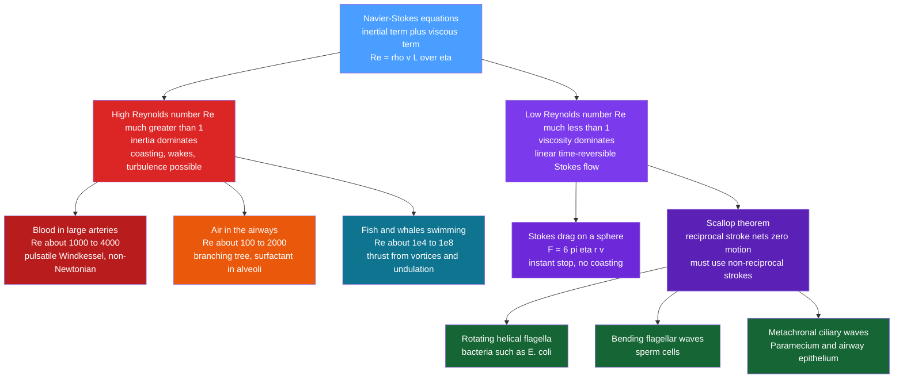

# 🌊 Fluid Dynamics in Biology

> [!abstract] TL;DR
> Life is soaked in fluids and spends enormous energy pumping them — blood through vessels, air through lungs, water past gills and cilia, cytoplasm around cells. Which physics governs a given flow is decided almost entirely by one dimensionless number: the **Reynolds number** $\mathrm{Re}=\rho v L/\eta$, the ratio of inertial to viscous forces. Biology spans an astonishing **~12 orders of magnitude** in $\mathrm{Re}$ — from whales gliding through inertial, turbulent water ($\mathrm{Re}\sim10^{8}$) down to bacteria swimming through a world where water feels like honey ($\mathrm{Re}\sim10^{-5}$). That single ratio explains why microbes cannot coast and must evade the **scallop theorem** with rotating flagella and non-reciprocal ciliary beats, why blood flow obeys Poiseuille's ferocious $r^4$ law, why blood is a non-Newtonian suspension, and why alveoli need surfactant to survive their own surface tension.

---

## Intuition

**Analogy:** For a swimming bacterium, water is not the thin, splashy fluid we know — it feels as thick as honey or molasses. At the microscopic scale momentum is meaningless: a bacterium that stops beating its flagellum halts within about an atom's width, unable to coast even a body-length. There is no gliding, no drifting, no turbulence — only relentless viscous drag. This is the world of **low Reynolds number**, where every intuition we built from splashing pools and coasting bicycles fails completely.

Meanwhile, at our own scale, blood is a genuinely strange fluid — a dense suspension of deformable cells that rearrange as they squeeze through capillaries a fraction of a hair's width, thinning and reorganising in ways plain water never does. Biology plays fluid dynamics across this vast range of scales, and the master dial that sets the rules is the balance between a fluid's *inertia* (its tendency to keep moving) and its *viscosity* (its internal stickiness).

---

## How It Works

### Core Mechanics

1. **The governing equations.** All these flows are, in principle, solutions of the **Navier-Stokes equations** — Newton's second law written for a fluid parcel, with an inertial term $\rho(\vec{v}\cdot\nabla)\vec{v}$ and a viscous term $\eta\nabla^2\vec{v}$. What changes across biology is not the equation but *which term wins*.

2. **The Reynolds number decides everything.** Non-dimensionalising Navier-Stokes leaves one control parameter,
$$\mathrm{Re}=\frac{\rho v L}{\eta}=\frac{\text{inertial force}}{\text{viscous force}},$$
where $\rho$ is fluid density, $v$ a characteristic speed, $L$ a characteristic size, and $\eta$ the dynamic viscosity. **Large $\mathrm{Re}$** (fish, blood in the aorta, air in the trachea) means inertia dominates: flow can separate, form wakes and vortices, and turn turbulent. **Small $\mathrm{Re}$** (bacteria, cilia, cytoplasm) means viscosity utterly dominates.

3. **Stokes flow — the low-$\mathrm{Re}$ limit.** When $\mathrm{Re}\ll1$ the nonlinear inertial term vanishes and Navier-Stokes collapses to the **linear, time-symmetric Stokes equations** $\eta\nabla^2\vec{v}=\nabla P$. Two shocking consequences follow. First, drag on a sphere is exactly $F=6\pi\eta r v$ (**Stokes drag**) — linear in velocity, so stopping the push stops the motion instantly. Second, because the equations have no time derivative, the flow is **time-reversible**: run the boundary motion backwards and every fluid particle retraces its path.

4. **The scallop theorem.** Time-reversibility has a brutal corollary for swimmers, formalised by Purcell: a **reciprocal** motion — one that looks identical played forwards and backwards, like a scallop opening and snapping shut — produces **zero net displacement** at low $\mathrm{Re}$. To move, a microswimmer must break time-symmetry with a **non-reciprocal** stroke. Evolution's answers: bacteria spin **helical flagella** driven by rotary motors, sperm propagate **bending waves** down a flagellum, and ciliated surfaces beat with asymmetric power-and-recovery strokes coordinated into travelling **metachronal waves**.

5. **Hemodynamics — high-$\mathrm{Re}$ plumbing.** In steady laminar pipe flow the **Hagen-Poiseuille law** gives volumetric flow $Q=\pi r^4\Delta P/(8\eta L)$, with a parabolic velocity profile. The $r^4$ dependence is the single most important fact in circulation physiology: a 19% narrowing of a vessel radius halves the flow, so the body regulates blood distribution mainly by dilating and constricting arteriole radius. Real arterial flow is also **pulsatile**, buffered by elastic arteries acting as a **Windkessel** (pressure reservoir), and the **wall shear stress** it imposes on the endothelium governs where atherosclerotic plaques form.

6. **Blood is non-Newtonian.** Blood is not a simple fluid but a ~45% suspension of deformable red cells. It is **shear-thinning** (viscosity drops as flow speeds up, because cells align and deform), and in vessels below ~300 µm it shows the **Fåhraeus-Lindqvist effect** — apparent viscosity *falls* as cells migrate to the centre leaving a low-viscosity plasma layer at the wall.

7. **Lungs and surface tension.** In the alveoli, gas exchange happens across a wet film whose **surface tension** would collapse small alveoli into large ones (**Laplace's law**: pressure $\propto 1/r$). Pulmonary **surfactant** lowers and, crucially, *varies* the surface tension with alveolar size, stabilising the whole population against collapse.

### Flow / Architecture



---

## Key Concepts

### Secondary (intuitive)
- Living things are full of moving fluids — blood, air, water, even the streaming inside a cell — and pushing those fluids around is a big part of what bodies do.
- **Big animals live in a splashy world**; tiny microbes live in a syrup world. The switch between the two is the Reynolds number: how much a fluid *keeps moving on its own* versus how much it *sticks and drags*.
- A microbe can't coast. The instant it stops swimming, it stops dead — so it can never "push off and glide" the way you can in a pool.
- Blood flow depends fantastically strongly on how wide a vessel is: a tiny bit of narrowing chokes the flow dramatically, which is why blocked arteries are so dangerous.

### Undergraduate (quantitative)
- **Reynolds number** $\mathrm{Re}=\rho v L/\eta=vL/\nu$ (with kinematic viscosity $\nu=\eta/\rho$). Bacterium $\sim10^{-5}$, sperm $\sim10^{-2}$, swimming fish $\sim10^{5}$, aorta $\sim3\times10^{3}$, blue whale $\sim10^{8}$ — roughly twelve decades.
- **Stokes drag** $F=6\pi\eta r v$ on a sphere; drag is *linear* in speed, so an overdamped microswimmer's velocity is proportional to the instantaneous force with no inertial memory.
- **Hagen-Poiseuille law** $Q=\dfrac{\pi r^4\,\Delta P}{8\eta L}$ with parabolic profile $v(\varrho)=\dfrac{\Delta P}{4\eta L}(r^2-\varrho^2)$; **vascular resistance** $R_{\text{flow}}=8\eta L/(\pi r^4)\propto r^{-4}$.
- **Laplace's law** for a bubble/alveolus $\Delta P=2\gamma/r$ (single surface) — the physics that makes surfactant essential.
- **Péclet number** $\mathrm{Pe}=vL/D$ compares advective to diffusive transport; bulk flow only helps when $\mathrm{Pe}\gg1$, which is exactly why circulation exists to beat the diffusion wall discussed in [[Diffusion_and_Brownian_Motion_in_Cells]].

### Graduate (advanced)
- **Non-reciprocity and gauge structure.** At zero $\mathrm{Re}$, net displacement of a swimmer is a *geometric* quantity — a line integral (holonomy) over the closed loop traced in shape space, independent of stroke rate. Reciprocal strokes enclose zero area and yield zero motion; this is the rigorous content of the scallop theorem (Shapere-Wilczek gauge theory of swimming).
- **Blood rheology.** Casson or Carreau-Yasuda constitutive models capture shear-thinning; the **Fåhraeus** and **Fåhraeus-Lindqvist** effects and cell-free layer formation require two-phase or suspension modelling and cell mechanics.
- **Pulsatile flow.** The **Womersley number** $\alpha=r\sqrt{\omega\rho/\eta}$ sets whether arterial flow is quasi-steady ($\alpha\ll1$) or inertia-dominated with a blunt, phase-lagged profile ($\alpha\gtrsim10$, as in the aorta); Windkessel and wave-reflection models describe the arterial tree.
- **Flagellar hydrodynamics.** Resistive-force theory and slender-body theory quantify thrust from drag anisotropy ($\zeta_\perp\approx2\zeta_\parallel$) of a beating filament — the mechanism that makes bending waves and rotating helices propulsive at low $\mathrm{Re}$.
- **Unsteady high-$\mathrm{Re}$ locomotion.** Insect flight exploits **leading-edge vortices**, rotational lift, and wake capture — unsteady mechanisms beyond steady airfoil theory; fish thrust is analysed via added mass and reverse Kármán vortex streets.

These ideas connect outward to the not-yet-written siblings *Biomechanics_of_Movement* (muscle-driven macroscale locomotion), *Cell_Motility_and_Adhesion* (how cells crawl and steer in viscous surroundings), and *Allometry_and_Scaling_Laws_in_Biology* (how flow networks and metabolic rate scale with body size), while the number sense that makes any of it quantitative lives in [[Scales_Units_and_Orders_of_Magnitude_in_Biophysics]].

---

## Python Demo

```python
# Biological fluid dynamics in three acts:
#   A) the Reynolds-number ladder spanning ~12 orders of magnitude
#   B) Poiseuille flow: parabolic profile and the ferocious r^4 law
#   C) the scallop theorem: reciprocal strokes swim nowhere at low Re
import numpy as np
import matplotlib.pyplot as plt

# ---------------------------------------------------------------------------
# PART A - Reynolds number across biology:  Re = rho * v * L / eta
# ---------------------------------------------------------------------------
# Each entry: (name, rho[kg/m^3], v[m/s], L[m], eta[Pa.s])   water eta~1e-3, air~1.8e-5
organisms = [
    ("Bacterium (E. coli)", 1000, 30e-6,  1e-6,  1.0e-3),
    ("Sperm cell",          1000, 100e-6, 50e-6, 1.0e-3),
    ("Cilium (beat)",       1000, 500e-6, 10e-6, 1.0e-3),
    ("Flying insect (fly)", 1.2,  1.0,    3e-3,  1.8e-5),
    ("Human aorta (blood)", 1060, 0.4,    0.025, 3.5e-3),
    ("Swimming trout",      1000, 1.0,    0.30,  1.0e-3),
    ("Blue whale",          1000, 5.0,    25.0,  1.0e-3),
]
names = [o[0] for o in organisms]
Re    = np.array([rho * v * L / eta for (_, rho, v, L, eta) in organisms])

print("Reynolds numbers across biology")
for n, r in zip(names, Re):
    regime = "viscous (Stokes)" if r < 1 else "inertial"
    print(f"  {n:22s} Re = {r:10.2e}   -> {regime}")
print(f"\nSpan: {np.log10(Re.max()/Re.min()):.1f} orders of magnitude")

# ---------------------------------------------------------------------------
# PART B - Poiseuille flow: parabolic profile and Q ~ r^4 (Hagen-Poiseuille)
# ---------------------------------------------------------------------------
R      = 1.0                       # normalised vessel radius
dP_muL = 4.0                       # lumps dP/(4*eta*L) so v_max = 1
rr     = np.linspace(-R, R, 200)
v_prof = dP_muL * (R**2 - rr**2) / 4.0            # v(r) = (dP/4 eta L)(R^2 - r^2)

# Q ~ r^4: relative flow vs relative radius, plus a vasoconstriction example
r_rel  = np.linspace(0.5, 1.2, 200)
Q_rel  = r_rel**4                                 # Q proportional to r^4
narrow = 0.80                                     # 20% radius reduction
Q_after = narrow**4
print(f"\nVasoconstriction: a {100*(1-narrow):.0f}% radius drop "
      f"leaves only {100*Q_after:.0f}% of the flow "
      f"(a {100*(1-Q_after):.0f}% reduction).")

# ---------------------------------------------------------------------------
# PART C - Scallop theorem: net swim per cycle ~ AREA enclosed in shape space
# ---------------------------------------------------------------------------
# Two shape parameters (e.g. two joint angles). Net displacement at Re->0 is a
# geometric holonomy proportional to the loop area they trace, NOT the speed.
phi = np.linspace(0, 2*np.pi, 400)
# Reciprocal stroke: both shape variables move IN PHASE -> path is a line (area 0)
a1_rec, a2_rec = np.sin(phi), np.sin(phi)
# Non-reciprocal stroke: 90-degree phase lag -> path is a loop (area > 0)
a1_non, a2_non = np.sin(phi), np.sin(phi - np.pi/2)

def enclosed_area(x, y):
    # shoelace area of the closed shape-space loop
    return 0.5 * abs(np.trapz(x, y) - np.trapz(y, x))

A_rec, A_non = enclosed_area(a1_rec, a2_rec), enclosed_area(a1_non, a2_non)
print(f"\nShape-space loop area  (proportional to net swim per cycle):")
print(f"  reciprocal stroke     : {A_rec:.3f}  -> essentially zero net motion")
print(f"  non-reciprocal stroke : {A_non:.3f}  -> real propulsion")

# ---------------------------------------------------------------------------
# Plots
# ---------------------------------------------------------------------------
fig, ax = plt.subplots(2, 2, figsize=(13, 10))

# (A) Reynolds ladder on a log axis
order = np.argsort(Re)
ypos  = np.arange(len(Re))
colors = ['#7c3aed' if r < 1 else '#dc2626' for r in Re[order]]
ax[0, 0].hlines(ypos, 1e-6, Re[order], color=colors, lw=2, alpha=0.6)
ax[0, 0].scatter(Re[order], ypos, color=colors, s=70, zorder=3)
ax[0, 0].set_yticks(ypos); ax[0, 0].set_yticklabels(np.array(names)[order])
ax[0, 0].set_xscale('log')
ax[0, 0].axvline(1.0, color='k', ls='--', lw=1.5)
ax[0, 0].text(1.3, 0.2, "Re = 1\nviscous  |  inertial", fontsize=9)
ax[0, 0].set_xlabel("Reynolds number  Re = rho v L / eta")
ax[0, 0].set_title("The Reynolds ladder of biology (~12 decades)")
ax[0, 0].grid(alpha=0.3, which='both', axis='x')

# (B) Poiseuille parabolic velocity profile
ax[0, 1].plot(v_prof, rr, color='#0e7490', lw=2)
ax[0, 1].fill_betweenx(rr, 0, v_prof, color='#0e7490', alpha=0.15)
for y in np.linspace(-0.85, 0.85, 9):          # arrows sketch the parabola
    vx = dP_muL * (R**2 - y**2) / 4.0
    ax[0, 1].annotate("", xy=(vx, y), xytext=(0, y),
                      arrowprops=dict(arrowstyle="->", color='#0e7490', lw=1))
ax[0, 1].set_xlabel("axial velocity  v(r)")
ax[0, 1].set_ylabel("radial position  r / R")
ax[0, 1].set_title("Poiseuille flow: parabolic profile")
ax[0, 1].grid(alpha=0.3)

# (C) The r^4 law and vasoconstriction
ax[1, 0].plot(r_rel, Q_rel, color='#b91c1c', lw=2, label="Q proportional to r^4")
ax[1, 0].axhline(1.0, color='gray', ls=':', lw=1)
ax[1, 0].axvline(1.0, color='gray', ls=':', lw=1)
ax[1, 0].scatter([narrow], [Q_after], color='k', zorder=5)
ax[1, 0].annotate(f"20% narrower\n-> {100*Q_after:.0f}% flow",
                  xy=(narrow, Q_after), xytext=(0.55, 1.8),
                  arrowprops=dict(arrowstyle="->"), fontsize=9)
ax[1, 0].set_xlabel("relative vessel radius  r / r0")
ax[1, 0].set_ylabel("relative flow  Q / Q0")
ax[1, 0].set_title("Hagen-Poiseuille r^4 law: why radius rules")
ax[1, 0].legend(); ax[1, 0].grid(alpha=0.3)

# (D) Scallop theorem in shape space
ax[1, 1].plot(a1_rec, a2_rec, color='#7f1d1d', lw=3,
              label=f"reciprocal (area={A_rec:.2f}) -> no swim")
ax[1, 1].plot(a1_non, a2_non, color='#166534', lw=2,
              label=f"non-reciprocal (area={A_non:.2f}) -> swims")
ax[1, 1].fill(a1_non, a2_non, color='#166534', alpha=0.15)
ax[1, 1].set_xlabel("shape parameter 1  (e.g. joint angle A)")
ax[1, 1].set_ylabel("shape parameter 2  (e.g. joint angle B)")
ax[1, 1].set_title("Scallop theorem: net swim ~ enclosed area")
ax[1, 1].legend(loc='upper left', fontsize=8)
ax[1, 1].set_aspect('equal'); ax[1, 1].grid(alpha=0.3)

plt.tight_layout()
plt.show()
```

**What you should see:** Part A prints and plots a ladder climbing from a bacterium at $\mathrm{Re}\sim10^{-5}$ to a blue whale at $\sim10^{8}$ with the $\mathrm{Re}=1$ divide splitting viscous microbes from inertial swimmers. Part B draws the parabolic Poiseuille profile and the $r^4$ curve, printing the punchline that a mere 20% narrowing cuts flow to ~41%. Part C shows the geometric heart of the scallop theorem: the reciprocal stroke collapses to a line of zero enclosed area (no net motion), while the phase-lagged non-reciprocal stroke encloses real area and therefore swims.

---

## Real-World Applications

> **Example — the arteriole as the body's flow valve.** The Hagen-Poiseuille $r^4$ law is not a textbook curiosity; it is the control knob of your circulation. Arterioles are wrapped in smooth muscle precisely so the body can tune vessel radius: a small vasoconstriction slashes flow by the fourth power, letting the cardiovascular system redirect blood to working muscle or away from skin with minimal radius changes. The same $r^4$ sensitivity is why a partially occluded coronary artery is so dangerous and why angioplasty, which restores radius, restores flow so dramatically.

- **Microfluidics and lab-on-a-chip.** These devices run at $\mathrm{Re}\sim10^{-3}$ — pure Stokes flow — so streams flowing side by side will *not* mix by turbulence; designers exploit laminar co-flow for gradient generators or add chaotic-advection geometry to force mixing.
- **Bacterial propulsion and antibiotics research.** Understanding flagellar rotary motors and the run-and-tumble of *E. coli* (a direct consequence of low-$\mathrm{Re}$ non-reciprocity) informs both microrobotics and strategies against motile pathogens.
- **Respiratory medicine.** Surfactant physics (Laplace's law) explains neonatal respiratory distress syndrome in premature infants who lack surfactant — treated with exogenous surfactant replacement.
- **Atherosclerosis and stent design.** Wall shear stress patterns from pulsatile arterial flow predict where plaques form (typically at bends and bifurcations with low, oscillatory shear), guiding vascular graft and stent geometry.
- **Ciliary clearance.** Coordinated metachronal ciliary waves sweep mucus up the airways; when cilia fail (primary ciliary dyskinesia) the low-$\mathrm{Re}$ transport breaks down and infections follow.

---

## Common Pitfalls

- **Importing macroscale intuition into the microbial world.** At $\mathrm{Re}\ll1$ there is no coasting, no turbulence, and no propulsion from a back-and-forth paddle. A "micro-submarine" with a reciprocal oar sits exactly still — the scallop theorem is absolute, not approximate.
- **Treating blood as water.** Blood is non-Newtonian: shear-thinning, cell-laden, and in small vessels its apparent viscosity *drops* (Fåhraeus-Lindqvist). Plugging a fixed water-like $\eta$ into Poiseuille misestimates resistance, especially in the microcirculation.
- **Forgetting the fourth power.** Because $Q\propto r^4$, linear intuition badly underestimates how strongly radius matters. A "small" 15–20% narrowing is a major flow reduction, and clinicians who reason linearly about stenosis will underrate its severity.
- **Confusing the diffusion regime with the flow regime.** Bulk flow only beats diffusion when the Péclet number $\mathrm{Pe}=vL/D\gg1$. Inside a single cell, stirring is nearly useless and transport is diffusion-dominated (see [[Diffusion_and_Brownian_Motion_in_Cells]]); circulation exists precisely because organisms are too big for diffusion.
- **Assuming steady Poiseuille flow in arteries.** Large-artery flow is pulsatile with a high Womersley number; the profile is blunt and phase-lagged, not the steady parabola. Static Poiseuille is a good model for capillaries and small vessels, not the aorta.
- **Ignoring surface tension in the lung.** Alveoli are not rigid balloons; without surfactant, Laplace's law would drive small alveoli to empty into large ones and collapse the lung.

---

## Related Concepts

- [[Viscous_Fluids_and_Navier_Stokes]] — the parent physics: Reynolds number, Stokes drag $6\pi\eta r v$, and the Hagen-Poiseuille derivation this note applies to biology.
- [[Diffusion_and_Brownian_Motion_in_Cells]] — the sibling half of biological transport; the Péclet number sets when flow beats diffusion, and both share the low-$\mathrm{Re}$ Stokes world.
- [[The_Circulatory_and_Respiratory_Systems]] — the biology of the heart-pump, vascular tree, and lungs that this note describes physically.
- [[Molecular_Motors_and_Mechanochemistry]] — the rotary and linear motors that power flagella and cilia against relentless viscous drag.
- [[Scales_Units_and_Orders_of_Magnitude_in_Biophysics]] — the number sense behind the 12-decade Reynolds ladder and every estimate here.
- [[Euler_Equations_and_Ideal_Fluids]] — the inviscid, high-$\mathrm{Re}$ idealisation relevant to fast swimming and flight.
- [[Turbulence_and_Instabilities]] — the chaotic high-$\mathrm{Re}$ regime possible for large swimmers but forbidden to microbes.
- [[Fluid_Statics_and_Properties]] — where viscosity $\eta$ itself comes from, the quantity that sets Stokes drag and Poiseuille resistance.
- [[Introduction_to_PDEs]] — Navier-Stokes and Stokes flow as (nonlinear and linear) partial differential equations.
- [[The_Cytoskeleton_and_Cell_Motility]] — cilia, flagella, and cytoplasmic streaming, the cellular hardware of biological flow.
- [[Cardiovascular_Fitness_and_Aerobic_Training]] — the applied, whole-body side of hemodynamics and cardiac pumping.

---

## Review Questions

1. **(Conceptual)** Explain why a swimming bacterium cannot coast, using the Reynolds number and the linearity of Stokes drag. Why does the *same* fluid, water, behave so differently for a bacterium and for a fish?
2. **(Scenario)** An arteriole constricts so its radius falls by 25%. By what factor does the flow change at fixed pressure, and by what factor does its resistance change? Explain, using the $r^4$ law, why the body regulates blood distribution through radius rather than through pressure.
3. **(Trade-off)** You must design a 10 µm artificial microswimmer to deliver a drug. Explain, invoking the scallop theorem, why a simple oscillating flap fails, and describe two non-reciprocal strategies real cells use. Then argue what changes — and what propulsion becomes newly available — if the same design were scaled up to a 10 cm robot swimming in water.

---

## Sources

- Edward M. Purcell, "Life at Low Reynolds Number," *American Journal of Physics* 45, 3–11 (1977).
- Rob Phillips, Jane Kondev, Julie Theriot & Hernan Garcia, *Physical Biology of the Cell*, 2nd ed., Garland Science (2012).
- Steven Vogel, *Life in Moving Fluids: The Physical Biology of Flow*, 2nd ed., Princeton University Press (1994).
- Y. C. Fung, *Biomechanics: Circulation*, 2nd ed., Springer (1997).
- Eric Lauga & Thomas R. Powers, "The hydrodynamics of swimming microorganisms," *Reports on Progress in Physics* 72, 096601 (2009).

---

#biophysics #fluid-dynamics #low-reynolds-number #hemodynamics #microswimmers
