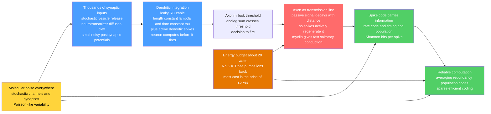

# 🧠 Neural Biophysics and Information

> [!abstract] TL;DR
> A neuron is simultaneously a **wire** and a **computer**, and it is a superb version of neither by conventional standards — yet it works. As a *wire* it is dreadful: a leaky, high-resistance cable in which voltage decays exponentially over a **length constant** $\lambda$ of only a fraction of a millimetre, which is exactly why axons must **actively regenerate** the signal as **all-or-nothing action potentials** and wrap themselves in **myelin** for fast, cheap **saltatory conduction**. As a *computer* it is subtle: thousands of stochastic synaptic inputs are integrated in branching dendrites — passively, via **cable theory**, and actively, via **dendritic spikes** — so the cell computes *before* it ever decides to fire. The output is a spike train that carries information about the world, quantifiable with **Shannon theory**: a **channel** of finite capacity (**bits per spike**), corrupted by **molecular noise** (stochastic channels, probabilistic vesicle release, Poisson-like trial-to-trial variability) that the brain defeats by **averaging, redundancy, and population codes**. And the whole apparatus runs on roughly **20 watts** — a dim lightbulb — most of it spent by the **Na⁺/K⁺-ATPase** pumping back the ions that each spike lets in. Neural design is thus an optimisation against four hard physical constraints — **energy, space, noise, and speed** — the same view that grounds computational neuroscience, efficient-coding theories of perception, and low-power **neuromorphic** hardware.

---

## Intuition

**Analogy:** A neuron is both a wire and a computer. As a wire, it is a *terrible* one — leaky, slow, and swamped by molecular noise — yet the brain routes signals reliably across it using tricks a telecom engineer would admire: it re-amplifies the signal at fixed intervals (action potentials are digital repeaters), it insulates the line (myelin), and it sends the same message down many parallel fibres and averages out the static (population coding). As a computer, a single neuron performs sophisticated calculations in its branching antennae — the dendrites — long before it ever "decides" to fire, so the cell body is less a lone logic gate than the output stage of a small analog processor. And it does all this on a power budget of about **20 watts for the whole brain** — running on the energy of a dim lightbulb while, at certain tasks, outperforming supercomputers that draw megawatts.

Two physical facts drive everything that follows. First, a passive nerve cable *loses* its signal with distance the way a whisper fades down a long hallway; nature's fix is to stop whispering and instead post a chain of shouting relay runners (spikes). Second, every one of those shouts is expensive — it lets sodium ions flood in, and each ion must later be bailed back out by an ATP-burning pump — so evolution is under relentless pressure to say as much as possible with as few spikes as possible. The neuron is where **cable physics**, **information theory**, and **thermodynamics** meet in one cell.

---

## How It Works

### Core Mechanics

**1. Inputs arrive as stochastic synaptic events.** A cortical neuron receives on the order of $10^3$–$10^4$ synapses onto its dendritic tree. Each presynaptic spike triggers **probabilistic vesicle release** (release probability often only $0.1$–$0.5$), neurotransmitter **diffuses** across the ~20 nm cleft, and receptors open channels producing a small **postsynaptic potential** (a fraction of a millivolt to a few millivolts). The very first stage of neural signalling is therefore *noisy and analog* — the physics of stochastic release and diffusion is developed in the sibling notes *Ion_Channels_and_Transport* and *Bioelectricity_and_Cellular_Signaling_Physics*.

**2. Dendrites integrate — and compute.** The dendrite is a **leaky RC cable**. Passive voltage spread is governed by the **cable equation**

$$\lambda^2 \frac{\partial^2 V}{\partial x^2} = \tau \frac{\partial V}{\partial t} + V,$$

with **length constant** $\lambda = \sqrt{r_m/r_i} = \sqrt{(R_m d)/(4 R_i)}$ (how far voltage spreads before decaying by a factor $e$) and **time constant** $\tau = R_m C_m$ (how fast the membrane charges). In steady state a signal decays as $V(x) = V_0\,e^{-x/\lambda}$: distal inputs are **attenuated and low-pass filtered** by the time they reach the soma. But dendrites are not merely passive — voltage-gated Na⁺, Ca²⁺, and NMDA channels support **dendritic spikes** and **nonlinear** local integration, so a single neuron behaves like a small **two-layer network**, computing coincidence, direction selectivity, and logical operations before threshold. *The neuron computes before it fires.*

**3. The axon solves the wire problem by regeneration.** Passive cable decay makes long-distance analog transmission impossible — over a metre-long axon $V_0 e^{-x/\lambda}$ is essentially zero. The evolutionary fix is **active regeneration**: the **action potential** (see *The_Hodgkin_Huxley_Model_and_Action_Potentials*) is a self-propagating, all-or-nothing pulse that is fully restored at every patch of membrane, making the axon a **digital transmission line** immune to attenuation. **Myelination** insulates internodes and confines regeneration to the **nodes of Ranvier**, giving fast **saltatory conduction** and saving energy (fewer ions cross per millimetre). Conduction is a *solved engineering problem* — reliable, fast, and cheap.

**4. Output is a spike code corrupted by noise.** Information is carried by **rate codes** (spikes per window), **temporal codes** (precise timing, down to microseconds in auditory ITD circuits), and **population codes** (distributed across an ensemble with different tuning). Every stage is **noisy**: stochastic channel gating, probabilistic synapses, and Poisson-like variability (Fano factor near 1). The brain computes *reliably despite noise* by **averaging over time and neurons, redundancy, and population coding** — and noise is occasionally even a *resource* (**stochastic resonance**). See *Neural_Coding_and_Spike_Trains*.

**5. Information meets energy.** Shannon quantifies the **channel capacity** and **mutual information** a spike train carries about a stimulus (typically ~1–3 bits per spike). **Efficient coding** (Barlow) says sensory systems maximise information given constraints — **redundancy reduction** and matching codes to **natural statistics**. But every spike costs ATP, so the design objective is really **bits per joule**: this drives **sparse coding** and the metabolic minimisation of spikes.

### Flow / Architecture



---

## Key Concepts

### Secondary Level

- **A neuron is a wire *and* a computer.** It receives many small signals in its dendrites, adds them up, and if the total is big enough it sends out a spike down its axon to other cells.
- **Signals fade in a wire.** Voltage travelling passively down a dendrite or axon gets weaker with distance — like a whisper down a long hallway. The distance over which it fades is the **length constant** $\lambda$.
- **Spikes are relay runners.** Because passive signals die out, the axon re-shouts the message at every step as an identical **action potential**, so it never gets quieter no matter how far it travels.
- **Myelin is insulation.** Fatty wrapping lets the spike "jump" between gaps (saltatory conduction) — faster *and* cheaper.
- **Neurons are noisy but reliable.** Individual signals are unpredictable, yet the brain gets the right answer by using many neurons and averaging — a crowd is steadier than one voice.
- **The brain sips power.** The whole brain runs on about **20 watts** — a dim lightbulb — most of it spent cleaning up (pumping ions back) after each spike.

### Undergraduate Level

- **Cable equation.** $\lambda^2 V_{xx} = \tau V_t + V$. Steady-state passive decay $V(x)=V_0 e^{-x/\lambda}$ with $\lambda=\sqrt{r_m/r_i}\propto\sqrt{d}$ (thicker fibres spread signals farther). Time constant $\tau=R_m C_m$ sets charging speed and temporal filtering.
- **Why axons must spike.** For $\lambda\sim 0.1$–$1$ mm, a passive signal is attenuated to nothing over centimetres. Active regeneration (voltage-gated Na⁺ channels) makes conduction distance-independent — the price is metabolic.
- **Dendrites as computational elements.** Sublinear (saturating) and superlinear (NMDA/Ca²⁺ spike) integration; a neuron approximates a **two-layer** nonlinear unit, not a single linear summator.
- **Synaptic stochasticity.** Quantal release: number of released vesicles is roughly binomial with parameters $(n, p)$; **synaptic failures** are common at low $p$. Reliability improves by pooling many synapses/inputs.
- **Neural coding schemes.** Rate vs temporal vs population codes; **tuning curves**; **Poisson** spiking with **Fano factor** $F=\mathrm{Var}(N)/\langle N\rangle\approx 1$.
- **Fisher information and discriminability.** For a Poisson neuron, $\mathcal I(s)=T\,\big(f'(s)\big)^2/f(s)$; the Cramér–Rao bound gives $\mathrm{Var}(\hat s)\ge 1/\mathcal I$. Signal-to-noise (and $d'$) grow as $\sqrt{N\,T}$ — averaging beats noise.
- **Bits per spike.** Mutual information $I(S;R)$ between stimulus and spike count; sensory neurons typically carry ~1–3 bits/spike.
- **Energy per spike.** From $Q=C_m\,\Delta V$, a spike admits a known charge of Na⁺; the Na⁺/K⁺-ATPase pumps 3 Na⁺ per ATP, giving ~$10^8$–$10^9$ ATP per spike for a typical neuron.

### Graduate Level

- **Rall cable theory and equivalent cylinders.** The full cable PDE with sealed/leaky boundary conditions; **electrotonic length** $L=\ell/\lambda$; Rall's **3/2 power law** collapsing a branched tree to an equivalent cylinder; input resistance and transfer impedance shaping synaptic efficacy by dendritic location (**democratic** vs distance-dependent synapses; dendritic normalisation).
- **Active dendrites and single-neuron computation.** NMDA spikes, Ca²⁺ plateau potentials, and Na⁺ dendritic spikes implement compartmentalised nonlinearities; two-layer/hierarchical models (Poirazi & Mel) and the demonstration that a biophysical pyramidal cell needs a *multi-layer* artificial network to emulate its input–output map.
- **Efficient coding and the Barlow programme.** Redundancy reduction; predictive/whitening filters matched to $1/f$ natural-image statistics (Atick & Redlich); Laughlin's fly LMC contrast-response curve matching the **cumulative distribution** of natural contrasts — a direct confirmation of information-maximisation.
- **Information rate and metabolic optimisation.** Attwell & Laughlin's ATP budget: synaptic transmission and postsynaptic currents dominate grey-matter energy; **bits-per-joule** optimisation predicts **low mean firing rates** and **sparse coding**; the metabolically optimal fraction of active neurons is a few percent (Levy & Baxter; Lennie's estimate of ~1% active).
- **Channel capacity of a spiking channel.** Rate-distortion and capacity of Poisson/renewal channels; timing precision limits (jitter) capping temporal codes; entropy of spike trains via the **direct method** (Strong et al.) and reliability of the fly H1 code (Bialek, de Ruyter van Steveninck).
- **Noise sources and stochastic resonance.** Channel noise scaling as $1/\sqrt{N_{\text{channels}}}$ (why thin axons are noisier and have a minimum viable diameter, Faisal et al.); synaptic and thermal noise; **stochastic resonance** where added noise *improves* subthreshold detection.
- **Wiring and space constraints.** Component-placement optimisation of cortical layout; conduction-delay vs volume trade-offs; myelination as a joint speed/energy/space optimum. The brain as a **near-optimal information processor** under simultaneous energy, space, noise, and speed constraints — the design lens shared with **neuromorphic** engineering.

---

## Python Demo

```python
# Neural biophysics and information — three linked demonstrations:
#   (a) NEURAL CODING & INFORMATION: a noisy Poisson neuron with a Gaussian
#       tuning curve. Compute Fisher information (coding precision) and show that
#       stimulus discriminability (d', percent-correct in a 2AFC task) grows as
#       sqrt(N*T) — averaging over time / neurons beats molecular noise.
#   (b) CABLE THEORY: passive voltage decay V(x) = V0 * exp(-x / lambda) along a
#       dendrite/axon for several length constants, showing why a passive signal
#       dies over distance and active spike regeneration is mandatory.
#   (c) ENERGY BUDGET: ATP cost per spike (ions admitted -> pumped back by the
#       Na/K-ATPase) and a back-of-envelope whole-brain power estimate (~20 W).
# Requires: numpy, matplotlib
import numpy as np
import matplotlib.pyplot as plt

rng = np.random.default_rng(0)

# =====================================================================
# (a) NEURAL CODING & INFORMATION
# =====================================================================
r0, rmax, sigma, spref = 2.0, 50.0, 20.0, 0.0     # baseline, peak (Hz), width, pref
T = 0.5                                            # observation window (s)

def tuning(s):                                     # Gaussian tuning curve, spikes/s
    return r0 + (rmax - r0) * np.exp(-(s - spref)**2 / (2 * sigma**2))

def dtuning(s):                                    # derivative df/ds
    return -(s - spref) / sigma**2 * (rmax - r0) * np.exp(-(s - spref)**2 / (2 * sigma**2))

def fisher_single(s):                              # Poisson-count Fisher info over T
    f = tuning(s)
    return T * dtuning(s)**2 / f                    # I(s) = T (f')^2 / f

s_axis = np.linspace(-60, 60, 400)
tc = tuning(s_axis)
FI = fisher_single(s_axis)

# --- 2AFC discrimination: distinguish s1 vs s2 by pooling M independent samples
s1, s2 = -5.0, +5.0                                # two nearby stimuli (deg)
r1, r2 = tuning(s1), tuning(s2)                    # their firing rates
def percent_correct(M, trials=4000):
    """Ideal Poisson observer pooling M samples (neurons x time). Likelihood-ratio."""
    lam1, lam2 = r1 * T * M, r2 * T * M            # pooled expected counts
    correct = 0
    for true_lam, other_lam in ((lam1, lam2), (lam2, lam1)):
        k = rng.poisson(true_lam, size=trials)     # observed pooled count
        # log-likelihood ratio; decide toward the closer mean
        llr = k * (np.log(lam1) - np.log(lam2)) - (lam1 - lam2)
        decide1 = llr > 0
        correct += np.sum(decide1 == (true_lam == lam1))
    return correct / (2 * trials)

M_vals = np.array([1, 2, 4, 8, 16, 32, 64, 128])
pc = np.array([percent_correct(M) for M in M_vals])
# theoretical d' for pooled Poisson: d' = |lam1-lam2| / sqrt((lam1+lam2)/2), grows ~ sqrt(M)
dprime = np.abs(r1 - r2) * T * M_vals / np.sqrt((r1 + r2) / 2 * T * M_vals)
print("Fisher info at steepest point : %.3f  (1/deg^2)" % np.nanmax(FI))
print("d' at M=1 : %.2f   d' at M=64 : %.2f  (scales ~ sqrt(M))" % (dprime[0], dprime[6]))

# =====================================================================
# (b) CABLE THEORY: passive decay V(x) = V0 exp(-x/lambda)
# =====================================================================
x = np.linspace(0, 5.0, 400)                       # distance along fibre (mm)
V0 = 100.0                                          # initial depolarisation (arb.)
lambdas = {"thin unmyelinated  lambda=0.2 mm": 0.2,
           "cortical dendrite  lambda=0.5 mm": 0.5,
           "thick axon         lambda=1.0 mm": 1.0}
threshold = 20.0                                    # spike threshold (arb. units)

# =====================================================================
# (c) ENERGY BUDGET: ATP per spike and whole-brain power
# =====================================================================
Cm    = 1.0e-6        # F/cm^2   specific membrane capacitance
dV    = 100e-3        # V        action-potential swing
e_ch  = 1.602e-19     # C        elementary charge
NA    = 6.022e23      # 1/mol
E_ATP = 50e3 / NA     # J        free energy per ATP hydrolysed (~50 kJ/mol)
overlap = 4.0         # Na influx ~4x the capacitive minimum (HH channel overlap)

# per unit membrane area:
Q_min   = Cm * dV                       # C/cm^2   minimal capacitive charge
Na_in   = overlap * Q_min / e_ch        # Na+ ions admitted per cm^2 per spike
ATP_cm2 = Na_in / 3.0                   # 3 Na+ pumped per ATP by Na/K-ATPase

# a cortical pyramidal neuron: total membrane ~ 5e-4 cm^2 (soma+dendrites, effective)
area_cell = 5e-4                        # cm^2 (order-of-magnitude effective area)
ATP_spike = ATP_cm2 * area_cell
print("\nNa+ admitted per spike per cm^2 : %.2e ions" % Na_in)
print("ATP per spike (one neuron)      : %.2e molecules" % ATP_spike)

# whole brain: N neurons, mean rate f_bar
N_neurons, f_bar = 8.6e10, 4.0         # ~86 billion neurons, ~4 Hz mean
power_spikes = N_neurons * f_bar * ATP_spike * E_ATP    # watts from spiking
print("Estimated spiking power         : %.1f W  (order-of-magnitude of ~20 W brain)"
      % power_spikes)

# Attwell & Laughlin (2001) approximate grey-matter ATP budget shares
budget = {"Postsynaptic\nreceptors": 0.34, "Action\npotentials": 0.21,
          "Resting\npotentials": 0.20, "Glutamate\nrecycling": 0.11,
          "Presynaptic\nCa2+": 0.03, "Other": 0.11}

# =====================================================================
# PLOTS
# =====================================================================
fig, ax = plt.subplots(2, 2, figsize=(13, 9))

# (a1) tuning curve + Fisher information
ax[0,0].plot(s_axis, tc, color="#1f77b4", lw=2, label="tuning curve f(s)")
ax[0,0].set_xlabel("stimulus s (deg)"); ax[0,0].set_ylabel("firing rate (spikes/s)")
axb = ax[0,0].twinx()
axb.plot(s_axis, FI, color="#d62728", lw=2, ls="--", label="Fisher info I(s)")
axb.set_ylabel("Fisher information (1/deg^2)", color="#d62728")
ax[0,0].set_title("(a) Tuning curve encodes s; precision peaks on the slopes")
ax[0,0].legend(loc="upper left"); axb.legend(loc="upper right")

# (a2) discriminability grows as sqrt(pooled samples)
ax[0,1].semilogx(M_vals, pc*100, "o-", color="#2ca02c", lw=2, ms=7,
                 label="ideal-observer % correct")
ax[0,1].axhline(50, ls=":", color="gray", label="chance")
ax[0,1].set_xlabel("pooled samples  M  (neurons x time bins)")
ax[0,1].set_ylabel("2AFC percent correct")
ax[0,1].set_title("(a) Averaging beats noise: discriminability rises with sqrt(N*T)")
ax[0,1].set_ylim(45, 102); ax[0,1].legend()

# (b) cable decay
for label, lam in lambdas.items():
    ax[1,0].plot(x, V0*np.exp(-x/lam), lw=2, label=label)
ax[1,0].axhline(threshold, ls="--", color="black", label="spike threshold")
ax[1,0].set_xlabel("distance along fibre x (mm)")
ax[1,0].set_ylabel("passive voltage V(x)  (arb.)")
ax[1,0].set_title("(b) Cable theory: passive signal decays -> spikes must regenerate it")
ax[1,0].legend(fontsize=8)

# (c) brain energy budget
names = list(budget.keys()); shares = [budget[k]*100 for k in names]
colors = ["#4a9eff","#ff6b6b","#e67700","#51cf66","#9467bd","#adb5bd"]
ax[1,1].bar(names, shares, color=colors)
ax[1,1].set_ylabel("share of grey-matter ATP budget (percent)")
ax[1,1].set_title("(c) Energy: pumping ions back dominates (Attwell-Laughlin)")
ax[1,1].tick_params(axis="x", labelsize=8)
for i, v in enumerate(shares):
    ax[1,1].text(i, v+0.6, "%.0f" % v, ha="center", fontsize=8)

plt.tight_layout()
plt.savefig("neural_biophysics_information.png", dpi=130)
plt.show()
```

Running this prints that a single Poisson neuron carries the most stimulus information **on the flanks of its tuning curve** (where $f'(s)$ is largest, not at the peak); that 2AFC discrimination of two nearby stimuli climbs from near chance toward certainty as the pooled sample count $M$ (neurons $\times$ time) rises, with $d'$ scaling as $\sqrt{M}$ — the quantitative statement of "averaging beats noise"; that a passive cable signal with $\lambda\sim 0.2$–$1$ mm falls **below spike threshold within a couple of millimetres**, which is why axons cannot rely on passive spread and must regenerate spikes; and that each spike admits on the order of $10^8$–$10^9$ Na⁺ ions that the Na⁺/K⁺-ATPase must pump back, producing a whole-brain spiking power in the right ballpark of the celebrated **~20 W** total, of which — per Attwell & Laughlin — the largest slice goes not to the spikes themselves but to **synaptic and postsynaptic ion traffic**.

---

## Real-World Applications

> **Example — the retina as an efficient-coding channel (and why it inspires cameras and prosthetics).** Simon Laughlin measured the contrast-response curve of a blowfly's large monopolar cell and found it matched the *cumulative distribution* of natural-scene contrasts almost exactly — the neuron allocates its limited output range so that every response level is used equally often, **maximising information** for a fixed dynamic range. This is Barlow's efficient-coding hypothesis made quantitative, and it is the same principle behind **histogram equalisation** in image processing and the design of **retinal prosthetics** (Argus II, and newer photovoltaic arrays), which must decide *which spike patterns* to inject into surviving ganglion cells to convey a scene under a tight electrode and power budget. See *The_Physics_of_Hearing_and_Vision* for the sensory-transduction side.

Other high-stakes uses:

- **Brain–computer interfaces.** Intracortical arrays read M1 spike trains and decode intended movement in real time; everything about electrode count, bin width, and achievable bit-rate is a direct application of neural-coding and channel-capacity analysis. See [[Brain_Computer_Interfaces]] and [[Population_Coding_and_Decoding]].
- **Neuromorphic and spiking hardware.** Chips such as Intel Loihi and IBM TrueNorth copy the brain's **event-driven, sparse, low-power** design — spikes only when there is information to send — to attack the energy wall that conventional GPUs hit; the target metric is explicitly **bits (or inferences) per joule**.
- **Multiple sclerosis and demyelination.** Stripping myelin destroys saltatory conduction: signals slow, jitter, and fail — a clinical demonstration that the axon's speed and reliability are *engineered* properties of the cable, not givens.
- **Multi-electrode data analysis and spike sorting.** Wireless implantable BCIs cannot transmit raw voltage traces; understanding whether **rate or timing** carries the information sets the minimum bandwidth, enabling ~$10^5\times$ compression by transmitting sorted firing rates instead of waveforms.
- **Anaesthesia, coma, and metabolic imaging.** Because most brain energy pays for signalling, **fMRI/PET** metabolic signals track neural activity; the ~20 W budget and its activity-dependence are the physiological basis of functional neuroimaging.

---

## Common Pitfalls

- **Treating the neuron as a single linear summator.** Real dendrites are active, nonlinear cables; distal and proximal inputs are weighted very differently ($V_0 e^{-x/\lambda}$), and NMDA/Ca²⁺ spikes make a lone neuron closer to a two-layer network. The point-neuron approximation is convenient but hides the computation.
- **Confusing the length constant $\lambda$ (space) with the time constant $\tau$ (time).** $\lambda=\sqrt{r_m/r_i}$ sets *how far* a signal spreads; $\tau=R_m C_m$ sets *how fast* the membrane charges and how much high-frequency detail is filtered. They answer different questions and have different units.
- **Assuming information peaks where firing is highest.** Fisher information $\propto (f')^2/f$ is largest on the **slopes** of the tuning curve, not at its peak where $f'=0$. A neuron discriminates best about stimuli near its steepest response, an easy point to get backwards.
- **Calling all variability "noise" to be removed.** Poisson-like variability may encode **uncertainty** (probabilistic population codes), and small noise can *help* detection via **stochastic resonance**. Averaging it away prematurely discards real structure.
- **Ignoring that spikes are expensive.** Forgetting the metabolic cost leads to models with implausibly high, dense firing. Real cortex fires **sparsely** (mean rates of a few Hz, ~1% active) precisely because bits-per-joule, not bits alone, is under selection.
- **Double-counting the charge per spike.** The *minimal* capacitive charge $Q=C_m\Delta V$ underestimates Na⁺ influx by a factor of a few (channel overlap during the AP); using the minimum understates ATP cost, using total ion flux overstates it — state which you mean.
- **Forgetting the pump underneath everything.** Cable theory, coding, and the resting potential all silently assume the Na⁺/K⁺-ATPase is continuously restoring the gradients (see [[Membrane_Potential_and_the_Nernst_Equation]]). No pump, no signalling — and that pump is where most of the energy goes.

---

## Related Concepts

**Biophysics vault (this section and siblings):**
- [[Membrane_Potential_and_the_Nernst_Equation]] — the resting battery and equilibrium potentials that every dendritic and axonal signal rides on; the pump that dominates the energy budget lives here.
- [[Ion_Channels_and_Transport]] — the selective, stochastically gating channels whose openings *are* the currents in cable theory and the source of channel noise.
- [[Diffusion_and_Brownian_Motion_in_Cells]] — neurotransmitter crossing the synaptic cleft and the molecular noise floor are diffusion problems.
- [[Energy_Entropy_and_Free_Energy_in_Biology]] — the free-energy accounting behind ATP-per-spike and the thermodynamic cost of neural computation.
- *The_Hodgkin_Huxley_Model_and_Action_Potentials* (planned sibling) — the biophysics of the regenerating spike that solves the cable-decay problem.
- *Bioelectricity_and_Cellular_Signaling_Physics* (planned sibling) — the broader physics of cellular electrical signalling and synaptic transmission.
- *The_Physics_of_Hearing_and_Vision* (planned sibling) — sensory transduction and efficient coding at the sensory front end.
- *Systems_Biophysics_and_Gene_Networks* (planned sibling) — information processing by molecular networks, the non-neural cousin of neural computation.

**Neuroscience vault:**
- [[Neuron_Structure_and_Function]] — the cellular anatomy (soma, dendrites, axon, myelin) that this note treats as physics.
- [[Action_Potentials_and_Resting_Membrane_Potential]] — the neuroscience account of the spike used here as a digital repeater.
- [[Synaptic_Transmission_and_Neurotransmitters]] — the probabilistic vesicle-release stage that injects noise at the input.
- [[Neural_Coding_and_Spike_Trains]] — rate/temporal/population codes and Poisson variability, quantified from the coding side.
- [[Population_Coding_and_Decoding]] — Fisher information, Cramér–Rao bounds, and decoders that turn noisy populations into precise estimates.
- [[Hodgkin_Huxley_Model_and_Computational_Neurons]] — the conductance-based model that determines when and how often a neuron spikes.

**Information Theory vault:**
- [[Channel_Capacity_and_the_Noisy_Channel_Theorem]] — the Shannon limit that "bits per spike" is measured against.
- [[Fisher_Information_and_the_Cramer_Rao_Bound]] — the coding-precision machinery used in the demo to bound stimulus discriminability.
- [[Information_Theory_in_Biology_and_Neuroscience]] — mutual information, efficient coding, and redundancy reduction applied to neural systems.

---

## Review Questions

**Secondary.** A dendrite carries a small voltage from a synapse toward the cell body, but the signal gets weaker the farther it travels. Explain in plain language why this happens, and why an axon that has to send a signal a whole metre down your leg cannot just let the voltage spread passively — what trick does it use instead, and why does wrapping it in myelin help?

**Undergraduate.** A passive dendrite has length constant $\lambda = 0.4$ mm. (a) By what factor is a synaptic potential attenuated over a distance of 1 mm? (b) A neuron has a Gaussian tuning curve for stimulus orientation. Using $\mathcal I(s)\propto (f'(s))^2/f(s)$, explain where along the tuning curve the neuron carries the most information about small changes in orientation, and why this is *not* at the peak. (c) If pooling one neuron for 100 ms gives $d'=1$, roughly what $d'$ would you expect from pooling 16 equivalent neurons for the same window, and why?

**Graduate.** Estimate the ATP cost of a single action potential and use it to argue why cortical firing rates are low. Start from $Q = C_m \Delta V$ for a membrane of area $A$ and specific capacitance $1\ \mu\text{F/cm}^2$ swinging $100$ mV, include a factor of ~4 for Na⁺/K⁺ channel current overlap, convert admitted Na⁺ to ATP via the Na⁺/K⁺-ATPase (3 Na⁺ per ATP), and then multiply by ~$8.6\times10^{10}$ neurons at a mean rate you choose. Compare your total to the brain's ~20 W and to the Attwell–Laughlin finding that *synaptic* traffic, not the spike itself, dominates the budget. What does a "bits-per-joule" objective, combined with your estimate, predict about **sparse coding** and the optimal fraction of simultaneously active neurons?

---

## Sources

- Dayan, P., & Abbott, L. F. (2001). *Theoretical Neuroscience: Computational and Mathematical Modeling of Neural Systems.* MIT Press — cable theory, Fisher information, and neural coding in one framework.
- Koch, C. (1999). *Biophysics of Computation: Information Processing in Single Neurons.* Oxford University Press — the definitive treatment of dendrites, cables, and single-neuron computation.
- Attwell, D., & Laughlin, S. B. (2001). "An energy budget for signaling in the grey matter of the brain." *Journal of Cerebral Blood Flow & Metabolism*, 21(10), 1133–1145 — the ATP-per-spike budget and the ~20 W figure.
- Rieke, F., Warland, D., de Ruyter van Steveninck, R., & Bialek, W. (1997). *Spikes: Exploring the Neural Code.* MIT Press — bits per spike, channel capacity, and reliability of the neural code.
- Laughlin, S. B. (1981). "A simple coding procedure enhances a neuron's information capacity." *Zeitschrift für Naturforschung C*, 36(9–10), 910–912 — efficient coding matched to natural statistics, measured in the fly retina.
- Faisal, A. A., Selen, L. P. J., & Wolpert, D. M. (2008). "Noise in the nervous system." *Nature Reviews Neuroscience*, 9(4), 292–303 — sources of molecular noise and their physical limits on neural design.

---

#biophysics #neural-coding #cable-theory #information-theory #brain-energy
