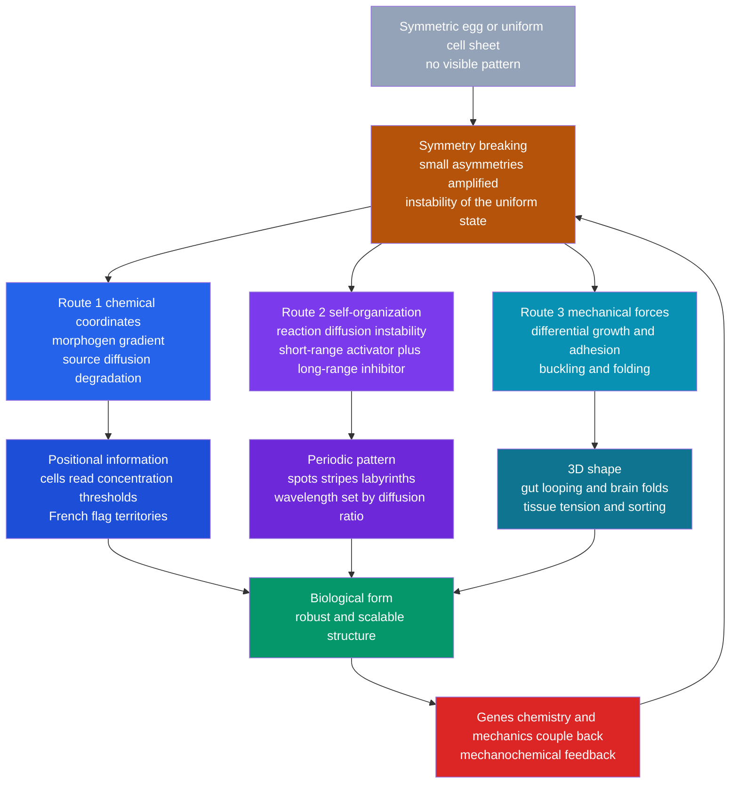

# 🐆 Pattern Formation and Morphogenesis

> [!abstract] TL;DR
> A fertilized egg is a nearly featureless ball of identical cells, yet it reliably becomes a striped tiger, a spotted leopard, or a five-fingered hand. The astonishing lesson of developmental **biophysics** is that the blueprint is *not* spelled out gene-by-gene — much of biological form **self-organizes** from a few simple physical and chemical rules. Three engines do most of the work: **morphogen gradients** give cells positional coordinates they read as thresholds (Wolpert's *French flag*); **Turing's reaction-diffusion instability** — a short-range activator racing a long-range inhibitor — spontaneously breaks a uniform state into spots, stripes, and labyrinths; and **mechanical forces** (differential growth, adhesion, buckling) fold flat sheets into guts and brains. The unifying theme is **symmetry-breaking**: development is a cascade of instabilities in which tiny asymmetries are amplified into robust, scalable structure — the same physics that paints frost ferns on a window and stripes a convection cell.

---

## Intuition

**Analogy:** Look at frost ferns spreading across a cold windowpane. Nobody drew them; no template decided where each branch would go. Water, temperature, and a little chemistry followed simple local rules, and an intricate, repeating pattern *emerged on its own* out of a smooth, featureless film. Biological pattern works shockingly often like this — order arising spontaneously from instability, not from a pixel-by-pixel plan.

Now push the analogy one step into biology. In 1952 Alan Turing asked a heretical question: could two chemicals that do nothing but **react and diffuse** — with no guiding hand, no map, no genetic pixel art — paint the spots on a leopard and the stripes on a tiger? He proved the answer is *yes*. If one chemical (an **activator**) builds itself up locally while a second (an **inhibitor**) spreads faster and suppresses it at a distance, a perfectly uniform sheet becomes **unstable** and settles into a regular pattern of peaks and valleys. The wavelength — the spot spacing — is set by nothing more than the ratio of how fast the two chemicals diffuse. This is the deep idea of the field: **structure is not always dictated; often it self-organizes because the smooth state cannot hold.**

---

## How It Works

### Core Mechanics

**Morphogenesis** is the generation of biological *form* and *pattern* during development — the central question of developmental biophysics: *how does structure arise from a symmetric start?* Three complementary mechanisms answer it.

**1. Morphogen gradients and positional information (Wolpert's French flag).**
A localized **source** secretes a signaling molecule, a **morphogen**, which **diffuses** away and is **degraded**. The competition between diffusion and decay produces a smooth, roughly exponential **concentration gradient** with a characteristic length $\lambda = \sqrt{D/k}$ (diffusion coefficient over degradation rate). Cells then read their *position* from the *local concentration*: above one threshold they adopt fate A, between thresholds fate B, below fate C. A smooth analog gradient is thereby converted into sharply bounded digital **territories** — Wolpert's blue/white/red **French flag**. Canonical examples: **Bicoid** setting the head-to-tail axis of the fly embryo, and **Sonic hedgehog (Shh)** patterning the vertebrate neural tube and setting digit identity in the limb bud. Gradients supply *coordinates*.

**2. Turing patterns — reaction-diffusion (diffusion-driven instability).**
Turing's 1952 *The Chemical Basis of Morphogenesis* showed something counterintuitive: **diffusion, normally a smoothing force, can *create* pattern.** The recipe is a **short-range activator** plus a **long-range inhibitor** — crucially, *the activator diffuses more slowly than the inhibitor*. Locally, a small bump of activator amplifies itself (autocatalysis) but also produces inhibitor, which diffuses away quickly and shuts down activation in the surroundings. The result is a "local self-enhancement, lateral inhibition" motif that **breaks the symmetry** of the uniform state into a periodic pattern. Reaction-diffusion gives *repetition and spacing*; the wavelength is fixed by the reaction rates and the diffusion ratio, not by any external template.

**3. Mechanical and mechanochemical morphogenesis.**
Form also arises from **forces**. Tissues behave like active materials: **differential growth** buckles a fast-growing layer bonded to a slow one (gut looping, the gyri and sulci of brain folding); **differential adhesion** (the differential-adhesion hypothesis) makes cell populations sort like immiscible fluids, minimizing interfacial energy; **tissue tension** and active stresses reshape sheets. Chemistry and mechanics are coupled — **mechanochemical feedback** — so a Turing chemical prepattern can direct where a tissue folds, and folding can feed back on signaling.

The genome supplies a conserved **toolkit** of genes, but it largely *tunes the parameters* of these physical processes rather than dictating every cell's fate. Robustness and **scaling** (patterns that hold up against noise and rescale with organ size — the scale-invariant French flag) emerge from the same dynamics.

### Flow / Architecture



---

## Key Concepts

### Secondary (intuitive)
- **Morphogenesis** is how a single egg turns into a shaped animal with organs, digits, and coat patterns — the origin of biological *form*.
- Much pattern is **not** drawn cell-by-cell; it **self-organizes**, like frost on glass, sand ripples, or snowflakes — order that appears on its own.
- A **morphogen** is a signal that spreads out from a source; a cell figures out *where it is* from how much of the signal it detects (high near the source, low far away) — the **French flag** idea.
- **Turing** showed that two chemicals that only react and diffuse can spontaneously make **spots and stripes** — the physics behind leopard spots and tiger stripes.
- Forces matter too: tissues **fold and buckle** into shape, the way a too-big sheet crumples — that is how the gut coils and the brain wrinkles.

### Undergraduate (quantitative)
- **Gradient length scale:** for a source-diffusion-degradation morphogen, the steady profile is roughly $c(x)=c_0\,e^{-x/\lambda}$ with **decay length** $\lambda=\sqrt{D/k}$ (diffusion coefficient $D$, degradation rate $k$). Thresholds on $c$ partition space into fates.
- **Reaction-diffusion system:** $\partial_t u = D_u\nabla^2 u + f(u,v)$, $\partial_t v = D_v\nabla^2 v + g(u,v)$. A **Turing instability** requires a stable well-mixed steady state that becomes *unstable to spatial perturbations* — the paradox of **diffusion-driven instability**.
- **The diffusion-ratio condition:** patterning needs $D_v \gg D_u$ (inhibitor $v$ diffuses much faster than activator $u$). The selected **wavelength** scales as $\sim 2\pi\sqrt{D_u D_v}\,/\,(\text{reaction rate})^{1/2}$ — spacing is set by diffusion and kinetics, not a template.
- **Activator-inhibitor motif:** local **self-activation** $+$ **lateral inhibition**. Gierer-Meinhardt and Gray-Scott are the standard toy models.
- **Body-size scaling of coats:** because pattern wavelength is roughly fixed, **small animals** show a *few* features (spots) while **large canvases** show *many stripes* — and famously "a spotted animal can have a striped tail, but not the reverse," a geometry argument from Murray.

### Graduate (advanced)
- **Linear stability analysis:** linearize about the homogeneous fixed point, expand perturbations in Fourier modes $e^{ik\cdot x + \sigma t}$. The Jacobian plus $-k^2 D$ gives a dispersion relation $\sigma(k)$; a **band of unstable wavenumbers** with $\mathrm{Re}\,\sigma(k)>0$ is the Turing regime. The fastest-growing mode $k^\*$ sets the initial wavelength.
- **The four Turing conditions** on the reaction Jacobian (self-activation of $u$, cross-inhibition, net negative trace, positive determinant) combined with $d=D_v/D_u$ exceeding a critical ratio $d_c$ — pattern appears only in a wedge of parameter space.
- **Beyond two morphogens:** most real systems are not clean activator-inhibitor pairs. Modern work uses **3+ node networks**, **cell-based / mechanochemical** couplings, and shows Turing behavior is far more parameter-robust with additional nodes (Marcon, Sharpe).
- **Amplitude equations & pattern selection:** weakly nonlinear analysis (Ginzburg-Landau / Swift-Hohenberg) predicts **spots vs stripes vs labyrinths** from symmetry and nonlinearity — a direct link to the physics of Rayleigh-Bénard convection and crystallization.
- **Robustness & scaling mechanisms:** expansion-repression, self-enhanced degradation, and pre-steady-state readout make gradients precise (Bicoid reads position to ~1 percent egg length) and scale-invariant across embryo sizes.
- **Symmetry-breaking as the unifying frame:** development is a cascade of bifurcations — egg $\to$ axes $\to$ segments $\to$ organs — each an instability amplifying microscopic asymmetry, deeply analogous to phase transitions and nonequilibrium pattern formation in physics.

These threads connect to the sibling notes in this section. *Diffusion_and_Brownian_Motion_in_Cells* supplies the transport physics that sets every gradient's length scale; *Bioelectricity_and_Cellular_Signaling_Physics* covers voltage and ionic prepatterns that can also carry positional information; *Systems_Biophysics_and_Gene_Networks* formalizes the gene-regulatory circuits that implement activator-inhibitor logic; *Cell_Motility_and_Adhesion* provides the differential-adhesion and force generation behind mechanical morphogenesis; and *The_Reach_and_Future_of_Biophysics* situates synthetic morphology and regenerative medicine as the applied frontier.

---

## Python Demo

```python
# Pattern formation from simple rules:
#   PART A - Gray-Scott reaction-diffusion (a Turing system) integrated on a 2D
#            grid, showing SPONTANEOUS emergence of spots / labyrinths / worms
#            from near-uniform noisy initial conditions. Changing (F, k) switches
#            the animal-coat-like texture.
#   PART B - a 1D MORPHOGEN GRADIENT (source-diffusion-degradation) thresholded
#            into the French-flag territories: positional information.
import numpy as np
import matplotlib.pyplot as plt

# ----------------------------------------------------------------------
# PART A - Gray-Scott Turing patterns
#   du/dt = Du*lap(u) - u*v^2 + F*(1 - u)     (activator-like substrate)
#   dv/dt = Dv*lap(v) + u*v^2 - (F + k)*v     (autocatalytic species)
# Inhibitor-like species diffuses faster relatively via the Du > Dv contrast
# plus the feed/kill balance -> diffusion-driven instability.
# ----------------------------------------------------------------------
def laplacian(A):
    # 5-point stencil with periodic (wrap-around) boundaries
    return (np.roll(A, 1, 0) + np.roll(A, -1, 0)
          + np.roll(A, 1, 1) + np.roll(A, -1, 1) - 4.0 * A)

def gray_scott(F, k, Du=0.16, Dv=0.08, N=200, steps=10000, seed=0):
    rng = np.random.default_rng(seed)
    U = np.ones((N, N))
    V = np.zeros((N, N))
    # seed a handful of random patches to break the initial symmetry
    r = 6
    for _ in range(25):
        cx, cy = rng.integers(r, N - r, size=2)
        U[cx - r:cx + r, cy - r:cy + r] = 0.50
        V[cx - r:cx + r, cy - r:cy + r] = 0.25
    # tiny noise everywhere so the instability has something to amplify
    U += 0.02 * rng.standard_normal((N, N))
    V += 0.02 * rng.standard_normal((N, N))
    U = np.clip(U, 0, 1); V = np.clip(V, 0, 1)
    for _ in range(steps):
        uvv = U * V * V
        U += Du * laplacian(U) - uvv + F * (1.0 - U)
        V += Dv * laplacian(V) + uvv - (F + k) * V
    return V

# Three parameter regimes -> three animal-coat-like textures
regimes = {
    "Spots  F=0.035 k=0.065":      dict(F=0.035, k=0.065),
    "Labyrinth  F=0.055 k=0.062":  dict(F=0.055, k=0.062),
    "Worms  F=0.0367 k=0.0649":    dict(F=0.0367, k=0.0649),
}
fields = {name: gray_scott(**p) for name, p in regimes.items()}

# ----------------------------------------------------------------------
# PART B - 1D morphogen gradient -> French flag positional information
# Integrate  dc/dt = Dm*c'' - kd*c  with a fixed source c(0)=1 to steady state.
# ----------------------------------------------------------------------
Nx = 400
x  = np.linspace(0.0, 1.0, Nx)
dx = x[1] - x[0]
Dm, kd = 4e-4, 1e-2                 # gives decay length lambda = sqrt(Dm/kd) = 0.2
dt = 0.4 * dx * dx / Dm             # stable explicit time step
c  = np.zeros(Nx)
for _ in range(40000):
    lap = np.empty_like(c)
    lap[1:-1] = (c[2:] - 2 * c[1:-1] + c[:-2]) / dx**2
    lap[0], lap[-1] = lap[1], lap[-2]      # zero-flux at the far end
    c += dt * (Dm * lap - kd * c)
    c[0] = 1.0                             # fixed morphogen source at x = 0
lam = np.sqrt(Dm / kd)
theta_hi, theta_lo = 0.5, 0.15            # two thresholds -> three fates

# build the French-flag colour bar from the gradient
flag = np.zeros((1, Nx, 3))
flag[0, c >= theta_hi]                       = [0.0, 0.20, 0.60]   # blue  (near source)
flag[0, (c < theta_hi) & (c >= theta_lo)]    = [1.0, 1.00, 1.00]   # white (middle)
flag[0, c < theta_lo]                        = [0.80, 0.10, 0.10]  # red   (far field)

b_blue  = x[np.argmax(c < theta_hi)]
b_white = x[np.argmax(c < theta_lo)]
print(f"decay length lambda = {lam:.3f} (domain units)")
print(f"blue|white boundary at x = {b_blue:.3f},  white|red boundary at x = {b_white:.3f}")

# ----------------------------------------------------------------------
# Plots
# ----------------------------------------------------------------------
fig, ax = plt.subplot_mosaic(
    [["spots", "laby", "worms"],
     ["grad",  "grad", "flag"]],
    figsize=(13, 8))

for key, name in zip(["spots", "laby", "worms"], fields.keys()):
    ax[key].imshow(fields[name], cmap="inferno", interpolation="bilinear")
    ax[key].set_title(name, fontsize=10)
    ax[key].axis("off")

ax["grad"].plot(x, c, lw=2, color="navy", label="morphogen c(x)")
ax["grad"].axhline(theta_hi, ls="--", color="k", lw=1)
ax["grad"].axhline(theta_lo, ls="--", color="k", lw=1)
ax["grad"].axvline(b_blue,  ls=":", color="steelblue")
ax["grad"].axvline(b_white, ls=":", color="firebrick")
ax["grad"].set_title("Morphogen gradient -> position read as thresholds")
ax["grad"].set_xlabel("position x"); ax["grad"].set_ylabel("concentration")
ax["grad"].legend(); ax["grad"].grid(alpha=0.3)

ax["flag"].imshow(flag, aspect="auto", extent=[0, 1, 0, 1])
ax["flag"].set_title("French flag territories")
ax["flag"].set_yticks([]); ax["flag"].set_xlabel("position x")

plt.tight_layout()
plt.show()
```

**What you should see:** Part A prints nothing but renders three 2D fields that started as near-uniform noise and *spontaneously* organized — a spotty coat, a fingerprint-like labyrinth, and connected "worm" stripes — purely from the same reaction-diffusion equations with different feed/kill rates: identical physics, different animal. Part B prints the decay length ($\lambda=0.2$) and the two territory boundaries, and draws the smooth exponential gradient being sliced by two thresholds into a crisp blue/white/red French flag — a diffusing chemical turned into digital positional information. (The Gray-Scott run takes a few seconds; drop `N` or `steps` to speed it up.)

---

## Real-World Applications

> **Example — leopard spots and body size.** James Murray's reaction-diffusion models predict that because pattern *wavelength* is roughly fixed, a small body surface fits only a few features (spots) while a large one fits many (stripes) — and that a spotted animal can have a striped tail but a striped animal cannot have a spotted tail, exactly as observed. The pattern is not painted by a gene per spot; it self-organizes from an activator-inhibitor chemistry.

- **Fish pigmentation (living Turing patterns):** in the marine angelfish *Pomacanthus*, stripes literally *move and rearrange* as the fish grows, splitting and inserting new stripes — dynamic behavior that Kondo and Asai predicted from a Turing model and that is strong molecular-scale evidence for reaction-diffusion in real skin.
- **Digit formation:** the number and spacing of fingers/toes follows a **Sox9 / BMP / Wnt Turing-like** network (Sharpe lab); modulating the network changes digit number, and the periodicity behaves like a reaction-diffusion wavelength — not a hand-drawn map.
- **Hair follicle and feather spacing; palatal ridges:** the regular spacing of follicles, feather buds, and the rugae on the roof of your mouth are classic periodic patterns produced by activator-inhibitor (WNT/DKK, FGF/BMP) reaction-diffusion.
- **Morphogen gradients in the clinic:** Bicoid and Sonic hedgehog set positional fates; disrupting Shh dosing causes **polydactyly** (extra digits) or **holoprosencephaly**, and teratogens like retinoids produce patterned limb defects — real French-flag logic gone wrong.
- **Mechanical morphogenesis:** gut looping and brain **gyrification** are now modeled as elastic **buckling** of a fast-growing layer on a slower substrate — differential growth, not a fold-by-fold genetic script.
- **Synthetic morphology & organoids:** bioengineers build artificial gradients and synthetic Turing circuits to steer stem cells into patterned **organoids** and self-organizing tissues, directly applying these physics to regenerative medicine.

---

## Common Pitfalls

- **"The genome is a blueprint that specifies every cell."** It largely *tunes the parameters* of self-organizing physical processes. Much pattern **emerges**; the same reaction-diffusion equations give a leopard or a tiger just by changing rates, with no per-spot gene.
- **"Diffusion only smooths things out."** The whole Turing surprise is **diffusion-driven instability** — adding diffusion to a stable well-mixed reaction can *destabilize* it into pattern. Diffusion is a creative, not merely dissipative, force here.
- **"Any two diffusing chemicals will pattern."** They will not. You need the **activator to diffuse slower than the inhibitor** ($D_v \gg D_u$) *and* the reaction Jacobian to satisfy the Turing conditions. Equal diffusion coefficients give no pattern.
- **"A single gradient explains everything."** Gradients give *coordinates* (aperiodic, position-dependent fates); **periodic** structures — spot/stripe/follicle spacing — need reaction-diffusion self-organization. Confusing the two mechanisms is the most common conceptual error.
- **"Turing models were disproven, it's all genetics."** The opposite: molecular identification of activator-inhibitor pairs (fish pigment cells, digits, follicles) drove a **resurgence** of Turing theory with concrete molecular support.
- **"Explicit integration is always safe."** The reaction-diffusion solver needs $D\,\Delta t/\Delta x^2 \lesssim 0.25$ in 2D or it blows up; and too much initial noise or the wrong feed/kill can wash the pattern out. Numerical artifacts get mistaken for biology.
- **"Chemistry does it all."** Ignoring **mechanics** misses half the story — differential growth, adhesion-driven sorting, tissue tension and buckling shape organs, and they feed back on chemistry (mechanochemical coupling).

---

## Related Concepts

- [[Morphogenesis_and_Pattern_Formation]] — the **Biology** companion (Hox genes, segmentation hierarchy, homeotic mutants); this note is the *physics* deep-dive into the same phenomenon — read them together.
- [[Diffusion_and_Brownian_Motion_in_Cells]] — supplies the transport physics ($D$, Fick's laws) that sets every morphogen gradient's decay length $\lambda=\sqrt{D/k}$.
- [[Cell_Signaling_in_Development]] — the Shh, Wnt, and BMP pathways that physically transmit morphogen signals and implement threshold readout.
- [[Embryonic_Development_and_Gastrulation]] — establishes the axes and germ layers that gradients and Turing systems then subdivide.
- [[Gene_Regulation]] — the transcription-factor logic that converts a morphogen concentration into a sharp on/off cell fate.
- [[Emergence_and_Self_Organization]] — the general principle that global order can arise from simple local rules with no central controller; morphogenesis is a flagship biological case.
- [[Bifurcations_and_Tipping_Points]] — a Turing instability *is* a bifurcation of the uniform state; the onset of pattern is a symmetry-breaking transition.
- [[Introduction_to_PDEs]] — reaction-diffusion is a coupled parabolic PDE system; linear stability and Fourier modes are the core tools.
- [[Numerical_ODEs_and_PDEs]] — the explicit finite-difference scheme (and its stability limit) used in the demo to integrate the equations.
- [[Criticality_and_Phase_Transitions]] — the deep physics analogy: pattern selection resembles ordering at a phase transition (convection, crystallization).
- [[Chemical_Kinetics]] — the reaction terms $f(u,v),\,g(u,v)$ are chemical rate laws; autocatalysis makes the activator self-enhancing.

---

## Review Questions

1. **(Conceptual)** Turing called it "diffusion-driven instability," yet diffusion normally *erases* gradients. Explain the paradox: how can adding diffusion to a *stable* well-mixed reaction *create* a spatial pattern? In your answer state precisely why the **activator must diffuse more slowly than the inhibitor**.
2. **(Scenario)** You are shown two developmental patterns: (a) the fly embryo's smooth head-to-tail sequence of unique segment identities, and (b) the regular, evenly spaced spots on a leopard's flank. For each, decide whether a **morphogen gradient (positional information)** or a **reaction-diffusion (Turing) mechanism** is the more natural explanation, and justify using the distinction between *coordinates* and *periodic spacing*.
3. **(Trade-off / synthesis)** Murray argued big animals can have spots or stripes but small ones only spots, and that a spotted animal can have a striped tail but not vice versa. Using the idea that Turing pattern **wavelength is roughly fixed** while the **canvas size varies**, explain both claims. Then describe how a **mechanical** process (differential-growth buckling) could impose additional structure that pure chemistry would not, and how the two might couple.

---

## Sources

- Turing, A. M. (1952). "The Chemical Basis of Morphogenesis." *Philosophical Transactions of the Royal Society B*, 237(641), 37-72.
- Wolpert, L. (1969). "Positional Information and the Spatial Pattern of Cellular Differentiation." *Journal of Theoretical Biology*, 25(1), 1-47.
- Kondo, S. & Miura, T. (2010). "Reaction-Diffusion Model as a Framework for Understanding Biological Pattern Formation." *Science*, 329(5999), 1616-1620.
- Pearson, J. E. (1993). "Complex Patterns in a Simple System." *Science*, 261(5118), 189-192 (Gray-Scott regimes).
- Murray, J. D. (2003). *Mathematical Biology II: Spatial Models and Biomedical Applications* (3rd ed.). Springer — animal coat patterns and mechanochemical models.

---

#biophysics #pattern-formation #reaction-diffusion #turing-patterns #morphogenesis
