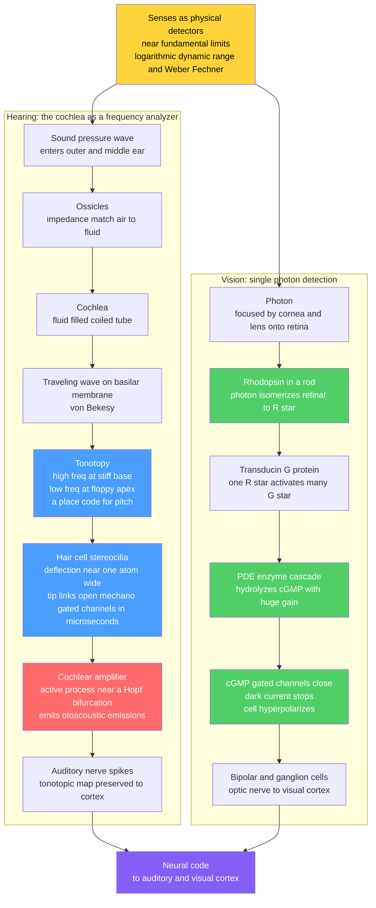

# 👂 The Physics of Hearing and Vision

> [!abstract] TL;DR
> Sensory organs are **transducers** — devices that convert a physical stimulus (a pressure wave, a photon) into a neural electrical signal — and evolution has driven them to the **fundamental physical limits** of sensitivity. The **cochlea** is a fluid-filled biological **spectrum analyzer**: the **basilar membrane** performs a spatial Fourier decomposition via von Békésy's **traveling wave**, mapping frequency to position (**tonotopy** — high pitch at the base, low at the apex). The sensory **hair cells** open mechanically-gated ion channels when their stereocilia deflect by only about an **atomic diameter**, a threshold *below* thermal noise — rescued by an **active cochlear amplifier** that pumps energy in near a **Hopf bifurcation** and even emits sound (otoacoustic emissions). Vision goes further: a **rod** can detect a **single photon**. A photon isomerizes **rhodopsin**, which fires an amplifying **G-protein cascade** (transducin → PDE → cGMP hydrolysis) that closes ion channels and hyperpolarizes the cell — one photon becomes a reliable current. Both senses tame an enormous **dynamic range** (a trillion-fold in sound intensity, ten orders of magnitude in light) through **logarithmic (Weber–Fechner) encoding** and active gain control. Understanding this physics drives cochlear implants and retinal prosthetics, and reveals evolution engineering detectors as sensitive as the laws of physics permit.

---

## Intuition

**Analogy:** Our senses operate at the very edge of physics — they are not sloppy biological gadgets but quantum- and thermal-limited instruments. The ear can register a sound so faint that the eardrum moves **less than the width of a single atom**, and it does this without drowning in the ceaseless thermal jiggling of its own molecules. The eye can register a **single particle of light**. Think of the ear as a bank of a few thousand exquisitely tuned tuning forks laid out along a ribbon — each one rings to its own note and reports *where* along the ribbon the sound landed — while a tiny built-in amplifier at each fork listens to itself and pumps energy back in to hear a whisper. Think of the eye's rod as a Geiger counter for light: one photon trips a chemical avalanche that produces a signal a million times larger than the original absorption, loud enough to be heard over the cell's own noise.

Once you see the senses as **physical detectors**, the whole design logic snaps into focus. A detector faces three enemies — **noise** (thermal jiggling, spontaneous chemical events), **weak signals** (a photon carries only a couple of electron-volts; a threshold sound carries less energy than a bacterium's lunch), and **range** (the world spans a trillion-fold in loudness and ten billion-fold in brightness). Hearing and vision are two independent evolutionary answers to the same physics problem: *build the most sensitive possible instrument, then compress its output logarithmically so a limited nerve can carry the whole span.*

---

## How It Works

### 1. The sense as a physical detector

A sensory receptor is a **transducer**: stimulus energy in, graded electrical signal out, ultimately spikes on a nerve. The remarkable fact is *how close to the physical floor* these detectors sit. A hair cell responds to stereocilia tip deflections of $\sim 0.3$ nm — roughly one atomic diameter, and comparable to the root-mean-square Brownian motion of the bundle itself. A dark-adapted rod responds to a **single absorbed photon** and the whole visual system reports a flash of $\sim 5$–$10$ absorbed photons. In both cases evolution has pushed sensitivity until it bumps into a *fundamental* limit — thermal noise for hearing, the quantized, Poisson-distributed arrival of photons for vision. This is the showcase theme of sensory biophysics: **optimization against the laws of physics**.

### 2. Hearing — the cochlea as a frequency analyzer

Sound is a **pressure wave** (see [[Wave_Motion_and_Properties]]). It is funneled by the outer ear, impedance-matched from air to fluid by the middle-ear ossicles (a lever-and-piston system that overcomes the huge air–water impedance mismatch), and injected into the fluid-filled, coiled **cochlea**. Running down its length is the **basilar membrane**, stiff and narrow at the **base** and floppy and wide at the **apex**. A pressure oscillation launches a **traveling wave** along this membrane (Georg von Békésy, Nobel 1961). Because stiffness and mass vary smoothly along the length, the wave's amplitude **peaks at a place that depends on frequency**: high frequencies peak near the stiff base, low frequencies travel to the floppy apex before peaking. This is **tonotopy** — a spatial **place code** for pitch, a biological, mechanical Fourier transform (see [[Fourier_Transform]], and the engineering analog in [[Spectrograms_Features]]). The frequency-to-position map is captured empirically by the **Greenwood function**.

### 3. Hair cells and mechanotransduction

Sitting on the basilar membrane are **hair cells**, each crowned by a bundle of **stereocilia**. When the membrane vibrates, the bundle deflects, tugging on molecular **tip links** that pull open **mechanically-gated ion channels** *directly* — no second messenger, no enzyme. This direct mechanical gating makes it the **fastest transduction in biology** (microseconds), fast enough to phase-lock to kilohertz sounds. Channel opening lets K⁺ and Ca²⁺ in, depolarizing the cell (the ionic bookkeeping is the subject of [[Membrane_Potential_and_the_Nernst_Equation]] and the sibling note *Ion_Channels_and_Transport*). The astonishing part is the **sensitivity**: threshold deflections are near an atomic diameter, *below* the bundle's own thermal Brownian motion. A passive detector could not beat its own noise. The cochlea cheats with an **active process** — the **cochlear amplifier**: outer hair cells feed mechanical energy **back into** the traveling wave, amplifying and sharpening the response. Tuned near a **Hopf bifurcation** (a critical point of an oscillator on the verge of self-oscillation), this active system delivers enormous gain for faint sounds, compresses loud ones, and sharpens frequency tuning. A tell-tale signature is that healthy ears literally **emit sound** — **otoacoustic emissions** — proof that energy is being pumped in, and the basis of newborn hearing screening.

### 4. The dynamic-range problem and logarithmic encoding

Human hearing spans about **12 orders of magnitude** in intensity (a **trillion-fold**, from the threshold of hearing to the threshold of pain) and vision spans about **10 orders of magnitude** in ambient light. No neuron, with its limited firing range, can linearly encode a trillion-fold span. The solution — shared across senses — is **logarithmic compression**: intensity is encoded as its logarithm, which is exactly why loudness is measured in **decibels**. This is the **Weber–Fechner law** (perceived magnitude grows as the log of the stimulus), and it is complemented by active **gain control** (the cochlear amplifier for sound; light/dark adaptation for vision). Log-encoding is a physicist's data-compression trick that a biological nerve rediscovered.

### 5. Vision — photoreceptors and single-photon detection

The eye focuses light (geometric and wave optics, [[Geometric_and_Wave_Optics]]) onto the retina's **rods** (dim light, achromatic, ultra-sensitive) and **cones** (bright light, color, fast). A **rod** is the ultimate optical detector: it can produce a reliable electrical response to the absorption of a **single photon** — the **quantum limit** of light detection (Baylor, Lamb & Yau, 1979). The system-level psychophysical threshold is only $\sim 5$–$10$ absorbed photons (Hecht, Shlaer & Pirenne, 1942). Photons themselves arrive as a **Poisson process**, so at threshold the *quantum fluctuations* of the light — not any biological sloppiness — dominate the reliability of seeing. The chief internal enemy is **dark noise**: rhodopsin occasionally isomerizes *thermally*, mimicking a photon. Reliable single-photon detection is therefore a problem of **discriminating a real photon from spontaneous thermal events**, solved by a high downstream threshold and spatial/temporal pooling.

### 6. The phototransduction cascade — a biochemical amplifier

How does one photon (a couple of electron-volts) become a macroscopic current? Through an **amplifying enzymatic cascade**:

1. A photon **isomerizes retinal** inside **rhodopsin** (11-cis → all-trans), activating it to R*.
2. Each R* activates many copies of the **G-protein transducin** (G*) during its lifetime.
3. Each G* switches on a **phosphodiesterase (PDE)** that hydrolyzes **cGMP** at high rate.
4. Falling cGMP lets **cGMP-gated cation channels close**, so the standing "dark current" of Na⁺/Ca²⁺ shuts off and the cell **hyperpolarizes**.
5. The net gain is enormous — one photon leads to hydrolysis of $\sim 10^{5}$ cGMP molecules and the blockage of $\sim 10^{6}$–$10^{7}$ Na⁺ ions, a current of about a picoampere lasting roughly a second.

This is a **cascade amplifier** converting one quantum into a reliable signal, sitting at the heart of the trade-off every detector faces: **gain vs speed vs noise**. High gain buys single-photon sensitivity but costs temporal resolution; cones sacrifice gain for speed and color.

### 7. Adaptation, color, and other senses

**Light/dark adaptation** slides the operating point across $\sim 10$ orders of magnitude of light: pupil size, rod/cone switchover, pigment bleaching, and biochemical **gain control** (feedback via Ca²⁺) reset sensitivity so the same neurons work at dawn and at noon. **Color vision** comes from **three cone types** (S, M, L) with overlapping spectral tuning; the brain reads out wavelength from their *ratio* of activation. The same detector-physics theme recurs everywhere: **olfaction** approaches the **single-molecule** limit; **electroreception** in fish senses microvolt-per-centimeter fields; **magnetoreception** may exploit a quantum radical-pair mechanism (the sibling note *Quantum_Biology*); and **touch/mechanosensation** uses Piezo channels — mechanically gated like the hair cell's. The unifying electrical physics of receptors and the information they carry is developed in the sibling notes *Neural_Biophysics_and_Information*, *The_Hodgkin_Huxley_Model_and_Action_Potentials*, and *Bioelectricity_and_Cellular_Signaling_Physics*.



---

## Key Concepts

### Secondary Level

- **Senses are converters.** The ear turns pressure waves into nerve signals; the eye turns light into nerve signals. They are the body's microphones and cameras.
- **The ear is a keyboard.** Different places along the coiled cochlea respond to different pitches — high notes at one end, low notes at the other. "Where it vibrates" tells the brain "what pitch it is."
- **The ear is unbelievably sensitive.** At the threshold of hearing, the eardrum moves less than the width of a single atom.
- **The eye can see one particle of light.** A rod cell in the dark-adapted eye can respond to a single photon; a few photons make a visible flash.
- **Loudness and brightness are measured on a squished scale.** Because the world spans a trillion-fold in loudness, we measure sound in decibels — a logarithmic scale — so a small number covers a huge range.

### Undergraduate Level

- **Tonotopy and the traveling wave.** Basilar-membrane stiffness decreases from base to apex; the traveling-wave envelope peaks at a frequency-dependent place. The **Greenwood function** $f = A\,(10^{a x} - k)$ maps position $x$ to characteristic frequency (human: $A\approx 165.4$ Hz, $a\approx 2.1$, $k\approx 0.88$).
- **Auditory filters.** Each place acts as a bandpass filter of width one **ERB** (equivalent rectangular bandwidth), $\mathrm{ERB}(f)\approx 24.7\,(4.37 f/1000 + 1)$ Hz — the basis of critical bands and the mel scale (see [[Spectrograms_Features]]).
- **Decibels.** $\mathrm{dB\,SPL} = 20\log_{10}(p/p_{0})$ with $p_0 = 20\ \mu$Pa; $0$ dB is threshold, $120$–$130$ dB is pain — a $10^{12}$ range in intensity compressed to a $\sim 130$-unit scale.
- **Photon statistics.** Photon arrivals are **Poisson**: for mean $\bar n$, $P(n) = e^{-\bar n}\bar n^{n}/n!$. The **frequency-of-seeing curve** is fit by "detected if $\ge K$ photons absorbed," with $K\approx 6$ (Hecht–Shlaer–Pirenne).
- **The phototransduction cascade** is a G-protein signaling chain: rhodopsin → transducin → PDE → cGMP hydrolysis → channel closure → hyperpolarization, with net amplification $\sim 10^{5}$–$10^{6}$.
- **Rods vs cones.** Rods: high gain, slow, one pigment, scotopic (dim) vision. Cones: lower gain, fast, three pigments, photopic (bright) and color vision.

### Graduate Level

- **The Hopf bifurcation and the active amplifier.** Modeling each hair bundle as a self-tuned oscillator poised at a Hopf bifurcation predicts the cochlea's hallmark nonlinearities: a **compressive** response ($\sim 1/3$-power growth of amplitude with drive), sharp frequency tuning, spontaneous otoacoustic emissions, and combination tones. Operating *at* the critical point maximizes gain and dynamic range simultaneously.
- **Beating thermal noise.** The passive hair bundle has RMS Brownian motion comparable to threshold deflection; the active process provides negative damping and mechanical gain that let the cell resolve sub-thermal signals — a biological instance of noise-limited detection and stochastic resonance ideas (see [[Statistical_Mechanics_of_Biomolecules]], [[Diffusion_and_Brownian_Motion_in_Cells]]).
- **Dark noise and the discriminability limit.** Spontaneous thermal isomerization of rhodopsin (rate $\sim 10^{-11}$ per molecule per second, but multiplied by $\sim 10^{8}$ rhodopsins per rod) sets a false-alarm floor. Reliable single-photon detection requires a **nonlinear thresholding** step in the rod's synapse that rejects the continuous noise while passing discrete single-photon events — an optimal-detection / signal-detection-theory problem.
- **Adaptive gain and Weber's law from feedback.** Ca²⁺-mediated feedback onto guanylate cyclase and the cGMP channels implements **light adaptation**: response gain scales roughly as $1/I$, producing Weber-law behavior (constant contrast sensitivity) across orders of magnitude — a control-theoretic automatic gain control.
- **Place code vs temporal code.** Pitch below $\sim 1$–$4$ kHz is also carried by **phase-locking** of auditory-nerve spikes (a temporal code), complementing the tonotopic place code; volley and place theories are unified in modern models. The mechanotransduction current is graded and encodes stimulus phase, feeding [[Action_Potentials_and_Resting_Membrane_Potential]].
- **Information-theoretic optimality.** Photoreceptor and hair-cell responses approach bounds set by counting statistics and channel capacity; the logarithmic transfer function is a nearly optimal encoding for natural stimulus distributions (histogram equalization), a theme in *Neural_Biophysics_and_Information*.

---

## Python Demo

```python
# The physics of hearing and vision as detectors near physical limits.
#   HEARING (a-c):
#     (a) a sound = sum of tones (time domain)
#     (b) the cochlea as a FREQUENCY ANALYZER: a bank of gammatone auditory
#         filters placed tonotopically -> an excitation pattern (place code)
#     (c) the huge DYNAMIC RANGE and its logarithmic (decibel) encoding
#   VISION (d-f):
#     (d) POISSON photon-count statistics for dim flashes
#     (e) the frequency-of-seeing curve near the SINGLE-PHOTON / quantum limit
#     (f) the phototransduction cascade GAIN: one photon -> ~1e6 blocked ions
# Requires: numpy, matplotlib
import numpy as np
import matplotlib.pyplot as plt
import math

gammaln = np.vectorize(math.lgamma)   # log Gamma, for Poisson pmf without scipy

# =====================================================================
# HEARING
# =====================================================================
fs   = 32000.0                       # sampling rate (Hz)
dur  = 0.25                          # seconds
t    = np.arange(0, dur, 1/fs)
tones = [(300, 1.0), (2000, 0.6), (8000, 0.35)]   # (frequency Hz, amplitude)
sig = sum(a*np.sin(2*np.pi*f*t) for f, a in tones)

# ---- one-sided spectrum ----
X  = np.fft.rfft(sig * np.hanning(len(sig)))
fx = np.fft.rfftfreq(len(sig), 1/fs)
P  = np.abs(X)**2                     # power spectrum

# ---- cochlear filterbank: gammatone magnitude, ERB-wide, placed tonotopically
def erb(f):                            # Glasberg & Moore ERB (Hz)
    return 24.7*(4.37*f/1000.0 + 1.0)

def gammatone_mag(f, cf, order=4):     # gammatone magnitude approximation
    b = 1.019*erb(cf)
    return (1.0 + ((f - cf)/b)**2)**(-order/2.0)

# Greenwood function: characteristic frequency vs normalized place along membrane
A, a_g, k_g = 165.4, 2.1, 0.88         # human cochlea constants
n_cf = 80
x_place = np.linspace(0.0, 1.0, n_cf)  # 0 = apex (low f), 1 = base (high f)
CF = A*(10**(a_g*x_place) - k_g)       # characteristic freq at each place
CF = np.clip(CF, 50, 14000)

# excitation at each place = power passed by that place's auditory filter
excitation = np.array([np.sqrt(np.sum(P*gammatone_mag(fx, cf)**2)) for cf in CF])
exc_dB = 20*np.log10(excitation/excitation.max() + 1e-9)

# ---- dynamic range: everyday sounds on the decibel scale ----
sounds  = ["Hearing\nthreshold", "Whisper", "Conversation", "City\ntraffic",
           "Rock\nconcert", "Pain\nthreshold"]
dB_spl  = np.array([0, 30, 60, 80, 110, 130])
intensity_ratio = 10**(dB_spl/10.0)    # linear intensity relative to threshold

# =====================================================================
# VISION
# =====================================================================
def poisson_pmf(n, mean):
    n = np.asarray(n, dtype=float)
    return np.exp(n*np.log(mean) - mean - gammaln(n + 1))

def prob_seeing(mean_arr, K):          # detected if >= K photons absorbed
    ks = np.arange(0, K)
    return np.array([1.0 - poisson_pmf(ks, m).sum() for m in mean_arr])

# (d) photon-count distributions for three dim flashes
n_counts = np.arange(0, 16)
flash_means = [0.5, 2.0, 6.0]

# (e) frequency-of-seeing curve vs mean absorbed photons, thresholds K=1,6
mean_abs = np.logspace(-0.7, 2.0, 300)
P_K1 = prob_seeing(mean_abs, 1)        # pure single-photon detector
P_K6 = prob_seeing(mean_abs, 6)        # Hecht-Shlaer-Pirenne ~ 6 quanta

# (f) phototransduction cascade cumulative gain (order-of-magnitude)
stages = ["1 photon", "1 R*\nrhodopsin", "~1e2 G*\ntransducin",
          "~1e5 cGMP\nhydrolyzed", "~1e6 Na+\nblocked"]
gain   = np.array([1, 1, 1e2, 1e5, 1e6], dtype=float)

# ---- console summary ----
print("=== HEARING ===")
print(f"Input tones (Hz): {[f for f,_ in tones]}")
peak_places = [x_place[np.argmin(np.abs(CF - f))] for f,_ in tones]
print(f"Tonotopic place (0=apex,1=base) of each tone: "
      f"{[round(p,2) for p in peak_places]}")
print(f"Dynamic range: {dB_spl[-1]-dB_spl[0]} dB "
      f"= {intensity_ratio[-1]:.0e}-fold in intensity (a trillion-fold)")
print("\n=== VISION ===")
print(f"P(see) at mean=6 photons, K=6 threshold : {prob_seeing([6.0],6)[0]:.2f}")
print(f"P(0 photons | mean=0.5)                 : {poisson_pmf(0,0.5):.2f}")
print(f"Cascade gain: 1 photon -> ~{gain[-1]:.0e} blocked ions")

# =====================================================================
# PLOTS
# =====================================================================
fig, ax = plt.subplots(2, 3, figsize=(16, 9))
fig.suptitle("Hearing and Vision as detectors near the limits of physics",
             fontsize=14, fontweight="bold")

# (a) waveform
ax[0,0].plot(t[:320]*1000, sig[:320], color="#1f77b4", lw=1)
ax[0,0].set_xlabel("time (ms)"); ax[0,0].set_ylabel("pressure (a.u.)")
ax[0,0].set_title("(a) Sound = sum of tones\n300 + 2000 + 8000 Hz")

# (b) cochlear excitation pattern (tonotopy / place code)
ax[0,1].plot(CF, exc_dB, color="#d62728", lw=2)
for f,_ in tones:
    ax[0,1].axvline(f, ls=":", color="gray")
ax[0,1].set_xscale("log")
ax[0,1].set_xlabel("characteristic frequency = cochlear place (Hz)")
ax[0,1].set_ylabel("excitation (dB re max)")
ax[0,1].set_title("(b) Cochlea as frequency analyzer\napex/low  <-->  base/high")

# (c) dynamic range on the decibel scale
bars = ax[0,2].bar(sounds, dB_spl, color="#2ca02c")
ax[0,2].set_ylabel("sound level (dB SPL)")
ax[0,2].set_title("(c) Logarithmic dynamic range\n130 dB = 1e13-fold in intensity")
for b, r in zip(bars, intensity_ratio):
    ax[0,2].text(b.get_x()+b.get_width()/2, b.get_height()+2,
                 f"{r:.0e}x", ha="center", fontsize=7, rotation=0)
ax[0,2].tick_params(axis="x", labelsize=7)

# (d) Poisson photon-count distributions
w = 0.25
for i, m in enumerate(flash_means):
    ax[1,0].bar(n_counts + (i-1)*w, poisson_pmf(n_counts, m), width=w,
                label=f"mean = {m}")
ax[1,0].set_xlabel("photons absorbed"); ax[1,0].set_ylabel("probability")
ax[1,0].set_title("(d) Photon arrivals are Poisson\n(quantum fluctuations of light)")
ax[1,0].legend(fontsize=8)

# (e) frequency-of-seeing curve near the single-photon limit
ax[1,1].semilogx(mean_abs, P_K1, color="#1f77b4", lw=2, label="threshold K = 1")
ax[1,1].semilogx(mean_abs, P_K6, color="#d62728", lw=2, label="threshold K = 6")
ax[1,1].axvspan(5, 10, color="gold", alpha=0.3, label="psychophysical\nthreshold ~5-10")
ax[1,1].set_xlabel("mean photons absorbed"); ax[1,1].set_ylabel("P(seeing)")
ax[1,1].set_title("(e) Frequency-of-seeing\nHecht-Shlaer-Pirenne")
ax[1,1].legend(fontsize=8, loc="lower right")

# (f) phototransduction cascade gain (log)
ax[1,2].bar(stages, gain, color="#9467bd")
ax[1,2].set_yscale("log")
ax[1,2].set_ylabel("cumulative amplification")
ax[1,2].set_title("(f) One photon -> ~1e6 ions\namplifying G-protein cascade")
ax[1,2].tick_params(axis="x", labelsize=7)

plt.tight_layout(rect=[0, 0, 1, 0.96])
plt.savefig("hearing_and_vision.png", dpi=130)
plt.show()
```

Running this prints the tonotopic **place** of each input tone (the 300 Hz tone lands near the apex, the 8 kHz tone near the base) and plots six panels: a sound as a **sum of tones**; the **cochlear excitation pattern** peaking at exactly those frequencies — a biological Fourier analysis; the **12-order-of-magnitude** intensity range compressed into a $\sim 130$-dB logarithmic scale; the **Poisson** statistics of dim flashes; the **frequency-of-seeing** curve whose steepness reveals a detection threshold of only a handful of photons; and the **phototransduction cascade** turning one photon into $\sim 10^{6}$ blocked ions. Together they show two senses operating right at the physical floor — thermal and quantum limits — with logarithmic compression to carry the enormous range.

---

## Real-World Applications

> **Example — the cochlear implant.** A cochlear implant is applied cochlear physics. It bypasses dead hair cells with an electrode array threaded into the cochlea, and it must respect **tonotopy**: a bank of bandpass filters splits incoming sound into frequency channels, and each channel drives the electrode at the **place** whose natural characteristic frequency matches — literally re-creating the basilar membrane's place code in silicon. It also mimics the ear's **logarithmic compression** and active gain to squeeze the acoustic dynamic range into the narrow electrical range the nerve tolerates.

- **Hearing aids and audio compression.** Wide-dynamic-range compression (WDRC) in hearing aids replaces the lost cochlear amplifier's compressive nonlinearity. Perceptual audio codecs (MP3, AAC) exploit **critical bands / ERBs** and masking — the same auditory-filter physics — to discard inaudible detail (see [[Spectrograms_Features]]).
- **Newborn hearing screening.** **Otoacoustic emissions** — sound *emitted* by a healthy active cochlea — are recorded with a tiny ear-canal microphone to test hearing in infants, a direct clinical use of the cochlear amplifier's energy output.
- **Retinal prosthetics and optogenetics.** Devices like the Argus II and newer optogenetic therapies stimulate surviving retinal neurons to restore crude vision when photoreceptors die, engineering around the phototransduction cascade.
- **Photon-limited imaging.** Understanding single-photon detection informs photomultipliers, single-photon avalanche diodes, and low-light camera design; the retina is the biological benchmark for a quantum-limited detector.
- **Color science and displays.** Three-cone spectral tuning is why RGB displays and camera sensors use three primaries; colorimetry (CIE spaces) is built on cone fundamentals.

---

## Common Pitfalls

- **"The ear is just an FFT."** The cochlea is an **active, nonlinear** analyzer, not a passive linear Fourier transform. It amplifies faint sounds, compresses loud ones, generates combination tones, and shows two-tone suppression — all consequences of the Hopf-bifurcation amplifier that a plain FFT misses.
- **Confusing place code with temporal code.** Pitch is carried *both* by tonotopic place and by spike **phase-locking** (below a few kHz). Treating pitch as purely a place code fails for low frequencies and for the "missing fundamental."
- **Over-reading "the eye sees one photon."** A *single rod* reliably responds to a single photon, but *conscious detection* needs $\sim 5$–$10$ absorbed photons because the visual system imposes a high threshold to reject **dark noise** (spontaneous thermal isomerizations). Sensitivity is limited by noise discrimination, not by the transduction step.
- **Ignoring dark noise / thermal isomerization.** The ultimate limit on vision in the dark is *thermal* activation of rhodopsin, not any engineering flaw. Forgetting this makes the biology look mysteriously "wasteful."
- **Treating decibels as linear.** dB is logarithmic: +10 dB is $10\times$ the intensity, +20 dB is $100\times$. Averaging or subtracting dB as if linear gives nonsense.
- **Assuming amplification is free.** The phototransduction cascade's huge gain costs **speed** (rods are slow) and adds **noise** at each enzymatic step. Cones deliberately trade gain away for speed and color. Every detector negotiates gain vs bandwidth vs noise.
- **Forgetting adaptation.** Both senses continuously reset their operating point. A model with a fixed transfer function cannot explain how the same photoreceptors work across ten orders of magnitude of light.

---

## Related Concepts

- [[Membrane_Potential_and_the_Nernst_Equation]] — the ionic battery and channel currents that both hair-cell mechanotransduction and rod hyperpolarization ride on.
- [[Ion_Channels_and_Receptor_Pharmacology]] — the mechanically-gated and cyclic-nucleotide-gated channels that are the molecular transducers in ear and eye.
- [[Action_Potentials_and_Resting_Membrane_Potential]] — how the graded receptor signal is converted into the nerve spikes that carry the sensory code.
- [[Statistical_Mechanics_of_Biomolecules]] — thermal (Boltzmann) fluctuations that set the noise floor a hair bundle and a rod must beat.
- [[Diffusion_and_Brownian_Motion_in_Cells]] — the Brownian motion of the stereocilia bundle that thermal-limits hearing, and diffusion of cGMP in the cascade.
- [[Auditory_System_and_Sound_Processing]] — the neuroscience of the cochlea, tonotopy, and the auditory pathway this note grounds in physics.
- [[Visual_System_and_Visual_Cortex]] — the neuroscience of the retina and visual cortex downstream of phototransduction.
- [[Sensory_Systems_and_Transduction]] — the general receptor-transduction framework across all sensory modalities.
- [[Wave_Motion_and_Properties]] — the physics of the pressure waves that the ear analyzes.
- [[Geometric_and_Wave_Optics]] — the optics that focus light onto the retina.
- [[Photoelectric_Effect_and_Compton]] — the quantized, particle-like nature of the photon that a rod detects one at a time.
- [[Fourier_Transform]] — the mathematical spectral analysis the basilar membrane performs mechanically.
- [[Spectrograms_Features]] — the engineering frequency analysis (STFT, mel/ERB filterbanks) that mirrors cochlear processing.

---

## Review Questions

**Secondary.** The eardrum at the threshold of hearing moves less than the width of a single atom, and a rod cell can respond to a single particle of light. In plain language, why is it fair to call the ear and the eye "physical detectors operating at the limits of physics," and why do we measure loudness on a squished (decibel) scale instead of a plain one?

**Undergraduate.** (a) Using the Greenwood function $f = A(10^{a x}-k)$, explain qualitatively why a 5 kHz tone and a 200 Hz tone peak at different places along the basilar membrane, and what "tonotopy is a place code" means. (b) Photons arriving at the dark-adapted eye follow Poisson statistics. If a dim flash delivers a mean of 6 absorbed photons and the visual system reports "seen" only when $\ge 6$ photons are absorbed, estimate qualitatively why the frequency-of-seeing curve is gradual rather than a sharp step, and what that reveals about the detection threshold.

**Graduate.** The passive thermal (Brownian) motion of a hair-cell bundle is comparable to its threshold deflection, so a purely passive detector could not resolve threshold sounds. Explain how tuning the bundle near a **Hopf bifurcation** (an active, self-tuned critical oscillator) simultaneously provides high gain for faint sounds, compressive nonlinearity for loud ones, sharp frequency tuning, and spontaneous otoacoustic emissions. Then, for vision, explain why reliable single-photon detection is fundamentally a **signal-detection** problem: what role does spontaneous thermal isomerization of rhodopsin play, and why does the rod's synapse need a nonlinear threshold rather than a linear amplifier?

---

## Sources

- Hecht, S., Shlaer, S., & Pirenne, M. H. (1942). "Energy, quanta, and vision." *Journal of General Physiology*, 25(6), 819–840 — the classic ~5–10 photon psychophysical threshold and frequency-of-seeing analysis.
- Baylor, D. A., Lamb, T. D., & Yau, K.-W. (1979). "Responses of retinal rods to single photons." *Journal of Physiology*, 288, 613–634 — direct electrophysiological demonstration of single-photon responses.
- Rieke, F., & Baylor, D. A. (1998). "Single-photon detection by rod cells of the retina." *Reviews of Modern Physics*, 70(3), 1027–1036 — the physics of quantum-limited vision and dark noise.
- Hudspeth, A. J. (2014). "Integrating the active process of hair cells with cochlear function." *Nature Reviews Neuroscience*, 15(9), 600–614 — the cochlear amplifier, hair-cell mechanotransduction, and the Hopf-bifurcation picture.
- Greenwood, D. D. (1990). "A cochlear frequency-position function for several species — 29 years later." *Journal of the Acoustical Society of America*, 87(6), 2592–2605 — the tonotopic frequency-place map.
- Bialek, W. (2012). *Biophysics: Searching for Principles*, Princeton University Press — sensory detection at physical limits, photon counting, and information bounds.

---

#biophysics #sensory-transduction #cochlea #photoreceptors #single-photon-detection
