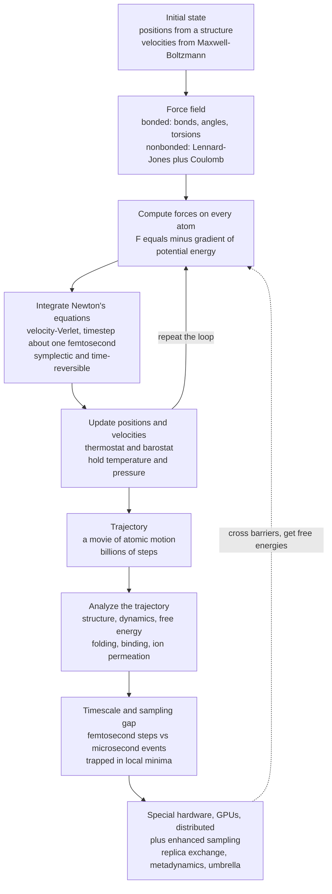

# 🔬 Computational Biophysics and Molecular Dynamics

> [!abstract] TL;DR
> Experiments give you a biomolecule's **shape** but almost never its **dance** — the femtosecond-by-femtosecond jiggling that makes it work. **Molecular dynamics (MD)** is a *computational microscope*: hand a computer **Newton's laws** and a **force field** (a parameterized potential energy of every bonded and nonbonded interaction), and it integrates the equations of motion forward by a tiny (~1–2 fs) timestep, billions of times, producing a **trajectory** — a movie of the atoms. From that movie you extract structure, dynamics, and **free energies** (binding, folding). The central obstacle is the **timescale/sampling gap**: biology happens on µs–s but the timestep is femtoseconds, met with **special hardware** (Anton), **GPUs/distributed computing** (Folding@home), and **enhanced sampling** (replica exchange, metadynamics, umbrella sampling). Reaching from all-atom to bigger, slower systems uses **coarse-graining** (MARTINI) and **QM/MM** for reactive chemistry. A Nobel-recognized field (2013: Karplus, Levitt, Warshel), now supercharged by **machine learning** (AlphaFold, ML potentials), it is indispensable to drug discovery and protein engineering.

---

## Intuition

**Analogy:** A crystal structure is a **photograph** of a protein — one frozen pose. But a protein *works* by moving: a hinge closes over a substrate, a channel gate flickers open, a loop breathes to let a drug slip in. No camera has a fast enough shutter to film this — the motions that matter unfold over **quadrillionths of a second**. Molecular dynamics is a microscope with exactly that impossible shutter speed. You give the computer two things — **Newton's laws of motion** and a **rulebook for the forces between every pair of atoms** — and it plays the molecule's motion forward one tiny step at a time, letting you *watch* a protein fold, a drug dock into its pocket, or an ion thread single-file through a membrane channel.

Technically, that "rulebook of forces" is the **force field**, and "playing it forward" is **numerical integration of Newton's second law** ($\mathbf{F} = m\mathbf{a}$) atom by atom. Each atom is a classical ball; the force field says how strongly every ball pushes and pulls on the others; and the integrator turns those forces into the next instant's positions. Repeat a billion times and the frozen photograph becomes a movie — the same energy-vs-entropy dance quantified statistically in the sibling *Statistical_Mechanics_of_Biomolecules*, but now watched frame by frame.

---

## How It Works

### Core Mechanics

1. **Represent the system atomistically.** Every atom (protein, ligand, ions, and typically tens of thousands of explicit water molecules) is a point mass with a position and velocity. A modern all-atom system is often $10^4$–$10^6$ atoms.

2. **Define the forces with a force field.** MD does *not* solve quantum mechanics for each step — that would be hopelessly slow. Instead it approximates the potential energy $U(\mathbf{r})$ with a cheap, parameterized **force field**:
   - **Bonded terms** — bond **stretching** ($\tfrac12 k_b(r-r_0)^2$), angle **bending** ($\tfrac12 k_\theta(\theta-\theta_0)^2$), and **torsions/dihedrals** (periodic terms) that keep the covalent skeleton intact.
   - **Nonbonded terms** — **van der Waals** via the **Lennard-Jones** potential $4\varepsilon\!\left[(\sigma/r)^{12} - (\sigma/r)^6\right]$ (short-range repulsion plus a weak attractive well) and **electrostatics** via **Coulomb's law** $q_iq_j/4\pi\varepsilon_0 r$. Popular parameter sets are **AMBER**, **CHARMM**, and **OPLS**. The force on each atom is $\mathbf{F}_i = -\nabla_i U$.

3. **Integrate Newton's equations.** With forces in hand, step the system forward using the **velocity-Verlet** integrator — a **symplectic**, **time-reversible** scheme that conserves energy remarkably well over long runs. The **timestep must be ~1–2 fs**, because it has to resolve the fastest motion in the system (hydrogen bond stretches vibrate on a ~10 fs period); a bigger step makes the integrator explode.

4. **Control temperature and pressure.** Raw Verlet conserves energy (the microcanonical **NVE** ensemble). To match a lab experiment at constant temperature/pressure, couple **thermostats** (Nose-Hoover, Langevin) and **barostats** (Parrinello-Rahman) to sample the **NVT**/**NPT** ensembles.

5. **Accumulate a trajectory, then analyze it.** Save snapshots to build a **trajectory** — the movie. Analysis extracts geometry (RMSD, radial distribution $g(r)$), dynamics (diffusion, correlation times), and, crucially, **free energies**: because $F = -k_BT\ln Z$ and $Z$ is an integral over the sampled ensemble, well-sampled trajectories yield binding and folding $\Delta G$.

6. **Fight the timescale/sampling wall.** This is the field's defining struggle. A folding event or large conformational change takes **microseconds to seconds**; a step is **femtoseconds** — so $10^9$–$10^{15}$ steps are needed. Worse, the system gets **trapped in local free-energy minima** (the sampling problem), never crossing high barriers in accessible time. Two remedies: **raw compute** — special-purpose hardware (**Anton**), **GPUs**, and distributed **Folding@home** — and **enhanced sampling** — **replica exchange**, **metadynamics**, **umbrella sampling**, and **steered MD**, which bias or heat the system to cross barriers and reconstruct the full **free-energy landscape**.

7. **Change scale when needed.** All-atom MD is one rung on a ladder. **Coarse-grained** models (e.g. **MARTINI**) lump ~4 heavy atoms into one bead to reach larger/longer scales (membranes, assemblies). **QM/MM** treats a reactive site (an enzyme's catalytic center) with **quantum mechanics** and the rest with molecular mechanics — the trick that won the 2013 Nobel. Complementary methods include **docking** (fast drug screening), **Monte Carlo**, **Brownian/Langevin dynamics**, and continuum **Poisson-Boltzmann** electrostatics.

### Flow / Architecture



---

## Key Concepts

### Secondary Level

- **A molecule is a moving thing.** Proteins are not statues; they wiggle, breathe, and flex constantly. MD lets you *watch* that motion on a computer instead of only seeing a still picture.
- **Give the computer the rules of motion.** Feed it Newton's laws (how things move when pushed) plus a rulebook of the forces between atoms, and it plays the movie forward one tiny step at a time.
- **Tiny steps, enormous number of them.** Each step is about a quadrillionth of a second, so watching even a millisecond of real biology needs a trillion steps — which is why MD needs supercomputers.

### Undergraduate Level

- **Newton's second law, per atom.** $\mathbf{F}_i = m_i\mathbf{a}_i$; the force on each atom is $-\nabla_i U$ from the force field, and the integrator turns force into the next position and velocity.
- **Force field anatomy.** Total energy = bonded (bond stretch, angle bend, dihedral torsion) + nonbonded (Lennard-Jones van der Waals + Coulomb electrostatics). AMBER/CHARMM/OPLS differ mainly in how these terms are parameterized against experiment and quantum data.
- **Velocity-Verlet and why fs.** The integrator is chosen for being **symplectic** (bounded long-term energy drift) and **time-reversible**. The ~1 fs timestep is set by the fastest vibration it must resolve (X–H stretches); constraint algorithms like **SHAKE/LINCS** freeze those bonds to allow a ~2 fs step.
- **Ensembles.** Pure Verlet gives **NVE** (energy conserved). Thermostats/barostats give **NVT**/**NPT** to mimic constant-temperature, constant-pressure lab conditions. Instantaneous temperature comes from kinetic energy via equipartition: $\langle KE\rangle = \tfrac{d}{2}k_BT$.
- **What you measure.** RMSD/RMSF for stability and flexibility, $g(r)$ for liquid structure, mean-squared displacement for diffusion, and $\Delta G$ for binding/folding.

### Graduate Level

- **The sampling problem is the real problem.** Trajectories are ergodic only if they cross every relevant barrier; most biological barriers are $\gg k_BT$, so brute-force MD is trapped. Free-energy accuracy is limited by *sampling*, not by the integrator.
- **Enhanced sampling and free energies.** **Umbrella sampling** + WHAM reconstructs a potential of mean force along a chosen coordinate; **metadynamics** deposits history-dependent bias to fill minima; **replica exchange (REMD)** swaps configurations across a temperature ladder to hop barriers; **steered MD** + **Jarzynski's equality** extracts $\Delta G$ from nonequilibrium pulling; **alchemical free-energy perturbation (FEP)** computes relative binding free energies for drug design.
- **Long-range electrostatics.** Coulomb sums are handled with **Particle Mesh Ewald (PME)** under periodic boundary conditions; naive cutoffs on electrostatics introduce serious artifacts.
- **Force-field limits.** Fixed-charge, non-polarizable force fields cannot capture electronic polarization or bond breaking; **polarizable** (AMOEBA) and **QM/MM** models address these, at higher cost. Reactive chemistry (enzyme catalysis) needs QM/MM by construction.
- **Multiscale hierarchy.** All-atom → coarse-grained (**MARTINI**) → continuum. Coarse-graining trades chemical detail for reach (µs–ms, large assemblies) and smooths the landscape (faster but altered kinetics).
- **ML acceleration.** **Machine-learned interatomic potentials** (e.g. neural-network potentials) approach QM accuracy at MM-like cost; **AlphaFold** supplies starting structures at genome scale; ML is reshaping both the force field and the sampling problem.

---

## Python Demo

```python
# Minimal 2D molecular dynamics: Lennard-Jones fluid with VELOCITY-VERLET.
# Demonstrates the core MD loop (force -> integrate -> repeat) and trajectory analysis:
#   (a) ENERGY CONSERVATION in the NVE ensemble (total ~ constant; KE <-> PE exchange)
#   (b) TEMPERATURE from kinetic energy via equipartition
#   (c) melting of a lattice into a liquid (snapshots) + radial distribution g(r)
# Reduced LJ units: epsilon = sigma = mass = kB = 1.
import numpy as np
import matplotlib.pyplot as plt

rng = np.random.default_rng(7)

# ------------------------- system setup -------------------------
n_side = 6
N      = n_side * n_side          # 36 particles
rho    = 0.75                      # number density -> liquid-like
L      = np.sqrt(N / rho)         # square periodic box side
rc     = 2.5                      # LJ cutoff
uc     = 4.0 * (rc**-12 - rc**-6) # potential shift so U(rc)=0 (cleaner energy)
dt     = 0.004                    # timestep (reduced units)
T0     = 1.0                      # target temperature
dof    = 2 * N - 2               # 2D, minus center-of-mass momentum

# place particles on a square lattice, then jitter slightly
spacing = L / n_side
gx, gy  = np.meshgrid(np.arange(n_side), np.arange(n_side))
pos     = np.stack([gx.ravel(), gy.ravel()], axis=1) * spacing
pos    += 0.05 * spacing * rng.standard_normal(pos.shape)
pos    %= L
pos0    = pos.copy()              # remember the initial lattice

# random velocities, remove net momentum, scale to target temperature
vel  = rng.standard_normal((N, 2))
vel -= vel.mean(axis=0)
vel *= np.sqrt(T0 / (np.sum(vel**2) / dof))

def forces(p):
    """Vectorized LJ forces + potential energy with minimum-image periodic BCs."""
    d   = p[:, None, :] - p[None, :, :]      # (N,N,2) pair displacements
    d  -= L * np.round(d / L)                # minimum image convention
    r2  = np.sum(d * d, axis=2)              # (N,N) squared distances
    np.fill_diagonal(r2, np.inf)             # ignore self-interaction
    mask   = r2 < rc * rc
    inv2   = np.where(mask, 1.0 / r2, 0.0)
    inv6   = inv2**3
    inv12  = inv6**2
    # F_i = sum_j 24*(2*inv12 - inv6)*inv2 * d_ij   (LJ force)
    fmag   = np.where(mask, 24.0 * (2.0 * inv12 - inv6) * inv2, 0.0)
    F      = np.sum(fmag[:, :, None] * d, axis=1)          # (N,2)
    pe     = 0.5 * np.sum(np.where(mask, 4.0 * (inv12 - inv6) - uc, 0.0))
    return F, pe

def temperature(v):
    return np.sum(v**2) / dof                # KE = 0.5*sum(v^2); T = 2*KE/dof

# ------------------------- equilibration (rescale thermostat) -------------------------
F, _ = forces(pos)
for step in range(1500):
    vel += 0.5 * dt * F                       # half kick
    pos  = (pos + dt * vel) % L               # drift + wrap
    F, _ = forces(pos)
    vel += 0.5 * dt * F                       # half kick
    if step % 50 == 0:                        # gentle velocity rescaling to T0
        vel *= np.sqrt(T0 / temperature(vel))

# ------------------------- production (pure NVE: no thermostat) -------------------------
n_prod   = 3000
ke_hist  = np.zeros(n_prod)
pe_hist  = np.zeros(n_prod)
T_hist   = np.zeros(n_prod)

# radial distribution function accumulator
nbins    = 80
r_max    = L / 2
edges    = np.linspace(0.0, r_max, nbins + 1)
rmid     = 0.5 * (edges[:-1] + edges[1:])
gr_acc   = np.zeros(nbins)
n_frames = 0

F, pe = forces(pos)
for step in range(n_prod):
    vel  += 0.5 * dt * F
    pos   = (pos + dt * vel) % L
    F, pe = forces(pos)
    vel  += 0.5 * dt * F

    ke = 0.5 * np.sum(vel**2)
    ke_hist[step] = ke
    pe_hist[step] = pe
    T_hist[step]  = temperature(vel)

    if step % 5 == 0:                         # sample g(r) periodically
        d  = pos[:, None, :] - pos[None, :, :]
        d -= L * np.round(d / L)
        r  = np.sqrt(np.sum(d * d, axis=2))
        iu = np.triu_indices(N, k=1)          # each pair once
        gr_acc += np.histogram(r[iu], bins=edges)[0]
        n_frames += 1

etot = ke_hist + pe_hist

# normalize g(r): divide by ideal-gas expectation for a 2D shell
shell_area = np.pi * (edges[1:]**2 - edges[:-1]**2)
ideal      = 0.5 * N * rho * shell_area        # expected i<j pairs per frame
g_r        = gr_acc / (n_frames * ideal)

# ------------------------- diagnostics -------------------------
drift = (etot.max() - etot.min()) / abs(etot.mean())
print(f"box L = {L:.3f}, density = {rho}, particles = {N}")
print(f"mean temperature (production) = {T_hist.mean():.3f}  (target {T0})")
print(f"relative total-energy drift    = {drift:.2e}  (small -> integrator OK)")
print(f"g(r) first-peak position       = {rmid[np.argmax(g_r)]:.2f} sigma")

# ------------------------- plots -------------------------
t = np.arange(n_prod) * dt
fig, ax = plt.subplots(2, 2, figsize=(12, 9))

# (a) energy conservation
ax[0, 0].plot(t, ke_hist, color="#2563eb", lw=1, label="kinetic")
ax[0, 0].plot(t, pe_hist, color="#dc2626", lw=1, label="potential")
ax[0, 0].plot(t, etot,    color="#111827", lw=2, label="total")
ax[0, 0].set_xlabel("time (reduced units)")
ax[0, 0].set_ylabel("energy")
ax[0, 0].set_title("(a) Energy conservation: KE <-> PE, total flat")
ax[0, 0].legend(fontsize=8)

# (b) temperature from kinetic energy
ax[0, 1].plot(t, T_hist, color="#7c3aed", lw=1)
ax[0, 1].axhline(T_hist.mean(), color="#059669", ls="--",
                 label=f"mean T = {T_hist.mean():.2f}")
ax[0, 1].set_xlabel("time (reduced units)")
ax[0, 1].set_ylabel("temperature  2*KE / dof")
ax[0, 1].set_title("(b) Temperature from kinetic energy")
ax[0, 1].legend(fontsize=8)

# (c) snapshots: initial lattice vs final liquid
ax[1, 0].scatter(pos0[:, 0], pos0[:, 1], s=90, facecolors="none",
                 edgecolors="#2563eb", label="initial lattice")
ax[1, 0].scatter(pos[:, 0],  pos[:, 1],  s=90, color="#dc2626",
                 alpha=0.8, label="final liquid")
ax[1, 0].set_xlim(0, L); ax[1, 0].set_ylim(0, L); ax[1, 0].set_aspect("equal")
ax[1, 0].set_title("(c) Lattice melts into a disordered liquid")
ax[1, 0].legend(fontsize=8, loc="upper right")

# (d) radial distribution function g(r)
ax[1, 1].plot(rmid, g_r, color="#059669", lw=2)
ax[1, 1].axhline(1.0, color="gray", ls=":", lw=1)
ax[1, 1].set_xlabel("distance r (sigma)")
ax[1, 1].set_ylabel("g(r)")
ax[1, 1].set_title("(d) Radial distribution function: liquid structure")

plt.tight_layout()
plt.savefig("md_lennard_jones.png", dpi=130)
print("saved md_lennard_jones.png")
```

Running this prints a **relative total-energy drift of ~1e-3 or smaller**, confirming velocity-Verlet conserves energy in the NVE ensemble even as kinetic and potential energy trade back and forth (panel a). The temperature (panel b) fluctuates around the target because instantaneous $T$ is read straight from kinetic energy via equipartition. Panel (c) shows the ordered starting **lattice melting into a disordered liquid** — spontaneous thermodynamic behavior emerging from nothing but forces and integration. Panel (d) is the **radial distribution function $g(r)$**: a strong first peak near $r\approx1.1\,\sigma$ (nearest-neighbor shell) decaying to $g(r)\to1$ at long range — the structural signature of a liquid, computed by analyzing the trajectory exactly as production MD does for water and biomolecules.

---

## Real-World Applications

> **Example — Anton and the µs barrier.** D. E. Shaw Research built **Anton**, a special-purpose supercomputer whose custom ASICs do nothing but the MD loop, achieving **milliseconds** of all-atom trajectory. On Anton, researchers watched fast-folding proteins fold and unfold reversibly *in silico*, directly validating the folding-funnel picture of the sibling *Protein_Structure_and_Folding* — a movie no experiment can film, produced by the same force-then-integrate loop as the demo above, scaled to real atoms.

- **Drug discovery in pharma.** **Free-energy perturbation (FEP)** predicts how a chemical tweak changes binding affinity, ranking candidate molecules before synthesis; MD reveals **drug residence times** and how mutations confer **resistance** (e.g. HIV protease, kinase inhibitors). Schrodinger's FEP+ is a production example.
- **Ion channels and transport.** MD films ions permeating single-file through selectivity filters, quantifying the energetics behind the electrophysiology in [[Ion_Channels_and_Transport]] and membrane potentials.
- **Membrane biophysics.** Coarse-grained **MARTINI** simulations of lipid bilayers reproduce phase behavior, curvature, and protein insertion at scales all-atom MD cannot reach — the physics of the sibling *Membranes_and_Lipid_Bilayers*.
- **Enzyme catalysis (QM/MM).** The reactive step of catalysis is simulated with quantum mechanics for the active site and molecular mechanics for the scaffold — the 2013 Nobel-winning approach used to dissect reaction mechanisms.
- **Molecular machines.** MD and enhanced sampling reveal the conformational cycles of motors and pumps, complementing the mechanochemistry of [[Molecular_Motors_and_Mechanochemistry]].
- **Distributed computing.** **Folding@home** crowdsourced millions of GPUs to simulate folding and, during the pandemic, SARS-CoV-2 spike dynamics for drug targeting.

---

## Common Pitfalls

- **Timestep too large.** Push past ~2 fs without constraining X–H bonds and the fastest vibrations are under-resolved; the integrator gains energy and the simulation **blows up** ("LINCS/SHAKE warnings", flying ice cubes). Use SHAKE/LINCS to safely reach 2 fs.
- **Mistaking a long run for a converged one.** A microsecond trajectory that never leaves one free-energy basin has **sampled nothing**. Length is not convergence — check that relevant transitions actually occur, or use enhanced sampling. This is the sampling problem, not a bug.
- **Trusting the force field blindly.** Force fields are approximations fit to particular data. Fixed-charge models miss polarization; none break bonds; disordered proteins and protein–protein interfaces are known weak spots. Validate against experiment and pick a force field suited to the system.
- **Cutting off electrostatics.** A hard cutoff on long-range Coulomb interactions creates artifacts (spurious ordering, wrong energetics). Use **Particle Mesh Ewald**, not a plain cutoff, for charges.
- **Ignoring equilibration.** Analyzing frames before the system relaxes from its artificial starting structure contaminates averages. Discard the equilibration phase (as the demo does before recording energies).
- **Over-reading a single trajectory.** One run is one sample of a stochastic process. Rare events, error bars, and reproducibility require **multiple independent replicas**, not a single "hero" trajectory.
- **Treating AlphaFold structures as dynamics.** AlphaFold gives a static fold, not motion or free energies. It is an excellent *starting structure* for MD, not a substitute for it.

---

## Related Concepts

- [[Newtons_Laws_and_Kinematics]] — the $\mathbf{F}=m\mathbf{a}$ that MD integrates numerically for every atom
- [[Classical_Statistical_Mechanics]] — the ensemble theory (canonical/microcanonical, $Z$, $F=-k_BT\ln Z$) that turns a trajectory into thermodynamics
- [[Statistical_Mechanics_of_Biomolecules]] — the Boltzmann/partition-function view of the same energy-vs-entropy competition MD samples explicitly
- [[Protein_Structure_and_Folding]] — MD films the folding funnel; AlphaFold supplies the structures MD then sets in motion
- [[Intermolecular_Forces_and_the_Aqueous_Environment]] — the van der Waals, electrostatic, and hydrophobic interactions the force field encodes
- [[Ion_Channels_and_Transport]] — MD reveals ion permeation and gating at atomic resolution
- [[Molecular_Motors_and_Mechanochemistry]] — conformational cycles of motors probed by MD and steered/enhanced sampling
- [[Membranes_and_Lipid_Bilayers]] — coarse-grained MARTINI simulations of bilayer structure and dynamics
- [[Diffusion_and_Brownian_Motion_in_Cells]] — Langevin/Brownian dynamics as the implicit-solvent, coarse-time cousin of MD
- [[Single_Molecule_Biophysics]] — the experiments whose one-molecule dynamics MD reproduces and interprets
- [[Enzyme_Kinetics_and_Catalysis_Physics]] — QM/MM MD dissects the catalytic step that classical force fields cannot
- [[Chemical_Thermodynamics]] — the $\Delta G = \Delta H - T\Delta S$ free energies MD extracts from sampled ensembles
- [[Quantum_Chemistry_and_Atomic_Orbitals]] — the electronic-structure layer that QM/MM and ML potentials fold back into simulation
- [[Chemical_Kinetics]] — barrier crossing and rates, the kinetic complement to MD's free-energy landscapes
- [[Transformer_Architecture]] — the attention model behind AlphaFold, now central to computational structural biophysics
- [[Gradient_Descent]] — energy minimization (the zero-temperature limit of force-driven motion) used to relax structures before MD

---

## Review Questions

1. **(Undergraduate / Conceptual)** Why must the MD timestep be on the order of a femtosecond, and what physical motion sets that limit? Explain why velocity-Verlet is preferred over a naive Euler integrator despite both being simple — what does "symplectic and time-reversible" buy you over a long simulation?
2. **(Graduate / Scenario)** You want the absolute binding free energy of a drug candidate to its target, but a 5 µs brute-force MD run never shows a single binding/unbinding event. Diagnose the problem in terms of the timescale and sampling walls, and propose two concrete strategies (one hardware/compute, one algorithmic) to extract a reliable $\Delta G$. What quantity would you actually compute, and how?
3. **(Trade-off)** Compare all-atom MD, coarse-grained (MARTINI) MD, and QM/MM for studying (i) the phase behavior of a large lipid membrane and (ii) the bond-forming step of an enzyme reaction. Which method fits each problem and why, and what does each one give up? Where might a machine-learned potential change the calculus?

---

## Sources

- Karplus, M., & McCammon, J. A. (2002). "Molecular dynamics simulations of biomolecules." *Nature Structural Biology*, 9(9), 646–652 — foundational review by a 2013 Nobel laureate.
- Frenkel, D., & Smit, B. — *Understanding Molecular Simulation: From Algorithms to Applications*, 2nd ed. (Academic Press, 2002) — the standard text on MD/MC methods, integrators, and free-energy calculation.
- Allen, M. P., & Tildesley, D. J. — *Computer Simulation of Liquids*, 2nd ed. (Oxford University Press, 2017) — velocity-Verlet, Lennard-Jones, $g(r)$, and periodic boundary conditions in detail.
- Shaw, D. E., et al. (2010). "Atomic-level characterization of the structural dynamics of proteins." *Science*, 330(6002), 341–346 — the Anton special-purpose MD machine reaching millisecond timescales.
- Jumper, J., et al. (2021). "Highly accurate protein structure prediction with AlphaFold." *Nature*, 596, 583–589 — the ML structure-prediction breakthrough now feeding simulation.

---

#biophysics #molecular-dynamics #simulation #force-fields #computational-biophysics
