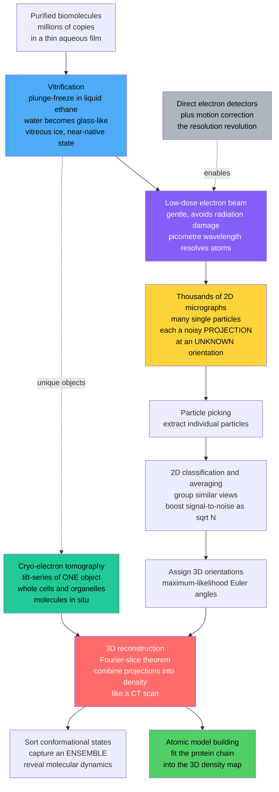

# 🧊 Cryo-Electron Microscopy

> [!abstract] TL;DR
> **Cryo-electron microscopy (cryo-EM)** determines the atomic 3D structures of biological molecules by flash-freezing them in glass-like **vitreous ice** and imaging them with a gentle **electron beam** — no crystals required. Because a purified sample contains millions of copies of a molecule, each frozen in a *random, unknown orientation*, every micrograph is a set of extremely noisy 2D **projections**. The trick is computational: **classify** the particles, **assign each an orientation**, and **combine tens of thousands to millions of projections** into a single 3D density using the same **Fourier-slice / tomographic** principle as a medical CT scan, with massive averaging beating down the low-dose noise (signal-to-noise grows as $\sqrt{N}$). The 2013 arrival of **direct electron detectors** and better software (motion correction, maximum-likelihood classification) triggered the **"resolution revolution"** — pushing cryo-EM to near-atomic resolution and making it the go-to method for large machines (ribosomes, spliceosomes, viruses), membrane proteins, non-crystallizable targets, and *multiple conformational states*. Its sibling, **cryo-electron tomography**, images unique objects like whole cells to reveal molecules **in situ**. The technique earned the 2017 Nobel Prize in Chemistry (Dubochet, Frank, Henderson) and now powers modern drug discovery and rapid structural responses to pandemics.

---

## Intuition

**Analogy:** Imagine you must learn the *exact* 3D shape of an intricate statue — but you can never touch it or see it whole. Instead you are handed **tens of thousands of blurry photographs**. Each photo was taken of a *different copy* of the statue, lying at a **random, unknown angle**, in **near-total darkness** (because bright light would melt it), so every single picture is grainy and almost featureless. No one image tells you much. But if you could sort the photos by which angle they were taken from, and **average all the ones that show the same view**, the grain would cancel and a crisp silhouette would emerge. Do this for every viewing angle, then stack those clean 2D silhouettes together the way a CT scanner stacks X-ray shadows, and the full 3D statue reassembles itself.

That is cryo-EM exactly. The "statues" are individual protein molecules, the "darkness" is the deliberately weak (low-dose) electron beam that keeps the beam from destroying the fragile molecule, the "random angles" are the orientations in which the molecules happened to freeze, and the "averaging + stacking" is the single-particle reconstruction pipeline that turns a haystack of noisy 2D projections into one sharp 3D map. Intuition first: **freeze many, image gently, average hard, reconstruct in 3D.**

---

## How It Works

### Core Mechanics

**1. Why electrons?** To *resolve* atoms you need a probe whose wavelength is smaller than the spacing you want to see (fractions of a nanometre). By the de Broglie relation, an electron accelerated through a few hundred kilovolts has a wavelength of a few *picometres* — thousands of times shorter than visible light and far below atomic spacing. Electrons also **scatter strongly** off matter (unlike X-rays, which pass through), so a *single* molecule scatters enough electrons to form an image. That is the key advantage over X-ray crystallography: crystallography needs a well-ordered crystal of billions of identical molecules to amplify a weak X-ray signal, and *many* important molecules — large machines, membrane proteins, flexible complexes — simply refuse to crystallize.

**2. The problem cryo-EM had to solve.** Biological molecules are terrible EM specimens. They are made of *light atoms* (C, N, O, H) that scatter electrons weakly, giving intrinsically **low contrast**. They are **fragile** — the electron beam that images them also ionizes and destroys them (radiation damage). And an electron microscope operates in **high vacuum**, which dehydrates and collapses an unprotected biomolecule, wrecking its native structure. For decades these obstacles kept EM from delivering biological structures.

**3. Vitrification — Dubochet's breakthrough.** The fix is to freeze the sample *so fast* that water has no time to form ice crystals. A thin aqueous film of purified molecules is **plunge-frozen** into liquid ethane at roughly $-180\,^{\circ}\text{C}$, and the water solidifies into **vitreous (glassy) ice** — an amorphous solid that traps every molecule in its **near-native, hydrated** state. This matters enormously: crystalline ice would both physically disrupt the molecules *and* diffract the electron beam, swamping the image. Vitreous ice is transparent and structure-preserving. Held at cryogenic temperature, the frozen molecules also tolerate **more** electron dose before damage accumulates.

**4. Low-dose imaging and the noise problem.** Even vitrified, a molecule can only absorb a tiny electron dose before it fries. So each micrograph is taken with a **deliberately low dose**, which means each individual particle image is buried in **shot noise** — the single-particle signal-to-noise ratio can be well below 1. You cannot interpret one image. The entire method is built around the fact that **averaging $N$ independent noisy copies improves SNR as $\sqrt{N}$** (the demo below shows this), so with tens of thousands of particles the true signal emerges from the noise.

**5. Single-particle analysis — the core algorithm.** A field of view holds **many single particles**, each a copy of the molecule frozen at a random 3D orientation, and each image is a **2D projection** (a shadow) of the 3D density along the beam. The pipeline:
   - **Pick** individual particles out of each micrograph.
   - **2D classify** them: group particles that happen to share a similar view and average within each group to get clean 2D "class averages."
   - **Assign orientations**: computationally determine the three Euler angles that describe each particle's unknown pose, typically by iterative **maximum-likelihood** matching against a growing 3D reference.
   - **Reconstruct in 3D** by combining all the oriented projections. This uses the **Fourier-slice (projection-slice) theorem**: the 2D Fourier transform of a projection equals a central 2D *slice* through the 3D Fourier transform of the object, oriented at the projection's angle. Collect enough slices at enough angles and you fill 3D Fourier space; inverse-transform to get the 3D density. This is the very same tomographic principle behind a **CT scan**.
   - **Build the atomic model** by fitting the polypeptide chain into the resolved 3D density map.

**6. The "resolution revolution" (~2013).** Two advances made near-atomic cryo-EM routine almost overnight. **Direct electron detectors** — fast, highly sensitive cameras that count electrons directly instead of via a scintillator — dramatically improved image quality and enabled **movie-mode** recording so that beam-induced specimen *motion* could be computationally corrected frame by frame. In parallel, **software** (motion correction, CTF estimation, and maximum-likelihood classification in packages such as RELION and cryoSPARC) let algorithms sort heterogeneous particles and extract more signal per image. Structures that were impossible suddenly poured out at near-atomic and then true atomic resolution.

**7. What cryo-EM excels at.** It shines exactly where crystallography struggles: **large complexes and molecular machines** (ribosomes, spliceosomes, proteasomes, whole viruses), **membrane proteins** (ion channels, receptors, transporters) that resist crystallization, and — uniquely — **conformational heterogeneity**. Because you image individual particles, you can *sort* them into distinct 3D states and recover an **ensemble of conformations**, capturing molecular *dynamics* and reaction intermediates rather than one frozen snapshot.

**8. Cryo-electron tomography (cryo-ET).** Single-particle analysis averages many identical copies. But a **whole cell or organelle** is unique — you cannot average thousands of copies of the *same* object. Cryo-ET instead tilts a *single* frozen specimen through a series of angles, records a **tilt-series**, and reconstructs a 3D volume of that one object. This lets you see macromolecules **in situ**, in their native cellular context ("visual proteomics"): structural biology performed *inside* cells, at lower resolution but with full spatial context.

Cryo-EM is one leg of the modern **integrated structural biology** toolkit alongside the not-yet-written siblings *X_Ray_Crystallography_and_Structural_Biology* (still often higher resolution for small, rigid, crystallizable proteins), *NMR_and_Magnetic_Resonance_in_Biology* (best for small proteins and dynamics in solution), *Fluorescence_Microscopy_and_Super_Resolution* (live-cell, lower resolution), and increasingly **AlphaFold** structure *predictions* that bootstrap and validate experimental maps — with *Biophysics_of_Infectious_Disease_and_Immunity* consuming the viral and antibody structures cryo-EM produces.

### Flow / Architecture



---

## Key Concepts

### Secondary Level

- **Freeze it in glass, not ice.** If you freeze wet things slowly, sharp ice crystals form and shred them. Cryo-EM freezes so fast the water turns into a smooth *glass* that gently locks each molecule in place, like an insect trapped in amber.
- **Take millions of blurry photos, then combine them.** One picture of one molecule is too dark and grainy to read. But averaging thousands of pictures of the same view cancels the grain, and stacking different views rebuilds the full 3D shape — the way stacking many X-ray shadows makes a CT scan.
- **No crystals needed.** Older methods needed molecules lined up in perfect crystals, which many important molecules refuse to do. Cryo-EM images molecules one at a time, so it can "see" things crystallography never could.
- **Why it was a revolution.** Around 2013 better cameras and software suddenly let cryo-EM see individual *atoms*, unleashing a flood of structures — hence the "resolution revolution" and a 2017 Nobel Prize.

### Undergraduate Level

- **Electron wavelength sets the resolution ceiling.** The de Broglie wavelength $\lambda = h/p$ of a 300 keV electron is about 2 pm, far below atomic spacing, so electrons *can* in principle resolve atoms. Real resolution is limited by lens aberrations, radiation damage, sample motion, and — above all — the low dose forced by fragility.
- **Projection = line integral of density.** A cryo-EM image is (to first order) the 2D **projection** of the molecule's 3D scattering density along the beam. Determining structure means *inverting* many such projections taken at unknown angles — a tomographic inverse problem.
- **Fourier-slice theorem.** The 2D Fourier transform of a projection equals a central planar slice through the 3D Fourier transform of the object, at the projection's orientation. Enough slices at enough angles fill Fourier space; the inverse transform is the reconstruction. This is why cryo-EM, CT, and MRI all rest on the same math (see *Fourier_Analysis_and_Integral_Transforms*).
- **Signal-to-noise scales as $\sqrt{N}$.** Averaging $N$ statistically independent noisy images of the same view multiplies SNR by $\sqrt{N}$: the coherent signal adds linearly ($\propto N$) while random noise adds in quadrature ($\propto \sqrt{N}$). Overcoming the brutal low-dose noise is therefore a *numbers game* — hence tens of thousands to millions of particles.
- **Vitreous vs crystalline ice.** Crystalline ice diffracts electrons (adding structured noise) and physically damages molecules; amorphous vitreous ice is electron-transparent and preserves native structure. Achieving vitrification requires cooling rates on the order of $10^{5}\,\text{K/s}$ in a film only tens of nanometres thick.

### Graduate Level

- **The orientation-assignment problem.** Each particle's three Euler angles are *unknown a priori*. Modern pipelines solve pose and 3D map jointly via **iterative maximum-likelihood / expectation-maximization** (RELION, cryoSPARC), marginalizing over orientation to avoid hard, error-propagating assignments. Getting stuck in bad local minima (model bias, "Einstein-from-noise") is a real hazard.
- **CTF and phase contrast.** Weak-phase objects give almost no amplitude contrast, so images are recorded **defocused** to convert phase differences into visible intensity. This imposes an oscillating, sign-flipping **Contrast Transfer Function** that must be estimated and corrected per micrograph; failing to correct it destroys high-resolution information.
- **Resolution assessment (FSC).** Resolution is quantified by the **Fourier Shell Correlation** between two independently reconstructed half-maps; the "gold-standard" 0.143 threshold guards against overfitting noise. Beam-induced motion, radiation damage weighting (dose-weighting), and per-particle CTF refinement all feed the achievable resolution.
- **Heterogeneity and continuous dynamics.** Beyond sorting into discrete 3D classes, methods now recover **continuous conformational landscapes** (multi-body refinement, manifold-embedding / deep-learning approaches such as cryoDRGN), turning cryo-EM into a tool for *free-energy landscapes* and reaction coordinates — connecting to the ensemble view in *Statistical_Mechanics_of_Biomolecules* and *Single_Molecule_Biophysics*.
- **Cryo-ET workflow specifics.** Tilt-series suffer the "missing wedge" (mechanical tilt is limited to roughly $\pm 60$–$70^{\circ}$), producing anisotropic resolution. **Subtomogram averaging** recovers the missing information by averaging many copies of a repeating complex extracted from tomograms, and **cryo-FIB milling** thins vitrified cells to electron-transparent lamellae so machines can be imaged inside cells.
- **Complementarity, not replacement.** Crystallography still often wins on resolution for small, rigid, well-ordering proteins; NMR excels for small proteins and solution dynamics; cryo-EM dominates for large, flexible, membrane, and non-crystallizable targets and native multi-state ensembles — and predictions from AlphaFold now serve as search models and validation cross-checks.

---

## Python Demo

```python
# Cryo-EM's computational heart in ~one screen: single-particle reconstruction.
# We demonstrate the three ideas that make cryo-EM work, using only numpy + matplotlib:
#   (a) FORWARD PROJECTION: take a 2D "molecule" phantom and generate many projections
#       from different angles (the Radon transform / sinogram) -> the noisy 2D "views".
#   (b) RECONSTRUCTION: recover the object from its projections via FILTERED
#       BACK-PROJECTION (the Fourier-slice / tomographic principle) -> combining many
#       noisy 2D views rebuilds the object.
#   (c) AVERAGING beats NOISE: averaging N noisy copies of the same view improves
#       signal-to-noise as sqrt(N) -- the key to surviving low-dose imaging.
import numpy as np
import matplotlib.pyplot as plt

rng = np.random.default_rng(0)
N = 96                       # image size (pixels)
n_angles = 120               # number of projection directions (unknown-in-practice poses)
angles = np.linspace(0.0, 180.0, n_angles, endpoint=False)

# ---------------------------------------------------------------------
# Build a simple 2D "molecule" phantom: a few Gaussian blobs (domains).
# ---------------------------------------------------------------------
def blob(N, cx, cy, s, amp):
    y, x = np.mgrid[0:N, 0:N]
    return amp * np.exp(-(((x - cx) ** 2 + (y - cy) ** 2) / (2.0 * s ** 2)))

phantom  = blob(N, 46, 40, 9, 1.0)      # big central domain
phantom += blob(N, 62, 58, 5, 0.8)      # smaller domain
phantom += blob(N, 34, 60, 4, 0.7)      # small domain
phantom += blob(N, 58, 30, 3, 0.6)      # tiny domain
phantom /= phantom.max()

# ---------------------------------------------------------------------
# Bilinear image rotation about the center (no scipy needed).
# ---------------------------------------------------------------------
def rotate(img, deg):
    h, w = img.shape
    cy, cx = (h - 1) / 2.0, (w - 1) / 2.0
    th = np.deg2rad(deg)
    c, s = np.cos(th), np.sin(th)
    ys, xs = np.mgrid[0:h, 0:w]
    xr, yr = xs - cx, ys - cy
    sx = c * xr + s * yr + cx           # inverse map to source coordinates
    sy = -s * xr + c * yr + cy
    x0 = np.floor(sx).astype(int); y0 = np.floor(sy).astype(int)
    x1, y1 = x0 + 1, y0 + 1
    ok = (x0 >= 0) & (x1 < w) & (y0 >= 0) & (y1 < h)
    wx, wy = sx - x0, sy - y0
    x0c, x1c = np.clip(x0, 0, w - 1), np.clip(x1, 0, w - 1)
    y0c, y1c = np.clip(y0, 0, h - 1), np.clip(y1, 0, h - 1)
    out = (img[y0c, x0c] * (1 - wx) * (1 - wy) + img[y0c, x1c] * wx * (1 - wy)
         + img[y1c, x0c] * (1 - wx) * wy      + img[y1c, x1c] * wx * wy)
    return np.where(ok, out, 0.0)

# ---------------------------------------------------------------------
# (a) FORWARD PROJECTION -> sinogram, then add low-dose "shot" noise.
#     Each column is one 2D view of a randomly oriented particle.
# ---------------------------------------------------------------------
sino = np.stack([rotate(phantom, a).sum(axis=0) for a in angles], axis=1)   # (N, n_angles)
noise_level = 0.6 * sino.std()
sino_noisy = sino + rng.normal(0.0, noise_level, size=sino.shape)           # noisy projections

# ---------------------------------------------------------------------
# (b) FILTERED BACK-PROJECTION (Fourier-slice reconstruction).
#     Ramp-filter each projection, smear it back, and rotate -> 3D idea in 2D.
# ---------------------------------------------------------------------
ramp = np.abs(np.fft.fftfreq(N)).reshape(-1, 1)                             # |frequency| filter
sino_filt = np.real(np.fft.ifft(np.fft.fft(sino_noisy, axis=0) * ramp, axis=0))
recon = np.zeros((N, N))
for i, a in enumerate(angles):
    recon += rotate(np.tile(sino_filt[:, i], (N, 1)), -a)                   # back-project
recon *= np.pi / n_angles

# ---------------------------------------------------------------------
# (c) AVERAGING beats NOISE: SNR of an averaged view vs number of copies N.
#     Signal adds linearly; independent noise adds in quadrature -> SNR ~ sqrt(N).
# ---------------------------------------------------------------------
view = rotate(phantom, 0.0)                        # one clean 2D "view" (class)
peak = view.max()                                  # signal amplitude
sigma1 = 0.8 * peak                                # heavy single-shot (low-dose) noise
Ns = np.unique(np.round(np.logspace(0, 3.3, 24)).astype(int))
snr = []
for M in Ns:
    stack = view[None] + rng.normal(0.0, sigma1, size=(M, N, N))
    avg = stack.mean(axis=0)
    bg = avg[:12, :12]                             # empty corner = pure noise
    snr.append(peak / bg.std())
snr = np.array(snr)
snr_theory = snr[0] * np.sqrt(Ns / Ns[0])          # sqrt(N) reference

# ---------------------------------------------------------------------
# PLOTS
# ---------------------------------------------------------------------
fig, ax = plt.subplots(2, 2, figsize=(12, 10))

ax[0, 0].imshow(phantom, cmap="magma")
ax[0, 0].set_title("(a) The 'molecule' phantom (3D density -> here 2D)")
ax[0, 0].axis("off")

ax[0, 1].imshow(sino_noisy, cmap="gray", aspect="auto",
                extent=[0, 180, 0, N])
ax[0, 1].set_title("(b) Noisy sinogram: many projections at unknown angles")
ax[0, 1].set_xlabel("projection angle (degrees)")
ax[0, 1].set_ylabel("detector position")

ax[1, 0].imshow(recon, cmap="magma")
ax[1, 0].set_title("(c) Reconstruction from NOISY projections (filtered back-proj.)")
ax[1, 0].axis("off")

ax[1, 1].loglog(Ns, snr, "o-", color="#4dabf7", label="measured SNR of average")
ax[1, 1].loglog(Ns, snr_theory, "k--", label=r"$\propto \sqrt{N}$ (theory)")
ax[1, 1].set_title("(d) Averaging beats low-dose noise: SNR grows as sqrt(N)")
ax[1, 1].set_xlabel("number of averaged particles N")
ax[1, 1].set_ylabel("signal-to-noise ratio")
ax[1, 1].legend()
ax[1, 1].grid(True, which="both", ls=":", alpha=0.5)

plt.tight_layout()
plt.savefig("cryo_em_single_particle.png", dpi=130)

# --- Console summary ---
print("=== Cryo-EM single-particle principle ===")
print(f"Projections combined            : {n_angles}")
print(f"Single-shot (low-dose) SNR      : {snr[0]:.2f}")
print(f"SNR after averaging {Ns[-1]:>4d} views : {snr[-1]:.2f}"
      f"   (expected ~{snr[0]*np.sqrt(Ns[-1]/Ns[0]):.2f})")
print(f"Fold SNR gain from averaging    : {snr[-1]/snr[0]:.1f}x")
```

Running this prints a single-shot SNR well below a usable level, then shows it climbing by roughly $\sqrt{N}$ as views are averaged — a ~30x gain by a thousand particles. Panel (a) is the "molecule," panel (b) is the noisy set of projections at many unknown angles (the sinogram), panel (c) shows that **filtered back-projection recombines those noisy 2D views into a recognizable object** (the tomographic / Fourier-slice heart of cryo-EM), and panel (d) makes the low-dose survival strategy quantitative: **you cannot read one image, but averaging enough of them recovers the signal.** That is single-particle cryo-EM in miniature.

---

## Real-World Applications

> **Example — Solving the SARS-CoV-2 spike for vaccine design.** Within weeks of the virus's genome being published in early 2020, cryo-EM single-particle analysis delivered a near-atomic structure of the **spike glycoprotein** in its prefusion conformation. That structure revealed exactly which surface the antibodies must target and guided the **stabilizing mutations** (the "2P" proline substitutions locking the prefusion state) engineered into the mRNA vaccine immunogens. A molecule too large and flexible to crystallize, imaged in its native state and multiple conformations, went from sequence to vaccine-guiding structure at pandemic speed — a textbook demonstration of why cryo-EM matters for *Biophysics_of_Infectious_Disease_and_Immunity*.

Other production-scale uses:

- **The ribosome and other giant machines.** Cryo-EM resolved the translating **ribosome**, the **spliceosome**, and the **proteasome** in multiple functional states, capturing molecular machines *mid-reaction* rather than as single static snapshots (see *Translation_and_the_Genetic_Code*).
- **Membrane proteins and drug targets.** **Ion channels, GPCRs, and transporters** — historically the hardest crystallography targets — are now routine cryo-EM structures, making the method central to structure-based **drug discovery** across the pharmaceutical industry.
- **Viruses and capsids.** Icosahedral virus capsids and enveloped viruses are imaged whole, informing antiviral and vaccine design (*Viruses*).
- **Membrane-protein complexes in situ.** **Cryo-electron tomography** with FIB milling visualizes nuclear pore complexes, the ATP synthase rows in mitochondria, and ribosomes *inside* intact cells — "visual proteomics" that no averaging-based method can reach.
- **Conformational ensembles.** By sorting particles into distinct 3D classes, cryo-EM maps the *series of shapes* a molecular machine passes through, feeding mechanistic and free-energy models that complement *Single_Molecule_Biophysics*.

---

## Common Pitfalls

- **Crystalline ice instead of vitreous ice.** Too-slow cooling, too-thick a film, or contamination lets water crystallize — diffracting the beam and destroying native structure. Vitrification demands ultra-fast cooling in an ultra-thin film, and ice quality gates everything downstream.
- **Killing the sample with dose.** Raising the electron dose to "see better" ionizes and destroys the molecule; high-resolution features vanish first. The whole method is engineered around *low dose plus massive averaging*, not brighter imaging.
- **Model bias / "Einstein from noise."** Iterative alignment against a reference can force pure noise to converge on whatever reference you seeded — even a face. Guard with independent half-map validation (gold-standard FSC), sensible starting models, and skepticism toward features that appear only after alignment.
- **Ignoring or mis-fitting the CTF.** Defocus imprints an oscillating, sign-flipping contrast transfer function; failing to estimate and correct it per micrograph scrambles phases and caps resolution far below what the data allow.
- **Preferred orientation.** If particles adopt only a few poses at the air-water interface, some viewing directions are missing and the reconstruction is anisotropically smeared — the single-particle analog of cryo-ET's missing wedge. Detergents, supports, or tilted data collection are needed.
- **Overstating resolution.** A pretty map is not a validated one. Quote gold-standard FSC resolution, check local resolution, and confirm side-chain density actually supports the atomic model rather than wishful fitting.
- **Averaging away real heterogeneity.** Forcing a flexible or multi-state complex into a single average blurs exactly the biology you care about. Genuine conformational variability must be *classified out*, not smoothed over.

---

## Related Concepts

- [[Protein_Structure_and_Folding]] — the atomic structures and folds that cryo-EM density maps are built to resolve.
- [[Single_Molecule_Biophysics]] — cryo-EM is a "structural" single-particle method; both recover *distributions and states* that ensemble averaging would blur.
- [[Statistical_Mechanics_of_Biomolecules]] — the conformational ensembles and free-energy landscapes that cryo-EM heterogeneity analysis now reconstructs.
- [[Membranes_and_Lipid_Bilayers]] — the membrane environment of the ion channels and receptors cryo-EM excels at solving.
- [[Ion_Channels_and_Transport]] — a marquee class of cryo-EM targets that resisted crystallization for decades.
- [[The_Physics_of_DNA_and_RNA]] — nucleic-acid machines and protein-nucleic-acid complexes routinely solved by cryo-EM.
- [[Biophysics_Overview]] — the parent survey placing cryo-EM among the instruments that gave molecular biology its eyes.
- [[Scales_Units_and_Orders_of_Magnitude_in_Biophysics]] — the nanometre-to-angstrom length scales and picometre electron wavelengths this method operates at.
- [[Wave_Particle_Duality_and_Uncertainty]] — the de Broglie wavelength $\lambda = h/p$ that lets electrons resolve atoms.
- [[Interference_and_Diffraction]] — the electron scattering, diffraction, and phase-contrast physics behind image formation.
- [[Geometric_and_Wave_Optics]] — the electromagnetic-lens optics (and their aberrations) that focus the electron beam.
- [[Fourier_Analysis_and_Integral_Transforms]] — the Fourier-slice theorem that turns 2D projections into a 3D reconstruction.
- [[Fourier_Transform]] — the projection-slice relationship at the mathematical core of tomographic reconstruction.
- [[DFT_and_FFT]] — the discrete transforms and FFTs that make filtered back-projection and 3D refinement computable.
- [[X_Ray_Diffraction_and_Braggs_Law]] — X-ray crystallography, cryo-EM's complementary (and historically dominant) structural method.
- [[NeRF_and_3DGS]] — a computer-vision analog: reconstructing a 3D scene from many 2D views at different (here, known) viewpoints.
- [[Viruses]] — whole virus capsids and spike proteins imaged intact by single-particle cryo-EM.
- [[Translation_and_the_Genetic_Code]] — the ribosome, whose functional states cryo-EM captured in action.
- [[Proteins_and_Amino_Acids]] — the amino-acid chains fit into cryo-EM density during model building.
- [[Vaccines_and_Antibiotics]] — structure-guided vaccine design built on cryo-EM antigen structures.

---

## Review Questions

**Secondary**
1. Using the "blurry photographs of a statue in the dark" analogy, explain (a) why a single cryo-EM image of one molecule is nearly unreadable, (b) why freezing the sample into *glass* rather than ordinary ice matters, and (c) how combining tens of thousands of images produces a sharp 3D structure.

**Undergraduate**
2. A colleague proposes simply increasing the electron dose to get clearer, less noisy images. Explain why this backfires, and describe quantitatively the alternative strategy cryo-EM actually uses to overcome noise — including how the signal-to-noise ratio scales with the number of averaged particles and why. Then state the theorem that lets 2D projections at many orientations be assembled into a 3D density.

**Graduate**
3. You are determining the structure of a flexible multi-subunit enzyme by single-particle cryo-EM and obtain a map that looks smeared in one region. Diagnose at least three distinct causes this could reflect (consider orientation coverage, conformational heterogeneity, and CTF/motion), explain how you would tell them apart, and describe how gold-standard FSC and half-map validation protect you from the "Einstein-from-noise" model-bias trap. How would your approach and expectations differ if instead you were doing cryo-electron tomography of this enzyme *inside* a cell?

---

## Sources

- Dubochet, J., et al. (1988). "Cryo-electron microscopy of vitrified specimens." *Quarterly Reviews of Biophysics*, 21(2), 129–228.
- Frank, J. (2006). *Three-Dimensional Electron Microscopy of Macromolecular Assemblies* (2nd ed.). Oxford University Press.
- Kühlbrandt, W. (2014). "The Resolution Revolution." *Science*, 343(6178), 1443–1444.
- Cheng, Y. (2018). "Single-particle cryo-EM — How did it get here and where will it go?" *Science*, 361(6405), 876–880.
- Nogales, E. (2016). "The development of cryo-EM into a mainstream structural biology technique." *Nature Methods*, 13(1), 24–27.
- Wrapp, D., et al. (2020). "Cryo-EM structure of the 2019-nCoV spike in the prefusion conformation." *Science*, 367(6483), 1260–1263.

---

#biophysics #cryo-em #structural-biology #single-particle #resolution-revolution
