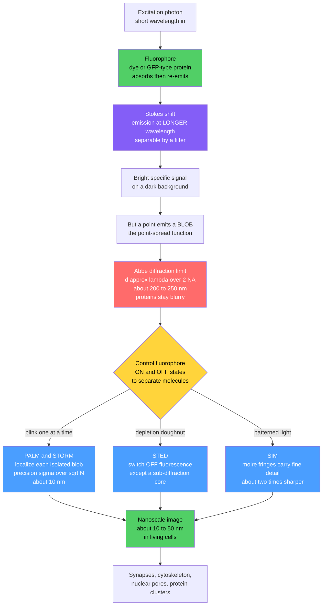

# 🔬 Fluorescence Microscopy and Super-Resolution

> [!abstract] TL;DR
> **Fluorescence microscopy** lights up *specific* molecules in a cell by tagging them with **fluorophores** — dyes or genetically encoded proteins like **GFP** — that absorb light and re-emit it at a longer wavelength (the **Stokes shift**), giving bright, specific signal against a dark background and letting biologists watch chosen proteins in *living* cells. For over a century one rule seemed absolute: Ernst Abbe's **diffraction limit** meant no light microscope could resolve features closer than roughly $\lambda / (2\,\mathrm{NA}) \approx 200\text{–}250$ nm, so the nanometre-scale molecular architecture of the cell stayed forever blurry. **Super-resolution microscopy** (the 2014 Nobel breakthroughs) shattered that barrier — not by violating physics but by *controlling fluorophore on/off states* to separate nearby molecules in time or space. **PALM/STORM** make molecules blink one at a time and localize each blink's centre to ~10 nm; **STED** uses a doughnut depletion beam to switch off fluorescence everywhere but a sub-diffraction core; **SIM** uses patterned illumination and moiré math for a ~2× gain. Together they revealed synapses, cytoskeleton, nuclear pores, and protein clusters at the nanoscale in living systems, transforming cell biology and neuroscience.

---

## Intuition

**Analogy:** Imagine two glowing fireflies hovering a hand-width apart in the dark. Move them close together and your eye eventually sees a single smear of light — you can no longer tell there are two. This is exactly the diffraction limit: light spreads into a blur (a "point-spread function") wider than the fireflies' separation, and no amount of squinting or better glass fixes it, because the blur is baked into the wave nature of light itself. For a hundred years this is where light microscopy stopped, and the molecular machinery of the cell — proteins are a few nanometres across, ten times finer than the ~200 nm limit — stayed hopelessly out of focus.

Then came a beautiful trick. If you cannot make two nearby glowing molecules *distinguishable at once*, make them **blink one at a time**. When only a single firefly is lit in any given instant, its blurry glow has an unambiguous **centre**, and you can pinpoint that centre far more precisely than the blur is wide — the more photons you collect, the tighter the estimate. Flash by flash, over thousands of frames, you record the centre of every molecule and assemble a razor-sharp picture from the accumulated pinpoints. Diffraction was never *beaten* by better lenses; it was *circumvented* by cleverly controlling *when* each molecule lights up.

---

## How It Works

### Core Mechanics

**1. Fluorescence — the workhorse contrast mechanism.** A fluorophore absorbs a photon, is promoted to an excited electronic state, loses a little energy internally as vibrational heat, then relaxes by emitting a photon of *lower* energy and therefore *longer* wavelength. That wavelength gap between absorption and emission is the **Stokes shift**, and it is what makes fluorescence so powerful: a dichroic filter can send in blue excitation and collect only the red-shifted emission, so labelled molecules glow brightly against an almost black background. Because you choose *what* to label, you get **molecular specificity** — you see *where a particular protein is*, not just bulk density. The photophysics of absorption and emission is the biological face of the electronic transitions covered in [[Molecular_Spectroscopy_and_Symmetry]].

**2. The GFP revolution.** Green fluorescent protein from the jellyfish *Aequorea victoria* is a fluorophore an organism builds *itself* from its own amino acids. Fuse the GFP gene to the gene for any protein of interest, and the cell expresses a glowing version of that exact protein — no dyes, no fixation, alive. GFP and its engineered spectral variants (BFP, CFP, YFP, mCherry) let researchers watch specific proteins move, assemble, and turn over inside living cells. It earned the 2008 Nobel Prize in Chemistry (Shimomura, Chalfie, Tsien) and rewired cell biology.

**3. The fluorescence toolkit.** Different optical geometries extract different information:
   - **Confocal microscopy** places a pinhole at the image plane that rejects out-of-focus light, giving clean **optical sections** that stack into 3D.
   - **Two-photon microscopy** excites a fluorophore only where two long-wavelength (near-IR) photons arrive together — at the focal point — enabling **deep-tissue** imaging with low photodamage, the backbone of live-brain neuroscience.
   - **TIRF** (total internal reflection fluorescence) illuminates only a ~100 nm slab at the coverslip, ideal for surfaces and single molecules.
   - **FRET** turns a donor–acceptor dye pair into a nanometre "proximity ruler" for conformational change and interactions (the single-molecule flavour is detailed in [[Single_Molecule_Biophysics]]).

**4. The diffraction limit.** Even a perfect point emitter images as a finite blob, the **point-spread function (PSF)** — the imaging system's [[Impulse_Response]]. Abbe (~1873) showed the minimum resolvable separation is set by wavelength and numerical aperture:
$$ d_{\min} = \frac{\lambda}{2\,\mathrm{NA}} \approx 200\text{–}250\ \text{nm} $$
Two features closer than $d_{\min}$ merge into one unresolvable blob. This is a property of *waves* (see [[Interference_and_Diffraction]]), not of lens quality, and it left proteins — an order of magnitude smaller — permanently blurred.

**5. The common super-resolution principle.** Every super-resolution method exploits a **controllable fluorophore state** (a switchable on/off) to make nearby molecules emit at *different times* or from *different places*, so they never have to be told apart within a single diffraction blob:
   - **PALM / STORM (localization microscopy).** Coax fluorophores to blink **stochastically**, so only a sparse, isolated few are ON per frame. Each lone PSF is fit to its centre with precision $\sigma_{\text{loc}} \approx \sigma_{\text{PSF}} / \sqrt{N}$ (N = photons collected) — nanometres, far below $d_{\min}$. Accumulate thousands of frames, plot every localization, and a super-resolved image emerges (Betzig, Hess, Zhuang).
   - **STED (stimulated emission depletion).** Overlap the excitation spot with a **doughnut-shaped** depletion beam that instantly switches OFF fluorescence everywhere except a sub-diffraction core, shrinking the effective spot. A *deterministic, scanning* method (Hell).
   - **SIM (structured illumination).** Project a fine known pattern; its interference with unresolvable sample detail produces coarse **moiré** fringes that carry the fine information into the passband. Computational reconstruction recovers ~2× resolution — fast and gentle enough for live cells.

**6. Watching dynamics.** Fluorescence is not just anatomy; it is a movie. **FRAP** (fluorescence recovery after photobleaching) measures mobility, **single-particle tracking** follows individual molecules diffusing, and genetically encoded **biosensors** report calcium, voltage, or pH in real time — the living cell in action.

These methods sit alongside not-yet-written sibling notes: *Spectroscopy_and_Optical_Methods_in_Biophysics* (the broader absorption/emission toolkit), *Cryo_Electron_Microscopy* (the electron-microscopy route to atomic structure that complements light nanoscopy), and *Systems_Biophysics_and_Gene_Networks* (where GFP reporters quantify gene expression). The vision physics that fluorescence imaging ultimately serves is developed in [[The_Physics_of_Hearing_and_Vision]].

### Flow / Architecture



---

## Key Concepts

### Secondary Level

- **A tag that glows.** A fluorophore is a tiny molecular lamp: shine one colour of light on it and it glows back a *different*, softer colour. Attach it only to the thing you want to see, and that thing lights up while everything else stays dark.
- **GFP: a lamp the cell builds itself.** Because GFP is a *protein*, you can hand a living cell the recipe (its gene) and the cell makes its own glowing tag on the protein you care about — so you can watch it in a living organism.
- **Why the picture is blurry.** Light naturally spreads into a fuzzy spot. Two glowing molecules closer than about half a wavelength merge into one blur, and no better lens can un-blur them.
- **The blinking trick.** If two lamps are too close to tell apart when both are lit, flash them *one at a time*. When only one is on, you can mark its exact centre — do this for thousands of lamps and rebuild a sharp picture.

### Undergraduate Level

- **Stokes shift and filtering.** Emission is red-shifted from absorption because the molecule dumps some energy as vibration before emitting. A dichroic mirror plus emission filter exploit this gap to reject scattered excitation and pass only fluorescence, giving the enormous signal-to-background that makes single-molecule detection possible.
- **The Abbe limit quantitatively.** $d_{\min} = \lambda/(2\,\mathrm{NA})$; the Rayleigh criterion gives the similar $0.61\,\lambda/\mathrm{NA}$. Higher NA (immersion oil, NA up to ~1.4) and shorter wavelength both sharpen the PSF, but you bottom out near ~200 nm for visible light.
- **The PSF as an impulse response.** The recorded image is the true fluorophore distribution **convolved** with the PSF. This is a linear systems view: the microscope is a low-pass spatial filter whose cutoff *is* the diffraction limit, connecting directly to [[Impulse_Response]] and Fourier optics.
- **Localization precision.** A single isolated PSF centred at an unknown point can be fit (centroid or Gaussian). The precision improves as $\sigma_{\text{loc}} \approx \sigma_{\text{PSF}}/\sqrt{N}$ with photon count $N$ — so 10,000 photons on a 100 nm-wide PSF localizes to ~1 nm. This is why PALM/STORM beat diffraction: they never *resolve* two molecules in one frame; they *localize* them in separate frames.
- **The three super-resolution families.** Stochastic single-molecule switching (PALM/STORM), deterministic depletion (STED), and patterned-illumination reconstruction (SIM) — all leverage a switchable fluorophore state to separate emitters in time or space.

### Graduate Level

- **Photon-limited localization and the CRLB.** The $\sigma_{\text{PSF}}/\sqrt{N}$ rule is the shot-noise limit; the full Cramér–Rao lower bound adds pixelation and background: $\sigma_{\text{loc}}^2 \approx \frac{s^2 + a^2/12}{N} + \frac{8\pi s^4 b^2}{a^2 N^2}$, where $s$ is PSF width, $a$ pixel size, $b$ background. Background photons are the enemy — hence TIRF and cleared samples for STORM.
- **Fluorophore photophysics is the engine.** PALM uses photo-activatable/photo-switchable fluorescent *proteins* (PA-GFP, Dronpa, mEos); STORM uses organic dyes (Alexa, Cy5) cycled between fluorescent and dark states via redox buffers and UV reactivation. The achievable resolution is set by localization precision *and* by labelling density (Nyquist: features need ~2 localizations per resolution element).
- **STED resolution scaling.** The effective PSF width shrinks as $d \approx \frac{\lambda}{2\,\mathrm{NA}\sqrt{1 + I/I_{\text{sat}}}}$ — resolution improves with the square root of the depletion intensity relative to the saturation intensity, so higher power buys sharpness at the cost of photobleaching and phototoxicity. STED is diffraction-*unlimited* in principle, gated by how hard you can drive the sample.
- **SIM in Fourier space.** Structured illumination shifts high spatial frequencies beyond the OTF passband down into the observable region as moiré; reconstruction unmixes and repositions them, effectively doubling the support of the optical transfer function. Saturated (nonlinear) SIM adds harmonics for further gains but reintroduces photodamage.
- **Live-cell trade-offs.** Every method balances **resolution vs speed vs phototoxicity vs labelling**. STORM: highest resolution, slow (thousands of frames), fixed or slow dynamics. SIM: gentlest and fastest, only ~2×, good for live cells. STED: fast point-scan, high intensity. Choosing among them is the central experimental-design question in modern nanoscopy.

---

## Python Demo

```python
# Fluorescence super-resolution: WHY blinking beats the diffraction limit.
# We show three things with just numpy + matplotlib:
#   (a) THE DIFFRACTION LIMIT  -- two point emitters closer than ~lambda/2NA
#       blur (via the PSF) into ONE unresolvable blob.
#   (b) LOCALIZATION           -- a SINGLE isolated emitter's blurry PSF can be
#       pinpointed to its center with precision ~ sigma_PSF / sqrt(N photons),
#       far below the diffraction limit.
#   (c) SUPER-RESOLUTION       -- simulate many molecules blinking ONE AT A TIME,
#       fit each center, and reconstruct structure the diffraction-limited image
#       cannot resolve. Plus: localization precision vs photon count.
# Requires: numpy, matplotlib
import numpy as np
import matplotlib.pyplot as plt

rng = np.random.default_rng(0)

# ---- Optical parameters (visible fluorescence, high-NA oil objective) ----
wavelength = 520.0                      # nm, GFP-like emission
NA         = 1.40                        # numerical aperture
abbe       = wavelength / (2 * NA)       # ~186 nm diffraction limit
psf_sigma  = 0.21 * wavelength / NA      # ~78 nm Gaussian PSF std-dev (FWHM ~185 nm)
print(f"Abbe diffraction limit   ~ {abbe:.0f} nm")
print(f"PSF Gaussian sigma       ~ {psf_sigma:.0f} nm  (FWHM ~ {2.355*psf_sigma:.0f} nm)")

def psf_1d(x, x0):                       # normalized 1D Gaussian PSF
    return np.exp(-(x - x0)**2 / (2 * psf_sigma**2))

# =====================================================================
# (a) DIFFRACTION LIMIT: two emitters, one closer than Abbe, one farther
# =====================================================================
x = np.linspace(-500, 500, 2000)        # nm
sep_close = 120.0                        # < Abbe (~186 nm) -> should merge
sep_far   = 420.0                        # > Abbe          -> should resolve
I_close = psf_1d(x, -sep_close/2) + psf_1d(x, +sep_close/2)
I_far   = psf_1d(x, -sep_far/2)   + psf_1d(x, +sep_far/2)

# =====================================================================
# (b) LOCALIZATION PRECISION vs PHOTON COUNT: sigma_loc ~ sigma_PSF / sqrt(N)
# =====================================================================
N_photons = np.logspace(2, 4.5, 60)     # 100 .. ~30000 photons
sigma_loc = psf_sigma / np.sqrt(N_photons)

# =====================================================================
# GROUND TRUTH: two parallel lines only 100 nm apart -- BELOW the ~186 nm limit
# =====================================================================
sep_lines = 100.0
n_mol = 600
ys = rng.uniform(-260, 260, n_mol)
side = np.where(rng.random(n_mol) < 0.5, -sep_lines/2, +sep_lines/2)
true_x = side + rng.normal(0, 4, n_mol)  # tiny structural jitter
true_y = ys

# --- Diffraction-limited widefield image: ALL molecules glow at once ---
grid = np.arange(-300, 300, 4.0)         # 4 nm pixels
GX, GY = np.meshgrid(grid, grid)
dl_image = np.zeros_like(GX)
for xm, ym in zip(true_x, true_y):
    dl_image += np.exp(-((GX-xm)**2 + (GY-ym)**2) / (2*psf_sigma**2))

# --- (c) Localization microscopy: each molecule BLINKS alone, fit its center ---
# Photons per blink vary; localization error ~ sigma_PSF / sqrt(N).
photons = rng.integers(700, 4000, n_mol)
prec = psf_sigma / np.sqrt(photons)
loc_x = true_x + rng.normal(0, 1, n_mol) * prec
loc_y = true_y + rng.normal(0, 1, n_mol) * prec

# --- Super-resolved reconstruction: 2D histogram of localizations (8 nm bins) ---
bins = np.arange(-300, 300, 8.0)
sr_image, _, _ = np.histogram2d(loc_x, loc_y, bins=[bins, bins])

# --- Cross-sections across the two lines (collapse the y-axis) ---
dl_profile = dl_image.sum(axis=0)                    # blurred -> one hump?
sr_profile = np.histogram(loc_x, bins=np.arange(-200, 200, 6.0))[0]

# =====================================================================
# PLOTS
# =====================================================================
fig, ax = plt.subplots(2, 3, figsize=(15, 9))

# (a) two-emitter resolvability
ax[0,0].plot(x, I_close, color="#ff6b6b", lw=2, label=f"sep {sep_close:.0f} nm (< limit)")
ax[0,0].plot(x, I_far,   color="#4a9eff", lw=2, label=f"sep {sep_far:.0f} nm (> limit)")
ax[0,0].set_title(f"(a) Diffraction limit ~ {abbe:.0f} nm")
ax[0,0].set_xlabel("position (nm)"); ax[0,0].set_ylabel("intensity")
ax[0,0].legend(fontsize=8)

# (b) localization precision vs photons
ax[0,1].loglog(N_photons, sigma_loc, color="#845ef7", lw=2, label="sigma_PSF / sqrt(N)")
ax[0,1].axhline(abbe, ls="--", color="#ff6b6b", lw=1.5, label=f"diffraction limit {abbe:.0f} nm")
ax[0,1].axhline(10,   ls=":",  color="k", lw=1, label="10 nm")
ax[0,1].set_title("(b) Localization precision vs photons")
ax[0,1].set_xlabel("photons collected, N"); ax[0,1].set_ylabel("precision (nm)")
ax[0,1].legend(fontsize=8)

# ground-truth molecule positions
ax[0,2].scatter(true_x, true_y, s=4, color="#51cf66")
ax[0,2].set_title("Ground truth: two lines 100 nm apart")
ax[0,2].set_xlabel("x (nm)"); ax[0,2].set_ylabel("y (nm)")
ax[0,2].set_xlim(-300, 300); ax[0,2].set_aspect("equal")

# diffraction-limited image: two lines blur into ONE
ax[1,0].imshow(dl_image, extent=[-300,300,-300,300], origin="lower", cmap="inferno")
ax[1,0].set_title("Diffraction-limited widefield\n(lines merge into one blur)")
ax[1,0].set_xlabel("x (nm)"); ax[1,0].set_ylabel("y (nm)")

# super-resolved reconstruction: two lines RESOLVED
ax[1,1].imshow(sr_image.T, extent=[-300,300,-300,300], origin="lower", cmap="inferno")
ax[1,1].set_title("PALM/STORM reconstruction\n(two lines resolved)")
ax[1,1].set_xlabel("x (nm)"); ax[1,1].set_ylabel("y (nm)")

# line profiles across the pair
xc = 0.5*(np.arange(-200,200,6.0)[:-1] + np.arange(-200,200,6.0)[1:])
ax[1,2].plot(grid, dl_profile/dl_profile.max(), color="#ff6b6b", lw=2,
             label="diffraction-limited (1 peak)")
ax[1,2].plot(xc, sr_profile/sr_profile.max(), color="#4a9eff", lw=2,
             label="super-resolution (2 peaks)")
ax[1,2].set_title("Cross-section across the two lines")
ax[1,2].set_xlabel("x (nm)"); ax[1,2].set_ylabel("normalized signal")
ax[1,2].legend(fontsize=8)

plt.tight_layout()
plt.savefig("fluorescence_super_resolution.png", dpi=130)

# ---- Console summary ----
print("\n=== Super-resolution vs diffraction ===")
print(f"Line separation to resolve = {sep_lines:.0f} nm  (below the ~{abbe:.0f} nm limit)")
print(f"Median localization precision = {np.median(prec):.1f} nm  "
      f"(from {int(np.median(photons))} photons)")
print("Diffraction-limited image: two lines merge -> ONE peak in the cross-section.")
print("Localization reconstruction: two lines RESOLVED -> TWO peaks. Limit circumvented.")
```

Running this prints an Abbe limit of ~186 nm and shows six panels. Panel (a) proves the barrier: two emitters 120 nm apart (below the limit) blur into a single hump, while 420 nm apart they split into two peaks. Panel (b) is the escape hatch — localization precision falls as $1/\sqrt{N}$ straight through the red diffraction-limit line, reaching ~1 nm at $10^4$ photons. The bottom row is the payoff: two fluorophore lines only 100 nm apart are an inseparable smear in the diffraction-limited widefield image, yet the accumulated single-molecule localizations resolve them into two crisp lines, and the cross-section makes it unmistakable — one peak becomes two. The physics was never violated; the molecules were simply separated *in time*.

---

## Real-World Applications

> **Example — Reconstructing the axonal cytoskeleton with STORM.** Using stochastic optical reconstruction microscopy, Xiaowei Zhuang's lab imaged the actin–spectrin membrane skeleton inside neuronal axons and discovered it forms **periodic rings spaced ~190 nm apart** wrapping the axon — a structure completely invisible to conventional fluorescence because the spacing sits right at the diffraction limit. Each frame lit only a sparse subset of blinking dye molecules; fitting tens of thousands of single-molecule PSFs to ~10 nm precision across many frames rebuilt the lattice. This finding, impossible without super-resolution, reshaped how neuroscientists think about axonal structure and mechanics — the same [[The_Cytoskeleton_and_Cell_Motility]] machinery seen at last at its native scale.

Other production-scale uses:

- **Live-cell dynamics with GFP.** Fusing GFP variants to proteins lets biologists film protein trafficking, cell division, and signalling in real time — the default readout of modern cell biology, and the reporter behind quantitative gene-expression studies (a theme of the sibling *Systems_Biophysics_and_Gene_Networks*).
- **Deep-brain imaging with two-photon.** Two-photon microscopy of GCaMP calcium sensors images neuronal activity hundreds of microns deep in living brains, a mainstay of systems neuroscience (complementing the macroscale methods in the Neuroscience vault's imaging notes).
- **Nuclear pore complexes.** STED and STORM resolve the eight-fold symmetry and ~120 nm ring architecture of nuclear pores, turning a blur into a countable molecular machine.
- **Synapse nanostructure.** Super-resolution maps the nanoscale alignment of pre- and post-synaptic proteins ("nanocolumns"), revealing organization that ensemble imaging averaged away.
- **SIM for fast live imaging.** Structured illumination captures mitochondrial dynamics, endoplasmic reticulum remodelling, and cytoskeletal motion at ~2× resolution with low phototoxicity, fast enough for video-rate live cells.
- **Single-particle tracking PALM (sptPALM).** Tracking individual photo-activated molecules maps diffusion and clustering of membrane receptors, linking imaging to the diffusion physics of the cell.

---

## Common Pitfalls

- **Confusing localization with resolution.** PALM/STORM never *resolve* two molecules inside one frame — they *localize* them in separate frames. Reporting "10 nm resolution" from single-emitter precision alone ignores that final resolution also depends on labelling density; sparse labels leave Nyquist gaps that no precision can fill.
- **Under-labelling and Nyquist violation.** To resolve a 20 nm feature you need roughly two localizations per 20 nm along it. Too few fluorophores yields a sharp-but-*wrong* image full of holes that can look like artefactual structure.
- **Photobleaching and phototoxicity.** High excitation (especially STED's depletion beam and STORM's long acquisitions) bleaches dyes and damages living cells; a "beautiful" fixed-cell image may not reflect live biology. Balance intensity, buffer, and exposure.
- **Drift and mapping errors.** Nanometre imaging over minutes is ruined by nanometre stage drift; without fiducial markers or drift correction, the reconstruction blurs back toward the diffraction limit. Multi-colour overlays also need careful chromatic registration.
- **Fixation and labelling artefacts.** Antibody labels are bulky (~10–15 nm), adding a "linkage error" comparable to the resolution; fixation can distort structure. What you image is the *label distribution*, not the molecule itself — a distinction that matters most exactly when resolution is highest.
- **Blinking mis-modelled.** A single molecule blinking multiple times is counted as several molecules, inflating apparent density and clustering. Quantitative super-resolution ("counting") requires careful photophysics controls.
- **Treating deconvolution as super-resolution.** Sharpening a diffraction-limited image computationally does not recover information beyond the OTF cutoff. True super-resolution needs a physical mechanism (switching, depletion, patterning), not just post-processing.

---

## Related Concepts

- [[Single_Molecule_Biophysics]] — localization microscopy is single-molecule detection turned into an imaging method; shares FRET, TIRF, and photobleaching physics.
- [[Interference_and_Diffraction]] — the wave-optics origin of the Abbe/Rayleigh limit that super-resolution circumvents.
- [[Geometric_and_Wave_Optics]] — numerical aperture, the point-spread function, and resolution that set the diffraction limit.
- [[Laser_Physics]] — excitation sources and the *stimulated emission* that STED uses to switch fluorophores off.
- [[Molecular_Spectroscopy_and_Symmetry]] — electronic absorption and emission transitions and the Stokes shift underlying fluorescence.
- [[UV_Vis_and_IR_Spectroscopy]] — the absorption/emission spectroscopy that characterizes fluorophores.
- [[Impulse_Response]] — the PSF is the imaging system's impulse response; the image is object convolved with it.
- [[Fourier_Transform]] — the optical transfer function and the moiré/spatial-frequency logic behind SIM.
- [[The_Cytoskeleton_and_Cell_Motility]] — actin/microtubule architecture that super-resolution finally imaged at native scale.
- [[The_Cell_Membrane_and_Transport]] — membrane proteins and receptors mapped by TIRF and sptPALM.
- [[The_Physics_of_Hearing_and_Vision]] — the physics of light detection that fluorescence imaging ultimately exploits.
- [[Diffusion_and_Brownian_Motion_in_Cells]] — single-particle tracking reads out the diffusion these tools visualize.
- [[Neuroimaging_Methods]] — the neuroscience imaging context where two-photon and super-resolution operate.

---

## Review Questions

**Secondary**
1. Two fluorescent molecules are 100 nm apart in a cell, but a normal light microscope shows them as a single blur. Using the firefly analogy, explain *why* the microscope cannot separate them, and describe the "blinking" trick that lets a super-resolution microscope tell them apart anyway.

**Undergraduate**
2. Localization precision scales as $\sigma_{\text{PSF}}/\sqrt{N}$. If a fluorophore's PSF has a width (sigma) of ~80 nm, roughly how many photons must you collect to localize its centre to 4 nm? Explain why this does *not* mean two molecules 4 nm apart can be resolved in a single image frame — and what PALM/STORM do instead to get around that.

**Graduate**
3. You must image a dynamic ~150 nm protein structure in a *living* cell. Compare STORM, STED, and SIM for this task in terms of resolution, acquisition speed, phototoxicity, and labelling requirements. Which would you choose and why, and what specific artefact (drift, under-labelling, bleaching, or linkage error) would most threaten your interpretation?

---

## Sources

- Huang, B., Bates, M., & Zhuang, X. (2009). "Super-resolution fluorescence microscopy." *Annual Review of Biochemistry*, 78, 993–1016.
- Betzig, E., Patterson, G. H., Sougrat, R., et al. (2006). "Imaging intracellular fluorescent proteins at nanometer resolution." *Science*, 313(5793), 1642–1645.
- Rust, M. J., Bates, M., & Zhuang, X. (2006). "Sub-diffraction-limit imaging by stochastic optical reconstruction microscopy (STORM)." *Nature Methods*, 3(10), 793–795.
- Hell, S. W., & Wichmann, J. (1994). "Breaking the diffraction resolution limit by stimulated emission: stimulated-emission-depletion fluorescence microscopy." *Optics Letters*, 19(11), 780–782.
- Gustafsson, M. G. L. (2000). "Surpassing the lateral resolution limit by a factor of two using structured illumination microscopy." *Journal of Microscopy*, 198(2), 82–87.
- Tsien, R. Y. (1998). "The green fluorescent protein." *Annual Review of Biochemistry*, 67, 509–544.

---

#biophysics #fluorescence-microscopy #super-resolution #STORM-PALM #diffraction-limit
