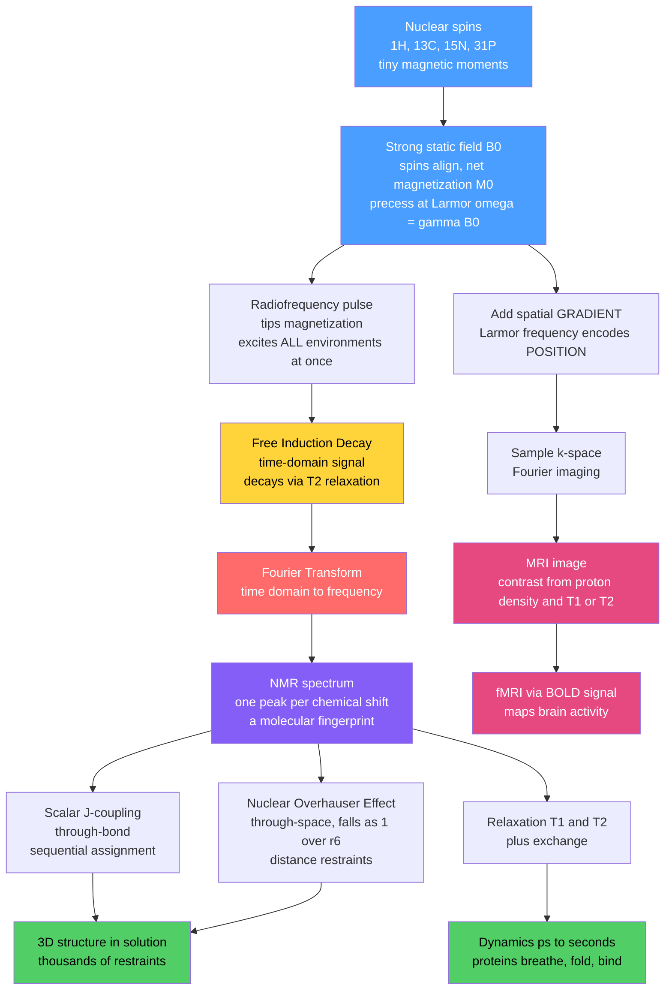

# 🧲 NMR and Magnetic Resonance in Biology

> [!abstract] TL;DR
> **Nuclear magnetic resonance** exploits the fact that certain atomic nuclei — $^{1}$H, $^{13}$C, $^{15}$N, $^{31}$P — have quantum **spin** and therefore behave like tiny magnets. Immersed in a strong field $B_0$ they align and **precess** at the **Larmor frequency** $\omega = \gamma B_0$, and a resonant radiofrequency pulse tips them so that their return to equilibrium radiates a detectable signal. The precise frequency of each nucleus is shifted by its local electronic environment — the **chemical shift** — turning a molecule into a fingerprint spectrum. In modern pulsed **FT-NMR** one pulse excites everything at once, the **free induction decay** (FID) is recorded in time, and a **Fourier transform** converts it to a spectrum. Layering on through-bond couplings for assignment and, above all, the **nuclear Overhauser effect** (NOE) for through-space distances, biomolecular NMR solves the 3D structures of small-to-medium **proteins in solution** and — uniquely — measures their **motion** across timescales from picoseconds to seconds via **relaxation** ($T_1$, $T_2$) and exchange. Scale the same physics up with magnetic-field **gradients** that encode position, and it becomes **MRI**: non-invasive, radiation-free imaging of soft tissue, and via the BOLD signal, **fMRI** maps of brain activity. Magnetic resonance is biophysics' bridge from single atoms to whole living brains.

---

## Intuition

**Analogy:** Atomic nuclei are tiny spinning magnets. Place them in a powerful magnetic field and they line up and wobble — **precess** — at a frequency that is exquisitely sensitive to their exact chemical surroundings, so each atom rings a slightly different bell. Now nudge the whole set with a sharp radio pulse and listen: you hear a *chorus* of pure tones, each fading away as the nuclei settle back to rest. Record that decaying chorus, mathematically separate the overlapping tones, and you have read out the frequency of every bell at once. Decode which bell is which and how loudly neighbours ring together, and you can reconstruct a protein's three-dimensional shape and even watch it wiggle and breathe in real time. Turn up the scale — image a whole human head instead of a test tube — and the very same trick, with a spatial twist, lets you photograph a living brain without a single incision or X-ray.

The technical translation is direct. The "wobble frequency" is the Larmor frequency $\omega = \gamma B_0$; the "slightly different bell" is the chemical shift; the "decaying chorus" is the free induction decay; "separating the tones" is the Fourier transform; "how loudly neighbours ring together" is the NOE and scalar coupling; and the "spatial twist" that turns spectroscopy into imaging is a deliberate magnetic-field gradient that makes frequency stand for *location*.

---

## How It Works

### Core Mechanics

1. **Spin and the magnetic moment.** A nucleus with non-zero spin $I$ (for $^{1}$H, $^{13}$C, $^{15}$N, all $I=\tfrac12$) carries a magnetic moment $\mu = \gamma \hbar I$, where $\gamma$ is the nucleus-specific **gyromagnetic ratio**. Without a field the spins point every which way; the quantum origin of that spin is the same intrinsic angular momentum treated in *[[Angular_Momentum_and_Spin]]*, and the nuclear properties that decide which isotopes are NMR-active come from *[[Nuclear_Structure]]*.

2. **Alignment and Larmor precession.** Switch on a strong static field $B_0$ (typically 7 to 23 tesla for research NMR, far above the ~1–3 T of clinical MRI) and the spins split into energy levels, producing a small net magnetization $M_0$ aligned along $B_0$. Each moment precesses about the field like a tilted spinning top, at the **Larmor frequency** $\omega = \gamma B_0$ — hundreds of megahertz for protons, squarely in the radio band. The field itself is nothing exotic: it is the same magnetostatics developed in *[[Magnetism_and_Biot_Savart]]*.

3. **The radiofrequency pulse.** A brief oscillating $B_1$ field applied at resonance tips the net magnetization away from $B_0$ into the transverse plane. In pulsed FT-NMR a single hard pulse excites *all* chemical environments simultaneously — the key efficiency of the modern method.

4. **The chemical shift — why structure appears.** Electrons around each nucleus partially **shield** it from $B_0$, so the field the nucleus actually feels, and hence its resonance frequency, depends on its precise chemical environment. This tiny fractional shift — measured in parts per million so it is field-independent — means different atoms in a molecule resonate at slightly different frequencies. That is the entire basis of structural NMR: the spectrum is a chemical fingerprint. This is the same chemical-shift physics detailed in the Chemistry note *[[NMR_Spectroscopy]]*; here the emphasis is on biomolecules.

5. **FID and Fourier transform.** After the pulse, the precessing transverse magnetization induces a decaying oscillating voltage in a receiver coil — the **free induction decay**. The FID is a *time-domain* sum of every excited frequency, each decaying with its transverse relaxation time. A **Fourier transform** (the workhorse of *[[Fourier_Transform]]* and, in discrete form, *[[DFT_and_FFT]]*) converts this decaying chorus into the *frequency-domain* spectrum, with one peak per chemical environment. This time-to-frequency step is the mathematical heart of NMR.

6. **From peaks to structure.** Two kinds of coupling turn a list of peaks into a molecule. **Scalar (J) coupling** propagates through chemical bonds and drives the sequential *assignment* of which peak belongs to which atom, spread out in **multidimensional NMR** (2D, 3D, 4D experiments that scatter overcrowded signals across extra axes). The **nuclear Overhauser effect** (NOE) is through-*space* dipolar cross-relaxation whose strength falls as $1/r^{6}$, yielding **distance restraints** between atoms closer than ~5 Å. Thousands of NOE distances plus dihedral-angle restraints are fed to a structure-calculation engine to compute the 3D fold — NMR's niche being small-to-medium proteins in **near-native solution**, complementary to the crystal structures of the not-yet-written sibling *X_Ray_Crystallography_and_Structural_Biology* and the large assemblies of *Cryo_Electron_Microscopy*. The resulting folds feed directly into *[[Protein_Structure_and_Folding]]*.

7. **Dynamics — NMR's unique strength.** Where crystallography gives one frozen snapshot, NMR reports **motion**. **Relaxation** — spin-lattice $T_1$ (return of magnetization along $B_0$) and spin-spin $T_2$ (loss of transverse coherence) — is driven by molecular tumbling and internal motion, so measuring $T_1$, $T_2$, NOE, and chemical **exchange** exposes flexibility across picoseconds to seconds. This is how NMR watches proteins **breathe, fold, and bind**, and captures disordered regions and transient states that other methods miss. These motions are the experimental counterpart to the simulations in the sibling *Computational_Biophysics_and_Molecular_Dynamics* and the ensembles of *[[Statistical_Mechanics_of_Biomolecules]]*.

8. **MRI — the same physics, spatially resolved.** Add a deliberate magnetic-field **gradient** so that $B_0$, and hence the Larmor frequency, varies linearly across space. Now frequency *encodes position*: the recorded signal is the Fourier transform of the spin-density map, sampled in **k-space**, and inverse-transforming reconstructs an image. **Contrast** comes from proton density and — crucially — from tissue-dependent $T_1$ and $T_2$: grey matter, white matter, fat, and cerebrospinal fluid relax differently, so weighting the pulse timing lights up soft tissue with no ionizing radiation. **fMRI** goes further, mapping activity through the **BOLD** signal (blood-oxygen-level-dependent contrast from deoxyhaemoglobin), and diffusion MRI, MR spectroscopy, and angiography extend the toolkit — all detailed on the neuroscience side in *[[Neuroimaging_Methods]]*.

### Flow / Architecture



---

## Key Concepts

### Secondary Level

- **Nuclei are tiny magnets.** Some atomic nuclei spin, which makes them behave like microscopic bar magnets. In a strong magnet they line up and wobble at a set frequency, and a radio pulse can make them "sing" a note we can record.
- **Every atom rings a slightly different bell.** The exact note a nucleus sings depends on its chemical neighbourhood, so a molecule produces a chord of distinct notes — a fingerprint we can read to work out its structure.
- **From molecules to medicine.** The very same physics, made to vary its "note" with location using a magnetic-field gradient, becomes an MRI scanner that photographs soft tissue inside the body without X-rays or surgery.

### Undergraduate Level

- **Larmor frequency.** Each spin precesses at $\omega = \gamma B_0$, where $\gamma$ is the gyromagnetic ratio. For $^{1}$H at 14.1 T this is ~600 MHz — the "600 MHz spectrometer" is named for exactly this proton Larmor frequency.
- **Chemical shift in ppm.** The resonance is offset from a reference by a fraction of $B_0$, reported in parts per million so it stays constant across field strengths: $\delta = 10^{6}\,(\nu - \nu_\text{ref})/\nu_\text{ref}$. Shielding by local electrons sets $\delta$, making it a structural reporter.
- **FID and the FT.** The recorded time-domain FID is $s(t)=\sum_k A_k\, e^{-t/T_{2,k}}\cos(2\pi f_k t)$; its Fourier transform is a spectrum of Lorentzian peaks, one per frequency $f_k$, with linewidth $\Delta\nu \approx 1/(\pi T_2)$. Faster relaxation (shorter $T_2$) means broader peaks.
- **$T_1$ vs $T_2$.** $T_1$ (spin-lattice) governs recovery of longitudinal magnetization, $M_z(t)=M_0(1-e^{-t/T_1})$; $T_2$ (spin-spin) governs decay of transverse coherence, $M_{xy}(t)=M_0 e^{-t/T_2}$. Always $T_2 \le T_1$. Both depend on molecular motion, which is why they double as a dynamics probe and as MRI contrast.
- **The NOE as a ruler.** NOE cross-relaxation intensity scales as $1/r^{6}$, so it is measurable only for atoms within ~5 Å — perfect for pinning down which parts of a folded chain are close in space.

### Graduate Level

- **Relaxation theory and dynamics.** $T_1$ and $T_2$ arise from stochastically fluctuating local fields; their rates depend on the **spectral density** $J(\omega)$ of molecular motion evaluated at $0$, $\omega$, and $2\omega$. Model-free (Lipari–Szabo) analysis extracts an order parameter $S^2$ and a correlation time $\tau_c$, quantifying ns-ps backbone flexibility residue by residue. Relaxation dispersion (CPMG, $R_{1\rho}$) reaches µs-ms exchange, exposing **invisible excited states** at a few percent population.
- **Multidimensional and isotope-labelled NMR.** Triple-resonance experiments on $^{13}$C/$^{15}$N-labelled protein (HNCA, HNCACB, etc.) walk the backbone for assignment; TROSY and deuteration suppress relaxation losses to push solution NMR toward larger systems. Sensitivity ultimately limits solution NMR to roughly 10–40 kDa without heroic labelling.
- **Structure calculation.** NOE-derived upper-distance bounds, $J$-coupling and residual-dipolar-coupling orientational restraints, and dihedral restraints from chemical shifts are combined by simulated annealing or torsion-angle dynamics into an *ensemble* of structures — the spread itself reporting precision and, sometimes, real conformational heterogeneity.
- **k-space and Fourier imaging.** MRI signal $S(\mathbf{k}) = \int \rho(\mathbf{r})\, e^{-i 2\pi \mathbf{k}\cdot\mathbf{r}}\, d\mathbf{r}$, with $\mathbf{k}(t)=\gamma\!\int_0^t \mathbf{G}(t')\,dt'$ set by the time-integral of the applied gradients. Frequency-encode, phase-encode, and slice-select gradients raster k-space; an inverse FFT reconstructs the image. Echo-planar imaging traverses k-space in a single shot, enabling fast fMRI.
- **Contrast weighting.** Repetition time $T_R$ and echo time $T_E$ tune $T_1$- vs $T_2$-weighting: short $T_R$/short $T_E$ emphasizes $T_1$ differences, long $T_R$/long $T_E$ emphasizes $T_2$. This is how identical anatomy yields radically different images, and how pathology (edema, tumours, demyelination) is made visible.
- **Complementarity in structural biology.** NMR uniquely delivers **solution** structures *and* dynamics for smaller proteins; X-ray crystallography reaches atomic resolution and very large complexes in the crystal; cryo-EM images huge, flexible assemblies. Integrated structural biology fuses all three plus computation.

---

## Python Demo

```python
# NMR / MRI physics from scratch: numpy + matplotlib.
# (a) Simulate a FREE INDUCTION DECAY (FID) as a sum of exponentially decaying
#     oscillations at a few chemical-shift frequencies, then FOURIER-TRANSFORM
#     it to recover the NMR SPECTRUM (one peak per chemical shift).
# (b) Illustrate T1 recovery and T2 decay, and how they DIFFER between tissues
#     -- the contrast mechanism of MRI.
# (c) Show the MRI principle: a field GRADIENT makes Larmor frequency encode
#     POSITION, so the (inverse) FT of the k-space signal maps space.
import numpy as np
import matplotlib.pyplot as plt

rng = np.random.default_rng(3)

# =====================================================================
# (a) FID  ->  Fourier transform  ->  NMR SPECTRUM
# =====================================================================
# Three "chemical environments" resonate at slightly different offsets.
# (Frequencies in Hz; at a 600 MHz spectrometer 1 ppm ~ 600 Hz for 1H.)
shifts_hz = np.array([120.0, 240.0, 400.0])   # chemical-shift offsets
amps      = np.array([1.0, 0.6, 0.8])         # peak amplitudes (proton counts)
T2        = np.array([0.20, 0.20, 0.12])      # transverse relaxation times (s)

fs = 4000.0                    # sampling rate (Hz)
Tacq = 1.0                     # acquisition time (s)
t = np.arange(0, Tacq, 1/fs)   # time axis

# FID = sum of decaying complex oscillations (quadrature detection)
fid = np.zeros_like(t, dtype=complex)
for f, a, tau in zip(shifts_hz, amps, T2):
    fid += a * np.exp(2j*np.pi*f*t) * np.exp(-t/tau)
fid += (rng.normal(0, 0.02, t.size) + 1j*rng.normal(0, 0.02, t.size))  # noise

# Fourier transform -> spectrum (magnitude), frequency axis
spec = np.fft.fftshift(np.fft.fft(fid))
freq = np.fft.fftshift(np.fft.fftfreq(t.size, d=1/fs))

# =====================================================================
# (b) T1 recovery and T2 decay for two tissues -> MRI CONTRAST
# =====================================================================
tt = np.linspace(0, 5.0, 600)               # seconds
tissues = {                                  # approximate 1.5 T brain values
    "grey matter": dict(T1=0.90, T2=0.09, color="#4a9eff"),
    "CSF (fluid)": dict(T1=4.00, T2=2.00, color="#e64980"),
}
Mz = {k: 1 - np.exp(-tt/v["T1"]) for k, v in tissues.items()}   # longitudinal
Mxy = {k: np.exp(-tt/v["T2"]) for k, v in tissues.items()}      # transverse

# =====================================================================
# (c) GRADIENT ENCODING: Larmor frequency encodes position -> k-space
# =====================================================================
# A 1D object: spin-density "phantom" (two bright bars) along x.
Nx = 256
x = np.linspace(-1, 1, Nx)                    # position (arbitrary units)
rho = np.zeros(Nx)
rho[(x > -0.6) & (x < -0.3)] = 1.0            # bar 1
rho[(x >  0.1) & (x <  0.5)] = 0.7            # bar 2

# Under a gradient G, Larmor freq f(x) = gamma*G*x  -> frequency == position.
# The measured k-space signal is the Fourier transform of the object;
# inverse-transforming it RECONSTRUCTS the spatial profile (1D MRI).
kspace = np.fft.fftshift(np.fft.fft(np.fft.ifftshift(rho)))
recon = np.abs(np.fft.fftshift(np.fft.ifft(np.fft.ifftshift(kspace))))
k = np.fft.fftshift(np.fft.fftfreq(Nx, d=(x[1]-x[0])))
gammaG = 300.0                                # gamma*G (Hz per unit x), illustrative
larmor_of_x = gammaG * x                      # frequency encodes position

# =====================================================================
# PLOTS  (2 x 3 grid)
# =====================================================================
fig, ax = plt.subplots(2, 3, figsize=(15, 8))

# (a1) the FID in the time domain
ax[0, 0].plot(t, fid.real, color="#845ef7", lw=0.7)
ax[0, 0].set_xlim(0, 0.25)
ax[0, 0].set_xlabel("time (s)")
ax[0, 0].set_ylabel("signal")
ax[0, 0].set_title("(a) Free Induction Decay (time domain)")

# (a2) the NMR spectrum after Fourier transform
ax[0, 1].plot(freq, np.abs(spec), color="#ff6b6b", lw=1.2)
ax[0, 1].set_xlim(0, 550)
for f in shifts_hz:
    ax[0, 1].axvline(f, ls="--", color="k", lw=0.8, alpha=0.5)
ax[0, 1].set_xlabel("chemical-shift frequency (Hz)")
ax[0, 1].set_ylabel("intensity")
ax[0, 1].set_title("(a) NMR spectrum = FT of the FID")

# (b1) T1 longitudinal recovery
for name, v in tissues.items():
    ax[0, 2].plot(tt, Mz[name], color=v["color"], lw=2, label=name)
ax[0, 2].set_xlabel("time after pulse (s)")
ax[0, 2].set_ylabel("Mz / M0")
ax[0, 2].set_title("(b) T1 recovery -> tissue contrast")
ax[0, 2].legend(fontsize=8)

# (b2) T2 transverse decay
for name, v in tissues.items():
    ax[1, 0].plot(tt, Mxy[name], color=v["color"], lw=2, label=name)
ax[1, 0].set_xlabel("time after pulse (s)")
ax[1, 0].set_ylabel("Mxy / M0")
ax[1, 0].set_title("(b) T2 decay -> tissue contrast")
ax[1, 0].legend(fontsize=8)

# (c1) gradient encoding: frequency is a linear function of position
ax[1, 1].plot(x, larmor_of_x, color="#20c997", lw=2)
ax[1, 1].set_xlabel("position x")
ax[1, 1].set_ylabel("Larmor frequency (Hz)")
ax[1, 1].set_title("(c) Gradient: frequency encodes POSITION")

# (c2) object, and its reconstruction from k-space via inverse FT
ax[1, 2].plot(x, rho, color="#adb5bd", lw=3, label="true object rho(x)")
ax[1, 2].plot(x, recon, color="#e64980", lw=1.2, ls="--", label="FT reconstruction")
ax[1, 2].set_xlabel("position x")
ax[1, 2].set_ylabel("spin density")
ax[1, 2].set_title("(c) 1D MRI: image = inverse FT of k-space")
ax[1, 2].legend(fontsize=8)

plt.tight_layout()
plt.savefig("nmr_mri_physics.png", dpi=130)

# --- Console summary ---
peaks = freq[(freq > 0) & (np.abs(spec) > 0.4*np.abs(spec).max())]
print("=== NMR / MRI physics demo ===")
print(f"Input chemical shifts (Hz):     {shifts_hz}")
print(f"Peaks recovered by FT (approx): "
      f"{np.round(np.unique(np.round(peaks/5)*5),0)}")
print(f"Grey vs CSF T1 (s):  {tissues['grey matter']['T1']}  vs  {tissues['CSF (fluid)']['T1']}")
print(f"Grey vs CSF T2 (s):  {tissues['grey matter']['T2']}  vs  {tissues['CSF (fluid)']['T2']}")
print(f"k-space reconstruction max error: {np.abs(recon-rho).max():.3e}")
```

The FID panel shows the raw decaying chorus; Fourier-transforming it yields the spectrum with peaks sitting exactly at the input chemical shifts — the time-to-frequency step that *is* NMR. The relaxation panels show grey matter and cerebrospinal fluid recovering ($T_1$) and decaying ($T_2$) at very different rates, which is precisely why the two tissues can be given opposite brightness in an MRI simply by choosing when to read the signal. The final pair shows the imaging trick: a gradient makes Larmor frequency a linear map of position, so the recorded k-space signal is the Fourier transform of the object, and an inverse transform reconstructs a faithful 1D image.

---

## Real-World Applications

> **Example — Solving a protein fold in solution (biomolecular NMR).** A $^{13}$C/$^{15}$N-labelled protein at millimolar concentration is placed in a 600–900 MHz spectrometer. Triple-resonance experiments walk the backbone to assign every $^{1}$H, $^{13}$C, and $^{15}$N peak; a 3D NOESY then reports hundreds to thousands of through-space $^{1}$H–$^{1}$H distances under 5 Å. Fed as restraints to a simulated-annealing calculation, these produce an ensemble of structures consistent with all the data — a native-state fold determined *without a crystal*. The same sample, run through $^{15}$N relaxation and CPMG dispersion, then reveals which loops are rigid, which are floppy on the nanosecond scale, and which flicker to a sparsely populated "invisible" conformer on the millisecond scale. This dual delivery of **structure and dynamics** is NMR's signature, complementary to the frozen snapshots of *X_Ray_Crystallography_and_Structural_Biology* and feeding the folding narrative of *[[Protein_Structure_and_Folding]]*.

Other production-scale uses:

- **Clinical MRI.** The transformative medical application: non-invasive, radiation-free imaging of the brain, spine, joints, heart, and abdomen, with soft-tissue contrast X-rays cannot match. $T_1$-, $T_2$-, and proton-density-weighted scans distinguish tumours, edema, infarcts, and demyelination.
- **Functional MRI.** BOLD-contrast fMRI maps which brain regions activate during tasks or at rest, the backbone of modern cognitive neuroscience — see *[[Neuroimaging_Methods]]* and *[[Neural_Biophysics_and_Information]]*.
- **Diffusion MRI and tractography.** Measuring water diffusion anisotropy reconstructs white-matter fibre tracts and detects acute stroke within minutes; the physics of that diffusion is *[[Diffusion_and_Brownian_Motion_in_Cells]]*.
- **Drug discovery.** Fragment-based screening ("SAR by NMR") detects weak small-molecule binding by chemical-shift perturbation, and NMR maps binding sites and conformational effects on target proteins.
- **Metabolomics and in-vivo MR spectroscopy.** $^{1}$H and $^{31}$P NMR quantify metabolite fingerprints in biofluids and, non-invasively, in tissue, probing energy metabolism and disease markers.
- **Nucleic acids and complexes.** Solution NMR resolves RNA and DNA structure, dynamics, and ligand binding, extending the physics of *[[The_Physics_of_DNA_and_RNA]]*.

---

## Common Pitfalls

- **Confusing $T_1$ and $T_2$.** $T_1$ is *longitudinal* recovery (along $B_0$), $T_2$ is *transverse* decoherence; $T_2 \le T_1$ always. Mixing them up scrambles both dynamics interpretation and MRI contrast weighting. Remember: $T_2$ sets linewidth ($\Delta\nu \approx 1/\pi T_2$), $T_1$ sets how long you must wait between scans.
- **Reading an NOE as a bond.** The NOE is a *through-space* effect ($1/r^{6}$), not a covalent connection. Two atoms with a strong NOE are close in space but may be far apart in sequence — that is exactly the information that defines a fold, and confusing it with $J$-coupling (through-bond) corrupts assignment.
- **Ignoring the size limit of solution NMR.** As proteins get larger they tumble slower, $T_2$ shortens, lines broaden, and signal vanishes. Beyond ~40 kDa you need TROSY, deuteration, or a different method entirely — reaching for NMR on a 300 kDa complex without these will simply fail.
- **Over-interpreting a single MRI weighting.** A bright spot on a $T_2$-weighted image is not automatically pathology; contrast depends on $T_R$/$T_E$ choices. Radiological reads combine multiple weightings for exactly this reason.
- **Treating fMRI BOLD as direct neural activity.** BOLD is a slow (seconds) *haemodynamic* proxy for activity, not spikes. Its sluggish, indirect nature and low temporal resolution are built into the physics — over-claiming millisecond neural timing from BOLD is a classic error.
- **Under-sampling or truncating the FID.** Cutting the FID short before it decays introduces truncation artifacts ("wiggles") in the spectrum; too-coarse sampling aliases peaks. The Fourier relationship between acquisition time, sampling rate, and resolution is unforgiving.

---

## Related Concepts

- [[NMR_Spectroscopy]] — the Chemistry sibling covering chemical shift, $J$-coupling, and small-molecule structure determination; this note is the biomolecule- and imaging-focused extension.
- [[Protein_Structure_and_Folding]] — the folds and folding pathways that NOE-restrained solution NMR resolves and whose motions relaxation measures.
- [[Angular_Momentum_and_Spin]] — the quantum spin and magnetic moment of the nucleus that make magnetic resonance possible.
- [[Nuclear_Structure]] — why only certain isotopes ($^{1}$H, $^{13}$C, $^{15}$N, $^{31}$P) are NMR-active and how their gyromagnetic ratios differ.
- [[Magnetism_and_Biot_Savart]] — the magnetostatics of the strong $B_0$ field and the encoding gradients.
- [[Fourier_Transform]] — the continuous transform that turns the time-domain FID into a spectrum and k-space into an image.
- [[DFT_and_FFT]] — the discrete, fast version actually used to process every FID and reconstruct every MRI slice.
- [[Fourier_Analysis_and_Integral_Transforms]] — the broader mathematical machinery behind time↔frequency and k-space↔image duality.
- [[Neuroimaging_Methods]] — the neuroscience treatment of MRI, fMRI, and the BOLD signal for mapping brain function.
- [[Diffusion_and_Brownian_Motion_in_Cells]] — the water diffusion physics exploited by diffusion MRI and tractography.
- [[Statistical_Mechanics_of_Biomolecules]] — the conformational ensembles and free-energy landscapes that NMR dynamics data constrain.
- [[Single_Molecule_Biophysics]] — a complementary way to watch conformational states and kinetics, one molecule rather than an ensemble at a time.
- [[The_Physics_of_DNA_and_RNA]] — nucleic-acid structure and dynamics studied by solution NMR.
- [[Neural_Biophysics_and_Information]] — the neural activity that fMRI images indirectly via haemodynamics.
- [[Molecular_Spectroscopy_and_Symmetry]] — the general spectroscopic framework of which NMR is the radiofrequency, spin-based member.
- [[Protein_Structure_and_Function]] — the biochemistry of the folded proteins whose structure and binding NMR characterizes.
- [[Biophysics_Overview]] — the parent survey placing magnetic resonance among biophysics' core techniques.

---

## Review Questions

**Secondary**
1. Using the "each atom rings a slightly different bell" analogy, explain why a molecule gives a *spectrum of several peaks* rather than a single note, and describe in words how the same physics that reads a test tube can instead photograph a living brain.

**Undergraduate**
2. You record an FID that is a sum of three decaying oscillations. (a) What operation converts this time-domain signal into the frequency-domain spectrum, and what determines the position and the width of each peak? (b) One tissue has a much longer $T_1$ than another; sketch how you would choose the timing of an MRI scan to make those two tissues appear with different brightness, and state which relaxation time controls peak *linewidth* in a spectrum.

**Graduate**
3. A collaborator has a well-behaved 18 kDa protein and wants both its solution structure *and* a map of its slow (µs-ms) conformational exchange. (a) Which restraints would you collect to compute the fold, distinguishing the roles of scalar coupling versus the NOE? (b) Which relaxation experiments would you use to detect and characterize a sparsely populated "invisible" excited state, and what physical quantity does the $1/r^{6}$ dependence of the NOE limit you to measuring? (c) At roughly what molecular size does solution NMR start to fail, why (in terms of $T_2$ and tumbling), and what experimental tricks push that limit higher?

---

## Sources

- Cavanagh, J., Fairbrother, W. J., Palmer, A. G., Rance, M., & Skelton, N. J. (2007). *Protein NMR Spectroscopy: Principles and Practice* (2nd ed.). Academic Press.
- Wüthrich, K. (1986). *NMR of Proteins and Nucleic Acids*. Wiley. (Nobel Prize 2002 for NMR structure determination of biomolecules.)
- Levitt, M. H. (2008). *Spin Dynamics: Basics of Nuclear Magnetic Resonance* (2nd ed.). Wiley.
- Bernstein, M. A., King, K. F., & Zhou, X. J. (2004). *Handbook of MRI Pulse Sequences*. Elsevier.
- Logothetis, N. K. (2008). "What we can do and what we cannot do with fMRI." *Nature*, 453, 869–878.

---

#biophysics #NMR #MRI #magnetic-resonance #protein-dynamics
