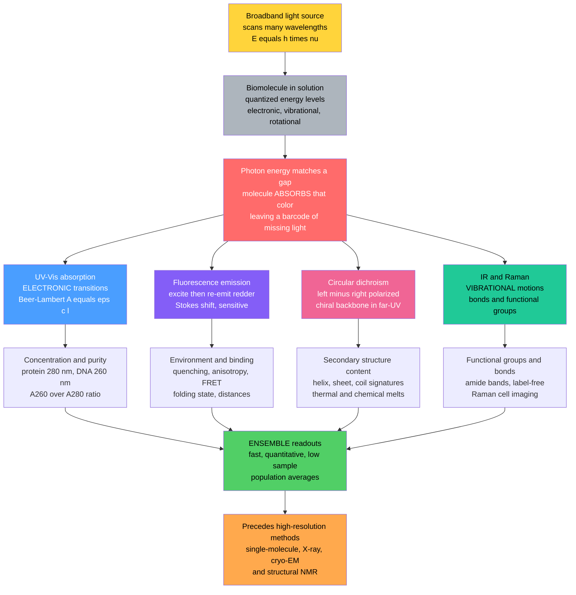

# 🌈 Spectroscopy and Optical Methods in Biophysics

> [!abstract] TL;DR
> **Spectroscopy** reads the *spectral fingerprints* of biomolecules by watching how they interact with light — **absorbing**, **emitting**, and **scattering** specific colors set by their quantized energy levels. Four workhorses dominate the biophysics bench: **UV–Vis absorption** with the **Beer–Lambert law** $A = \varepsilon c \ell$ for routine **concentration and purity** (proteins at 280 nm via aromatic residues, DNA/RNA at 260 nm); **fluorescence** for exquisitely sensitive readouts of **environment, folding, and binding** (Stokes shift, quenching, anisotropy, FRET); **circular dichroism (CD)** for rapid **secondary-structure** content and **folding/unfolding melts**; and **vibrational** methods (**IR** and **Raman**) for **bonds and functional groups**. Rounded out by scattering (**DLS** for size/aggregation) and spin methods (**EPR**), these are fast, quantitative, low-sample, mostly **ensemble** techniques — the daily diagnostic backbone of biochemistry, biopharma quality control, and the characterization that *precedes* any high-resolution structural study.

---

## Intuition

**Analogy:** Every molecule is a tiny instrument that can only play a fixed set of "notes" — specific colors of light it is willing to absorb or emit, dictated by its internal structure. Shine a rainbow through a solution and the molecule *steals exactly the colors that match its internal energy jumps*, leaving behind a barcode of missing light. Read that barcode and you can tell whether a protein is folded, what state a membrane is in, or how fast a molecule is tumbling — all **without ever seeing the molecule directly**, just by listening to which colors it likes.

The technical payoff is that different regions of the electromagnetic spectrum plug into different kinds of molecular motion: ultraviolet and visible light jostle **electrons**, infrared light shakes **chemical bonds**, and polarized light exposes molecular **handedness**. Pick the right color of light and you interrogate a different property of the same molecule — concentration, structure, environment, or dynamics — cheaply, quickly, and with milligrams to spare.

---

## How It Works

### Core Mechanics

Spectroscopy rests on a single quantum idea: molecules have **quantized energy levels** — electronic, vibrational, and rotational — and they can only absorb or emit a photon whose energy *exactly matches* the gap between two levels, $\Delta E = h\nu = hc/\lambda$. Bigger gaps demand more energetic (bluer, shorter-wavelength) light. Because the gaps are set by molecular structure, the pattern of colors a molecule absorbs or emits is a structural fingerprint.

1. **The spectral map.** Different spectral regions probe different motions. **UV/Visible** light (roughly 200–700 nm) drives *electronic* transitions — an electron jumps to a higher orbital. **Infrared** (mid-IR, ~2.5–25 µm) excites *vibrational* motions — bonds stretch and bend. **Microwave/radio** reach *rotational* and *nuclear-spin* transitions (the latter is [[NMR_Spectroscopy]], covered in the sibling note *NMR_and_Magnetic_Resonance_in_Biology*). One molecule, many windows.

2. **UV–Vis absorption — the concentration workhorse.** A **chromophore** (a light-absorbing group) promotes an electron across the HOMO–LUMO gap. The amount absorbed obeys the **Beer–Lambert law**, $A = \varepsilon c \ell$: absorbance is linear in concentration $c$, path length $\ell$, and the molar extinction coefficient $\varepsilon$. This makes UV–Vis the everyday tool for **quantifying** biomolecules — proteins absorb at **280 nm** through aromatic side chains (tryptophan, tyrosine), while nucleic acids absorb at **260 nm** through their bases. The **A260/A280 ratio** even reports sample purity. It is the single most-run measurement in a biochemistry lab.

3. **Fluorescence — sensitive reporter of environment.** After a molecule absorbs a photon and jumps to an excited electronic state, it can re-emit a photon as it drops back down. Because some energy is lost to vibration first, the emitted light is *redder* than the absorbed light — the **Stokes shift**. Fluorescence is enormously sensitive (single molecules are detectable) and environment-dependent: intrinsic tryptophan fluorescence blue-shifts when buried in a folded core and red-shifts when exposed on unfolding. **Quenching** (collisional or static), **anisotropy** (how much polarization is retained, reporting tumbling and binding), and **FRET** (distance-dependent energy transfer, a molecular ruler) turn fluorescence into a versatile probe of folding, binding, and dynamics — connecting to the sibling notes *Fluorescence_Microscopy_and_Super_Resolution* and [[Single_Molecule_Biophysics]].

4. **Circular dichroism — the secondary-structure readout.** Chiral molecules absorb **left- and right-circularly polarized light** slightly differently; the difference, $\Delta A = A_L - A_R$, is the CD signal. In the **far-UV** (190–250 nm) the peptide backbone's chirality makes CD acutely sensitive to **secondary structure**: an α-helix shows a characteristic double minimum near **208 and 222 nm**, a β-sheet a single minimum near **218 nm**, and random coil a strong minimum near **198 nm**. A real protein's spectrum is a **linear combination** of these basis shapes, so fitting it yields the percentage of each structure. Ramp the temperature and watch the 222 nm signal collapse to trace a **thermal melt** — the fastest structural readout of folding stability.

5. **Vibrational spectroscopy — bonds and functional groups.** **Infrared absorption** excites bond vibrations directly; the **amide I band** (~1650 cm⁻¹, C=O stretch of the backbone) is diagnostic of secondary structure, complementing CD. **Raman scattering** probes the same vibrations by inelastic light scattering (a tiny fraction of scattered photons shift in energy by a vibrational quantum). Raman needs no labels, works in water better than IR, and enables **label-free imaging** of cells and tissues; **surface-enhanced Raman (SERS)** boosts sensitivity to trace levels.

6. **Scattering and spin methods.** **Dynamic light scattering (DLS)** measures how quickly scattered-light intensity fluctuates as particles diffuse, giving **hydrodynamic size** and flagging **aggregation** — critical in biopharma. **Static light scattering** gives molecular mass. **Electron paramagnetic resonance (EPR)** uses site-directed **spin labels** to measure distances and dynamics. **Mass spectrometry** (adjacent, not optical) supplies mass and identity.

7. **Ensemble vs single-molecule.** Almost all of the above is **ensemble** spectroscopy — it reports a *population average* over trillions of molecules. That is fast, quantitative, and needs little sample, but it *blurs distinct states together*. Where heterogeneity and rare intermediates matter, [[Single_Molecule_Biophysics]] and the fluctuation machinery of [[Statistical_Mechanics_of_Biomolecules]] take over. Spectroscopy's job is the quick, quantitative characterization — concentration, folding state, binding — that *precedes and complements* the high-resolution structural methods (X-ray, cryo-EM, NMR) and [[Protein_Structure_and_Folding]] studies.

### Flow / Architecture



---

## Key Concepts

### Secondary Level

- **Molecules like certain colors.** Just as a struck tuning fork rings at one pitch, a molecule only absorbs or emits particular colors of light, fixed by its structure. Reading those colors is reading a fingerprint.
- **More light lost means more molecule.** The more of a substance is dissolved, the more light it soaks up. That simple proportionality (the Beer–Lambert idea) is how a lab measures *how much* protein or DNA is in a tube.
- **Different colors probe different things.** Ultraviolet light checks concentration, special polarized light checks whether a protein is folded, and infrared light checks which chemical bonds are present — all on the same sample.
- **No microscope needed.** Spectroscopy never "sees" the molecule; it infers structure and amount purely from the light going in versus the light coming out.

### Undergraduate Level

- **The master equation.** $\Delta E = h\nu = hc/\lambda$: absorption or emission happens only when a photon's energy matches a gap between quantized levels. Electronic gaps are large (UV–Vis), vibrational gaps smaller (IR), rotational smaller still (microwave).
- **Beer–Lambert in practice.** $A = \varepsilon c \ell$, where $A = -\log_{10}(I/I_0)$. For a 1 cm cuvette, $c = A/\varepsilon$. Proteins use $\varepsilon_{280}$ estimated from Trp/Tyr/Cys content; dsDNA uses ~50 (µg/mL)⁻¹cm⁻¹ at 260 nm. Deviations from linearity appear at high $A$ (stray light, crowding).
- **Chromophores and the 280/260 split.** Aromatic residues absorb near 280 nm; nucleic-acid bases near 260 nm. The **A260/A280 ratio** (~1.8 for clean DNA, ~0.6 for pure protein) diagnoses contamination.
- **Fluorescence essentials.** Excitation → non-radiative relaxation → red-shifted emission (Stokes shift). **Quantum yield** is emitted-over-absorbed photons. Tryptophan is the intrinsic probe; its emission maximum shifts with local polarity, reporting folding and burial.
- **CD as a structure meter.** Far-UV CD spectra of α-helix, β-sheet, and random coil have distinct signatures; a protein's spectrum is their weighted sum. Deconvolution (CONTIN, SELCON, CDSSTR) returns percent helix/sheet/coil.
- **Anisotropy and FRET.** Steady-state anisotropy rises when a fluorophore tumbles slowly (large complex, bound state). FRET efficiency falls as $1/(1 + (r/R_0)^6)$ — a nanometre ruler for proximity and binding.

### Graduate Level

- **Selection rules and intensity.** Electronic transition intensity is set by the transition dipole moment; the extinction coefficient $\varepsilon$ encodes the oscillator strength. Symmetry-forbidden transitions (weak $n\!\to\!\pi^*$) still appear via vibronic coupling — the theory lives in [[Molecular_Spectroscopy_and_Symmetry]].
- **CD, optical activity, and exciton coupling.** CD arises when a chromophore sits in a chiral environment, mixing electric and magnetic transition dipoles (nonzero **rotational strength**). The α-helix's 208/222 nm couplet is textbook **exciton coupling** between backbone amide transitions. Data are reported as **mean residue ellipticity** $[\theta]$ in deg·cm²·dmol⁻¹.
- **Two-state thermodynamics from melts.** A CD- or fluorescence-monitored melt gives a sigmoidal signal $S(T)$; assuming two states, the **van't Hoff** analysis yields $\Delta H_{vH}$, $\Delta S$, and $T_m = \Delta H/\Delta S$ from the transition midpoint. A mismatch between $\Delta H_{vH}$ and calorimetric $\Delta H$ (from DSC) flags intermediates or oligomerization.
- **Fluorescence quenching mechanisms.** **Dynamic** (collisional) quenching follows the **Stern–Volmer** relation $F_0/F = 1 + K_{SV}[Q]$ and shortens lifetime; **static** quenching forms a ground-state complex and leaves lifetime unchanged. Distinguishing them (lifetime, temperature dependence) is a standard exam trap.
- **Vibrational structure resolution.** IR amide I (1600–1700 cm⁻¹) decomposes into component bands: ~1655 cm⁻¹ (α-helix), ~1630/1685 cm⁻¹ (antiparallel β-sheet). Raman adds resonance enhancement and, via SERS, single-molecule sensitivity from plasmonic hotspots.
- **Time-resolved and stopped-flow kinetics.** Rapid-mixing **stopped-flow** with fluorescence or CD detection resolves folding and binding kinetics on millisecond timescales; **T-jump** and **fluorescence lifetime** methods push to nanoseconds — the ensemble counterpart to single-molecule dwell-time analysis.
- **Ensemble averaging trade-off.** Spectroscopic observables are Boltzmann-weighted population averages; a smooth melt or a single blurred peak can hide multiple sub-states that only time-resolved or single-molecule methods separate.

---

## Python Demo

```python
# Biophysical spectroscopy toolkit demo.
# (a) UV-Vis + Beer-Lambert: absorbance is LINEAR in concentration (A = eps*c*l),
#     and a modeled absorption spectrum has electronic peaks at 260 nm (DNA)
#     and 280 nm (protein) -> read A280 to determine protein concentration.
# (b) Circular Dichroism (CD): model far-UV signatures of alpha-helix, beta-sheet,
#     and random coil; a real protein's spectrum is their LINEAR COMBINATION, so
#     least-squares fitting recovers secondary-structure content. Then a thermal
#     MELT monitored at 222 nm gives a folding curve and the melting temperature Tm.
# Requires: numpy, matplotlib
import numpy as np
import matplotlib.pyplot as plt

rng = np.random.default_rng(0)

# =====================================================================
# (a) UV-VIS ABSORPTION AND THE BEER-LAMBERT LAW
# =====================================================================
# Beer-Lambert:  A = eps * c * l   (l = 1 cm cuvette)
eps280 = 43824.0        # protein molar extinction at 280 nm (M^-1 cm^-1)
path_l = 1.0            # cm
concs = np.linspace(0, 40e-6, 9)          # 0..40 micromolar
A_linear = eps280 * concs * path_l + rng.normal(0, 0.01, concs.size)
slope = np.polyfit(concs, A_linear, 1)[0]  # recovered eps*l

# Model a full absorption spectrum: DNA peak at 260 nm, protein peak at 280 nm
wl = np.linspace(220, 320, 400)           # nm
def gauss(x, mu, sig):
    return np.exp(-0.5 * ((x - mu) / sig) ** 2)
A_260 = 0.9 * gauss(wl, 260, 11)          # nucleic-acid electronic transition
A_280 = 0.6 * gauss(wl, 280, 9)           # aromatic (Trp/Tyr) transition
A_spectrum = A_260 + A_280

# Determine an unknown concentration from a measured A280
A280_measured = 0.55
c_unknown = A280_measured / (eps280 * path_l)   # mol/L

# =====================================================================
# (b) CIRCULAR DICHROISM: secondary-structure basis spectra (far-UV)
# =====================================================================
w = np.linspace(190, 250, 300)            # far-UV wavelengths (nm)
# Mean residue ellipticity (deg cm^2 dmol^-1), stylized characteristic shapes:
helix = ( 80000*gauss(w,192,7) - 36000*gauss(w,208,9) - 38000*gauss(w,222,9) )
sheet = ( 32000*gauss(w,196,7) - 18000*gauss(w,217,11) )
coil  = (-40000*gauss(w,198,8) +  5000*gauss(w,220,13) )
basis = np.vstack([helix, sheet, coil]).T          # (wavelength x 3)

# A real protein = linear combination of the three (fractions sum to 1)
f_true = np.array([0.55, 0.25, 0.20])              # 55% helix, 25% sheet, 20% coil
protein_cd = basis @ f_true + rng.normal(0, 400, w.size)

# Recover the secondary-structure content by least squares
f_fit, *_ = np.linalg.lstsq(basis, protein_cd, rcond=None)

# =====================================================================
# (b') THERMAL MELT monitored by CD at 222 nm (two-state van't Hoff)
# =====================================================================
R = 8.314                                          # J/mol/K
Tm, dH = 328.0, 400e3                              # Tm = 55 C, dH = 400 kJ/mol
T = np.linspace(293, 363, 200)                     # 20..90 C in Kelvin
dG = dH * (1 - T / Tm)                             # two-state, dS = dH/Tm
K = np.exp(-dG / (R * T))                          # unfolding equilibrium constant
frac_unfolded = K / (1 + K)
theta_folded, theta_unfolded = -24000.0, -3000.0   # ellipticity at 222 nm
theta222 = theta_folded*(1-frac_unfolded) + theta_unfolded*frac_unfolded
theta222 += rng.normal(0, 300, T.size)
Tm_readout = T[np.argmin(np.abs(theta222 -
                                (theta_folded+theta_unfolded)/2))] - 273.15

# =====================================================================
# PLOTS
# =====================================================================
fig, ax = plt.subplots(2, 2, figsize=(13, 9))

# (a1) Beer-Lambert linearity
ax[0,0].plot(concs*1e6, A_linear, "o", color="#4a9eff", label="measured")
ax[0,0].plot(concs*1e6, slope*concs, "-", color="crimson",
             label=f"fit: A = {slope:.0f} * c")
ax[0,0].set_xlabel("concentration (micromolar)")
ax[0,0].set_ylabel("absorbance A (280 nm)")
ax[0,0].set_title("(a) Beer-Lambert: A = eps*c*l is LINEAR")
ax[0,0].legend(fontsize=8)

# (a2) absorption spectrum with 260 / 280 peaks
ax[0,1].plot(wl, A_spectrum, color="#845ef7", lw=2, label="total")
ax[0,1].plot(wl, A_260, "--", color="#20c997", lw=1, label="DNA 260 nm")
ax[0,1].plot(wl, A_280, "--", color="#ffa94d", lw=1, label="protein 280 nm")
ax[0,1].axvline(260, color="k", ls=":", lw=0.8)
ax[0,1].axvline(280, color="k", ls=":", lw=0.8)
ax[0,1].set_xlabel("wavelength (nm)")
ax[0,1].set_ylabel("absorbance A")
ax[0,1].set_title(f"(a) Spectrum: c(unknown) from A280 = {c_unknown*1e6:.1f} uM")
ax[0,1].legend(fontsize=8)

# (b) CD basis spectra + fitted protein
ax[1,0].plot(w, helix/1000, color="crimson", label="alpha-helix")
ax[1,0].plot(w, sheet/1000, color="#4a9eff", label="beta-sheet")
ax[1,0].plot(w, coil/1000,  color="#868e96", label="random coil")
ax[1,0].plot(w, protein_cd/1000, ".", color="black", ms=2, alpha=0.5,
             label="protein data")
ax[1,0].plot(w, (basis @ f_fit)/1000, color="#f06595", lw=2,
             label=f"fit: {f_fit[0]*100:.0f}% H, {f_fit[1]*100:.0f}% S, {f_fit[2]*100:.0f}% C")
ax[1,0].axhline(0, color="k", lw=0.5)
ax[1,0].set_xlabel("wavelength (nm)")
ax[1,0].set_ylabel("mean residue ellipticity (x1e3)")
ax[1,0].set_title("(b) CD: protein = linear combo of H/S/C")
ax[1,0].legend(fontsize=7)

# (b') thermal melt monitored at 222 nm
ax[1,1].plot(T-273.15, theta222/1000, "o", color="#20c997", ms=3,
             label="CD at 222 nm")
ax[1,1].axhline((theta_folded+theta_unfolded)/2/1000, color="gray", ls="--", lw=1)
ax[1,1].axvline(Tm_readout, color="crimson", ls="--", lw=1.5,
                label=f"Tm ~ {Tm_readout:.0f} C")
ax[1,1].set_xlabel("temperature (deg C)")
ax[1,1].set_ylabel("ellipticity 222 nm (x1e3)")
ax[1,1].set_title("(b) Thermal melt -> folding stability")
ax[1,1].legend(fontsize=8)

plt.tight_layout()
plt.savefig("biophysical_spectroscopy.png", dpi=130)

# --- Console summary ---
print("=== UV-Vis / Beer-Lambert ===")
print(f"true eps*l = {eps280*path_l:.0f} ; recovered slope = {slope:.0f}")
print(f"unknown concentration from A280={A280_measured} -> {c_unknown*1e6:.2f} uM")
print("\n=== Circular Dichroism secondary structure ===")
print(f"true fractions   H/S/C = {f_true}")
print(f"fitted fractions H/S/C = {np.round(f_fit,2)}")
print(f"\nMelt: true Tm = {Tm-273.15:.0f} C ; read-out Tm = {Tm_readout:.0f} C")
```

Running this prints a recovered extinction slope matching the true $\varepsilon\ell$, an unknown concentration read straight off $A_{280}$, secondary-structure fractions that recover the input 55/25/20 helix/sheet/coil split, and a melting temperature near 55 °C from the sigmoidal 222 nm curve. The four panels show, in order: the Beer–Lambert straight line, a two-peak absorption spectrum (260 nm nucleic acid, 280 nm protein), the three CD basis spectra with a fitted mixed-protein spectrum, and a CD-monitored thermal melt. This is the everyday quantitative loop of the biophysics bench — **how much, what fold, how stable** — all from light.

---

## Real-World Applications

> **Example — Biopharmaceutical characterization (UV–Vis + CD + DLS).** Before a therapeutic antibody or protein drug is released, quality-control labs run a spectroscopic panel. **UV–Vis at 280 nm** sets the concentration and the A320 baseline flags aggregation-related scatter; **far-UV CD** confirms the protein retains its native secondary structure batch-to-batch and reports the melting temperature as a stability metric; and **DLS** measures hydrodynamic radius to detect the aggregates that cause immunogenicity. This fast, low-sample panel is a regulatory backbone of biologics manufacturing — spectroscopy as production infrastructure.

Other production-scale uses:

- **Nucleic-acid and protein quantitation.** A NanoDrop-style UV–Vis reading of $A_{260}$, $A_{280}$, and the A260/A280 ratio is the first measurement of nearly every molecular-biology prep — concentration and purity in seconds from 1–2 µL.
- **Folding and stability screens.** CD- and fluorescence-monitored thermal/chemical melts rank mutant stabilities, screen buffer formulations, and validate that engineered proteins fold — the ensemble complement to [[Single_Molecule_Biophysics]] and to [[Protein_Structure_and_Folding]] studies.
- **Binding and kinetics.** Fluorescence anisotropy and quenching titrations measure ligand and drug binding affinities; **stopped-flow** fluorescence/CD resolves millisecond folding and enzyme kinetics.
- **Label-free tissue imaging.** **Raman** and **SERS** map lipids, proteins, and nucleic acids in live cells and tumor margins without stains — increasingly used in surgical and diagnostic settings.
- **Membrane and lipid state.** Fluorescent probes and IR report bilayer phase and order, linking spectroscopy to [[Membranes_and_Lipid_Bilayers]].
- **Photobiology of vision.** UV–Vis absorption of retinal-based pigments underlies the spectral tuning of photoreceptors discussed in [[The_Physics_of_Hearing_and_Vision]].

---

## Common Pitfalls

- **Beer–Lambert breaks at high absorbance.** Above $A \approx 1.5$–2 the linear law fails from stray light, molecular crowding, and detector saturation. Dilute into the linear range instead of trusting an off-scale reading.
- **Light scattering masquerading as absorption.** Aggregates and turbid samples scatter light, inflating apparent absorbance (especially a sloping baseline rising toward the UV). Always check A320/A340 as a scatter baseline before quoting a concentration.
- **Wrong extinction coefficient.** Using a generic $\varepsilon$ instead of the sequence-specific one (or ignoring bound cofactors, nucleotides, or denaturant absorbance) yields a wrong concentration. Compute $\varepsilon_{280}$ from Trp/Tyr/Cys content.
- **Buffer absorbance in the far-UV.** Chloride, DTT, imidazole, and high salt absorb strongly below ~200 nm and swamp the CD signal exactly where the coil minimum sits. Use CD-compatible buffers (phosphate, low chloride) and check the high-voltage/dynode trace.
- **Confusing static and dynamic quenching.** Both lower fluorescence, but only dynamic quenching shortens the lifetime. Reporting a binding constant from a Stern–Volmer plot without checking the mechanism is a classic error.
- **Over-interpreting CD deconvolution.** Secondary-structure percentages depend on the reference basis set and are unreliable if the spectrum is noisy, the concentration is uncertain, or the far-UV range is truncated. Treat CD content as approximate, corroborated by IR amide I where possible.
- **Assuming two-state melts.** A smooth sigmoidal melt does not prove a two-state transition; aggregation, oligomer dissociation, and intermediates can mimic it. Cross-check $\Delta H_{vH}$ against calorimetry.
- **Inner-filter effects in fluorescence.** High absorbance attenuates excitation and re-absorbs emission, distorting intensities. Keep $A < 0.1$ at the excitation wavelength or apply inner-filter corrections.

---

## Related Concepts

- [[Protein_Structure_and_Folding]] — the secondary structure and folding transitions that CD, fluorescence, and IR quantify.
- [[Single_Molecule_Biophysics]] — the single-molecule complement that resolves the heterogeneity ensemble spectroscopy averages away.
- [[Statistical_Mechanics_of_Biomolecules]] — the Boltzmann-weighted populations behind every ensemble spectroscopic average and van't Hoff melt.
- [[Membranes_and_Lipid_Bilayers]] — bilayer phase and order read out by fluorescent probes and IR.
- [[The_Physics_of_DNA_and_RNA]] — the 260 nm chromophores and helix–coil transitions probed by UV–Vis and CD.
- [[The_Physics_of_Hearing_and_Vision]] — visual-pigment absorption spectra and spectral tuning of photoreceptors.
- [[Biophysics_Overview]] — the parent survey placing spectroscopy among the instruments of molecular biophysics.
- [[UV_Vis_and_IR_Spectroscopy]] — the chemistry-side deep dive on Beer–Lambert, chromophores, and IR group frequencies.
- [[Molecular_Spectroscopy_and_Symmetry]] — selection rules and the quantum theory of transition intensities underlying every method here.
- [[Molecular_Spectroscopy]] — the physics of electronic, vibrational, and rotational spectra of molecules.
- [[NMR_Spectroscopy]] — the magnetic-resonance sibling for atomic-resolution structure and dynamics.
- [[Mass_Spectrometry]] — the adjacent (non-optical) method giving mass and molecular identity.
- [[Stereochemistry_and_Chirality]] — the molecular handedness that makes circular dichroism possible.
- [[Polarization_and_Dispersion]] — the left/right circular polarization of light exploited by CD.
- [[Atomic_Models_and_Spectroscopy]] — the quantized-level and $E = h\nu$ foundations of absorption and emission.
- [[Laser_Physics]] — the coherent light sources behind fluorescence, Raman, and time-resolved spectroscopy.
- [[Optical_Properties_and_Photonic_Materials]] — how materials absorb, emit, and scatter light, the physics shared with molecular chromophores.
- [[Proteins_and_Amino_Acids]] — the aromatic residues (Trp/Tyr) that give proteins their 280 nm signature.
- [[Nucleic_Acids]] — the bases responsible for the 260 nm absorption used to quantify DNA/RNA.

---

## Review Questions

**Secondary**
1. Using the "molecule as an instrument" analogy, explain how a lab can measure the amount of DNA in a tube and check whether a protein is folded — *without ever seeing the molecules* — just by shining different colors of light through the sample.

**Undergraduate**
2. A protein solution reads $A_{280} = 0.62$ in a 1 cm cuvette, and its sequence-based extinction coefficient is $\varepsilon_{280} = 41{,}000\ \text{M}^{-1}\text{cm}^{-1}$. Compute the concentration. The same sample later reads $A_{280} = 2.4$ with a rising baseline toward 320 nm — give two reasons this second reading should *not* be trusted at face value, and how you would fix each.

**Graduate**
3. You measure a far-UV CD spectrum with a strong double minimum at 208 and 222 nm, then run a thermal melt monitored at 222 nm that gives a clean sigmoid with a midpoint at 58 °C. Explain (a) what secondary structure the couplet indicates and why exciton coupling produces it, (b) how you would extract $\Delta H_{vH}$ and $T_m$ from the melt assuming two states, and (c) what independent measurement would tell you whether the two-state assumption is actually valid.

---

## Sources

- Lakowicz, J. R. (2006). *Principles of Fluorescence Spectroscopy* (3rd ed.). Springer.
- Kelly, S. M., Jess, T. J., & Price, N. C. (2005). "How to study proteins by circular dichroism." *Biochimica et Biophysica Acta (Proteins and Proteomics)*, 1751(2), 119–139.
- van Holde, K. E., Johnson, W. C., & Ho, P. S. (2006). *Principles of Physical Biochemistry* (2nd ed.). Pearson.
- Greenfield, N. J. (2006). "Using circular dichroism spectra to estimate protein secondary structure." *Nature Protocols*, 1(6), 2876–2890.
- Barth, A. (2007). "Infrared spectroscopy of proteins." *Biochimica et Biophysica Acta (Bioenergetics)*, 1767(9), 1073–1101.

---

#biophysics #spectroscopy #circular-dichroism #UV-Vis #optical-methods
