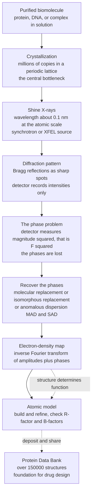

# 🔬 X-Ray Crystallography and Structural Biology

> [!abstract] TL;DR
> **Structure determines function** — you cannot understand how an enzyme cuts, a channel gates, or a drug binds without seeing the atoms. But atoms sit ~0.1 nm apart, thousands of times smaller than the ~500 nm wavelength of visible light, so no microscope can ever resolve them. **X-ray crystallography** solves this by using X-rays whose wavelength *matches* atomic spacings — but because no lens exists for X-rays, we cannot form an image directly. Instead we grow a **crystal** (millions of identical molecules in a periodic lattice) to amplify the faint scattering into sharp spots, record the **diffraction pattern** governed by **Bragg's law** $n\lambda = 2d\sin\theta$, and recognise that this pattern is literally the **Fourier transform of the electron density**. Inverse-transforming it would rebuild the molecule — except detectors record only intensities $|F|^2$ and **throw away the phases**, which carry most of the structural information. This **phase problem** is the central difficulty, cracked by molecular replacement, isomorphous replacement, and anomalous dispersion. Once phased, the Fourier synthesis yields an **electron-density map** into which an atomic model is built and refined. This method revealed the **DNA double helix**, the first proteins (**myoglobin, hemoglobin**), and the **ribosome**, earned more than a dozen Nobel Prizes, filled the **Protein Data Bank** with 150,000+ structures, and remains the highest-resolution window onto the molecular architecture of life.

---

## Intuition

**Analogy:** You cannot photograph a protein. It is far smaller than the wavelength of the light you would use to see it — like trying to make out the shape of a single virus by the glow of a searchlight whose beam is itself a thousand times wider than the thing you are hunting. Detail smaller than a wave's wavelength is simply invisible to that wave. So biophysicists switched illumination: they use **X-rays**, whose wavelength (~0.1 nm) happens to match the spacing between atoms. But now a new problem appears — there are **no lenses for X-rays**. A glass lens bends visible light back together to form an image; nothing bends X-rays that way. So instead of a picture, all you get is a **scatter of bright spots** on a detector — a diffraction pattern — and you must *mathematically* reconstruct the molecule from it.

That reconstruction is like being handed the intricate pattern of shifting shadows a **wind chime** casts on a wall and being asked to rebuild the wind chime itself — every rod, ring, and thread — purely from the shadows. The information is all there, encoded in the interference of the scattered waves, but recovering the object is an inverse problem in disguise. The mathematical machine that inverts it is the **Fourier transform**: the diffraction pattern *is* the Fourier transform of the object's electron density, so transforming it back should hand you the molecule — if only you knew the one thing the detector cannot record.

---

## How It Works

### Core Mechanics

1. **The goal: structure determines function.** All of molecular biology rests on the premise that a biomolecule's three-dimensional atomic arrangement *is* its function — the shape of an enzyme's active site, the groove where a transcription factor grips DNA, the pocket a drug must fill. To understand or manipulate function, you must **see** the structure at atomic resolution. That is the mission of structural biology, and for six decades crystallography was its workhorse.

2. **Why X-rays, not light.** Resolution is limited by wavelength: you cannot resolve features finer than roughly the wavelength you illuminate with. Visible light spans ~400–700 nm; atoms in a molecule are ~0.1 nm (1 Å) apart — a **~5000-fold mismatch**. X-rays with $\lambda \approx 0.5$–$1.5$ Å sit right at the atomic scale. The catch: refractive optics for X-rays essentially do not exist (their refractive index in matter is ~1), so you cannot build an X-ray lens to form an image. You are forced to use **diffraction** and reconstruct computationally.

3. **Crystallization — the central requirement and bottleneck.** A single molecule scatters X-rays far too weakly to detect above noise. The trick is to arrange **millions to trillions** of identical molecules on a regular three-dimensional lattice — a **crystal**. The periodicity makes their scattered waves interfere **constructively** only in sharply defined directions, concentrating the weak signal into intense, measurable **spots**. Growing well-ordered crystals of a floppy, hydrated biomolecule is notoriously difficult — a slow, empirical art of screening thousands of precipitant, pH, and temperature conditions — and it remains the field's rate-limiting step (see the complementary *Cryo_Electron_Microscopy*, which needs no crystal at all).

4. **Diffraction and Bragg's law.** X-rays scatter off the **electron clouds** of atoms (more electrons → stronger scattering). The regularly spaced lattice planes act like a stack of partial mirrors: waves reflected from successive planes reinforce only when their path difference is a whole number of wavelengths. This is **Bragg's law**,
$$n\lambda = 2d\sin\theta,$$
where $d$ is the interplanar spacing, $\theta$ the glancing angle, and $n$ the order. Each family of planes gives a spot (a **reflection**) at a specific angle; large spacings $d$ diffract to small angles (spots near the beam), fine spacings to wide angles. The full pattern of thousands of reflections — their positions *and* intensities — encodes the structure. (This physics is shared with materials science; see [[X_Ray_Diffraction_and_Braggs_Law]] and [[Interference_and_Diffraction]].)

5. **The Fourier relationship — crystallography is applied Fourier analysis.** Each reflection $(h,k,l)$ has a **structure factor** $F_{hkl}$, a complex number whose value is the Fourier transform of the electron density $\rho(\mathbf{r})$ sampled at that lattice point. Conversely, the electron density is the **inverse Fourier transform** of the structure factors:
$$\rho(\mathbf{r}) = \frac{1}{V}\sum_{hkl} F_{hkl}\, e^{-2\pi i(hx+ky+lz)}, \qquad F_{hkl} = |F_{hkl}|\,e^{i\phi_{hkl}}.$$
Measure every $F_{hkl}$, inverse-transform, and you get an **electron-density map** — a 3D contour map showing where the electrons (and hence the atoms) are (see [[Fourier_Transform]] and [[Fourier_Analysis_and_Integral_Transforms]]).

6. **The phase problem — the central difficulty.** Here is the catch. A detector counts **photons**, so it measures **intensities** $I_{hkl} \propto |F_{hkl}|^2$ — it recovers the **amplitudes** $|F_{hkl}|$ but **destroys the phases** $\phi_{hkl}$. And it is the *phases* that carry most of the structural information (see the Python demo: keeping amplitudes but scrambling phases yields noise, while keeping phases but flattening amplitudes still shows the molecule). Recovering the missing phases is **the phase problem**, and the ingenious workarounds are the intellectual heart of the field:
   - **Molecular replacement (MR):** borrow starting phases from an already-known structure of a similar molecule, oriented into the new unit cell.
   - **Isomorphous replacement (MIR):** soak in **heavy atoms** (mercury, platinum, gold) that add strong, localizable scattering, and compare intensity changes to deduce phases.
   - **Anomalous dispersion (MAD/SAD):** tune the X-ray energy near an absorption edge of an atom (often selenium, substituted for sulfur as selenomethionine) so its scattering becomes wavelength-dependent, breaking the phase symmetry.

7. **Resolution, refinement, and validation.** **Resolution** (quoted in Å) is set by how far out in angle measurable spots extend — high-angle spots encode fine detail; 3.5 Å traces the backbone fold, 1.5 Å resolves individual atoms and ordered waters. From an initial map, an **atomic model** is built and then **refined** — iteratively adjusted so its predicted diffraction best matches the observed data. Fit quality is scored by the **R-factor** and the cross-validated **R-free**; per-atom **B-factors** (temperature factors) capture thermal motion and flexibility (high B = blurry, mobile region).

8. **Modern sources and time-resolved crystallography.** Two hardware revolutions transformed the field. **Synchrotrons** deliver brilliant, tunable, highly collimated X-rays that make MAD phasing routine and let tiny crystals diffract. **X-ray free-electron lasers (XFELs)** fire femtosecond pulses so intense they vaporize the sample — but the diffracted photons escape *before* the crystal explodes ("**diffraction before destruction**"), enabling structures from micron-sized crystals and **time-resolved "molecular movies"** that catch enzymes and photoreceptors mid-reaction.

### Flow / Architecture



---

## Key Concepts

### Secondary (intuitive)
- **You can't photograph an atom.** Atoms are far smaller than the wavelength of visible light, so ordinary microscopes can never show them. X-rays are "shorter" waves that match the size of atoms.
- **No X-ray lens, so no direct picture.** Since nothing focuses X-rays, we catch the *scatter* — a pattern of bright dots — and rebuild the molecule with math instead of optics.
- **Why a crystal?** One molecule scatters too faintly to see. Line up millions in a repeating grid and their tiny scattered waves add up into strong, sharp spots. Growing that crystal is the hardest part.
- **Structure is everything.** Seeing the exact 3D shape of a protein or DNA tells you how it works and how a drug might fit it — this is why the double helix and the first protein structures were such landmarks.

### Undergraduate (quantitative)
- **Bragg's law** $n\lambda = 2d\sin\theta$: constructive interference from lattice planes; big $d$ → small angle, fine $d$ → wide angle; the highest-angle spots set the resolution.
- **Structure factor** $F_{hkl} = |F_{hkl}|e^{i\phi_{hkl}}$ is the Fourier component of $\rho(\mathbf{r})$ at reciprocal-lattice point $(h,k,l)$; electron density is the inverse Fourier sum over all reflections.
- **The phase problem:** intensity $I \propto |F|^2$ gives amplitudes but loses phases $\phi$; phases dominate the reconstructed image, so phasing is essential. Methods: **MR**, **MIR**, **MAD/SAD**.
- **Resolution (Å)** is diffraction-limited by the maximum $2\theta$ recorded; ~3 Å = fold and backbone, ~1.2 Å = individual atoms. **R-factor / R-free** measure model-to-data agreement; **B-factors** encode atomic mobility.
- **Sources:** rotating anodes → **synchrotrons** (bright, tunable, enabling MAD) → **XFELs** (femtosecond serial crystallography, diffraction-before-destruction).

### Graduate (advanced)
- **Reciprocal space and the Ewald sphere.** Diffraction samples the Fourier transform of the density on the reciprocal lattice; the Ewald construction predicts which reflections are in diffracting condition as the crystal rotates. The convolution theorem factors the pattern into the molecular transform (continuous) sampled by the lattice (a comb).
- **Anomalous scattering formalism.** Near an absorption edge, $f = f_0 + f' + if''$; the imaginary $f''$ breaks Friedel's law ($|F_{hkl}| \neq |F_{-h-k-l}|$), and the Bijvoet differences yield phase information exploited in MAD/SAD (Hendrickson).
- **Phasing and density modification.** Patterson maps (the FT of intensities, i.e. the autocorrelation of density) locate heavy atoms; solvent flattening, histogram matching, and non-crystallographic-symmetry averaging bootstrap and refine phases.
- **Refinement machinery.** Maximum-likelihood targets, restrained/TLS and anisotropic B-factor models, real-space vs reciprocal-space refinement; over-fitting is policed by R-free and geometry validation (Ramachandran, clashscore).
- **Radiation damage and serial crystallography.** Site-specific photoreduction and global damage limit dose; XFEL **serial femtosecond crystallography** merges single-shot patterns from a stream of microcrystals, and **time-resolved** pump-probe schemes reconstruct reaction trajectories ("molecular movies").
- **Where it sits among methods.** Crystallography gives the **highest resolution** but demands crystals; *Cryo_Electron_Microscopy* handles large, flexible, non-crystallizable complexes; *NMR_and_Magnetic_Resonance_in_Biology* reports **solution dynamics**; and *Computational_Biophysics_and_Molecular_Dynamics* plus AlphaFold now predict and animate what experiments capture statically.

---

## Python Demo

```python
# X-ray crystallography from two angles:
#   PART A - BRAGG'S LAW  n*lambda = 2 d sin(theta): where the spots land
#   PART B - the FOURIER heart of crystallography and THE PHASE PROBLEM:
#            a 2D "molecule" -> its diffraction pattern |F|^2 -> reconstructions
#            showing that losing the PHASES destroys the image, while the phases
#            alone (with flat amplitudes) still reveal the structure.
import numpy as np
import matplotlib.pyplot as plt

# ================================================================
# PART A - BRAGG'S LAW:  n * lambda = 2 d sin(theta)
# ================================================================
wavelength = 1.5406                 # Cu K-alpha X-ray wavelength in angstroms
d = np.linspace(1.0, 8.0, 400)      # lattice-plane spacings d in angstroms

def bragg_two_theta(d_spacing, lam, order):
    """Scattering angle 2*theta (degrees) for a given d, wavelength, order n."""
    s = order * lam / (2.0 * d_spacing)
    s = np.where(s <= 1.0, s, np.nan)          # no reflection when n*lam/2d > 1
    return np.degrees(2.0 * np.arcsin(s))

print("Bragg's law   n*lambda = 2 d sin(theta),   lambda = 1.5406 A (Cu K-alpha)")
for dsp in [1.5, 3.0, 5.0]:
    tt = bragg_two_theta(np.array([dsp]), wavelength, 1)[0]
    print(f"  d = {dsp:4.1f} A  ->  first-order 2-theta = {tt:6.2f} deg")
print("  Large d spacings diffract at SMALL angles (spots near the beam center).\n")

# ================================================================
# PART B - FOURIER RECONSTRUCTION AND THE PHASE PROBLEM
# ================================================================
N = 128
yy, xx = np.mgrid[0:N, 0:N]

def add_atom(rho, cx, cy, weight=1.0, sigma=2.2):
    """Add one Gaussian 'atom' (a blob of electron density) at (cx, cy)."""
    return rho + weight * np.exp(-((xx - cx)**2 + (yy - cy)**2) / (2.0 * sigma**2))

# Build an asymmetric "molecule": point-like atoms forming an L + branch shape
rho = np.zeros((N, N))
atoms = [(40, 40, 1.0), (52, 52, 1.0), (64, 64, 1.3), (76, 64, 1.0),
         (88, 64, 1.0), (64, 76, 1.0), (64, 88, 1.0), (50, 82, 0.8), (84, 46, 0.8)]
for (cx, cy, w) in atoms:
    rho = add_atom(rho, cx, cy, w)

# Structure factors: the diffraction pattern is the Fourier transform of density
F         = np.fft.fftshift(np.fft.fft2(rho))
intensity = np.abs(F) ** 2          # what a DETECTOR measures: |F|^2  (phases lost!)
amplitude = np.abs(F)               # |F|  -> recoverable from intensity
phase     = np.angle(F)             # phi  -> the information a detector THROWS AWAY

# (1) Perfect reconstruction: correct amplitude AND phase -> exact inverse transform
rec_perfect = np.real(np.fft.ifft2(np.fft.ifftshift(amplitude * np.exp(1j * phase))))

# (2) THE PHASE PROBLEM: keep the measured amplitude, but the phases are unknown
rng = np.random.default_rng(0)
rand_phase  = rng.uniform(-np.pi, np.pi, size=F.shape)
rec_nophase = np.real(np.fft.ifft2(np.fft.ifftshift(amplitude * np.exp(1j * rand_phase))))

# (3) Phases carry the structure: correct PHASE but FLAT (uniform) amplitude
rec_phaseonly = np.real(np.fft.ifft2(np.fft.ifftshift(np.exp(1j * phase))))

def corr(a, b):
    a = a - a.mean(); b = b - b.mean()
    return float(np.sum(a * b) / np.sqrt(np.sum(a * a) * np.sum(b * b)))

print("Correlation of each reconstruction with the true molecule:")
print(f"  correct amplitude + correct phase : {corr(rec_perfect,   rho):+.3f}  (perfect)")
print(f"  correct amplitude + RANDOM phase  : {corr(rec_nophase,   rho):+.3f}  (destroyed)")
print(f"  FLAT amplitude   + correct phase  : {corr(rec_phaseonly, rho):+.3f}  (survives)")
print("\n=> PHASES matter more than amplitudes: losing them wrecks the image,")
print("   but keeping only the phases still reveals the molecule.")

# ================================================================
# PLOTS
# ================================================================
fig, ax = plt.subplots(2, 3, figsize=(14, 9))

# (A) Bragg's law: 2-theta vs d for orders n = 1, 2, 3
for n in (1, 2, 3):
    ax[0, 0].plot(d, bragg_two_theta(d, wavelength, n), lw=2, label=f"order n = {n}")
ax[0, 0].set_xlabel("lattice spacing  d  (angstrom)")
ax[0, 0].set_ylabel("scattering angle  2-theta  (deg)")
ax[0, 0].set_title("(A) Bragg's law:  n*lambda = 2 d sin(theta)")
ax[0, 0].legend(); ax[0, 0].grid(alpha=0.3)

# (B) The molecule (true electron density)
ax[0, 1].imshow(rho, cmap="inferno", origin="lower")
ax[0, 1].set_title("(B) The 'molecule' (electron density)")
ax[0, 1].axis("off")

# (C) Diffraction pattern |F|^2 (log-scaled) -- what the detector records
ax[0, 2].imshow(np.log1p(intensity), cmap="viridis", origin="lower")
ax[0, 2].set_title("(C) Diffraction pattern  |F|^2  (log)")
ax[0, 2].axis("off")

# (D) Perfect reconstruction: amplitude + phase
ax[1, 0].imshow(rec_perfect, cmap="inferno", origin="lower")
ax[1, 0].set_title("(D) Reconstruction: amplitude + PHASE\n-> exact")
ax[1, 0].axis("off")

# (E) The phase problem: correct amplitude, random phase
ax[1, 1].imshow(rec_nophase, cmap="inferno", origin="lower")
ax[1, 1].set_title("(E) Amplitude only, phases RANDOM\n-> the phase problem: noise")
ax[1, 1].axis("off")

# (F) Phase-only: correct phase, flat amplitude
ax[1, 2].imshow(rec_phaseonly, cmap="inferno", origin="lower")
ax[1, 2].set_title("(F) PHASE only, flat amplitude\n-> structure survives")
ax[1, 2].axis("off")

plt.tight_layout()
plt.show()
```

**What you should see.** Part A prints and plots how the scattering angle depends on lattice spacing: wide-spaced planes diffract close to the beam, fine-spaced planes far out — and higher orders push the same planes to larger angles until $n\lambda/2d$ exceeds 1 and the reflection vanishes. Part B is the conceptual core: panel (B) is the true "molecule," (C) is its diffraction pattern $|F|^2$ (all a detector ever sees), and (D) shows that inverse-transforming the *complete* structure factors rebuilds it exactly. Then (E) delivers the punchline of the **phase problem** — keep the correct amplitudes but randomize the phases and the reconstruction collapses into meaningless noise — while (F) shows the mirror-image lesson: keep the correct *phases* and throw the amplitudes away entirely (set them all equal), and the molecule is still clearly recognizable. The printed correlations quantify it: **phases carry the structure.**

---

## Real-World Applications

> **Example — the ribosome, and structure-based drug design.** The atomic structure of the **ribosome** (Ramakrishnan, Steitz, Yonath; Nobel Prize in Chemistry 2009) was solved by X-ray crystallography of crystals containing this ~2.5-MDa RNA–protein machine. It did not just confirm that the ribosome is a **ribozyme** (RNA does the catalysis); it revealed exactly *where* antibiotics such as tetracyclines, aminoglycosides, and macrolides bind, and *why* resistance mutations work — turning the structure directly into a template for designing new antibiotics. This is **structure-based drug design** in a nutshell: solve the target's structure, see the active-site pocket, and design a molecule that fits it. HIV protease inhibitors, the leukemia drug imatinib (Gleevec), and countless kinase inhibitors were all guided by crystal structures.

- **The DNA double helix (1953).** Rosalind Franklin's **Photo 51** — an X-ray fiber-diffraction pattern of DNA — showed the tell-tale "X" of a helix and its spacings, the data Watson and Crick used to deduce the double-helix model. The founding image of molecular biology was a diffraction pattern (see [[The_Physics_of_DNA_and_RNA]]).
- **The first protein structures.** **Myoglobin** (Kendrew) and **hemoglobin** (Perutz) — the first atomic protein structures, and the debut of isomorphous replacement phasing (Nobel Prize 1962) — proved proteins have precise, reproducible folds (see [[Protein_Structure_and_Folding]] and [[Protein_Structure_and_Function]]).
- **Membrane proteins and GPCRs.** Crystallizing membrane proteins is brutally hard, yet crystal structures of the **photosynthetic reaction center**, ion channels, and **G-protein-coupled receptors** (Nobel Prizes 1988 and 2012) opened whole drug-target classes.
- **The Protein Data Bank.** More than **150,000 crystal structures** underpin modern biology, bioinformatics, and the training data behind structure-prediction AI.
- **XFEL time-resolved studies.** Serial femtosecond crystallography at facilities like LCLS captures enzymes and photoreceptors *mid-reaction*, producing "molecular movies" of chemistry in flight.

---

## Common Pitfalls

- **Thinking crystallography photographs molecules.** There is no image and no lens. You measure a diffraction pattern and *compute* the structure by Fourier synthesis — after solving the phase problem. Skipping that framing makes the whole method seem like magic.
- **Underestimating the phase problem.** A common misconception is that measuring bright spots gives you the answer. It gives you only $|F|$; the **phases**, which hold most of the information, are lost and must be recovered by MR, MIR, or MAD/SAD. As the demo shows, correct amplitudes with wrong phases yield pure noise.
- **Confusing resolution with accuracy.** High resolution (small Å number) means fine detail is *available*, not that the model is automatically correct. A well-refined 2.0 Å structure can still contain misbuilt loops or wrongly modeled ligands; check R-free, geometry, and the density fit.
- **Ignoring the crystal's artifacts.** A crystal structure is a molecule frozen in a lattice, often at cryogenic temperature, possibly distorted by **crystal-packing contacts** and missing flexible regions (high B-factors or absent density). It is a static, averaged snapshot — not the dynamic solution ensemble that NMR or MD reveals.
- **Assuming the map shows atoms directly.** X-rays scatter off **electrons**, so hydrogen atoms (one electron, often mobile) are usually invisible except at ultra-high resolution, and the map is *electron density*, not ball-and-stick atoms — the model is an interpretation fitted into that density.
- **Treating B-factors as pure temperature.** B-factors lump together thermal vibration, static disorder, and model error; a high B-factor flags an uncertain or mobile region, not simply "warmth."
- **Forgetting the crystallization bottleneck.** If a molecule will not crystallize (many membrane proteins, large flexible complexes, intrinsically disordered proteins), crystallography simply cannot be applied — which is precisely why cryo-EM and prediction methods now complement it.

---

## Related Concepts

- [[X_Ray_Diffraction_and_Braggs_Law]] — the shared physics foundation: Bragg's law, reciprocal lattice, and diffraction in materials science, applied here to biomolecules.
- [[Interference_and_Diffraction]] — the wave-optics origin of why periodic scatterers produce sharp constructive-interference spots.
- [[Fourier_Transform]] — the mathematical engine: the diffraction pattern is the Fourier transform of the electron density, and the map is its inverse.
- [[Fourier_Analysis_and_Integral_Transforms]] — the physics treatment of Fourier synthesis, convolution, and reciprocal space underlying structure factors.
- [[DFT_and_FFT]] — the discrete/fast Fourier transform used numerically (as in the demo) to compute diffraction patterns and density maps.
- [[Crystal_Systems_and_Space_Groups]] — the lattice symmetry and space groups that classify crystals and reduce the data needed to solve them.
- [[Solid_State_and_Crystal_Structures]] — the chemistry of crystalline order that makes coherent diffraction possible.
- [[Electromagnetic_Waves_and_Radiation]] — X-rays as short-wavelength EM waves scattering off electron clouds.
- [[Protein_Structure_and_Folding]] — the biophysics sibling: the folds that crystallography reveals and that structure determines function.
- [[The_Physics_of_DNA_and_RNA]] — the double helix, whose structure was first read from Franklin's X-ray diffraction (Photo 51).
- [[Protein_Structure_and_Function]] — the chemistry of secondary/tertiary structure that crystal structures visualize atom by atom.
- [[Proteins_and_Amino_Acids]] — the building blocks whose arrangement the electron-density map traces.
- [[NMR_Spectroscopy]] — the complementary technique for solution structures and dynamics, contrasted with crystallography's high-resolution but crystal-bound view.
- [[Single_Molecule_Biophysics]] — the ensemble-averaging contrast: crystallography averages over trillions of molecules; single-molecule methods watch one at a time.
- [[Scales_Units_and_Orders_of_Magnitude_in_Biophysics]] — why the ~0.1 nm atomic scale demands X-ray wavelengths in the first place.

---

## Review Questions

1. **(Secondary / conceptual)** Why can't an ordinary light microscope ever show the individual atoms of a protein, and what two changes does X-ray crystallography make to get around this? In plain terms, why do we need a *crystal* rather than a single molecule?
2. **(Undergraduate / quantitative)** State Bragg's law and explain how the diffraction pattern relates to the electron density via the Fourier transform. Then explain the **phase problem**: what does a detector actually measure, what is lost, and why does that loss matter more than losing the amplitudes? Name two methods used to recover the phases.
3. **(Graduate / trade-off)** You have a 200 kDa membrane-protein complex you want to see at atomic resolution, but it resists crystallization; a smaller soluble domain crystallizes but only diffracts to 3.2 Å. Compare X-ray crystallography, cryo-EM, and NMR for this project — addressing resolution, sample requirements, dynamics, and phasing — and explain how anomalous dispersion (SAD/MAD) and an XFEL with microcrystals might change your strategy. Where would a predicted AlphaFold model help, and where would it not substitute for experiment?

---

## Sources

- Bragg, W. L. (1913). "The Structure of Some Crystals as Indicated by Their Diffraction of X-rays." *Proc. R. Soc. Lond. A* 89, 248–277.
- Kendrew, J. C. et al. (1958). "A Three-Dimensional Model of the Myoglobin Molecule Obtained by X-Ray Analysis." *Nature* 181, 662–666. (See also Perutz et al., *Nature* 185, 416, 1960.)
- Watson, J. D. & Crick, F. H. C. (1953). "Molecular Structure of Nucleic Acids." *Nature* 171, 737–738. (Franklin & Gosling, *Nature* 171, 740 — Photo 51.)
- Rupp, B. (2009). *Biomolecular Crystallography: Principles, Practice, and Application to Structural Biology*. Garland Science.
- Chapman, H. N. et al. (2011). "Femtosecond X-ray protein nanocrystallography." *Nature* 470, 73–77. (Diffraction-before-destruction at an XFEL.)

---

#biophysics #x-ray-crystallography #structural-biology #diffraction #phase-problem
