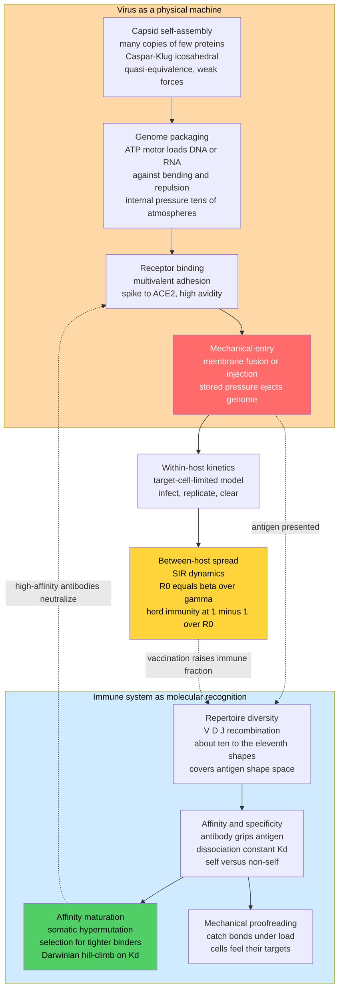

# 🦠 Biophysics of Infectious Disease and Immunity

> [!abstract] TL;DR
> Infection and immunity are, at bottom, a **contest of forces, shapes, and self-assembly** — a physical drama that runs beneath the familiar molecular and genetic story. A virus is a triumph of biological nanotechnology: a **self-assembling nanoparticle** whose **capsid** is built from many copies of a few proteins following strict geometric symmetry rules (Caspar–Klug icosahedral quasi-equivalence), which packs its genome so tightly that **internal pressures reach tens of atmospheres** — a coiled spring loaded by a molecular motor against electrostatic self-repulsion — and then uses that stored pressure to **mechanically inject** its genome into a host cell after multivalent **receptor binding** (spike–ACE2) and membrane fusion. The immune system answers with **molecular recognition**: antibodies and T-cell receptors that must physically *grip* an antigen's shape with the right **affinity** ($K_d$), a repertoire of **~10^11 different shapes** generated by combinatorial V(D)J recombination to cover "shape space", **affinity maturation** that Darwinian-ally hill-climbs toward tighter binders in germinal centers, and even **mechanical proofreading** where cells pull on bonds to test them. This biophysical view — self-assembly, packaging pressure, binding affinity, epidemic thresholds — powers structure-based vaccine design, antibody therapeutics, antivirals, and quantitative prediction of spread and viral escape.

---

## Intuition

**Analogy:** A virus is a marvel of physical engineering. Think of it as a **self-assembling nanoparticle that packs its genome under enormous pressure — like winding a coiled spring into a tiny box — and then injects that spring into a cell with real mechanical force.** The protein shell snaps together on its own from a handful of identical parts, the way soap molecules spontaneously form a bubble; a molecular motor then crams a charged, stiff strand of DNA or RNA into the shell until it pushes back at tens of atmospheres; and when the virus docks onto the right cell, that stored pressure helps fire the genome inside like a loaded syringe.

The immune system, in turn, plays a **staggering matching game.** It generates *billions* of different antibody shapes ahead of time so that, whatever invader shows up, *some* of them will physically grip it — a lock-and-key search run in parallel across an enormous library of keys. Then it does something even cleverer: cells "feel out" the binding strength of a threat, pulling on the bond to check it is real, and they *evolve* better binders in real time by mutation and selection. So infection and immunity are not just chemistry and genetics — they are self-assembly, stored elastic energy, adhesion forces, and an evolutionary optimization, all playing out at the nanometre scale.

---

## How It Works

### Core Mechanics

Read the infection–immunity cycle as a sequence of **physical operations**, each governed by forces, energies, and geometry rather than by biology alone.

1. **Capsid self-assembly (geometry + weak forces).** A viral shell is not manufactured part-by-part on an assembly line; it **self-assembles** from many copies of a few coat proteins, driven by weak interactions (hydrophobic contact, hydrogen bonds, electrostatics) that individually are only a few $k_B T$ but collectively lock a stable cage. **Caspar–Klug theory** explains why so many capsids are **icosahedral**: an icosahedron is the closest a protein lattice can come to tiling a sphere with identical subunits, and **quasi-equivalence** lets the same protein sit in *slightly* different bonding environments so shells of $60T$ subunits (triangulation number $T = 1, 3, 4, 7, \dots$) can form. This is programmed nanotechnology written into the shape of a protein.

2. **Genome packaging under pressure (a loaded spring).** DNA and RNA are stiff, uniformly negatively charged polymers that *resist* being crammed into a tiny shell — bending energy plus electrostatic self-repulsion fights compaction. Many double-stranded DNA phages and herpesviruses use a powerful **packaging motor** (an ATP-driven terminase) to force the genome in against this resistance until the interior reaches **tens of atmospheres of pressure** — among the strongest molecular motors known, generating tens of piconewtons. The packaged genome is literally a **compressed spring** storing elastic and electrostatic energy.

3. **Receptor binding and mechanical entry (adhesion + injection).** The virus finds its host by **specific, multivalent adhesion** — many weak spike–receptor contacts (for example SARS-CoV-2 **spike binding ACE2**) that together make a strong, selective grip, the biophysics of avidity. Entry then proceeds by **membrane fusion** (enveloped viruses, driven by spring-loaded fusion-protein conformational changes) or **mechanical penetration** — and for pressurized phages, the stored packaging pressure helps **eject** the genome into the cell, a mechanical injection.

4. **Within-host dynamics (target-cell kinetics).** Once inside, replication and clearance become a **quantitative dynamical system**. A target-cell-limited model tracks susceptible cells, infected cells, and free virus; whether the infection grows or is cleared depends on a within-host reproduction number, exactly analogous to the epidemic threshold below.

5. **Between-host spread (epidemic thresholds).** Zoom out to a population and contagion obeys **SIR-type dynamics**. The **basic reproduction number** $R_0 = \beta / \gamma$ (new infections per infectious individual in a fully susceptible population) sets a sharp threshold: $R_0 > 1$ means an outbreak grows, $R_0 < 1$ means it dies out. The **herd-immunity threshold** is $1 - 1/R_0$: once that fraction is immune, each case infects fewer than one other on average and the epidemic recedes.

6. **Immune recognition as molecular binding (affinity + discrimination).** Immunity is fundamentally about **binding and discrimination**. An antibody or T-cell receptor must physically recognize an antigen's shape, and the strength of that grip is the **affinity**, quantified by the dissociation constant $K_d$ — the antigen concentration at which half the receptors are bound. Low $K_d$ means tight binding; the challenge of self/non-self discrimination is to bind pathogen shapes hard while *not* binding the body's own molecules.

7. **Repertoire diversity and shape space (covering all antigens).** The physical problem is combinatorial: to bind *any* possible antigen, the body pre-generates an enormous library of receptor shapes via **V(D)J recombination**, mixing gene segments to reach **on the order of 10^11 distinct antibodies**. Picture antigens as points in an abstract **"shape space"**; each antibody covers a small ball around the shapes it binds, and diversity must be large enough that the balls **cover the whole space** so no invader escapes recognition.

8. **Affinity maturation as optimization (Darwin in miniature).** The pre-made repertoire only needs a *rough* match. In **germinal centers**, B cells whose antibodies bind an antigen undergo **somatic hypermutation** and are **selected for tighter binding** — a literal round-by-round **Darwinian optimization** that **hill-climbs a binding landscape**, driving effective $K_d$ from micromolar down to nanomolar or picomolar. The immune system is an *evolving* system on a timescale of days.

9. **Mechanical immunology (forces test bonds).** Recognition is not purely chemical. T cells and immune cells **exert and sense forces** on their targets: **catch bonds** counter-intuitively grow *stronger* under load, giving **mechanical proofreading** that sharpens discrimination between a real antigen and a look-alike; the **immunological synapse** organizes under mechanical tension; and phagocytes physically feel and engulf their prey. Immune cells literally *pull on* a threat to check it is real.

These threads connect to the wider Biophysics vault: the self-assembly and folding physics of *Protein_Structure_and_Folding*, the piconewton force tools that measure packaging motors and catch bonds in *Single_Molecule_Biophysics*, and the yet-to-be-written siblings *Systems_Biophysics_and_Gene_Networks* (the within-host regulatory dynamics), *Physics_of_Cancer* (another arena of forces, evolution, and clonal selection), and *DNA_Nanotechnology_and_Synthetic_Biophysics* (engineering the same self-assembly that viruses perfected).

### Flow / Architecture



---

## Key Concepts

### Secondary Level

- **A virus builds itself.** No factory assembles a virus part by part — the protein shell **snaps together on its own** from copies of a few proteins, the way soap film spontaneously forms a bubble. That is self-assembly.
- **The genome is a loaded spring.** Many viruses jam their DNA so tightly inside the shell that it **pushes back with the pressure of a bicycle tyre** many times over, and that pressure helps shoot the genome into the cell.
- **Immunity is a shape-matching game.** Your body makes **billions of different antibody shapes** in advance, so that whatever germ arrives, some antibody will fit it like a key in a lock.
- **Practice makes tighter.** Once an antibody roughly fits an invader, the body **tweaks and improves it** over days until it grips much more tightly — evolution happening inside you.
- **Outbreak or fizzle.** If each sick person infects **more than one** other on average, the disease spreads; **fewer than one**, and it dies out. That tipping number is $R_0$.

### Undergraduate Level

- **Caspar–Klug and triangulation number.** Icosahedral capsids contain $60T$ subunits with $T \in \{1,3,4,7,\dots\}$; **quasi-equivalence** lets one protein occupy nearly-equivalent lattice sites so a closed shell forms. This geometry is *why* so many unrelated viruses look alike.
- **Packaging energetics.** Compaction fights **bending stiffness** (persistence length ~50 nm for dsDNA) and **electrostatic self-repulsion** of the phosphate backbone; the terminase motor does work against both, storing energy that manifests as **tens of atm** of internal pressure and tens of pN of motor force.
- **Binding isotherm and $K_d$.** Fraction of receptor bound is $f = \dfrac{[A]}{[A] + K_d}$; the **dissociation constant** $K_d = k_{\text{off}}/k_{\text{on}}$ equals the antigen concentration giving half-occupancy. **Avidity** from multivalency makes many weak contacts behave like one strong one.
- **$R_0$ and herd immunity.** For SIR, $R_0 = \beta/\gamma$. Threshold behaviour: $R_0>1$ → epidemic, $R_0<1$ → die-out. Vaccinating a fraction $\ge 1 - 1/R_0$ pushes the *effective* reproduction number below 1 — the **herd-immunity threshold**.
- **Repertoire as covering.** With ~$10^{11}$ antibody specificities, each covering a small region of "shape space", the repertoire is engineered to **cover the space of possible antigens** — a coverage/statistics problem, not a lookup table.

### Graduate Level

- **Pressure and ejection dynamics.** Continuum models treat the packaged genome as an inverse-spool of charged, bent polymer; the **internal force** grows steeply near full packaging, and *in vitro* ejection experiments (osmotic suppression) confirm that external osmotic pressure can halt ejection — direct evidence the driving force is stored mechanical pressure.
- **Within-host target-cell model.** $\dot T = -\beta T V$, $\dot I = \beta T V - \delta I$, $\dot V = pI - cV$; the **within-host $R_0 = \dfrac{\beta p T_0}{\delta c}$** governs initial exponential growth, and the interplay of viral production $p$, infected-cell death $\delta$, and clearance $c$ sets peak viral load and set-point.
- **Bell/catch bonds and kinetic proofreading.** Slip bonds obey $k_{\text{off}}(F)=k_0 e^{F\Delta x^{\ddagger}/k_BT}$, but **catch bonds** *decrease* $k_{\text{off}}$ over a force window; combined with **kinetic proofreading** (a chain of reversible steps requiring sustained binding), force gives T cells extraordinary discrimination between high- and low-affinity ligands differing only slightly in $K_d$.
- **Affinity maturation as an evolutionary algorithm.** Germinal-center selection is a $(\mu,\lambda)$-style **mutation–selection** loop climbing a $K_d$ landscape; the trade-off between mutation rate and selection stringency, and the risk of **local optima** and **antigenic escape**, mirror optimization theory and connect to fitness-landscape ideas.
- **Shape space and coverage statistics.** Perelson–Oster "shape space" formalizes antigen recognition as overlap in a low-dimensional space; a minimal repertoire size emerges from requiring that random receptor balls cover the space with high probability — an early quantitative theory of why $\sim 10^6$–$10^7$ distinct clones per individual suffices despite $10^{11}$ potential specificities.
- **Structure-based design.** Stabilizing viral fusion proteins in a **prefusion conformation** (the 2P-stabilized spike behind mRNA COVID vaccines) is applied conformational biophysics: lock the metastable, high-free-energy state that displays the best neutralizing epitopes.

---

## Python Demo

```python
# Biophysics of infection and immunity, two physical stories in one figure:
#
#  (A) EPIDEMIC THRESHOLD (SIR model): the reproduction number R0 = beta/gamma
#      sets a sharp threshold. R0 > 1 -> outbreak grows; R0 < 1 -> dies out.
#      The herd-immunity threshold is 1 - 1/R0.
#
#  (B) ANTIBODY BINDING + AFFINITY MATURATION: binding fraction vs antigen
#      concentration follows f = C/(C+Kd). Affinity maturation is an EVOLUTIONARY
#      optimization (mutate + select tighter binders) that hill-climbs Kd downward
#      from micromolar to nanomolar over successive germinal-center rounds.
#
# Requires: numpy, matplotlib
import numpy as np
import matplotlib.pyplot as plt

rng = np.random.default_rng(1)

# =====================================================================
# (A) SIR epidemic dynamics and the R0 threshold
# =====================================================================
def sir(R0, gamma=0.2, N=1.0, I0=1e-4, days=200, dt=0.1):
    """Integrate SIR with RK4. beta = R0*gamma. Returns t, S, I, R."""
    beta = R0 * gamma
    def rhs(y):
        S, I, _ = y
        infect = beta * S * I / N
        recover = gamma * I
        return np.array([-infect, infect - recover, recover])
    steps = int(days / dt)
    t = np.arange(steps) * dt
    Y = np.zeros((steps, 3))
    y = np.array([N - I0, I0, 0.0])
    for k in range(steps):
        Y[k] = y
        k1 = rhs(y)
        k2 = rhs(y + 0.5 * dt * k1)
        k3 = rhs(y + 0.5 * dt * k2)
        k4 = rhs(y + dt * k3)
        y = y + (dt / 6.0) * (k1 + 2*k2 + 2*k3 + k4)
    return t, Y[:, 0], Y[:, 1], Y[:, 2]

t1, S1, I1, R1 = sir(R0=2.5)   # outbreak
t2, S2, I2, R2 = sir(R0=0.8)   # dies out
herd = 1.0 - 1.0 / 2.5          # herd-immunity threshold for R0 = 2.5

# =====================================================================
# (B1) Binding isotherm: fraction bound vs antigen concentration, f = C/(C+Kd)
# =====================================================================
C = np.logspace(-11, -4, 300)          # antigen concentration (Molar)
Kd_naive   = 1e-6                       # weak, first-responder antibody (uM)
Kd_matured = 1e-9                       # high-affinity, matured antibody (nM)
f_naive   = C / (C + Kd_naive)
f_matured = C / (C + Kd_matured)

# =====================================================================
# (B2) Affinity maturation as evolutionary hill-climbing on the Kd landscape
#      Each round: somatic hypermutation (perturb log Kd) + selection (keep the
#      tightest binders = lowest Kd) + clonal expansion. Effective Kd falls.
# =====================================================================
n_clones = 400
rounds = 14
logKd = rng.normal(np.log10(1e-6), 0.4, n_clones)   # naive repertoire ~ 1 uM
best_Kd, median_Kd = [], []
for _ in range(rounds):
    logKd = logKd + rng.normal(0.0, 0.30, n_clones)  # somatic hypermutation
    keep = np.argsort(logKd)[: n_clones // 2]        # select tightest half (low Kd)
    logKd = np.concatenate([logKd[keep], logKd[keep]])  # clonal expansion (2x)
    best_Kd.append(10 ** logKd.min())
    median_Kd.append(10 ** np.median(logKd))
rounds_ax = np.arange(1, rounds + 1)

# =====================================================================
# PLOTS
# =====================================================================
fig, ax = plt.subplots(2, 2, figsize=(13, 9))

# (A) outbreak: R0 = 2.5
ax[0, 0].plot(t1, S1, label="Susceptible", color="#4a9eff", lw=2)
ax[0, 0].plot(t1, I1, label="Infected",    color="#ff6b6b", lw=2)
ax[0, 0].plot(t1, R1, label="Recovered",   color="#51cf66", lw=2)
ax[0, 0].axhline(herd, ls="--", color="k", lw=1)
ax[0, 0].text(5, herd + 0.02, f"herd-immunity threshold 1-1/R0 = {herd:.2f}", fontsize=8)
ax[0, 0].set_title("(A) SIR outbreak: R0 = 2.5 > 1")
ax[0, 0].set_xlabel("time (days)"); ax[0, 0].set_ylabel("population fraction")
ax[0, 0].legend(fontsize=8)

# (A) threshold comparison: infected curve for R0>1 vs R0<1
ax[0, 1].plot(t1, I1, color="#ff6b6b", lw=2, label="R0 = 2.5  (grows: outbreak)")
ax[0, 1].plot(t2, I2, color="#845ef7", lw=2, label="R0 = 0.8  (decays: dies out)")
ax[0, 1].set_title("(A) The R0 = 1 threshold decides outbreak vs die-out")
ax[0, 1].set_xlabel("time (days)"); ax[0, 1].set_ylabel("infected fraction")
ax[0, 1].legend(fontsize=8)

# (B1) binding isotherms: matured antibody binds at far lower concentration
ax[1, 0].semilogx(C, f_naive,   color="#ffa94d", lw=2, label=f"naive   Kd = {Kd_naive:.0e} M")
ax[1, 0].semilogx(C, f_matured, color="#20c997", lw=2, label=f"matured Kd = {Kd_matured:.0e} M")
ax[1, 0].axhline(0.5, ls=":", color="gray", lw=1)
ax[1, 0].axvline(Kd_naive,   ls="--", color="#ffa94d", lw=1)
ax[1, 0].axvline(Kd_matured, ls="--", color="#20c997", lw=1)
ax[1, 0].set_title("(B) Binding isotherm f = C / (C + Kd): tighter = leftward shift")
ax[1, 0].set_xlabel("antigen concentration (M)"); ax[1, 0].set_ylabel("fraction bound")
ax[1, 0].legend(fontsize=8)

# (B2) affinity maturation: effective Kd falls over germinal-center rounds
ax[1, 1].semilogy(rounds_ax, best_Kd,   "o-", color="#e64980", lw=2, label="best clone Kd")
ax[1, 1].semilogy(rounds_ax, median_Kd, "s-", color="#4263eb", lw=2, label="median clone Kd")
ax[1, 1].set_title("(B) Affinity maturation = Darwinian hill-climb on Kd")
ax[1, 1].set_xlabel("germinal-center round"); ax[1, 1].set_ylabel("effective Kd (M, log)")
ax[1, 1].legend(fontsize=8)

plt.tight_layout()
plt.savefig("infection_immunity_biophysics.png", dpi=130)

# --- Console summary ---
print("=== Epidemic threshold (SIR) ===")
print(f"R0 = 2.5 -> final epidemic size (recovered) = {R1[-1]*100:.1f}% of population")
print(f"R0 = 0.8 -> final epidemic size (recovered) = {R2[-1]*100:.1f}% (dies out)")
print(f"Herd-immunity threshold for R0=2.5 = 1 - 1/R0 = {herd:.2f}")
print("\n=== Affinity maturation ===")
print(f"Naive best Kd   ~ {best_Kd[0]:.2e} M")
print(f"Matured best Kd ~ {best_Kd[-1]:.2e} M")
print(f"Affinity improved by ~ {best_Kd[0]/best_Kd[-1]:.0f}-fold over {rounds} rounds")
```

Running this prints an outbreak that infects most of the population when $R_0 = 2.5$ but a curve that decays to nothing when $R_0 = 0.8$ — the **sharp threshold at $R_0 = 1$** — and it shows the **herd-immunity fraction $1 - 1/R_0 = 0.6$**. The binding panels show that **affinity maturation** shifts the isotherm left by orders of magnitude (a matured antibody reaches half-occupancy at ~1000× lower antigen concentration) and that the effective $K_d$ **hill-climbs downward** round after round — a literal Darwinian optimization inside a germinal center.

---

## Real-World Applications

> **Example — Prefusion-stabilized spike and the COVID-19 mRNA vaccines.** The SARS-CoV-2 **spike** protein is a metastable molecular machine: it springs from a high-energy **prefusion** shape to a low-energy **postfusion** shape to drive membrane fusion. The prefusion form displays the epitopes that elicit the best neutralizing antibodies, but it is unstable and tends to collapse. Structure-based design solved this by introducing **two proline substitutions (2P)** that lock the spike in its prefusion conformation — pure applied conformational biophysics. That stabilized antigen is what the Moderna and Pfizer–BioNTech mRNA vaccines instruct cells to make, and it is why the immune response targets the right shape. This is the biophysical picture behind *Infectious_Disease_Vaccines_and_Immunity* made concrete.

Other production-scale uses:

- **Antibody therapeutics and affinity engineering.** Monoclonal-antibody drugs (for cancer, autoimmunity, and antivirals) are optimized *in vitro* by **directed evolution** — phage/yeast display that mimics affinity maturation, driving $K_d$ into the picomolar range. The binding-isotherm and maturation physics in the demo is exactly what antibody engineers tune.
- **Antivirals that jam viral machinery.** Fusion inhibitors, capsid assembly modulators (for hepatitis B and HIV), and packaging-motor/terminase inhibitors (letermovir for cytomegalovirus) all attack a *physical* step — blocking assembly, entry, or the pressurized packaging that the biophysics reveals.
- **Structure-based vaccine and immunogen design.** Beyond spike, **epitope scaffolding** and **nanoparticle vaccines** exploit self-assembly to array many antigen copies for high-avidity B-cell activation — using the same Caspar–Klug-style symmetry principles that build capsids.
- **Predicting spread and control policy.** SIR/SEIR models with estimated $R_0$ guide vaccination targets via $1 - 1/R_0$, quantify the impact of interventions, and forecast hospital load — the epidemic-threshold mathematics in real public-health practice (*Public_Health_and_Epidemiology*).
- **Forecasting viral escape.** Mapping how mutations shift **binding affinity** and epitope shape lets researchers anticipate immune-escape variants and update vaccines — quantitative host–pathogen coevolution, linked to the evolutionary dynamics of *Molecular_Evolution_and_Phylogenetics*.
- **Single-molecule and cryo-EM measurement.** Optical/magnetic tweezers measure phage packaging-motor force directly, and cryo-EM resolves capsid symmetry and spike conformations — the instruments of *Single_Molecule_Biophysics* applied to viruses.

---

## Common Pitfalls

- **Treating a virus as "just chemistry".** The genome is not passively floating inside — it is **under tens of atmospheres of pressure**, storing mechanical energy that does work during ejection. Ignoring capsid mechanics and packaging forces misses how entry actually happens.
- **Confusing affinity with avidity.** A single antibody arm may bind weakly ($K_d$), yet a bivalent antibody or a multivalent surface binds with far greater **avidity** because many weak contacts must break at once. Reporting a monovalent $K_d$ for a multivalent interaction badly underestimates real binding strength.
- **Reading $R_0$ as a fixed constant of the pathogen.** $R_0 = \beta/\gamma$ depends on **contact behaviour and environment**, not just the virus. The same pathogen has different $R_0$ across settings, so herd-immunity thresholds ($1 - 1/R_0$) shift too — and the *effective* $R_t$ falls as immunity accumulates.
- **Assuming a bigger repertoire always wins.** Diversity must **cover shape space**, but binding *everything* would also bind self. The immune system trades coverage against tolerance; naive "more antibodies is better" reasoning ignores self/non-self discrimination and autoimmunity.
- **Modeling affinity maturation as smooth hill-climbing.** Real binding landscapes are **rugged**: somatic hypermutation can get stuck in **local optima**, and pathogens **move the landscape** by mutating epitopes (antigenic escape). Selection stringency that is too high collapses diversity prematurely.
- **Forgetting mechanical forces in recognition.** Equilibrium $K_d$ alone does not explain T-cell discrimination; **catch bonds and kinetic proofreading** under force let cells separate ligands whose affinities differ only slightly. A purely thermodynamic view understates the immune system's precision.

---

## Related Concepts

- [[Viruses]] — the molecular/genetic account of capsids, envelopes, and replication that this note reframes as self-assembly, pressure, and mechanical entry.
- [[The_Adaptive_Immune_System]] — antibodies, B and T cells, and V(D)J diversity, here viewed as molecular binding, shape-space coverage, and affinity maturation.
- [[The_Innate_Immune_System]] — the first-line, non-specific defenses that precede and shape the physical recognition contest.
- [[Vaccines_and_Antibiotics]] — the biology of vaccination whose structure-based, conformation-stabilizing design this note grounds in biophysics.
- [[Protein_Structure_and_Folding]] — the folding and conformational-change physics behind capsid proteins, spike fusion machines, and antibody shapes.
- [[Single_Molecule_Biophysics]] — the optical/magnetic tweezers and force spectroscopy that measure packaging-motor forces and immune catch bonds.
- [[Intermolecular_Forces_and_the_Aqueous_Environment]] — the weak interactions (hydrophobic, electrostatic, hydrogen-bond) driving self-assembly and antigen binding.
- [[Molecular_Motors_and_Mechanochemistry]] — the ATP-driven terminase packaging motors that load viral genomes against enormous resistance.
- [[The_Physics_of_DNA_and_RNA]] — the bending stiffness and electrostatic self-repulsion of nucleic acids that make packaging so costly.
- [[Membranes_and_Lipid_Bilayers]] — the host membranes that enveloped viruses fuse with and steal, and where the immunological synapse forms.
- [[Statistical_Mechanics_of_Biomolecules]] — the binding free energies and Boltzmann statistics behind $K_d$, avidity, and conformational stability.
- [[Cell_Motility_and_Adhesion]] — the adhesion and force-sensing machinery underlying multivalent receptor binding and mechanical immunology.
- [[Infectious_Disease_Vaccines_and_Immunity]] — the public-health companion covering immunity, vaccines, and disease at the applied level.
- [[Public_Health_and_Epidemiology]] — the population-scale SIR/$R_0$ modeling and herd-immunity mathematics used to guide policy.
- [[Molecular_Evolution_and_Phylogenetics]] — the viral-evolution and host–pathogen coevolution framework behind immune escape and vaccine updates.
- [[Natural_Selection_and_Adaptation]] — the mutation-and-selection engine that affinity maturation runs on fast-forward inside germinal centers.
- [[Network_Dynamics_and_Contagion]] — spreading processes on contact networks that generalize the well-mixed SIR threshold.
- [[Evolutionary_Dynamics_and_Fitness_Landscapes]] — the rugged-landscape view of affinity maturation as hill-climbing with local optima.
- [[Evolutionary_Stable_Strategies]] — the evolutionary-game-theory lens on host–pathogen coevolution and virulence.
- [[Replicator_Dynamics]] — selection dynamics of competing clones, mirroring germinal-center competition among B cells.
- [[Systems_of_ODEs]] — the coupled differential equations that define both within-host and SIR epidemic models.
- [[Probability_Theory]] — the combinatorial and coverage statistics behind repertoire diversity and shape space.

---

## Review Questions

**Secondary**
1. Using the "coiled spring" and "shape-matching game" analogies, explain in your own words two ways infection and immunity are *physical* problems and not just chemistry: one about how a virus gets its genome into a cell, and one about how the body prepares to recognize an invader it has never seen.

**Undergraduate**
2. A pathogen has $R_0 = 4$. (a) What fraction of the population must be immune to stop sustained spread, and where does that formula come from? (b) A naive antibody has $K_d = 1\ \mu\text{M}$ and its matured descendant has $K_d = 1\ \text{nM}$. Using $f = [A]/([A]+K_d)$, at an antigen concentration of $10\ \text{nM}$, roughly what fraction of each antibody is bound, and what does the difference say about why affinity maturation matters for neutralization?

**Graduate**
3. Explain how **catch bonds** plus **kinetic proofreading** let a T cell discriminate between two ligands whose equilibrium $K_d$ values differ only modestly, and why an equilibrium-affinity-only model fails to predict this precision. Then connect this to affinity maturation as an optimization: why are **rugged binding landscapes** and **antigenic escape** the reasons a virus and the immune system remain locked in coevolution, and how does that shape vaccine-update strategy?

---

## Sources

- Caspar, D. L. D., & Klug, A. (1962). "Physical principles in the construction of regular viruses." *Cold Spring Harbor Symposia on Quantitative Biology*, 27, 1–24.
- Smith, D. E., Tans, S. J., Smith, S. B., Grimes, S., Anderson, D. L., & Bustamante, C. (2001). "The bacteriophage phi29 portal motor can package DNA against a large internal force." *Nature*, 413, 748–752.
- Perelson, A. S., & Oster, G. F. (1979). "Theoretical studies of clonal selection: minimal antibody repertoire size and reliability of self–non-self discrimination." *Journal of Theoretical Biology*, 81(4), 645–670.
- Anderson, R. M., & May, R. M. (1991). *Infectious Diseases of Humans: Dynamics and Control.* Oxford University Press.
- Pallesen, J., Wang, N., Corbett, K. S., et al. (2017). "Immunogenicity and structures of a rationally designed prefusion MERS-CoV spike antigen." *PNAS*, 114(35), E7348–E7357.
- Phillips, R., Kondev, J., Theriot, J., & Garcia, H. (2012). *Physical Biology of the Cell* (2nd ed.). Garland Science. (Chapters on viruses and receptor–ligand binding.)

---

#biophysics #virology #immunology #antibody-affinity #viral-mechanics
