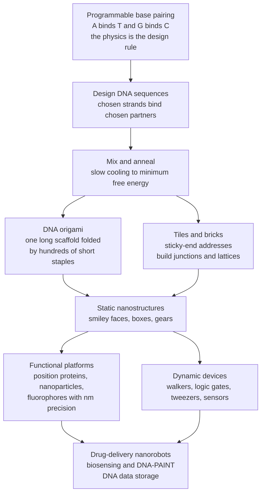

# 🧬 DNA Nanotechnology and Synthetic Biophysics

> [!abstract] TL;DR
> **DNA nanotechnology** hijacks life's information molecule and uses it as the most **programmable nanoscale construction material** ever discovered — not for the genes it encodes, but for the fact that its base pairing (A-T, G-C) is **predictable and designable**. Because you know in advance which sequence will bind which, you can write sequences that make chosen strands find their partners and **self-assemble** — driven by hybridization thermodynamics and locked in by slow **annealing** — into essentially any shape. The workhorse is **DNA origami** (Rothemund, 2006): fold one long viral "scaffold" strand into a smiley face, box, or gear using hundreds of short "staple" strands, each pulling distant parts of the scaffold together. Beyond static shapes, DNA can be built into **dynamic machines** — walkers that step along tracks, **strand-displacement logic gates** that compute, and reconfigurable tweezers and sensors. These structures **position other molecules** (proteins, nanoparticles, fluorophores) with nanometre precision, enabling plasmonics, single-molecule rulers, and super-resolution (DNA-PAINT); as **nanorobots** they deliver drugs on molecular cues; and, separately, DNA is an ultra-dense, long-lived medium for **digital data storage**. The whole enterprise embodies **synthetic biophysics** — the credo, after Feynman, that *what I cannot build, I do not understand*.

---

## Intuition

**Analogy:** DNA's most famous job is storing genetic information — but it turns out to be the world's best construction material at the nanoscale. Because A always pairs with T and G always with C, DNA behaves like **programmable Velcro**: design the sequences correctly and the strands will spontaneously find their matching partners and **fold a long DNA strand into any shape you want** — a smiley face, a hollow box, even a nanoscale robot — simply by mixing them in a tube and letting physics assemble them. We have taken life's information molecule and turned it into a self-building 3D printer.

The trick is that the *specificity is already written into the physics*. To build with LEGO you must decide by hand where each brick clicks; with DNA you just choose the sequences, and the molecules sort themselves into place because only the correct partners stick. The engineer's job moves from *placing parts* to *designing sequences* — and the assembly runs itself, thermodynamically driven, in a warm test tube.

---

## How It Works

### The paradigm shift: DNA as a building material

For decades DNA was studied only as the carrier of genetic information. **Nadrian ("Ned") Seeman** made the conceptual leap in the early 1980s: what if you used DNA purely as a **structural, self-assembling material** and ignored the meaning of the sequence entirely? The double helix is the most *controllable* nanoscale building block known because its interactions are **predictable from first principles** — you do not have to discover empirically which strand binds which, you can *compute* it from the Watson-Crick rules. This is the founding slogan of the field: **the physics is the design rules.**

### Why DNA is the ideal nanomaterial

The physical properties that make DNA a superb structural medium (developed as mechanics in the sibling note [[The_Physics_of_DNA_and_RNA]]):

1. **Programmable, specific binding.** A pairs only with T, G only with C. Choose a 20-base sequence and you have specified, in advance, the *unique* complementary strand that will bind it — nothing else sticks appreciably. Specificity is designed, not discovered.
2. **Known, rigid geometry.** B-form DNA is a well-characterised rod: about **2 nm wide**, **0.34 nm per base**, and **~10.5 base pairs per helical turn**. Over lengths shorter than its ~50 nm persistence length it behaves as a stiff strut, so you can predict where every helix and crossover will sit in 3D.
3. **Self-assembly driven by thermodynamics.** Hybridization (two complementary strands zipping into a duplex) releases free energy; the correct, fully-paired structure is the **minimum-free-energy** state, so the system *wants* to assemble into the design if you let it relax.
4. **A four-letter, addressable alphabet.** Four bases give a combinatorially huge space of orthogonal (mutually non-binding) sequences, so many distinct parts can coexist in one pot without cross-talk.

The **aqueous, ionic environment matters intimately**: the phosphate backbone is negatively charged, so assembly requires counterions (typically **Mg²⁺**) to screen the repulsion and let helices pack — a point developed in the sibling [[Intermolecular_Forces_and_the_Aqueous_Environment]].

### Structural DNA nanotechnology: junctions, tiles, and sticky-end addresses

Seeman's building blocks were **branched junctions** — synthetic analogues of the Holliday junction — that let DNA go beyond a linear duplex into two- and three-dimensional connectivity. Rigid **tiles** (e.g. double-crossover "DX" tiles) present short single-stranded overhangs called **sticky ends**. A sticky end is a programmable **address**: it will hybridize only to its complement, so tiles snap together in a predetermined pattern to build **periodic lattices** and larger objects.

The addressing power is combinatorial. An overhang of **n bases** has **4ⁿ** possible sequences, giving up to **4ⁿ unique, orthogonal addresses** — a 6-base sticky end already offers 4096 distinguishable connections. This exponential address space is what lets a single pot of hundreds of distinct components each find its one correct neighbour.

### DNA origami: fold one scaffold with many staples

The field's breakthrough was **Paul Rothemund's DNA origami (2006)**. Take one long single strand — typically the **~7,250-base genome of the M13 bacteriophage** — as a **scaffold**, and design **~200 short "staple" strands** (~32 bases each). Each staple is complementary to *two or more separated regions* of the scaffold, so when it binds it **pulls those distant regions together**, folding the scaffold back and forth like rows of raster-scanned wire. Choose the staple sequences and you dictate the fold. Simply **mix scaffold plus staples and anneal**, and the object assembles itself: Rothemund made nanoscale **smiley faces, stars, and maps**; the approach was quickly extended to boxes, gears, and complex curved 3D objects. Origami is the **workhorse** of the field because it is robust, high-yield, and fully addressable — every staple is a unique pixel you can extend or decorate.

### The thermodynamics of assembly: annealing to the designed minimum

Assembly is governed by **hybridization thermodynamics**. Each duplex has a **melting temperature $T_m$** — the temperature at which half of it is paired — that rises with **length** and **GC content** (G-C pairs bring three hydrogen bonds and stronger base stacking than A-T's two). Design exploits this: to reach the *correct, global* minimum-free-energy structure rather than a kinetically trapped tangle, you **anneal** — heat everything above all $T_m$'s to melt every mispairing, then **cool slowly** so that components lock in **hierarchically**, high-$T_m$ (long/GC-rich) contacts first, weak sticky-end closures last. Good design also *avoids* misfolding by choosing sequences with **minimal unintended complementarity** (no accidental hairpins or off-target pairings). This programmed, thermally-driven search for the designed minimum is the physics of self-assembly in action — the same statistical-mechanics machinery of cooperativity and two-state transitions treated in [[Statistical_Mechanics_of_Biomolecules]].

### Dynamic DNA devices: machines that move and compute

DNA is not only structure but **machine**. Beyond static shapes lie **dynamic devices**:

- **DNA walkers / motors** — a strand with "legs" that steps processively along a track of complementary footholds, powered by hybridization or by a nicking enzyme burning its track.
- **Strand-displacement circuits** — the core primitive of **DNA computation**. An invading strand binds a short single-stranded **toehold** and then, branch-migration by branch-migration, *displaces* an incumbent strand from a duplex. Cascades of toehold-mediated displacement implement **logic gates (AND, OR, NOT), amplifiers, and even neural-network-style classifiers** entirely in DNA, with no protein or electronics.
- **Tweezers and reconfigurable structures** — devices that open and close in response to a fuel strand, ion, or pH change, converting a molecular signal into mechanical motion.

Here DNA is simultaneously the wire, the gate, and the moving part.

### Functional nanostructures: positioning matter with nanometre precision

Because origami is a fully **addressable pegboard** (each staple a known coordinate), it can **organise *other* molecules** with nanometre accuracy. Extend chosen staples with capture handles and you can **place proteins, gold nanoparticles, quantum dots, or fluorophores** at prescribed positions — building plasmonic antennas and chiral photonic devices, arranging **enzyme cascades** so intermediates channel from one active site to the next, or holding two single molecules a defined distance apart for **single-molecule FRET rulers**. In super-resolution microscopy, **DNA-PAINT** uses transient binding of dye-labelled "imager" strands to origami docking sites as blinking fiducials, achieving nanometre-scale localisation.



---

## Key Concepts

**Secondary (foundations)**
- DNA can be used as a *building material*, not just as a carrier of genes.
- Because A always pairs with T and G with C, you can **design** strands so that the right pieces stick to the right partners.
- Mix designed strands in a tube, cool slowly, and they **self-assemble** into a chosen shape — DNA origami folds one long strand into smiley faces and boxes.
- DNA machines can also **move** (walkers) and even **compute** (logic gates).

**Undergraduate (mechanism)**
- **Sticky ends as addresses:** an n-base overhang gives **4ⁿ** unique, orthogonal bindings that direct assembly.
- **DNA origami:** one ~7 kb viral **scaffold** folded by ~200 short **staple** strands, each stapling distant scaffold regions together.
- **Annealing:** heat above all $T_m$'s, then cool slowly so contacts form hierarchically and the system reaches the designed **minimum-free-energy** structure; avoids kinetic traps and misfolds.
- **$T_m$ design:** melting temperature rises with **length** and **GC content**; you tune sequences so parts assemble in a chosen order and at a chosen temperature.
- **Strand displacement:** toehold-mediated branch migration is the primitive behind DNA logic gates and DNA walkers.
- **Mg²⁺** counterions screen the charged backbone so helices can pack.

**Graduate (quantitative and frontier)**
- **Nearest-neighbor thermodynamics:** sequence-dependent $\Delta H, \Delta S$ per base-pair step (SantaLucia parameters) predict $T_m$ from $T_m = \Delta H / (\Delta S + R\ln(C_T/x))$ for a bimolecular duplex at total strand concentration $C_T$.
- **Sequence design as constraint satisfaction:** minimise unintended complementarity (secondary structure, crosstalk) while maximising on-target stability — the basis of tools like caDNAno, NUPACK, and oxDNA coarse-grained simulation.
- **Kinetics vs thermodynamics of folding:** origami yield depends on annealing rate; isothermal folding and staple cooperativity reveal a rugged landscape with a dominant folding transition.
- **Strand-displacement kinetics:** toehold length sets rate constants over ~6 orders of magnitude, enabling programmable reaction networks and seesaw-gate circuits (Qian & Winfree).
- **Wireframe and curved origami, and single-stranded tiles / DNA "bricks"** for modular, LEGO-like 3D assembly (Ke, Yin).
- **DNA data storage:** channel and source coding over the {A,C,G,T} alphabet with error-correcting codes to counter synthesis/sequencing errors — extreme density (~10^18 bytes/mm³) and millennia-scale longevity.

---

## Python Demo

```python
# DNA nanotech DESIGN PHYSICS in four panels:
#   A) Tm DESIGN MAP        -- melting temperature vs strand length and GC content
#   B) MELTING CURVES       -- designed strands assemble at different temperatures
#   C) ADDRESS SPACE        -- an n-base sticky end gives 4^n unique addresses
#   D) ANNEALING SCHEDULE   -- components lock in hierarchically as temperature drops
# Requires: numpy, matplotlib
import numpy as np
import matplotlib.pyplot as plt

R = 1.987  # gas constant in cal / (mol K)

# ============================================================
# Simple nearest-neighbor / two-state hybridization model.
# Per base pair we assign average enthalpy/entropy contributions; GC pairs
# (3 H-bonds + stronger stacking) are more stabilizing than AT pairs (2 H-bonds).
# For a bimolecular duplex at total strand concentration C_T:
#     Tm = dH_total / ( dS_total + R * ln(C_T / 4) )
# and the fraction of strands paired follows a two-state curve that is 0.5 at Tm.
# ============================================================
def per_bp(gc):
    dH_bp = (1 - gc) * (-7000.0) + gc * (-10000.0)   # cal/mol per base pair
    dS_bp = (1 - gc) * (-20.5)   + gc * (-22.5)       # cal/(mol K) per base pair
    return dH_bp, dS_bp

def Tm_celsius(N, gc, C_T=1e-6):
    dH_bp, dS_bp = per_bp(gc)
    Tm_K = (N * dH_bp) / (N * dS_bp + R * np.log(C_T / 4.0))
    return Tm_K - 273.15

def bound_fraction(T_C, N, gc, C_T=1e-6):
    # two-state bound fraction; dG = 0 at Tm  ->  f = 0.5 at Tm
    dH_bp, dS_bp = per_bp(gc)
    dH, dS = N * dH_bp, N * dS_bp
    T_K = T_C + 273.15
    dG = dH - T_K * dS + R * T_K * np.log(C_T / 4.0)   # cal/mol
    K = np.exp(-dG / (R * T_K))
    return K / (1.0 + K)

# ---------- Panel A data: Tm design map -----------------------------
lengths = np.arange(5, 41)                       # 5 to 40 base pairs
gc_values = [0.30, 0.50, 0.70]

# ---------- Panel B data: melting curves for 3 designed strands -----
T_axis = np.linspace(10, 100, 400)
designs = [("8-mer sticky end (50% GC)",  8,  0.50),
           ("16-mer staple  (50% GC)",   16,  0.50),
           ("24-mer staple  (60% GC)",   24,  0.60)]

# ---------- Panel C data: sticky-end address space ------------------
n_bases = np.arange(1, 13)
addresses = 4.0 ** n_bases

# ---------- Panel D data: hierarchical annealing schedule -----------
# Four component classes with staggered Tm's; as we COOL from 90 C the
# high-Tm core forms first, the sticky-end closure last.
components = [("Scaffold core (long, GC-rich)", 30, 0.60),
             ("Primary staples",                20, 0.55),
             ("Secondary staples",              14, 0.50),
             ("Sticky-end closure",              8, 0.45)]
T_cool = np.linspace(90, 20, 400)                # temperature falling left->right

# ============================== plotting ============================
fig, ax = plt.subplots(2, 2, figsize=(13, 9))
fig.suptitle("DNA Nanotechnology: the design physics of programmed self-assembly",
             fontsize=14, fontweight="bold")

# A. Tm vs length for several GC contents
axA = ax[0, 0]
colors = ["#4a9eff", "#51cf66", "#ff6b6b"]
for gc, c in zip(gc_values, colors):
    axA.plot(lengths, [Tm_celsius(N, gc) for N in lengths], lw=2.2, color=c,
             label=f"{int(gc*100)}% GC")
axA.set_xlabel("strand length (base pairs)")
axA.set_ylabel("melting temperature  Tm  (C)")
axA.set_title("A. Tm DESIGN MAP\nlonger + more GC  ->  binds first / hotter")
axA.legend(loc="lower right")
axA.grid(alpha=0.3)

# B. melting curves for designed strands
axB = ax[0, 1]
for (name, N, gc), c in zip(designs, colors):
    f = bound_fraction(T_axis, N, gc)
    axB.plot(T_axis, f, lw=2.2, color=c, label=name)
    axB.axvline(Tm_celsius(N, gc), ls="--", color=c, alpha=0.5)
axB.axhline(0.5, ls=":", color="gray")
axB.set_xlabel("temperature (C)")
axB.set_ylabel("fraction of strands paired")
axB.set_title("B. MELTING CURVES\ndesign sets the assembly temperature")
axB.legend(loc="lower left", fontsize=8)
axB.grid(alpha=0.3)

# C. address space 4^n
axC = ax[1, 0]
axC.semilogy(n_bases, addresses, "o-", lw=2.2, color="#845ef7")
axC.set_xlabel("sticky-end length  n  (bases)")
axC.set_ylabel("unique addresses = 4^n  (log scale)")
axC.set_title("C. ADDRESS SPACE\nn-base overhang -> 4^n orthogonal bindings")
for n in (4, 6, 8):
    axC.annotate(f"4^{n} = {4**n:,}", (n, 4**n),
                 textcoords="offset points", xytext=(6, -4), fontsize=8)
axC.grid(alpha=0.3, which="both")

# D. hierarchical annealing schedule (cool from 90 -> 20 C)
axD = ax[1, 1]
for (name, N, gc), c in zip(components, colors + ["#ffa94d"]):
    f = bound_fraction(T_cool, N, gc)
    axD.plot(T_cool, f, lw=2.2, color=c, label=f"{name} (Tm={Tm_celsius(N,gc):.0f} C)")
axD.set_xlim(90, 20)                              # reversed axis: cooling ->
axD.set_xlabel("temperature during anneal (C)   [cooling ->]")
axD.set_ylabel("fraction assembled")
axD.set_title("D. ANNEALING SCHEDULE\ncomponents lock in as T drops through their Tm")
axD.legend(loc="upper right", fontsize=7.5)
axD.grid(alpha=0.3)

plt.tight_layout(rect=[0, 0, 1, 0.96])
plt.show()

# Console sanity check
print("Tm of an 8-base sticky end (50% GC):  %.1f C" % Tm_celsius(8, 0.50))
print("Tm of a 20-base staple    (50% GC):  %.1f C" % Tm_celsius(20, 0.50))
print("A 6-base sticky end provides 4^6 = %d unique addresses" % (4**6))
```

Running this reproduces the two facts an origami designer lives by. **First**, $T_m$ is a *tunable design knob*: it climbs with both length and GC content (panels A and B), so by choosing sequences you decide *which* contacts form *first* and *at what temperature* — the basis of programmable, ordered self-assembly. **Second**, sticky ends are an exponentially rich addressing system (panel C): even a 6-base overhang gives 4,096 orthogonal connections, enough to give every one of hundreds of staples its own unique docking instruction. Panel D shows the payoff — during a slow anneal the strong, GC-rich core assembles at high temperature and the weak sticky-end closures snap shut last, so the structure builds itself hierarchically toward the designed minimum.

---

## Real-World Applications

- **Targeted drug delivery (DNA nanorobots).** A famous 2012 origami "**logic-gated nanorobot**" (Douglas, Bachelet & Church) is a barrel that stays clamped shut by aptamer locks and springs open to expose an antibody payload *only* when it detects the right molecular cue on a cell surface — targeted release by molecular logic. Related work uses tubular origami to deploy thrombin at tumour blood vessels.
- **Super-resolution and single-molecule rulers (DNA-PAINT).** Origami with docking strands at known spacings are the calibration standards and imaging probes of nanometre-precision fluorescence microscopy; they also hold two molecules a defined distance apart for FRET.
- **Photonics and plasmonics.** Origami positions gold nanoparticles or dyes into chiral and antenna geometries, building nanoscale optical elements bottom-up.
- **Enzyme cascades and nanoreactors.** Placing sequential enzymes at controlled separations on a scaffold channels intermediates and boosts multi-step reaction efficiency.
- **Biosensing and diagnostics.** Strand-displacement circuits and reconfigurable structures transduce the presence of a specific nucleic-acid or protein target into an amplified optical or electronic signal.
- **Molecular computation.** Toehold-mediated strand-displacement cascades implement logic gates, amplifiers, and even small winner-take-all neural-network classifiers entirely in DNA.
- **DNA data storage.** Digital files are encoded in synthesised {A,C,G,T} sequences and read back by sequencing, offering density around $10^{18}$ bytes per mm³ and stability over millennia — Microsoft/UW and others have stored and retrieved megabytes this way; the coding theory is the biological face of [[Information_Theory_in_Biology_and_Neuroscience]].

---

## Common Pitfalls

- **"DNA nanotech is about genetics."** It uses DNA *only* as a structural, self-assembling material; the sequence's biological meaning is irrelevant — what matters is which strand binds which. Conflating the two misses the entire paradigm shift.
- **Skipping the anneal (or cooling too fast).** Assembly must find a *global* minimum. Quenching traps the system in misfolded, kinetically-locked structures; slow annealing lets contacts form hierarchically by $T_m$. Ramp rate is a real experimental parameter.
- **Ignoring unintended complementarity.** Two "unrelated" strands can share a short accidental complement and form hairpins or off-target duplexes, corrupting the design. Sequence design must *minimise crosstalk*, not just maximise on-target stability — this is what NUPACK/caDNAno checks.
- **Forgetting the counterions.** The backbone is highly charged; without enough **Mg²⁺** (or high monovalent salt) the helices repel and origami will not fold or will fall apart. $T_m$ and structural integrity are salt-dependent.
- **Treating GC content and length as interchangeable.** Both raise $T_m$, but GC content changes stability *per base* (stacking + an extra H-bond) while length adds contacts; conflating them gives wrong assembly orders.
- **Assuming rigidity at all scales.** DNA is stiff only below ~50 nm (its persistence length); large origami sheets can twist, bend, and warp, which is why wireframe and multilayer designs exist to control global shape.
- **Overstating in-vivo readiness.** Naked DNA nanostructures face nucleases, immune recognition, and low stability in serum; therapeutic use needs coatings or chemical protection — an open engineering problem shared with [[Nanomedicine_and_Drug_Delivery_Systems]].

---

## Related Concepts

- [[The_Physics_of_DNA_and_RNA]] — the polymer mechanics, base stacking, and melting thermodynamics ($T_m$, worm-like chain) that this note turns into design rules.
- [[Intermolecular_Forces_and_the_Aqueous_Environment]] — hydrogen bonding, base stacking, and the counterion screening that make DNA hybridization and helix packing possible.
- [[Membranes_and_Lipid_Bilayers]] — a *different* self-assembling biomolecular material; origami is increasingly used to sculpt and gate lipid membranes (nanopores, membrane channels).
- [[Statistical_Mechanics_of_Biomolecules]] — the two-state transitions, cooperativity, and partition functions behind melting curves and folding yields.
- [[Nanofabrication_and_Self_Assembly]] — the broader materials-science view of bottom-up self-assembly that DNA nanotech is the most programmable example of.
- [[Nanomedicine_and_Drug_Delivery_Systems]] — where DNA nanorobots sit within targeted-delivery and diagnostic nanotechnology.
- [[Nanoparticles_and_Colloidal_Systems]] — the gold nanoparticles and quantum dots that origami scaffolds position for plasmonics and photonics.
- [[Synthetic_Biology_and_Metabolic_Engineering]] — the sibling engineering discipline of *building* biological systems, from the genetic/circuit side.
- [[Genetics/01_Molecular_Genetics/DNA_Structure_and_Replication|DNA Structure and Replication]] — helix geometry (~2 nm, 0.34 nm/base, 10.5 bp/turn) and base pairing from the molecular-genetics side.
- [[Nucleic_Acids]] — the chemical structure of the bases and backbone underlying every design.
- [[Nucleic_Acids_and_the_Central_Dogma]] — base pairing and complementarity as biochemistry.
- [[PCR_and_DNA_Sequencing]] — hybridization and $T_m$ design shared with primers, plus the sequencing used to *read back* DNA data storage.
- [[Chemical_Bonding_and_Molecular_Geometry]] — the hydrogen bonds and van der Waals/π interactions that make base pairing specific and stacking strong.
- [[Information_Theory_in_Biology_and_Neuroscience]] — the coding-theory view of DNA as an information channel, central to DNA data storage.

> The Biophysics siblings *Systems_Biophysics_and_Gene_Networks* (engineered gene circuits and synthetic cells) and *The_Reach_and_Future_of_Biophysics* (the "build it to understand it" frontier) extend the synthetic-biophysics theme touched on here; both are planned notes not yet written.

---

## Review Questions

**Secondary.** In one sentence, explain how you could get a long strand of DNA to fold into a specific shape — such as a smiley face — just by mixing molecules in a tube. Why does A-T, G-C pairing make this possible?

**Undergraduate.** You are designing an origami whose core should form at high temperature and whose closing sticky ends should snap shut only near the end of the anneal. Using the ideas that $T_m$ rises with length and GC content and that a slow anneal builds structure hierarchically, describe concretely how you would choose the sequences (length, GC content) of the core staples versus the sticky-end closures, and why quenching instead of slowly cooling would ruin the assembly.

**Graduate.** (a) An n-base sticky end gives $4^n$ addresses, but real designs cannot use all of them. Explain what constraints (unintended complementarity, $T_m$ uniformity, secondary structure) shrink the usable address set, and how a design tool searches for an orthogonal sequence set. (b) A toehold-mediated strand-displacement gate's rate can be tuned over ~6 orders of magnitude. Explain the mechanism (toehold binding then branch migration) and how toehold length gives this control, then sketch how you would wire two such gates into an AND operation.

---

## Sources

- Seeman, N. C. (1982). "Nucleic acid junctions and lattices." *Journal of Theoretical Biology*, 99(2), 237-247. — the founding paper of structural DNA nanotechnology.
- Rothemund, P. W. K. (2006). "Folding DNA to create nanoscale shapes and patterns." *Nature*, 440, 297-302. — the DNA origami breakthrough.
- Douglas, S. M., Bachelet, I., & Church, G. M. (2012). "A logic-gated nanorobot for targeted transport of molecular payloads." *Science*, 335(6070), 831-834.
- Qian, L., & Winfree, E. (2011). "Scaling up digital circuit computation with DNA strand displacement cascades." *Science*, 332(6034), 1196-1201.
- SantaLucia, J. (1998). "A unified view of polymer, dumbbell, and oligonucleotide DNA nearest-neighbor thermodynamics." *PNAS*, 95(4), 1460-1465. — the $T_m$ / hybridization thermodynamics used in the demo.
- Church, G. M., Gao, Y., & Kosuri, S. (2012). "Next-generation digital information storage in DNA." *Science*, 337(6102), 1628. — DNA as a data-storage medium.

---

#biophysics #DNA-nanotechnology #DNA-origami #self-assembly #synthetic-biology
