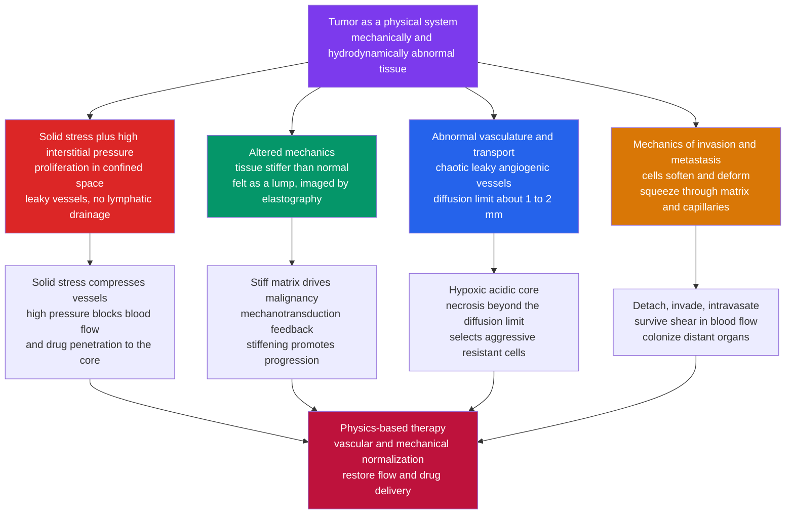

# 🦀 The Physics of Cancer

> [!abstract] TL;DR
> Cancer is usually told as a story of **broken genes** — but it is also, inseparably, a story of **broken physics**. Alongside the genetic hallmarks sits a set of **physical hallmarks**: a tumor is a **mechanically and hydrodynamically abnormal tissue**. It is **stiffer** than the surrounding tissue (which is why a lump is *palpable* and why **elastography** can image it), yet — paradoxically — the individual metastatic cells within it often become **softer and more deformable**, the better to squeeze through tissue. Runaway proliferation in a confined space builds up **solid stress** that physically **compresses the tumor's own blood and lymph vessels**, and leaky vessels with no working lymphatic drainage raise the **interstitial fluid pressure (IFP)** to a near-uniform high plateau across the tumor core. Together these **crush the vasculature and stall transport**, so blood flow is poor and **drugs cannot penetrate to the center** — a leading reason chemotherapy fails. A tumor also outgrows its supply: without new vessels it stalls at the **diffusion limit** of ~1–2 mm, then triggers chaotic **angiogenesis** and lives in a **hypoxic, acidic** microenvironment that selects the most aggressive clones. Metastasis is a **physical journey**: cancer cells must detach, deform to invade the extracellular matrix (even squeezing their own nucleus through pores), intravasate, survive the **shear forces** of blood flow, and colonize. Reading cancer as a **physical system** — forces, stiffness, pressure, and flow — yields new diagnostics (elastography), new strategies (**vascular and mechanical "normalization"**, Jain), and a mechanistic complement to the genetic and **evolutionary** ([[Cancer_and_Evolutionary_Medicine]]) pictures.

---

## Intuition

**Analogy:** When a doctor presses on your abdomen feeling for a "mass," they are doing physics — probing tissue **stiffness** with their fingertips. A tumor betrays itself as a *hard lump* because it is mechanically different: denser, stiffer, more pressurized than the soft healthy tissue around it. Now picture that lump from the inside. It is like an overcrowded room where too many people keep pushing in: the walls bulge, the doorways (blood vessels) get **squeezed shut**, and the air (oxygen, nutrients, drugs) can't circulate to the middle. Everyone in the center is starving and gasping — and, worse, the crowd is so tightly packed and pressurized that anything you try to deliver from outside simply **can't push its way in** against the pressure.

That crowded, high-pressure room is a tumor read as a **physical system**. Cancer is not *only* a genetic accident inside individual cells; it is a place where **forces, stiffness, pressure, and flow have all gone wrong**. The stiff matrix pushes cells toward malignancy; the built-up mechanical stress crushes the very vessels the tumor grew to feed itself; the elevated fluid pressure blocks the drugs meant to kill it; and the deadliest cells respond by going physically **rogue** — softening themselves so they can deform, invade, and flow away to distant organs. Seeing cancer this way explains things genetics alone cannot: *why* you can feel a lump, *why* good drugs fail to reach their target, and *how* cells physically break free and spread.

---

## How It Works

Classical oncology reads cancer through **mutations** — oncogenes stuck "on," tumor suppressors switched "off" (the genetic story in [[Cancer_and_the_Cell_Cycle]] and [[Cancer_Genetics_and_Oncogenes]]). **Physical oncology** — the *physical sciences–oncology* movement launched by the NIH/NCI in 2009 — adds a complementary layer: the tumor as a **material** and a **fluid system** governed by mechanics and transport. These are the **physical hallmarks of cancer**.

### 1. Altered mechanics — tumors are stiff, invasive cells are soft

At the **tissue** scale, a tumor is typically **several-fold stiffer** than the tissue it grew from. Healthy breast stroma has an elastic (Young's) modulus of roughly 1–2 kPa; a breast carcinoma can reach 10–40 kPa. This stiffening comes from **collagen deposition and cross-linking** (a desmoplastic reaction) plus high cell density, and it is exactly the signal a clinician feels as a lump and that **elastography** turns into an image (see Diagnostic Physics below). The mechanics build on the same continuum ideas as [[Stress_Strain_and_Elastic_Moduli]]: stress, strain, and modulus, now applied to living tissue.

Crucially, stiffness is not a passive readout — it is a **driver**. A stiff extracellular matrix (ECM) is *sensed* by cells through **mechanotransduction**: integrin adhesions and the actomyosin cortex (see [[The_Cytoskeleton_and_Cell_Mechanics]]) pull on the matrix, and stiffer matrix → higher cytoskeletal tension → activation of pathways (e.g. **YAP/TAZ**) that promote proliferation and malignancy. This closes a vicious **feedback loop**: tumor growth stiffens the matrix, and the stiffer matrix pushes more cells toward a malignant, invasive phenotype.

The **paradox** of cancer mechanics: while the *tissue* stiffens, many *individual metastatic cells become softer and more deformable* (lower cortical stiffness, measured as reduced $G'$). A softer, more fluid cell can change shape to **squeeze through** the tiny gaps of the matrix and through capillaries — cell softness is a mechanical *enabler* of invasion, not a sign of health. Stiffness is measured cell-by-cell with **atomic force microscopy (AFM)** indentation and **optical stretchers**, and tissue-wide with elastography.

### 2. Solid stress and interstitial fluid pressure — the tumor crushes itself

Cells proliferating inside a **confined**, elastic tissue cannot expand freely, so they store mechanical energy as **solid stress** — the residual force locked into the tumor's *solid* components (cells + matrix), distinct from fluid pressure. Cut a tumor and it visibly springs open, releasing this stored stress. Solid stress can reach **kilopascals** and is large enough to **compress blood and lymphatic vessels shut**, throttling perfusion from the inside.

Layered on top is **interstitial fluid pressure (IFP)**. Tumor vessels are **leaky** (they lack tight walls), so plasma floods the interstitium; meanwhile tumors have **no functional lymphatics** to drain it. Fluid accumulates until pressure builds to a **near-uniform high plateau across the tumor core**, dropping steeply only at the rim. This has two brutal consequences for therapy:

- With interstitial pressure nearly equal to microvascular pressure, there is almost **no pressure gradient** to drive fluid (and dissolved drug) *out* of vessels into the tumor — **convection stalls**.
- At the rim the pressure gradient points *outward*, so fluid oozes **away** from the tumor, carrying drug and antigens with it and pushing cells toward invasion.

The result is a **transport barrier**: large drugs and nanoparticles that rely on convection **cannot reach the center**. This is a physics problem, and it has a physics-based fix — **vascular normalization** (Rakesh Jain): judicious anti-angiogenic dosing prunes the chaotic vessels toward a more normal architecture, *lowering* IFP and solid stress and *restoring* flow so drugs penetrate. Mechanical "normalization" (e.g. depleting excess matrix) does the same by relieving solid stress.

### 3. Angiogenesis, the diffusion limit, and transport

Oxygen and nutrients reach cells only by **diffusion** from vessels, and diffusion is *slow over distance* (see [[Diffusion_and_Brownian_Motion_in_Cells]]). A solid tumor with no blood supply of its own can therefore grow only until its center starves — the **diffusion limit**, a tumor **~1–2 mm** across. To grow beyond it, a tumor must recruit its own blood supply by secreting factors (VEGF) that trigger **angiogenesis**. But tumor-induced vessels are **chaotic, leaky, tortuous, and poorly connected** — the opposite of orderly capillary beds — so perfusion is uneven, flow can even reverse, and large regions stay **hypoxic**. Blood flow through this abnormal network obeys the same viscous-flow physics as [[Fluid_Dynamics_in_Biology]] and [[Viscous_Fluids_and_Navier_Stokes]], but with compressed, collapsing vessels the transport is catastrophically worse than in healthy tissue. Transport physics — diffusion plus convection plus consumption — governs growth rate, the size of the **hypoxic/necrotic core**, and drug delivery all at once.

### 4. Growth dynamics — physics of resource limits

Because growth is capped by supply, tumor volume does **not** grow exponentially forever. It follows a **sigmoidal** law that decelerates as the tumor outstrips its blood/nutrient supply — a **physical/resource constraint**. Two standard models: the **logistic** law $\dot V = rV(1 - V/K)$ and the widely used **Gompertz** law $\dot V = bV\ln(K/V)$, both saturating at a carrying capacity $K$. The Gompertz curve fits many real tumors and underlies dosing schedules and the "Norton–Simon" rationale in chemotherapy. Growth is thus not just biology but **constrained physics**: a self-limiting process set by transport.

### 5. The mechanics of metastasis — a physical journey

Metastasis kills ~90% of cancer patients, and every step is a **physical** ordeal (the machinery is detailed in [[Cell_Motility_and_Adhesion]] and [[The_Cytoskeleton_and_Cell_Mechanics]]):

1. **Detach & invade.** A cell loosens its adhesions, softens, and uses actin protrusions plus matrix-degrading enzymes to push into the ECM — often **squeezing through pores smaller than its own nucleus**, physically deforming that stiff nucleus (nuclear envelope rupture and DNA damage can follow).
2. **Intravasate.** It crosses the vessel wall into the bloodstream.
3. **Survive circulation.** In flowing blood it faces **fluid shear stress** and violent deformation in narrow capillaries; most circulating tumor cells die from mechanical stress. Survivors travel as a physical suspension.
4. **Arrest & extravasate.** It lodges where it physically fits (capillary size, adhesion), then squeezes back out.
5. **Colonize.** It must survive and grow in a mechanically foreign tissue.

Force and deformation gate every step — metastasis is as much a problem of **mechanics** as of genetics.

### 6. The tumor microenvironment as a physical ecosystem

Matrix **stiffness**, **hypoxia**, low **pH** (the acidic Warburg microenvironment), interstitial **pressure**, and mechanical **forces** together form a physical ecosystem that shapes cell behavior and *selects* for aggressive, resistant clones. This is precisely where the physical picture meets the **evolutionary/game-theory** view: the microenvironment is the selective "game board," and strategies like **adaptive therapy** exploit it — see [[Cancer_and_Evolutionary_Medicine]].



---

## Key Concepts

### Secondary Level

- **A lump is physics you can feel.** A tumor is *stiffer* than the tissue around it, which is why a doctor can feel it and why special ultrasound (elastography) can "see" stiffness.
- **The tumor crushes its own plumbing.** As cancer cells cram into a tight space they build up pressure that squeezes their blood vessels shut, so the middle of the tumor is starved of oxygen — and drugs can't get in.
- **A tumor can't grow big without a blood supply.** Diffusion only feeds cells a millimeter or two deep, so tumors have to trick the body into growing them new (leaky, messy) blood vessels.
- **Spreading is a physical journey.** To metastasize, a cancer cell has to soften, squeeze through tissue, survive being tossed around in the bloodstream, and settle somewhere new — a gauntlet of forces.

### Undergraduate Level

- **Tissue vs cell stiffness.** Tumor *tissue* stiffens (Young's modulus rising from ~1–2 kPa to tens of kPa via collagen cross-linking), while many invasive *cells* soften — measured by **AFM** indentation, optical stretchers, and **elastography**.
- **Mechanotransduction feedback.** Stiff ECM → higher integrin/actomyosin tension → YAP/TAZ activation → proliferation and matrix remodeling → still stiffer ECM. Stiffness is a *cause*, not just a symptom.
- **Solid stress vs interstitial fluid pressure (IFP).** Solid stress is residual force in the cell/matrix scaffold (a tumor springs open when cut); IFP is the elevated *fluid* pressure from leaky vessels + no lymphatics. Both compress vessels and block transport.
- **Transport = diffusion + convection.** Small molecules diffuse; large drugs/nanoparticles rely on convection, which needs a pressure gradient. High, flat IFP kills the gradient, so big agents stall at the rim (the **Péclet number** $\mathrm{Pe}=vL/D$ decides which mode dominates).
- **Diffusion limit & critical radius.** With diffusivity $D$, surface concentration $C_s$, and consumption rate $A$, a tumor's oxygen center falls to zero at a critical radius $R_{\text{crit}}=\sqrt{6DC_s/A}$ — a fraction of a millimeter — beyond which a **necrotic core** forms and angiogenesis is required.
- **Growth laws.** Logistic $\dot V=rV(1-V/K)$ and **Gompertz** $\dot V=bV\ln(K/V)$ both give sigmoidal, resource-limited growth saturating at carrying capacity $K$.

### Graduate Level

- **Steady-state IFP (Baxter–Jain).** In a spherical tumor with uniform hydraulic conductivity, IFP obeys a modified Helmholtz equation whose solution is $p(r)=1-\dfrac{R}{r}\dfrac{\sinh(\alpha r)}{\sinh(\alpha R)}$ (dimensionless), where $\alpha=\sqrt{L_p (S/V)/K_t}$ mixes vascular leakiness $L_p S/V$ and interstitial hydraulic conductivity $K_t$. For $\alpha R\gg1$ the pressure is a **flat high plateau** ($p\to1$) across the core, with all gradient — and hence all convective outflow — concentrated in a thin peripheral shell.
- **Drug penetration & the Thiele modulus.** Steady reaction–diffusion of a drug consumed at first order in a sphere, $D\,r^{-2}\,\partial_r(r^2\partial_r C)=kC$, gives $C(r)=C_s\dfrac{R}{r}\dfrac{\sinh(\phi r/R)}{\sinh\phi}$ with **Thiele modulus** $\phi=R\sqrt{k/D}$. Center delivery $C(0)/C_s=\phi/\sinh\phi\to 0$ for large $\phi$: rapid uptake plus slow diffusion confines the drug to an outer shell.
- **Solid-stress mechanics.** Growth-induced stress is modeled with a **multiplicative decomposition** of the deformation gradient into elastic and *growth* parts, $F=F_e F_g$; residual (incompatible growth) stress compresses intratumoral vessels and stores strain energy that relaxes on cutting. Estimated intratumoral solid stresses reach ~1–20 kPa.
- **Mechanotransduction & rigidity sensing.** Cells act as active mechanosensors: traction increases with substrate rigidity up to a plateau; the **motor-clutch** model and YAP/TAZ nuclear shuttling capture how matrix stiffness biases fate toward proliferation and invasion.
- **Confined migration & the nuclear bottleneck.** The nucleus (the stiffest organelle) sets the rate-limiting deformation in confined invasion; migration through sub-nuclear pores (< ~7 µm²) requires lamin remodeling and risks envelope rupture and DNA damage — mechanics feeding back onto genome integrity.
- **Circulating-cell mechanics.** Survival in flow is governed by hemodynamic **shear stress** $\tau=\eta\dot\gamma$ and capillary deformation; models couple Stokes-flow drag (see [[Fluid_Dynamics_in_Biology]]) to cell viscoelasticity to predict arrest and death probabilities.

---

## Python Demo

```python
# The physics of cancer in four panels:
#   (a) TUMOR GROWTH -- resource-limited GOMPERTZ vs LOGISTIC laws:
#       exponential early growth that DECELERATES as the tumor outstrips its
#       blood/nutrient supply -> the characteristic sigmoidal curve.
#   (b) INTERSTITIAL FLUID PRESSURE (Baxter-Jain) -- IFP is a near-uniform HIGH
#       plateau across the core, dropping only at the rim; fluid velocity (the
#       convective driver of drug delivery) is ZERO in the center, peaks at the edge.
#   (c) DRUG PENETRATION -- steady reaction-diffusion in a spherical tumor
#       (Thiele modulus phi): large phi -> the drug is trapped in an outer shell
#       and CANNOT reach the core.
#   (d) DIFFUSION-LIMITED SIZE -- oxygen profile with consumption sets a critical
#       avascular radius R_crit = sqrt(6 D Cs / A) (~ sub-mm) beyond which the
#       center goes necrotic -> why tumors must trigger angiogenesis.
import numpy as np
import matplotlib.pyplot as plt

fig, ax = plt.subplots(2, 2, figsize=(14, 10))

# ---------------------------------------------------------------------------
# (a) TUMOR GROWTH: Gompertz vs logistic (analytic solutions)
# ---------------------------------------------------------------------------
t   = np.linspace(0, 120, 600)          # days
V0  = 1.0e-3                            # initial volume (cm^3, ~1 mm^3)
K   = 100.0                             # carrying capacity (cm^3)
b   = 0.06                              # Gompertz rate (1/day)
r   = 0.12                              # logistic rate (1/day)

V_gomp  = K * np.exp(np.log(V0 / K) * np.exp(-b * t))           # Gompertz
V_log   = K / (1 + (K - V0) / V0 * np.exp(-r * t))             # logistic
V_exp   = V0 * np.exp(r * t)                                    # unchecked exp

ax[0, 0].plot(t, V_gomp, lw=2.5, color='#7c3aed', label='Gompertz  dV/dt = b V ln(K/V)')
ax[0, 0].plot(t, V_log,  lw=2.5, color='#059669', label='Logistic  dV/dt = r V (1 - V/K)')
ax[0, 0].plot(t, np.minimum(V_exp, 3 * K), lw=1.5, ls='--', color='#dc2626',
              label='Unchecked exponential')
ax[0, 0].axhline(K, ls=':', color='gray', label=f'carrying capacity K = {K:.0f} cm^3')
ax[0, 0].set_ylim(0, 1.25 * K)
ax[0, 0].set_title('(a) Resource-limited tumor growth\ngrowth slows as the tumor outstrips its supply')
ax[0, 0].set_xlabel('time (days)'); ax[0, 0].set_ylabel('tumor volume (cm^3)')
ax[0, 0].legend(fontsize=8); ax[0, 0].grid(alpha=0.3)

# ---------------------------------------------------------------------------
# (b) INTERSTITIAL FLUID PRESSURE profile (Baxter-Jain, dimensionless)
#     p(r) = 1 - (R/r) sinh(alpha r) / sinh(alpha R)   ;  velocity ~ -dp/dr
# ---------------------------------------------------------------------------
R      = 1.0                            # normalized tumor radius
alphaR = 8.0                            # dimensionless leakiness; large -> flat core
x      = np.linspace(1e-3, 1.0, 500)    # r/R (avoid r=0 singularity)
p      = 1 - (1.0 / x) * np.sinh(alphaR * x) / np.sinh(alphaR)
p_center = 1 - alphaR / np.sinh(alphaR)                 # r->0 limit
# radial fluid velocity is proportional to -dp/dr (outward at the rim)
dpdr   = np.gradient(p, x * R)
u      = -dpdr
u      = u / u.max()                                   # normalize for display

ax[0, 1].plot(x, p, lw=2.6, color='#dc2626', label='IFP  p(r)')
ax[0, 1].plot(x, u, lw=2.2, color='#2563eb', label='fluid velocity |u(r)| (norm.)')
ax[0, 1].axhline(1.0, ls=':', color='gray')
ax[0, 1].fill_between(x, 0, p, color='#dc2626', alpha=0.10)
ax[0, 1].annotate('high, flat plateau\n-> no gradient, no convection',
                  xy=(0.25, p[125]), xytext=(0.10, 0.55),
                  arrowprops=dict(arrowstyle='->'), fontsize=8)
ax[0, 1].set_title(f'(b) Interstitial fluid pressure (Baxter-Jain)\nplateau p(0) ~ {p_center:.2f}; flow only at the rim')
ax[0, 1].set_xlabel('normalized radius  r / R  (0 = center)')
ax[0, 1].set_ylabel('normalized pressure / velocity')
ax[0, 1].legend(fontsize=8); ax[0, 1].grid(alpha=0.3)

# ---------------------------------------------------------------------------
# (c) DRUG PENETRATION: reaction-diffusion in a sphere, Thiele modulus phi
#     C(r)/Cs = (R/r) sinh(phi r/R) / sinh(phi)
# ---------------------------------------------------------------------------
rr = np.linspace(1e-3, 1.0, 500)        # r/R
for phi, col in [(1.0, '#059669'), (3.0, '#d97706'), (8.0, '#dc2626')]:
    C = (1.0 / rr) * np.sinh(phi * rr) / np.sinh(phi)
    C0 = phi / np.sinh(phi)             # center concentration C(0)/Cs
    ax[1, 0].plot(rr, C, lw=2.4, color=col,
                  label=f'phi = {phi:.0f}  ->  center = {C0:.3f} Cs')
ax[1, 0].set_title('(c) Drug penetration into a tumor\nlarge Thiele modulus -> drug trapped in outer shell')
ax[1, 0].set_xlabel('normalized radius  r / R  (0 = center)')
ax[1, 0].set_ylabel('drug concentration  C(r) / Cs')
ax[1, 0].legend(fontsize=8, title='phi = R sqrt(k/D)'); ax[1, 0].grid(alpha=0.3)

# ---------------------------------------------------------------------------
# (d) DIFFUSION-LIMITED avascular size: O2 profile + critical radius
#     C(r) = Cs - (A/(6D)) (R^2 - r^2)  ;  R_crit = sqrt(6 D Cs / A)
# ---------------------------------------------------------------------------
D   = 2.0e-9      # m^2/s   oxygen diffusivity in tissue
Cs  = 4.0e-2      # mol/m^3 surface (vessel) O2 concentration (~ scaled units)
A   = 1.5e4       # mol/m^3/s * scale : volumetric consumption (illustrative)
R_crit = np.sqrt(6 * D * Cs / A)                       # m
Rc_um  = R_crit * 1e6                                   # micrometers
for R_um, col in [(0.5 * Rc_um, '#059669'), (Rc_um, '#d97706'), (1.8 * Rc_um, '#dc2626')]:
    Rm = R_um * 1e-6
    rprof = np.linspace(0, Rm, 300)
    Cprof = Cs - (A / (6 * D)) * (Rm**2 - rprof**2)
    necro = Cprof < 0
    lbl = f'R = {R_um:.0f} um' + ('  (necrotic core!)' if necro.any() else '')
    ax[1, 1].plot(rprof * 1e6, np.clip(Cprof, 0, None) / Cs, lw=2.4, color=col, label=lbl)
ax[1, 1].axhline(0, color='k', lw=0.8)
ax[1, 1].set_title(f'(d) Diffusion-limited avascular size\nR_crit = sqrt(6 D Cs / A) = {Rc_um:.0f} um radius')
ax[1, 1].set_xlabel('radius from center (um)')
ax[1, 1].set_ylabel('oxygen  C(r) / Cs')
ax[1, 1].legend(fontsize=8); ax[1, 1].grid(alpha=0.3)

plt.tight_layout(); plt.show()

# ---- Console summary ----
print("(a) Gompertz reaches 50% of K at t =",
      f"{t[np.argmin(np.abs(V_gomp - 0.5 * K))]:.0f} d;",
      "unchecked exp would blow past K almost immediately.")
print(f"(b) IFP center plateau p(0) = {p_center:.3f} (near 1 = microvascular pressure) "
      f"-> convective drug delivery to core ~ 0")
print("(c) center drug fraction C(0)/Cs:  phi=1 ->",
      f"{1/np.sinh(1):.3f},  phi=3 -> {3/np.sinh(3):.3f},  phi=8 -> {8/np.sinh(8):.4f}")
print(f"(d) critical avascular RADIUS = {Rc_um:.0f} um "
      f"(diameter ~ {2*Rc_um:.0f} um); beyond this the core turns necrotic "
      f"and angiogenesis becomes mandatory.")
```

**What you should see.** Panel (a): the **Gompertz** and **logistic** curves both trace the classic **sigmoid** — near-exponential early, then *decelerating* as supply runs short — while the unchecked exponential rockets off the chart (real tumors are supply-limited, not exponential). Panel (b): interstitial pressure sits at a **high, flat plateau** across the core and only bends down at the rim, so the fluid velocity that carries large drugs is **zero in the center and peaks at the edge** — the transport barrier in one picture. Panel (c): as the **Thiele modulus** grows, the drug concentration collapses toward the center — at $\phi=8$ the core sees under 1% of the surface dose, the physics of why chemotherapy under-treats tumor interiors. Panel (d): oxygen falls parabolically toward the center, and past the **critical radius** the center hits zero and goes **necrotic** — the ~sub-millimeter **diffusion limit** that forces a tumor to trigger angiogenesis to grow larger.

---

## Real-World Applications

> **Example — vascular normalization turns a physics insight into therapy.** Rakesh Jain's group at MGH/Harvard reframed the drug-delivery failure of tumors as a *transport* problem: chaotic, leaky vessels raise interstitial pressure and collapse under solid stress, so drugs can't get in. Counterintuitively, giving a *low* dose of anti-angiogenic drug (e.g. bevacizumab) **prunes and normalizes** the vasculature rather than destroying it — lowering IFP, re-opening compressed vessels, and *improving* the delivery and efficacy of chemotherapy and radiation. This "normalization window" is now an active clinical strategy, a direct application of tumor transport physics.

- **Elastography for diagnosis.** Ultrasound and MR **elastography** map tissue stiffness quantitatively, improving detection and grading of breast, liver, prostate, and thyroid tumors and reducing unnecessary biopsies — imaging the *physical hallmark* of malignancy.
- **Radiation and particle therapy.** Radiotherapy is applied physics: dose is deposited by ionizing radiation, and **proton/particle therapy** exploits the **Bragg peak** — charged particles dump most of their energy at a tunable depth — to hit deep tumors while sparing tissue in front and behind.
- **Hyperthermia and thermal ablation.** Heating tumors (RF, microwave, focused ultrasound, magnetic nanoparticles) exploits their abnormal, poorly-perfused vasculature (which dissipates heat badly) to preferentially kill tumor cells and sensitize them to radiation and chemo.
- **Nanoparticle drug delivery.** Nanomedicine is engineered around tumor transport physics — leaky vessels (the EPR effect), high IFP, and dense matrix all shape particle size and design; the same problems that block small drugs also gate nanoparticles.
- **Mechanical biomarkers.** Single-cell stiffness (AFM, optical stretcher, deformability cytometry) is being developed as a label-free **diagnostic** — softer, more deformable cells flag invasive potential in liquid biopsies.

---

## Common Pitfalls

- **"Cancer is purely a genetic disease."** Genetics is necessary but not sufficient to explain *why lumps are palpable, why drugs fail to penetrate, and how cells physically invade*. The physical hallmarks — stiffness, solid stress, IFP, transport — are causal, not decorative, and yield therapies genetics alone misses.
- **"Stiffer tumor tissue means stiffer tumor cells."** Opposite is common: the *tissue/ECM* stiffens while many *invasive cells soften*. Conflating the two scales muddles the mechanics — softness at the cell scale is what *enables* deformation and invasion.
- **"Softer cells are healthier."** In cancer, *reduced* cortical stiffness often marks *more* aggressive, invasive cells. Softness is a mechanical enabler of metastasis, not a sign of benignity.
- **"Interstitial pressure is high mainly at the edge."** It is a **high, nearly uniform plateau across the core** that drops steeply at the rim; the flat interior is exactly the problem — no gradient means no convection, so large drugs never reach the center.
- **"Anti-angiogenic drugs help by starving the tumor of blood."** Their most useful effect can be the *opposite*: at the right (lower) dose they **normalize** vessels, *reduce* pressure, and *improve* perfusion and drug delivery. Maximal vessel destruction can worsen delivery and hypoxia.
- **"Tumors grow exponentially."** Real growth is **resource-limited and sigmoidal** (Gompertz/logistic); assuming exponential growth overestimates late-stage rate and misleads dosing schedules.
- **"The diffusion limit is about tumor mass."** It is set by the **balance of diffusion and consumption** ($R_{\text{crit}}=\sqrt{6DC_s/A}$), a length of a fraction of a millimeter — a *transport* constraint, which is precisely why angiogenesis is required to grow beyond it.

---

## Related Concepts

- [[The_Cytoskeleton_and_Cell_Mechanics]] — the cell-scale mechanics of stiffness, cortical tension, and mechanotransduction that make tumor cells soften and matrix stiffness drive malignancy
- [[Cell_Motility_and_Adhesion]] — the machinery of detachment, protrusion, and confined migration that powers invasion and the physical journey of metastasis
- [[Fluid_Dynamics_in_Biology]] — the low-to-moderate Reynolds hemodynamics and Péclet-number transport physics behind tumor blood flow, IFP, and shear on circulating cells
- [[Diffusion_and_Brownian_Motion_in_Cells]] — the diffusion physics that sets the ~1–2 mm avascular limit and governs drug penetration into the tumor core
- [[Cancer_and_the_Cell_Cycle]] — the genetic/biological hallmarks (oncogenes, tumor suppressors, metastasis) this note complements with physical hallmarks
- [[Cancer_Genetics_and_Oncogenes]] — the mutational drivers that initiate the disease the physics then shapes and constrains
- [[Cancer_and_Evolutionary_Medicine]] — cancer as a somatic-evolutionary ecosystem; the physical microenvironment (hypoxia, pH, stiffness) is the selective landscape adaptive therapy exploits
- [[Stress_Strain_and_Elastic_Moduli]] — the continuum-mechanics foundation (stress, strain, Young's modulus) behind tissue/cell stiffness and solid stress
- [[Viscous_Fluids_and_Navier_Stokes]] — the viscous-flow and Darcy-flow physics underlying interstitial fluid pressure and perfusion through abnormal vasculature

Two forthcoming Biophysics siblings extend this note: *Systems_Biophysics_and_Gene_Networks* (the signaling/mechanotransduction networks that convert matrix stiffness into a proliferative decision) and *Biophysics_of_Infectious_Disease_and_Immunity* (the physical forces of immune-cell attack and the mechanics of the immune microenvironment).

---

## Review Questions

1. **(Secondary/conceptual)** A doctor can often *feel* a tumor as a hard lump, yet the individual cancer cells that break away to spread are frequently *softer* than normal cells. Explain, in plain terms, how a tumor can be stiff as a *tissue* while its most dangerous cells are soft — and why that softness actually helps them spread.
2. **(Undergraduate/scenario)** A promising chemotherapy kills tumor cells beautifully in a dish but barely shrinks the same tumor in a patient. Using **interstitial fluid pressure** and the idea of convective vs diffusive transport, explain the physical reason the drug fails to reach the tumor core, and describe one physics-based strategy that could *improve* delivery — and why it works.
3. **(Graduate/trade-off)** You are modeling a spherical avascular tumor. (a) Derive/justify the critical radius $R_{\text{crit}}=\sqrt{6DC_s/A}$ from the steady oxygen balance with zero-order consumption, and explain what happens beyond it. (b) For drug penetration governed by the Thiele modulus $\phi=R\sqrt{k/D}$, explain why *increasing* a drug's tumor-cell uptake rate $k$ can *worsen* delivery to the core. (c) Discuss the trade-off in **anti-angiogenic dosing** between destroying vessels (starving the tumor) and normalizing them (improving delivery), and what determines which effect dominates.

---

## Sources

- Jain, R. K. (2005). "Normalizing tumor vasculature with anti-angiogenic therapy: a new paradigm for combination therapy." *Nature Medicine* 7:987–989; and Jain, R.K. (2013), *J. Clin. Oncol.* 31:2205 — vascular normalization and tumor transport.
- Stylianopoulos, T. & Jain, R. K. et al. (2012). "Causes, consequences, and remedies for growth-induced solid stress in murine and human tumors." *PNAS* 109:15101–15108 — solid stress and vessel compression.
- Baxter, L. T. & Jain, R. K. (1989). "Transport of fluid and macromolecules in tumors. I. Role of interstitial pressure and convection." *Microvascular Research* 37:77–104 — the classic IFP model used in the demo.
- Suresh, S. (2007). "Biomechanics and biophysics of cancer cells." *Acta Biomaterialia / Acta Materialia* 55:3989–4014 — cell stiffness, deformability, and metastasis mechanics.
- Hanahan, D. & Weinberg, R. A. (2011). "Hallmarks of cancer: the next generation." *Cell* 144:646–674 — the genetic hallmarks these physical hallmarks complement.
- Folkman, J. (1971). "Tumor angiogenesis: therapeutic implications." *New England Journal of Medicine* 285:1182–1186 — the diffusion limit and angiogenesis.

---

#biophysics #physics-of-cancer #tumor-mechanics #mechanobiology #metastasis
