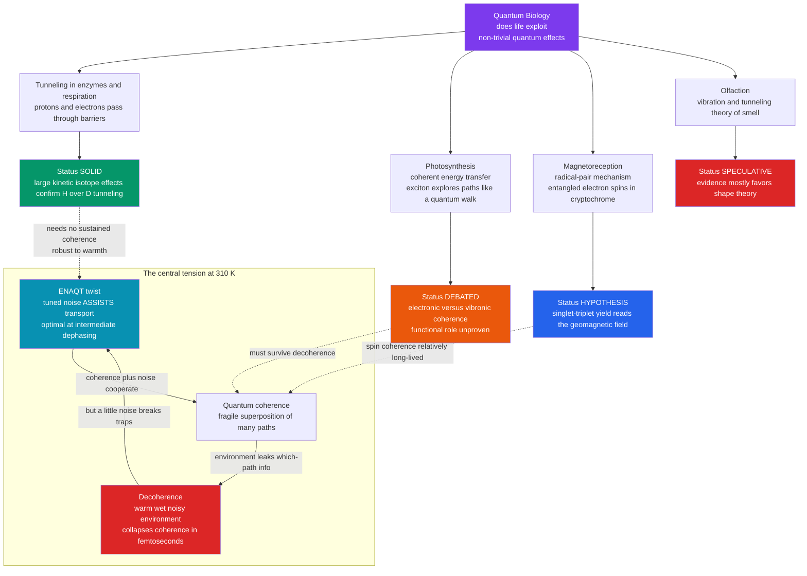

# 🧬 Quantum Biology

> [!abstract] TL;DR
> **Quantum biology** asks a sharp, controversial question: does life exploit *non-trivial* quantum mechanics — **coherence, tunneling, entanglement, spin** — in a **functional** way, beyond the trivial sense that all chemistry is ultimately quantum? Three cases anchor the field at very different confidence levels. **Proton and electron tunneling** through energy barriers in enzymes and in the respiratory/photosynthetic electron-transport chains is *solid*, confirmed by anomalously large **kinetic isotope effects** (H tunnels far more easily than the twice-as-heavy D). **Long-lived coherent energy transfer** in photosynthetic light-harvesting — where an exciton seems to "explore" many routes to the reaction center at once, like a quantum walk, achieving near-perfect quantum efficiency — is *actively debated* since the 2007 Engel experiments, with the modern consensus leaning toward **vibronic** rather than purely electronic, functional coherence. The **radical-pair mechanism**, in which a light-triggered pair of **entangled electron spins** in the protein **cryptochrome** gives migratory birds a chemical magnetic compass, is an *intriguing, still-tested hypothesis*. All of this runs against one profound obstacle — **decoherence**: quantum superpositions are fragile and, in a warm ($\sim$310 K), wet, noisy cell, appear to wash out in femtoseconds. Separating genuine functional quantum effects from ordinary chemistry is the field's central discipline, and the twist that **environment-assisted transport (ENAQT)** shows noise can sometimes *help* keeps the story alive.

## Intuition

**Analogy:** Quantum mechanics — with its ghostly superpositions, particles being in many places at once, and tunneling straight through walls that classical physics says are solid — was supposed to belong to ultra-cold, exquisitely isolated laboratories, utterly washed out by the warm, wet, jostling chaos of a living cell. A quantum computer needs near-absolute-zero temperatures and heroic shielding just to hold a fragile superposition for a fraction of a second; a leaf sits in the sun at body temperature and does something that *looks* similar for free. So the provocative idea is that **nature may have gotten there first**. A photosynthetic molecule appears to explore several energy pathways *simultaneously* to funnel captured sunlight to the reaction center with almost no loss; a robin may literally *see* the Earth's magnetic field using a pair of entangled electron spins in its eye; and enzymes routinely let protons and electrons **tunnel** through energy barriers they could never climb over. Life, it seems, might quietly exploit quantum tricks we assumed were impossible in a warm, wet body.

The catch — and the reason this is a *frontier* and not a settled textbook chapter — is that the same warmth and wetness that make life possible are exactly what should *destroy* these quantum effects almost instantly. The whole subject lives in the tension between "quantum coherence is far too delicate to survive in a cell" and "yet here are measurements that look quantum." Sorting the real, evolution-selected quantum effects from ordinary chemistry dressed up in quantum language is the discipline that gives the field its edge.

---

## How It Works

### Core Mechanics

Start with what "non-trivial" means, because the whole debate hinges on it. In one sense *all* of chemistry is quantum — covalent bonds, orbital shapes, spectra, and reaction barriers are quantum-mechanical, and no one disputes that. **Quantum biology** reserves its claim for something stronger: a quantum phenomenon that (i) is **coherent, entangled, spin-selective, or tunneling** in a way ordinary rate chemistry cannot reproduce, and (ii) plays a **functional role** — it makes a biological process work better and could have been *selected for*. The burden of proof is high precisely because "quantum" is easy to invoke and hard to prove functional.

Four candidate phenomena, ranked from solid to speculative:

1. **Quantum tunneling in enzymes and respiration (SOLID).** Particles do not need to go *over* an energy barrier; their wavefunction can leak *through* it, with a transmission probability that falls **exponentially** with barrier width and with the square root of particle mass times barrier height. This is why light particles tunnel and heavy ones do not. In the **electron-transport chains** of respiration and photosynthesis, electrons hop between redox centers 10–20 Å apart by tunneling through protein — there is no classical path. In enzyme catalysis, **proton and hydrogen-atom transfer** is often tunneling-dominated, betrayed by **kinetic isotope effects (KIEs)** far larger than the semiclassical ceiling of $\sim$7 for H versus D: because deuterium is twice as heavy, its wavefunction is more sharply localized and it tunnels much less, so swapping H for D can slow a reaction 20-, 50-, even 80-fold. This is the one place quantum biology is uncontroversial — a genuine, accepted quantum contribution to biological rates, and the deep companion to the classical barrier physics in [[Enzyme_Kinetics_and_Catalysis_Physics|the enzyme-kinetics sibling]].

2. **Coherent energy transfer in photosynthesis (DEBATED).** Light-harvesting antenna complexes capture a photon, creating a mobile electronic excitation (an **exciton**) that must reach the reaction center. Efficiency is astonishing — near unity. In 2007, **Engel and coworkers** used 2-D electronic spectroscopy on the **FMO complex** of green sulfur bacteria and saw long-lived oscillatory "beating" signals interpreted as electronic **quantum coherence**: the exciton was said to sample many pathways at once, like a **quantum walk**, and thereby find the optimal route rather than stumbling through an inefficient random hop-by-hop search. The follow-up decade was a model of scientific self-correction: subsequent work argued the beatings are largely **vibrational (vibronic)** — coherent nuclear motions — and may be *incidental* rather than the *cause* of efficient transport, and that at physiological temperature electronic coherence lasts only tens of femtoseconds. The current, careful position (e.g. the 2020 "quantum biology revisited" reassessment) is that vibronic coupling is real and interesting but that long-lived *functional electronic* coherence optimizing yield is **not established** — a cautionary, evolving story rather than a triumph.

3. **Magnetoreception via the radical-pair mechanism (HYPOTHESIS).** How does a migratory bird sense the Earth's weak ($\sim$50 μT) magnetic field to navigate? The leading physical hypothesis: blue light hits the flavoprotein **cryptochrome** in the retina and creates a **radical pair** — two molecules each with an unpaired electron, born in a quantum-correlated **singlet** spin state. The pair interconverts between singlet and **triplet** states at a rate exquisitely sensitive to the orientation of the external magnetic field (through hyperfine coupling to nuclear spins). Because singlet and triplet lead to different chemical products, the yield becomes a **chemical compass** whose reading depends on the bird's heading relative to the field lines. This is a proposed *functional* role for quantum **spin** and short-lived **entanglement** in a living sensor, drawing directly on the spin physics of [[Angular_Momentum_and_Spin|electron spin]] and [[Entanglement_and_Bell_States|entangled two-spin states]]. It elegantly explains behavioral quirks (birds need light, respond to weak radio-frequency fields that disrupt spin coherence) but is still being nailed down experimentally.

4. **Olfaction — the vibration/tunneling theory of smell (SPECULATIVE).** The standard theory says receptors recognize odorants by **shape** (lock-and-key). A minority "swipe-card" theory (Turin) proposes receptors instead sense a molecule's **vibrational frequencies** via **inelastic electron tunneling** — an electron only tunnels across the receptor when the odorant offers a vibrational mode to absorb the energy gap. It makes a testable prediction (isotope-swapped molecules, same shape but different vibrations, should smell different), but the evidence is contested and mostly favors shape. It is included here as a *methodological specimen*: exactly the kind of exciting-sounding claim quantum biology must hold to a high bar before accepting.

**The central tension — coherence versus decoherence.** A quantum superposition is a delicate phase relationship between states. Any uncontrolled interaction with the environment — a solvent collision, a thermal vibration, a fluctuating field — leaks "which-path" information out and **decoheres** the system, collapsing it toward classical behavior. In a warm, wet cell the environment is a firehose of such interactions, and naive estimates give electronic **decoherence times of femtoseconds** at 310 K — seemingly far too short to be useful. This is the skeptic's decisive point and the challenge the whole field must answer: *how could biology maintain or use quantum effects at body temperature?* Tunneling sidesteps the problem (it is a fast, single-barrier event needing no *sustained* coherence), which is why it is the solid case; coherence-based claims must confront decoherence head-on. The physics here is the same [[Decoherence_and_Quantum_Noise|open-quantum-system decoherence]] that plagues quantum computers.

**The twist — environment-assisted transport (ENAQT).** The story is subtler than "noise = bad." Theory of open quantum systems shows that a *tuned* amount of environmental noise can actually **help** transport: pure coherence can trap an excitation in destructive-interference dead-ends or Anderson-localized states, while a little dephasing breaks those traps and keeps energy flowing downhill to the reaction center. Transport efficiency is often **maximized at intermediate noise** — not zero, not overwhelming — a regime dubbed **environment-assisted quantum transport (ENAQT)**. So warmth and wetness are not purely destructive; coherence and noise can cooperate. This reframes the question from "does coherence survive?" to "how do coherence and dissipation jointly optimize function?"

### Flow / Architecture



---

## Key Concepts

### Secondary Level

- **All chemistry is quantum, but that is not the point.** Quantum biology asks the *stronger* question: does life use quantum "tricks" — being in many states at once, passing through walls — in a way that actually helps it work?
- **Tunneling — through, not over.** Tiny particles like electrons and protons can pass *through* an energy barrier instead of climbing over it. This lets some biological reactions go far faster than they otherwise could. Lighter particles tunnel more easily than heavier ones.
- **Photosynthesis is astonishingly efficient.** A captured particle of light is delivered to where it is used with almost no waste; one idea is that the energy explores several routes at once to find the best path.
- **A bird's compass.** Robins and other migratory birds may sense Earth's magnetic field using light-sensitive molecules in the eye whose chemistry depends on the field's direction.
- **The catch.** Quantum effects are extremely delicate and normally vanish instantly in something as warm and messy as a living cell. Whether life beats this is the big open question.

### Undergraduate Level

- **Coherence, entanglement, spin, tunneling — the four flavors.** Functional quantum biology needs one of these to do real work: *coherence* (definite phase relationships enabling interference), *entanglement* (non-classical correlations, as in radical pairs), *spin selectivity* (singlet vs triplet chemistry), or *tunneling* (barrier penetration).
- **Tunneling probability.** For a rectangular barrier of height $V_0$ and width $a$ with particle energy $E<V_0$, the thick-barrier transmission is $T \approx e^{-2\kappa a}$ with $\kappa = \sqrt{2m(V_0-E)}/\hbar$. Exponential in width, and $\propto \sqrt{m}$ in the exponent — hence isotope sensitivity.
- **Kinetic isotope effect (KIE).** $\mathrm{KIE} = k_H/k_D$. Semiclassical zero-point-energy arguments cap it near 7 at room temperature; **tunneling inflates it well beyond**, a fingerprint used to diagnose hydrogen tunneling in enzymes.
- **Exciton and quantum walk.** In light-harvesting, the absorbed energy is an exciton delocalized over pigment sites; a **continuous-time quantum walk** spreads *ballistically* (spread $\sigma \propto t$) versus a classical random walk's *diffusive* $\sigma \propto \sqrt{t}$ — the proposed source of a search speed-up.
- **Radical pair basics.** Light creates a spin-correlated radical pair in a singlet state; **hyperfine** coupling drives coherent singlet$\leftrightarrow$triplet oscillation, and the external field tilts the balance — an anisotropic chemical yield the animal can read.
- **Decoherence time.** The timescale $\tau_D$ over which environmental coupling destroys phase coherence. Functionality requires $\tau_D$ to be *long enough* relative to the useful process (transfer, spin evolution) — the quantitative crux of every claim.

### Graduate Level

- **Open quantum systems framework.** Biological quantum dynamics is modeled with density matrices and master equations — **Lindblad**, **Redfield**, or numerically exact **HEOM (hierarchical equations of motion)** — capturing a system (pigments, radical spins) coupled to a structured phonon/solvent bath characterized by a spectral density $J(\omega)$.
- **ENAQT quantitatively.** Transport efficiency as a function of dephasing rate $\gamma$ is typically non-monotonic: near-zero $\gamma$ suffers coherent trapping and localization; huge $\gamma$ gives the quantum Zeno effect and classical hopping; a broad **optimum at intermediate $\gamma$** maximizes trapping at the reaction center. This is the theoretical heart of why "warm and wet" is not fatal.
- **Electronic vs vibronic coherence.** The reinterpretation of FMO beatings hinges on distinguishing purely electronic coherences (short-lived at 300 K) from **vibronic** coherences resonant with pigment vibrational modes, which are longer-lived but whose *functional* contribution to yield remains contested. The methodological lesson: oscillations in a 2-D spectrum are necessary but not sufficient evidence for functional electronic coherence.
- **Spin dynamics of radical pairs.** The spin Hamiltonian includes Zeeman, hyperfine, exchange ($J$), and dipolar terms; the singlet yield $\Phi_S$ as a function of field direction and magnitude is computed from the spin density matrix. Sensitivity to $\sim$50 μT and to weak RF fields (a proposed disruption test) constrains the model; coherence lifetimes of $\sim$microseconds are needed, unusually long for a biomolecule.
- **Marcus theory meets tunneling.** Long-range biological **electron transfer** rates follow $k \propto e^{-\beta R}\, e^{-(\Delta G + \lambda)^2/4\lambda k_B T}$ — an electronic **tunneling** factor (decay $\beta \approx 1.1$ Å$^{-1}$ through protein) times a nuclear/Marcus activation factor. This is settled quantum biology and underlies the electron-transport chains of [[Oxidative_Phosphorylation|respiration]] and [[Photosynthesis|photosynthesis]].
- **The functionality burden.** The rigorous test is not "is there a quantum effect?" but "is it **functional and selected**?" — requiring that removing/detuning the quantum feature measurably degrades performance, and that the effect is not merely an incidental spectroscopic epiphenomenon. Theory (open-system models) and experiment (isotope substitution, mutagenesis of pigment/radical sites, RF disruption) must jointly meet it.

---

## Python Demo

```python
# Quantum biology, two solid-to-illustrative phenomena in one figure:
#
#   TUNNELING (the SOLID case)
#     (A) transmission T through a rectangular barrier vs barrier WIDTH for an
#         electron, a proton, and a deuteron -> the exponential tunneling law and
#         the mass dependence (heavier = far less tunneling)
#     (B) T vs barrier HEIGHT for a proton -> exponential sensitivity to the barrier
#     (C) the kinetic isotope effect  KIE = T_H / T_D  vs width -> tunneling drives
#         KIE far above the semiclassical ceiling (~7), the enzyme fingerprint
#
#   COHERENT vs INCOHERENT TRANSPORT (the DEBATED case)
#     (D) excitation spread on a chromophore chain: a continuous-time QUANTUM walk
#         (ballistic, sigma ~ t) vs a classical random walk (diffusive, sigma ~ t^0.5)
#         -- the proposed search speed-up -- with a note on decoherence timescales.
#
# Requires: numpy, matplotlib
import numpy as np
import matplotlib.pyplot as plt

# ---- fundamental constants (SI) ----
hbar = 1.054571817e-34     # J*s
m_e  = 9.1093837015e-31    # electron mass, kg
m_p  = 1.67262192369e-27   # proton mass, kg
m_d  = 2.0 * m_p           # deuteron ~ 2 x proton (good enough for the trend)
eV   = 1.602176634e-19     # J

def transmission(mass, V0_eV, E_eV, a_m):
    """Exact rectangular-barrier transmission for E < V0."""
    V0, E = V0_eV*eV, E_eV*eV
    kappa = np.sqrt(2.0*mass*(V0 - E)) / hbar          # decay constant (1/m)
    ka = kappa * a_m
    # exact closed form; sinh handles both thin and thick barriers
    with np.errstate(over='ignore'):
        T = 1.0 / (1.0 + (V0**2 * np.sinh(ka)**2) / (4.0*E*(V0 - E)))
    return T

# ---- barrier parameters (a plausible proton-transfer barrier) ----
V0_eV, E_eV = 0.80, 0.40          # barrier height and particle energy (eV)
widths = np.linspace(0.2e-10, 3.0e-10, 400)   # 0.2 to 3.0 Angstrom
ang    = widths * 1e10                          # for plotting in Angstrom

T_e = transmission(m_e, V0_eV, E_eV, widths)
T_p = transmission(m_p, V0_eV, E_eV, widths)
T_d = transmission(m_d, V0_eV, E_eV, widths)

# ---- panel B data: T vs barrier height (proton, fixed width) ----
a_fixed = 1.0e-10                 # 1 Angstrom
heights = np.linspace(0.45, 2.0, 400)          # V0 in eV, all > E = 0.40
T_vs_V0 = transmission(m_p, heights, E_eV, a_fixed)

# ---- panel C data: kinetic isotope effect T_H / T_D vs width ----
KIE = T_p / T_d
semiclassical_ceiling = 7.0

# ---- panel D: coherent (quantum) vs incoherent (classical) transport ----
N   = 61                          # chromophore sites on a chain
c0  = N // 2                      # start at the center site
x   = np.arange(N)
J   = 1.0                         # electronic coupling / hopping (arb. units)
gam = 1.0                         # classical hop rate (matched scale)

# tight-binding Hamiltonian: H_{i,i}=0, H_{i,i+-1} = -J
H = np.zeros((N, N))
idx = np.arange(N-1)
H[idx, idx+1] = -J
H[idx+1, idx] = -J
Ev, U = np.linalg.eigh(H)         # H = U diag(Ev) U^T

# classical continuous-time random-walk generator (graph Laplacian * gam)
L = np.zeros((N, N))
L[idx, idx+1] = gam
L[idx+1, idx] = gam
for i in range(N):
    L[i, i] = -np.sum(L[i]) + L[i, i]   # rows sum to zero
Lv, W = np.linalg.eigh(L)

psi0 = np.zeros(N); psi0[c0] = 1.0    # initial amplitude / probability at center
c_q  = U.T @ psi0
c_c  = W.T @ psi0

times = np.linspace(0.1, 10.0, 120)
sig_q = np.zeros_like(times)          # quantum spread (std dev of position)
sig_c = np.zeros_like(times)          # classical spread
for k, t in enumerate(times):
    psi_t = U @ (np.exp(-1j*Ev*t) * c_q)      # coherent evolution
    p_q   = np.abs(psi_t)**2
    p_c   = W @ (np.exp(Lv*t) * c_c)           # classical master equation
    p_c   = np.clip(p_c, 0, None); p_c /= p_c.sum()
    sig_q[k] = np.sqrt(np.sum(p_q * (x - c0)**2))
    sig_c[k] = np.sqrt(np.sum(p_c * (x - c0)**2))

# ----------------------------- plotting -----------------------------
fig, ax = plt.subplots(2, 2, figsize=(13, 10))
fig.suptitle("Quantum Biology: tunneling (solid) and coherent transport (debated)",
             fontsize=14, fontweight="bold")

# A: transmission vs barrier width for three particles
axA = ax[0, 0]
axA.semilogy(ang, T_e, lw=2.2, color="#2563eb", label="electron")
axA.semilogy(ang, T_p, lw=2.2, color="#ea580c", label="proton")
axA.semilogy(ang, T_d, lw=2.2, color="#059669", label="deuteron (2x proton mass)")
axA.set_xlabel("barrier width  (Angstrom)")
axA.set_ylabel("transmission probability  T")
axA.set_title("A. Tunneling decays exponentially with width\nlighter particles tunnel farther")
axA.set_ylim(1e-30, 2)
axA.legend(); axA.grid(alpha=0.3, which="both")

# B: transmission vs barrier height (proton)
axB = ax[0, 1]
axB.semilogy(heights, T_vs_V0, lw=2.4, color="#7c3aed")
axB.set_xlabel("barrier height  V0  (eV),  particle energy E = 0.40 eV")
axB.set_ylabel("proton transmission  T")
axB.set_title("B. Exponential sensitivity to barrier height\n(proton, width = 1 Angstrom)")
axB.grid(alpha=0.3, which="both")

# C: kinetic isotope effect vs width
axC = ax[1, 0]
axC.plot(ang, KIE, lw=2.4, color="#dc2626", label="KIE = T_H / T_D (tunneling)")
axC.axhline(semiclassical_ceiling, ls="--", color="gray",
            label="semiclassical ceiling ~ 7")
axC.set_xlabel("barrier width  (Angstrom)")
axC.set_ylabel("kinetic isotope effect  T_H / T_D")
axC.set_title("C. Tunneling inflates the H/D isotope effect\nfar above the classical limit -> enzyme fingerprint")
axC.set_ylim(0, max(30, KIE[np.isfinite(KIE)].max()*0.4))
axC.legend(); axC.grid(alpha=0.3)

# D: coherent (ballistic) vs incoherent (diffusive) spread
axD = ax[1, 1]
axD.loglog(times, sig_q, lw=2.4, color="#0891b2", label="quantum walk  (coherent)")
axD.loglog(times, sig_c, lw=2.4, color="#ea580c", label="random walk  (classical)")
axD.loglog(times, 0.9*times, ls=":", color="#0891b2", label="slope 1  (ballistic)")
axD.loglog(times, 1.0*np.sqrt(times), ls=":", color="#ea580c", label="slope 1/2  (diffusive)")
axD.set_xlabel("time  (arb. units)")
axD.set_ylabel("excitation spread  sigma  (sites)")
axD.set_title("D. Coherent search spreads BALLISTICALLY\nvs diffusive classical hopping")
axD.legend(fontsize=8); axD.grid(alpha=0.3, which="both")

plt.tight_layout(rect=[0, 0, 1, 0.95])
plt.show()

# --- decoherence reality check (printed) ---
print("Decoherence timescales (order of magnitude, physiological ~300 K):")
print("  electronic coherence in light-harvesting : ~10-100 femtoseconds")
print("  single energy-transfer / hopping step     : ~0.1-1 picoseconds")
print("  radical-pair spin coherence (cryptochrome): ~1 microsecond (unusually long)")
print("=> tunneling needs NO sustained coherence (robust); coherent transport must")
print("   act within tens of fs -- which is why the photosynthesis case stays debated.")
```

Panel **A** shows the exponential tunneling law and the decisive **mass dependence**: an electron (light) tunnels through the same barrier with a probability many orders of magnitude larger than a proton, and a proton far larger than a deuteron — the physical origin of isotope effects. Panel **B** shows how steeply transmission falls as the barrier rises. Panel **C** turns this into the observable that makes tunneling *provable* in enzymes: because the twice-heavier deuteron tunnels so much less, the H/D **kinetic isotope effect** climbs well above the semiclassical ceiling of $\sim$7 — an anomaly ordinary over-the-barrier chemistry cannot produce. Panel **D** contrasts a **coherent quantum walk** (excitation spreads *ballistically*, $\sigma \propto t$) with a **classical random walk** (*diffusive*, $\sigma \propto \sqrt{t}$): the ballistic spreading is the proposed source of a faster, more thorough search for the reaction center. The printed decoherence timescales supply the essential caveat — coherence in a warm complex lasts only tens of femtoseconds, so any *functional* coherent transport must complete within a few hops, which is exactly why the photosynthesis case remains debated while tunneling (needing no sustained coherence) does not.

---

## Real-World Applications

> **Example:** **Photosynthetic light-harvesting as a design blueprint.** Even setting aside the coherence debate, the near-perfect quantum efficiency of energy funneling in complexes like **FMO** and the plant **LHCII** is a target that has directly inspired **artificial light-harvesting** and next-generation **organic/quantum-dot solar cells**, where engineers copy the geometric arrangement of chromophores and the energy-gradient "funnel" that biology evolved. The **ENAQT** insight — that a tuned amount of dephasing can *improve* transport — has become a design principle for excitonic materials and even guides thinking in engineered quantum devices about the constructive role of noise.

- **Enzyme and drug engineering.** Because hydrogen **tunneling** contributes to many enzymatic H-transfer steps, KIE measurements are a routine mechanistic probe, and understanding tunneling informs the design of transition-state-analog inhibitors and of enzymes optimized for H-transfer — the applied face of [[Enzyme_Kinetics_and_Catalysis_Physics|enzyme catalysis physics]].
- **Quantum biosensing and magnetometry.** The **radical-pair** mechanism motivates ultrasensitive chemical magnetometers and has cross-pollinated with **NV-center** and spin-based **quantum sensors**; conversely, spin-chemistry techniques are used to *test* the avian compass in the lab.
- **Respiration and bioenergetics.** Long-range **electron tunneling** between redox centers (Marcus theory) is the accepted mechanism of the electron-transport chain, essential to modeling [[Oxidative_Phosphorylation|oxidative phosphorylation]] and to bio-inspired electrocatalysis and biofuel cells.
- **Origins-of-life and evolution questions.** If quantum effects genuinely improve efficiency, they raise the deep question of whether they were **selected for** and whether quantum mechanics shaped early metabolism — a frontier flagged in the companion *The_Reach_and_Future_of_Biophysics* sibling.

---

## Common Pitfalls

- **"All chemistry is quantum, therefore biology is quantum-biological."** True but trivial. The field's claim is *non-trivial functional* quantum mechanics — coherence, entanglement, spin selectivity, or tunneling doing work that classical rate chemistry cannot. Conflating the two dissolves the whole question.
- **"Oscillations in a spectrum prove functional coherence."** Beating signals in 2-D electronic spectroscopy can be **vibrational** and **incidental**. Distinguishing electronic from vibronic coherence, and coherence-that-helps from coherence-that-merely-exists, is the hard part — the lesson of the post-2007 FMO reappraisal.
- **"Warm and wet always destroys quantum effects."** The naive decoherence argument is a strong *prior*, not a theorem. **ENAQT** shows tuned noise can *aid* transport, and radical-pair **spin** coherence can survive microseconds. Quote a *timescale comparison*, not a slogan.
- **"Tunneling and coherent transport stand or fall together."** They do not. **Tunneling is solid** and needs no sustained coherence; **long-lived functional coherence is debated**. Treating them as one claim lets the weakest case discredit the strongest, or vice versa.
- **"Quantum biology explains consciousness."** Extrapolations like Orch-OR are **speculative** and unsupported; importing them contaminates the credible, evidence-based core (tunneling, radical pairs, energy transfer). Keep the tiers separate.
- **"A quantum effect that exists is a quantum effect that is used."** Existence $\neq$ function $\neq$ selected-for. The rigorous test requires showing that detuning or removing the quantum feature *degrades performance* — the functionality burden most claims still owe.

---

## Related Concepts

**Quantum-mechanical foundations**
- [[Wave_Particle_Duality_and_Uncertainty]] — the superposition and matter-wave physics that makes tunneling and coherence possible at all
- [[Schrodinger_Equation]] — the wave equation whose barrier solutions give the exponential tunneling law used in the demo
- [[Angular_Momentum_and_Spin]] — electron spin and singlet/triplet states, the substrate of the radical-pair compass
- [[Quantum_Statistical_Mechanics]] — the thermal-ensemble physics behind the $k_BT$ energy scale and thermally activated versus tunneling rates
- [[Quantum_Chemistry_and_Atomic_Orbitals]] — the molecular quantum states, orbitals, and couplings underlying excitons and electron transfer

**Open systems, coherence, and decoherence**
- [[Decoherence_and_Quantum_Noise]] — the open-quantum-system decoherence that is quantum biology's central obstacle and the crux of the coherence debate
- [[Entanglement_and_Bell_States]] — the non-classical spin correlations invoked in the radical-pair mechanism

**Biology and chemistry it touches**
- [[Photosynthesis]] — the light-harvesting and reaction-center machinery where coherent energy transfer is claimed
- [[Oxidative_Phosphorylation]] — the respiratory electron-transport chain, run by accepted long-range electron tunneling
- [[Enzymes_and_Catalysis]] — the biology companion to enzymatic proton/hydrogen tunneling
- [[Chemical_Kinetics]] — Arrhenius/transition-state rates that tunneling and KIEs modify
- [[Molecular_Spectroscopy]] — the vibrational modes central to the olfaction-vibration theory and to vibronic coherence
- [[Sensory_Systems_and_Transduction]] — how a chemical/spin signal (compass, smell) becomes a neural one

**Biophysics siblings**
- [[Enzyme_Kinetics_and_Catalysis_Physics]] — the classical barrier-crossing picture that tunneling and KIEs extend
- [[Energy_Entropy_and_Free_Energy_in_Biology]] — the $k_BT$ and free-energy scales against which quantum contributions are judged
- [[Statistical_Mechanics_of_Biomolecules]] — the ensemble/thermal-bath framework needed to model open-system biological quantum dynamics
- [[The_Physics_of_Hearing_and_Vision]] — the sibling on biological sensing, the natural neighbor to magnetoreception and olfaction
- [[Biophysics_Overview]] — the vault map that places quantum effects at the frontier of the physics of life

---

## Review Questions

**Secondary**
1. Explain, using the "through the wall" picture, what quantum tunneling is and why an electron tunnels through a barrier much more easily than a proton, and a proton more easily than a deuteron. Why does this make tunneling something scientists can actually *test* in a living enzyme?

**Undergraduate**
2. A photosynthesis researcher measures oscillating "beating" signals in a light-harvesting complex and claims they prove the system uses quantum coherence to boost efficiency. (a) What alternative, more mundane explanation must be ruled out? (b) Given that electronic coherence at body temperature lasts only tens of femtoseconds while energy-transfer steps take hundreds of femtoseconds to picoseconds, what does the *timescale comparison* imply for the claim? (c) What additional evidence would you demand to show the coherence is **functional** rather than incidental?

**Graduate**
3. Contrast the epistemic status of (i) hydrogen tunneling in enzymes, (ii) coherent energy transfer in photosynthesis, and (iii) the radical-pair magnetic compass. For each, name the specific experimental signature that supports it (or would be needed to confirm it), explain why the **decoherence** objection is or is not fatal, and describe how **ENAQT** reframes the naive "warm and wet destroys everything" argument. Finally, state the general standard a claim must meet to count as a *functional, evolved* quantum effect rather than incidental quantum chemistry.

---

## Sources

- Lambert, N., Chen, Y.-N., Cheng, Y.-C., Li, C.-M., Chen, G.-Y. & Nori, F. (2013). "Quantum Biology." *Nature Physics* 9, 10–18 — the standard critical review of the whole field.
- Engel, G. S. et al. (2007). "Evidence for Wavelike Energy Transfer through Quantum Coherence in Photosynthetic Systems." *Nature* 446, 782–786 — the flagship (and much-debated) FMO experiment.
- Cao, J. et al. (2020). "Quantum Biology Revisited." *Science Advances* 6, eaaz4888 — the careful reassessment: vibronic vs functional electronic coherence.
- Hore, P. J. & Mouritsen, H. (2016). "The Radical-Pair Mechanism of Magnetoreception." *Annual Review of Biophysics* 45, 299–344 — the definitive review of the avian compass.
- Klinman, J. P. & Kohen, A. (2013). "Hydrogen Tunneling Links Protein Dynamics to Enzyme Catalysis." *Annual Review of Biochemistry* 82, 471–496 — the solid case: tunneling and kinetic isotope effects.
- Mohseni, M., Rebentrost, P., Lloyd, S. & Aspuru-Guzik, A. (2008). "Environment-Assisted Quantum Walks in Photosynthetic Energy Transfer." *J. Chem. Phys.* 129, 174106 — the ENAQT concept.

---

#biophysics #quantum-biology #photosynthesis #magnetoreception #quantum-tunneling
