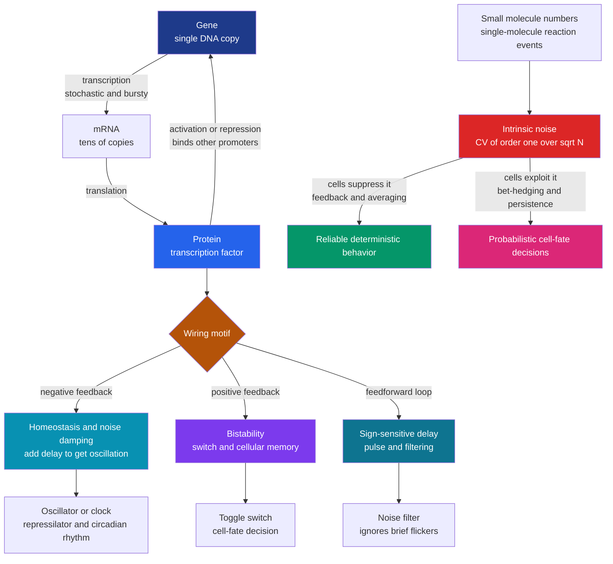

# 🔀 Systems Biophysics and Gene Networks

> [!abstract] TL;DR
> **Systems biophysics** treats the living cell not as a bag of chemicals but as a **dynamical circuit** — genes switch each other on and off through **activation** and **repression**, and the wiring diagram of these interactions is a **gene regulatory network** that computes cellular behavior. The astonishing discovery (Uri Alon and others) is that real networks are built from a small set of recurring **motifs** — the same way electronics reuses a handful of building blocks: **positive feedback** makes a **bistable switch** with *memory* (the genetic **toggle switch**, cell-fate decisions, the *lac* operon); **negative feedback with delay** makes an **oscillator** or *clock* (circadian rhythms, the cell cycle, the synthetic **repressilator**); and **feedforward loops** make sign-sensitive delays, **pulse generators**, and **filters**. But there is a twist an electrical engineer never faces: the key molecules are present in *tiny* numbers — sometimes a *single* copy of a gene, a handful of mRNAs — so gene expression is irreducibly **stochastic**. Fluctuations (noise) with coefficient of variation scaling as roughly $1/\sqrt{N}$, transcriptional **bursting**, and the split into **intrinsic** vs **extrinsic** noise (Elowitz's two-color experiment) mean the cell must *engineer reliable behavior out of noisy parts* — and, remarkably, sometimes *exploit* the noise for **bet-hedging** and probabilistic differentiation. This framework — dynamical systems, control theory, and statistical mechanics applied to regulation — underpins **synthetic biology** and our modern understanding of cellular decision-making, development, and disease.

---

## Intuition

**Analogy:** A cell is a living **circuit board**. Its genes are not a static list of instructions but a network of components that switch each other on and off — and those switches behave *exactly* like the parts an electrical engineer already knows. One little loop of genes acts as a **memory switch** (flip it and it stays flipped, like a computer's flip-flop). Another loop acts as a **clock**, ticking out a steady rhythm. A third acts as a **filter**, ignoring brief flickers and only responding to a signal that stays on. Feedback, oscillators, amplifiers, logic gates — the cell has quietly invented all of them out of DNA and protein.

But here is the twist that makes cellular engineering *harder* than electrical engineering. On a real circuit board there are trillions of electrons in every wire, so currents are smooth and predictable. Inside a cell the components are present in *absurdly* small numbers — often a **single copy** of a gene, and just a few molecules of the protein it controls. When you are counting to five instead of to a trillion, **randomness is unavoidable**: whether the next mRNA gets made in the next second is a coin flip, and the coin is loud. So the cell's genes are jittering, noisy, flickering parts — and yet the organism must reliably build a heart, keep a clock ticking, and remember a decision for a lifetime. **Systems biophysics is the study of how the cell engineers dependable behavior out of inherently noisy toggles — and when to let the noise do the deciding.**

---

## How It Works

### From single molecules to networks

The rest of biophysics zooms *in* — on one protein folding, one motor stepping, one channel opening. Systems biophysics zooms *out*: given that we understand the parts, **what behavior emerges when thousands of them interact?** The organizing idea is that a cell is an **information-processing dynamical system**. Its inputs are signals (nutrients, hormones, stress); its state is the concentration of every molecular species; and its dynamics are set by the **network of regulatory interactions** among genes and proteins. The right language is not chemistry alone but **dynamical systems and control theory**: fixed points, stability, feedback, gain, bifurcations, limit cycles.

### Gene regulatory networks as circuits

The core interaction is **transcriptional regulation**. A gene is transcribed into mRNA and translated into a **protein**; some of those proteins are **transcription factors** that bind the promoters of *other* genes and either **activate** (turn up) or **repress** (turn down) their transcription. Because a protein made by gene A can control gene B, which controls gene C, which controls A, genes form **directed networks** whose edges are labeled activation ($\rightarrow$) or repression ($\dashv$). This is *literally* a circuit diagram, and it can be analyzed like one.

The quantitative dynamics of a single regulated gene are captured by production/degradation equations. For a protein $p$ whose transcription is repressed by a factor $r$, a standard model is

$$\frac{dp}{dt} \;=\; \underbrace{\beta\,\frac{K^{n}}{K^{n}+r^{n}}}_{\text{regulated production}} \;-\; \underbrace{\gamma\,p}_{\text{degradation + dilution}}$$

The **Hill function** captures cooperative, switch-like regulation (steepness set by the Hill coefficient $n$), $\beta$ is the maximal synthesis rate, and $\gamma$ is the combined degradation-plus-dilution rate that sets the response time $\tau = 1/\gamma$. String several such equations together — coupling each gene's production to the others' concentrations — and you have the circuit's **ordinary differential equations**, whose fixed points and stability determine what the cell does.

### Network motifs: the reusable building blocks

Alon's key empirical finding is that real regulatory networks are **not** random wiring: a few small subgraphs — **network motifs** — appear far more often than chance, because each performs a useful **dynamical function**. Three families dominate:

- **Negative feedback** (a gene represses its own production, directly or through a loop). Function: **homeostasis** (holds output near a set-point), **faster response times**, and **noise reduction**. Add a **time delay** around the loop and negative feedback becomes an **oscillator** — the origin of biological clocks.
- **Positive feedback** (a gene activates itself, or two genes mutually repress — a double-negative, which is net positive). Function: **bistability** — two stable states separated by an unstable threshold — giving an **all-or-none switch**, **cellular memory**, and irreversible **decisions**. The genetic **toggle switch** and the **lac operon** are the canonical examples.
- **Feedforward loops** (an input regulates a target both *directly* and *indirectly* through a second gene). Function: **sign-sensitive delay** (respond fast to ON but slow to OFF, or vice versa), **pulse generation**, and **filtering** of brief, spurious input flickers. The coherent and incoherent feedforward loops are the two most common three-node motifs in bacteria.

### The physics of gene expression: stochastic chemical reactions

Here systems biophysics parts ways with electronics. Transcription and translation are **chemical reactions among small numbers of molecules**. A bacterium may carry a **single copy** of a gene and only tens of mRNA or protein molecules. Reaction events — a polymerase firing, an mRNA degrading — are **discrete, random** occurrences governed by probabilities per unit time, not smooth rates. The correct description is not the deterministic ODE but the **chemical master equation**, sampled exactly by the **Gillespie stochastic simulation algorithm**: at each step, draw *when* the next reaction happens and *which* reaction it is, from exponential waiting times weighted by the propensities.

The consequence is **noise**. For a simple birth-death process (constant production, first-order degradation) the steady-state molecule count is **Poisson**, so its relative fluctuation — the coefficient of variation — is

$$\mathrm{CV} \;=\; \frac{\sigma}{\langle N\rangle} \;=\; \frac{1}{\sqrt{\langle N\rangle}}$$

**Small numbers mean large relative noise.** Ten molecules fluctuate by roughly 30 percent; a million fluctuate by a tenth of a percent. Worse, transcription is often **bursty**: genes flip between OFF and ON promoter states, firing off a *burst* of several mRNAs and then falling silent, which makes the noise **super-Poissonian** (bigger than $1/\sqrt{N}$).

Elowitz's landmark **two-color experiment** (2002) separated two sources: **intrinsic noise** — the inherent randomness of the reactions at *one* gene, which makes two identical reporter genes in the *same* cell disagree — and **extrinsic noise** — cell-to-cell differences in shared factors (ribosome count, cell size, polymerase levels), which pushes both reporters up or down *together*. Plotting two colors against each other cleanly decomposes the total.

### Noise as bug and as feature

Because noise threatens reliability, cells **suppress** it: **negative feedback** damps fluctuations, **temporal or population averaging** washes them out, higher **molecule numbers** shrink the $1/\sqrt{N}$ term, and redundancy adds robustness. But noise is not only a nuisance — cells **exploit** it. A **bistable switch** driven by noise makes a **probabilistic cell-fate decision**: genetically identical cells choose different fates by chance, producing **bet-hedging** (a fraction of *persister* bacteria survive antibiotics; *B. subtilis* stochastically enters competence). Noise turns a deterministic circuit into a **randomizing device** — a survival strategy in an unpredictable world.



---

## Key Concepts

### Secondary (intuitive)
- Genes do not just sit there; they **switch each other on and off**, forming a network that behaves like an **electronic circuit** inside the cell.
- Some gene loops act as a **memory switch** (flip it and it stays flipped) — this is how a cell "remembers" a decision, such as which type of cell to become.
- Other gene loops act as a **clock**, ticking out a steady rhythm — this runs your daily (circadian) body clock and the cell-division cycle.
- Because the important molecules come in **tiny numbers** (sometimes just one gene, a few proteins), the cell is inherently **noisy** — outcomes are partly random, like a coin flip.
- Cells both **fight** the noise (to be reliable) and sometimes **use** it (to make a few cells behave differently as a survival bet).

### Undergraduate (quantitative)
- **Regulated gene dynamics:** $\dot p = \beta\,\mathrm{Hill}(r) - \gamma p$. Repression uses $\beta K^n/(K^n+r^n)$; activation uses $\beta\,r^n/(K^n+r^n)$. Response time $\tau=1/\gamma$; steady state where production equals degradation.
- **Positive feedback and bistability:** two mutually repressing genes (a **toggle switch**, Gardner-Cantor-Collins 2000) have production/degradation nullclines that intersect **three times** — two stable states plus an unstable **saddle**. The system rests in one of the two stable states = **memory**; crossing the threshold flips it, and **hysteresis** makes the flip hard to reverse.
- **Negative feedback and oscillation:** a loop of **three** repressors (the **repressilator**, Elowitz-Leibler 2000) has a single unstable fixed point surrounded by a **limit cycle** — sustained oscillations. Oscillation needs sufficient **loop gain**, **cooperativity** ($n \ge 2$), and **delay** (odd number of repressions).
- **Feedforward loops (FFL):** the **coherent type-1 FFL** with AND logic is a **persistence detector** — it responds only to inputs that stay ON long enough, filtering brief pulses; the **incoherent FFL** generates a **pulse** and speeds responses.
- **Stochastic gene expression:** birth-death gives a **Poisson** steady state, so $\mathrm{CV}=1/\sqrt{\langle N\rangle}$ — noise falls as molecule numbers rise. **Fano factor** $=\sigma^2/\langle N\rangle=1$ for Poisson; **bursting** pushes it above 1.
- **The Gillespie algorithm:** exact simulation of the chemical master equation — sample waiting time $\tau\sim\mathrm{Exp}(a_0)$ (total propensity) and pick the reaction with probability proportional to its propensity.

### Graduate (advanced)
- **Bifurcation view:** a bistable switch appears through a **saddle-node** (fold) bifurcation as feedback strength or Hill cooperativity crosses a critical value; the oscillator appears through a **Hopf** bifurcation. The cell's decisions and clocks are *bifurcations of a dynamical system* — the same mathematics as [[Bifurcations_and_Tipping_Points]].
- **Intrinsic vs extrinsic decomposition:** with two identical reporters (CFP, YFP) in one cell, $\eta_{\text{int}}^2 = \tfrac12\langle(c-y)^2\rangle/\langle c\rangle\langle y\rangle$ and $\eta_{\text{ext}}^2 = (\langle cy\rangle-\langle c\rangle\langle y\rangle)/\langle c\rangle\langle y\rangle$; total variance is their sum (Elowitz et al. 2002; Swain, Elowitz, Siggia).
- **Noise propagation and spectra:** the **linear noise approximation** (van Kampen system-size expansion) and **fluctuation-dissipation** relations give closed-form variances and power spectra; negative feedback **shifts the noise spectrum to high frequency** and reduces low-frequency variance, but too much gain plus delay *creates* oscillatory noise.
- **Bursting kinetics:** a two-state (telegraph) promoter yields a **negative-binomial / gamma-Poisson** steady state; burst size $b=k_{\text{tl}}/\gamma_m$ and burst frequency set the mean and the super-Poissonian Fano factor.
- **Robustness and perfect adaptation:** bacterial **chemotaxis** achieves *exact* adaptation to constant stimuli via **integral feedback control** (Barkai-Leibler, Yi-Doyle) — a network property robust to parameter variation, a landmark link between control theory and biology.
- **Information theory of regulation:** a gene network is a noisy channel; the **mutual information** between input signal and output expression (bits) bounds how many distinguishable states a cell can resolve — the *Bicoid* gradient transmits about 1.5 bits, near a physical optimum (Tkacik, Bialek). See [[Information_Theory_in_Biology_and_Neuroscience]].
- **Landscape picture:** Waddington's epigenetic landscape becomes a **quasi-potential** on the network's state space; attractors are cell types, and stochastic transitions over barriers are noise-driven fate switches.

---

## Python Demo

```python
# SYSTEMS BIOPHYSICS: gene circuits as dynamical systems + the physics of noise
# Four panels:
#   A) TOGGLE SWITCH (positive feedback via mutual repression) -> BISTABILITY.
#      Phase portrait: two stable attractors = cellular MEMORY; trajectories from
#      different initial conditions fall into one basin or the other.
#   B) REPRESSILATOR (three repressors in a loop, negative feedback + delay)
#      -> sustained OSCILLATIONS (a synthetic genetic clock), via ODEs.
#   C) STOCHASTIC gene expression via the GILLESPIE algorithm: a single-cell
#      protein trajectory with SMALL numbers is jagged/noisy, while the
#      deterministic ODE is smooth. Higher <N> is visibly less noisy.
#   D) NOISE SCALING: measured CV vs mean protein number reproduces CV = 1/sqrt(N).
# Requires: numpy, matplotlib
import numpy as np
import matplotlib.pyplot as plt

rng = np.random.default_rng(7)

# ----------------------------------------------------------------------
# Tiny RK4 integrator (keeps the demo to numpy + matplotlib only)
# ----------------------------------------------------------------------
def rk4(f, y0, t):
    y = np.zeros((len(t), len(y0)))
    y[0] = y0
    for i in range(len(t) - 1):
        dt = t[i + 1] - t[i]
        k1 = f(y[i])
        k2 = f(y[i] + 0.5 * dt * k1)
        k3 = f(y[i] + 0.5 * dt * k2)
        k4 = f(y[i] + dt * k3)
        y[i + 1] = y[i] + (dt / 6.0) * (k1 + 2 * k2 + 2 * k3 + k4)
    return y

# ======================================================================
# PART A - genetic TOGGLE SWITCH: two genes repress each other.
#   du/dt = a1 / (1 + v^b) - u
#   dv/dt = a2 / (1 + u^g) - v
# Mutual repression is DOUBLE-NEGATIVE = net POSITIVE feedback -> BISTABLE.
# ======================================================================
a1 = a2 = 3.0
b = g = 3.0
def toggle(y):
    u, v = y
    return np.array([a1 / (1.0 + v**b) - u,
                     a2 / (1.0 + u**g) - v])

t_tog = np.linspace(0, 20, 2000)
# initial conditions sprinkled across state space; each falls to one of TWO states
inits = [(0.4, 3.0), (3.0, 0.4), (0.8, 2.6), (2.6, 0.8),
         (1.2, 2.0), (2.0, 1.2), (1.5, 1.7), (1.7, 1.5)]
trajs = [rk4(toggle, np.array(ic), t_tog) for ic in inits]

# vector field for a streamplot
uu, vv = np.meshgrid(np.linspace(0, 3.2, 26), np.linspace(0, 3.2, 26))
dU = a1 / (1.0 + vv**b) - uu
dV = a2 / (1.0 + uu**g) - vv

# ======================================================================
# PART B - REPRESSILATOR: gene1 -| gene2 -| gene3 -| gene1 (a loop).
#   dx/dt = alpha/(1+z^n) - x, etc.  Odd # of repressions + delay -> OSCILLATION.
# ======================================================================
alpha, n_hill = 10.0, 3.0
def repressilator(y):
    x, yy, z = y
    return np.array([alpha / (1.0 + z**n_hill) - x,
                     alpha / (1.0 + x**n_hill) - yy,
                     alpha / (1.0 + yy**n_hill) - z])

t_rep = np.linspace(0, 40, 4000)
rep = rk4(repressilator, np.array([1.0, 2.0, 3.0]), t_rep)

# ======================================================================
# PART C/D - STOCHASTIC gene expression (Gillespie).
#   Birth-death:  0 -> P at rate k (production);  P -> 0 at rate gamma*n (decay).
#   Steady state is POISSON with mean k/gamma  ->  CV = 1/sqrt(mean).
# ======================================================================
def gillespie_birth_death(k, gamma, t_max, n0=0, record=False):
    t, n = 0.0, int(n0)
    ts, ns = [0.0], [n]
    sw = s1 = s2 = 0.0            # time-weighted accumulators for mean/variance
    while t < t_max:
        a_prod = k
        a_deg = gamma * n
        a0 = a_prod + a_deg
        tau = rng.exponential(1.0 / a0)
        sw += tau; s1 += tau * n; s2 += tau * n * n   # weight by dwell time
        t += tau
        if rng.random() * a0 < a_prod:
            n += 1
        else:
            n -= 1
        if record:
            ts.append(t); ns.append(n)
    mean = s1 / sw
    var = s2 / sw - mean**2
    cv = np.sqrt(max(var, 0.0)) / mean
    return mean, cv, (np.array(ts), np.array(ns)) if record else None

# (C) two single-cell trajectories: small <N> is noisy, large <N> is smooth.
gamma = 1.0
_, _, (t_lo, n_lo) = gillespie_birth_death(k=8.0,   gamma=gamma, t_max=30, n0=0, record=True)
_, _, (t_hi, n_hi) = gillespie_birth_death(k=200.0, gamma=gamma, t_max=30, n0=0, record=True)
t_det = np.linspace(0, 30, 600)
det_norm = 1.0 - np.exp(-gamma * t_det)     # deterministic n(t)/<n>, smooth curve

# (D) noise scaling: measure CV at several mean levels; start near steady state.
means = np.array([2, 5, 10, 25, 50, 100, 200], dtype=float)
cvs = []
for m in means:
    mean, cv, _ = gillespie_birth_death(k=m, gamma=gamma, t_max=400, n0=int(round(m)))
    cvs.append(cv)
cvs = np.array(cvs)

# ============================== plotting ==============================
fig, ax = plt.subplots(2, 2, figsize=(13, 9))
fig.suptitle("Systems biophysics: switches, clocks, and the physics of noise",
             fontsize=14, fontweight="bold")

# A. toggle switch phase portrait -> bistability = memory
axA = ax[0, 0]
axA.streamplot(uu, vv, dU, dV, color="#c7d2fe", density=1.1, linewidth=0.7, arrowsize=0.7)
for tr in trajs:
    axA.plot(tr[:, 0], tr[:, 1], lw=1.4, color="#334155", alpha=0.8)
    axA.plot(tr[0, 0], tr[0, 1], "o", ms=4, color="#64748b")
# the two stable attractors (endpoints of trajectories)
axA.plot(trajs[0][-1, 0], trajs[0][-1, 1], "*", ms=18, color="#7c3aed", zorder=5)
axA.plot(trajs[1][-1, 0], trajs[1][-1, 1], "*", ms=18, color="#7c3aed", zorder=5)
axA.set_xlabel("protein U"); axA.set_ylabel("protein V")
axA.set_title("A. TOGGLE SWITCH (positive feedback)\ntwo stable states = bistability = MEMORY")
axA.set_xlim(0, 3.2); axA.set_ylim(0, 3.2)

# B. repressilator -> sustained oscillations (genetic clock)
axB = ax[0, 1]
for series, name, c in zip(rep.T, ["gene 1", "gene 2", "gene 3"],
                           ["#2563eb", "#059669", "#dc2626"]):
    axB.plot(t_rep, series, lw=2.0, color=c, label=name)
axB.set_xlabel("time"); axB.set_ylabel("protein level")
axB.set_title("B. REPRESSILATOR (negative feedback + delay)\nsustained OSCILLATIONS = a genetic clock")
axB.legend(loc="upper right", fontsize=8)

# C. stochastic vs deterministic; small N is noisy
axC = ax[1, 0]
axC.step(t_lo, n_lo / 8.0,   where="post", color="#dc2626", lw=1.0,
         label="stochastic, <N>=8  (jagged)")
axC.step(t_hi, n_hi / 200.0, where="post", color="#2563eb", lw=1.0, alpha=0.8,
         label="stochastic, <N>=200 (smoother)")
axC.plot(t_det, det_norm, "k--", lw=2.0, label="deterministic ODE (smooth)")
axC.axhline(1.0, color="gray", ls=":", lw=1)
axC.set_xlabel("time"); axC.set_ylabel("protein number / mean")
axC.set_title("C. STOCHASTIC gene expression (Gillespie)\nsmall numbers -> large relative NOISE")
axC.legend(loc="lower right", fontsize=8)
axC.set_ylim(0, 2.2)

# D. noise scaling CV = 1/sqrt(N)
axD = ax[1, 1]
Ngrid = np.linspace(means.min(), means.max(), 200)
axD.loglog(means, cvs, "o", ms=8, color="#7c3aed", label="Gillespie (measured)")
axD.loglog(Ngrid, 1.0 / np.sqrt(Ngrid), "k-", lw=2, label="theory  CV = 1/sqrt(N)")
axD.set_xlabel("mean protein number  <N>")
axD.set_ylabel("coefficient of variation  CV")
axD.set_title("D. NOISE SCALING\nrelative noise shrinks as 1/sqrt(N)")
axD.legend(fontsize=9); axD.grid(alpha=0.3, which="both")

plt.tight_layout(rect=[0, 0, 1, 0.96])
plt.show()

# ---- console summary ----
print("Toggle switch stable states (U, V):")
print("   state 1: (%.2f, %.2f)" % (trajs[0][-1, 0], trajs[0][-1, 1]))
print("   state 2: (%.2f, %.2f)" % (trajs[1][-1, 0], trajs[1][-1, 1]))
print("Repressilator period (approx):",
      "oscillating" if rep[-500:, 0].std() > 0.1 else "settled")
print("\nGillespie noise scaling  (mean N  ->  measured CV  vs  1/sqrt(N)):")
for m, cv in zip(means, cvs):
    print("   <N>=%6.1f   CV_meas=%.3f   1/sqrt(N)=%.3f" % (m, cv, 1/np.sqrt(m)))
```

**What you should see.** Panel A is the payoff of *positive feedback*: no matter where a cell starts, its two mutually-repressing genes drive it into **one of two stable corners** (U-high/V-low or V-high/U-low). That is **bistability** — a genetic **memory** bit, and the physical basis of an irreversible cell-fate decision. Panel B is the payoff of *negative feedback with delay*: three repressors chasing each other around a loop never settle, producing the **repressilator's** sustained **oscillations** — a synthetic genetic clock, the same principle as circadian rhythms. Panels C-D expose the twist that has no electrical analogue: with only ~8 molecules the single-cell trajectory is violently **jagged** while the deterministic ODE (dashed) is glassy-smooth, and the measured **CV collapses onto the $1/\sqrt{N}$ line** — quantitative proof that *small numbers mean big relative noise*. (The Gillespie noise-scaling loop runs a few seconds; lower `t_max` or drop the `<N>=200` case to speed it up.)

---

## Real-World Applications

> **Example — the *lac* operon as nature's toggle switch.** In *E. coli*, lactose uptake is governed by a **positive-feedback** loop: the permease that imports the inducer also raises intracellular inducer, which further activates the operon. Ozbudak, Van Oudenaarden and colleagues showed this makes the operon **bistable and hysteretic** at intermediate inducer — individual cells are either fully ON or fully OFF, not graded, and which state they occupy depends on their *history*. It is a real genetic memory switch, exactly the circuit of Panel A.

- **Circadian clocks (biological time-keeping).** The cyanobacterial **KaiABC** clock and the mammalian **PER/CRY** clock are **delayed negative-feedback oscillators** — clock proteins repress their own genes, and the built-in delay produces a ~24 hour rhythm. The repressilator is the synthetic, stripped-down proof of principle.
- **Cell-fate decisions and development.** Mutual-repression toggle switches (e.g. **GATA1 vs PU.1** in blood-cell lineage choice, **Cdc2/cyclin** bistability driving the all-or-none entry into mitosis) implement irreversible **decisions** and give development its ratchet-like, one-way commitments.
- **Bacterial persistence and bet-hedging.** A noise-driven switch lets a tiny fraction of a clonal bacterial population enter a dormant **persister** state that survives antibiotics — a stochastic **bet-hedge** that is a leading explanation for chronic, relapsing infections. *B. subtilis* stochastically entering **competence** is the textbook case.
- **Synthetic biology.** The **toggle switch** (Gardner et al. 2000) and the **repressilator** (Elowitz & Leibler 2000), published back-to-back, launched the field: engineers now build genetic **logic gates**, **oscillators**, **biosensors**, **band-pass filters**, and even memory registers and edge detectors from standardized biological parts, with applications in living diagnostics, biomanufacturing, and engineered therapeutics.
- **Robust signaling — chemotaxis.** *E. coli* swims toward attractants using a network that achieves **exact adaptation** through **integral feedback control**, so it responds to *changes* in concentration while ignoring absolute levels — a control-theoretic design principle robust to wide parameter variation.
- **Disease and cancer.** Bistable oncogenic switches and dysregulated feedback (e.g. p53 oscillations after DNA damage) are increasingly analyzed as **circuit malfunctions**, guiding where to intervene in the network rather than on a single gene.

---

## Common Pitfalls

- **"The genome is a static program executed line by line."** It is a **dynamical circuit** with feedback. The same wiring can be a switch, a clock, or a filter depending on parameters; behavior is an *emergent property of the network*, not a list read top to bottom.
- **"Bistability just needs any feedback."** It needs **positive feedback** *plus* sufficient **nonlinearity** (cooperativity, Hill $n>1$). Linear or weak feedback gives a single graded steady state — no memory. Mutual repression works because double-negative is net positive.
- **"Oscillation just needs negative feedback."** Negative feedback alone gives a *stable* set-point (homeostasis). Sustained oscillation additionally requires **delay** (or enough intermediate steps) and **sufficient gain/cooperativity** to destabilize the fixed point through a Hopf bifurcation. This is why the repressilator needs *three* genes, not two.
- **"Noise is just measurement error to average away."** Intrinsic noise is a **real physical property** of the reactions, set by small molecule numbers ($\mathrm{CV}\sim1/\sqrt{N}$). It is not experimental sloppiness; it shapes cell fate and can be **functional**. Averaging over a population *hides* single-cell behavior that may be the whole point.
- **"Deterministic ODEs always suffice."** ODEs describe the **mean of large populations**. When key species are present in *single-digit* copies, or when the system sits near a threshold, you *must* use the stochastic (master-equation / Gillespie) description — the ODE can miss switching, bursting, and bimodality entirely.
- **"Intrinsic and extrinsic noise are the same thing."** They are distinct and separable (Elowitz's two-color trick). Intrinsic noise makes two identical genes in *one* cell differ; extrinsic noise (shared ribosomes, cell size) moves them *together*. Confusing them mis-attributes the source and the fix.
- **"Bursting is negligible."** Many genes fire mRNA in **bursts**, giving **super-Poissonian** noise (Fano factor $>1$). Assuming simple Poisson statistics underestimates the true variability and the resulting phenotypic spread.
- **"A circuit built in one host will behave the same everywhere."** Synthetic circuits suffer **context-dependence** — retroactivity, resource competition for ribosomes/polymerases, host growth-rate coupling, and **evolutionary** breakdown (cells mutate away a costly circuit). Real engineering must budget for these.

---

## Related Concepts

- [[Statistical_Mechanics_of_Biomolecules]] — the partition-function and cooperativity physics behind Hill functions, promoter occupancy, and two-state switching that gene circuits are built from.
- [[Diffusion_and_Brownian_Motion_in_Cells]] — the same small-number, single-molecule physics; sets how quickly transcription factors find their binding sites and bounds regulatory precision.
- [[Pattern_Formation_and_Morphogenesis]] — its activator-inhibitor reaction-diffusion systems *are* gene networks embedded in space; this note supplies the circuit logic that implements them.
- [[Bioelectricity_and_Cellular_Signaling_Physics]] — voltage and signaling dynamics that feed inputs into gene-regulatory circuits and share the dynamical-systems toolkit.
- [[Enzyme_Kinetics_and_Catalysis_Physics]] — the rate laws and Michaelis-Menten / Hill kinetics that quantify production and degradation terms in the ODEs.
- [[Single_Molecule_Biophysics]] — the experimental basis for counting molecules one at a time, which revealed transcriptional bursting and intrinsic noise directly.
- [[Computational_Biophysics_and_Molecular_Dynamics]] — the broader simulation companion; the Gillespie algorithm is the stochastic, network-scale analogue of MD's molecular-scale sampling.
- [[Gene_Regulation]] — the molecular-biology mechanism (promoters, transcription factors, operons) that this note abstracts into circuit edges.
- [[Transcription]] — the physical process whose stochastic firing generates the mRNA bursts and noise analyzed here.
- [[Cell_Signaling_in_Development]] — how signaling inputs drive the fate-deciding switches and clocks during development.
- [[Cell_Fate_and_Differentiation]] — the developmental decisions implemented by bistable switches and Waddington-landscape attractors.
- [[Systems_Genetics_and_Gene_Networks]] — the genetics-vault companion: inferring network structure from genome-scale data (eQTL, co-expression, GRN reconstruction).
- [[Synthetic_Biology_and_Metabolic_Engineering]] — the engineering discipline that designs and builds the toggle switches, oscillators, and logic gates discussed here.
- [[Feedback_Loops_and_Causality]] — the general systems-thinking principle of reinforcing vs balancing loops that positive and negative gene feedback instantiate.
- [[Dynamical_Systems_and_Attractors]] — fixed points, stability, limit cycles, and basins of attraction — the exact framework for switches (multistability) and clocks (limit cycles).
- [[Bifurcations_and_Tipping_Points]] — saddle-node bifurcations create switches and Hopf bifurcations create oscillators; cell decisions are bifurcations.
- [[Nonlinearity_and_Feedback]] — why nonlinearity (cooperativity) is essential for bistability and oscillation rather than smooth graded responses.
- [[Cybernetics_and_Control]] — control-theory view: homeostasis, integral feedback, and robust adaptation (chemotaxis) as biological controllers.
- [[Emergence_and_Self_Organization]] — cellular behavior as an emergent property of interacting parts, not reducible to any single gene.
- [[Systems_of_ODEs]] — the mathematical machinery (coupled first-order ODEs, nullclines, Jacobian stability) used throughout the demo.
- [[Random_Variables]] — the Poisson statistics, coefficient of variation, and Fano factor that quantify gene-expression noise.
- [[Information_Theory_in_Biology_and_Neuroscience]] — a gene network as a noisy information channel; mutual information bounds how many states a cell can reliably distinguish.

---

## Review Questions

1. **(Conceptual)** An electrical engineer and a cell biologist both build a memory switch. The engineer's flip-flop sees trillions of electrons per wire; the cell's toggle switch sees a handful of protein molecules. Explain (a) *why* mutual repression between two genes produces two stable states rather than one graded intermediate — what role does cooperativity ($n>1$) play — and (b) why the cell's version faces a reliability problem the engineer's does not, quantifying the noise with the $1/\sqrt{N}$ scaling.
2. **(Scenario)** You are handed single-cell fluorescence data from a clonal bacterial population under antibiotic. Most cells die, but a reproducible ~1 percent survive as dormant persisters, and the survivors are *not* genetically different from the dead ones. Argue why a **noise-driven bistable switch** is a better explanation than a deterministic "persister gene," and describe how you would use a **two-color reporter** experiment to test whether the switching arises from **intrinsic** or **extrinsic** noise.
3. **(Trade-off / synthesis)** You must engineer a synthetic circuit that (i) reliably reports a toxin's presence with minimal cell-to-cell variability, and separately (ii) generates *diversity* so a subpopulation pre-adapts to sudden stress. For each goal, state whether you would **suppress** or **exploit** noise, name the concrete design levers (molecule numbers, feedback sign, cooperativity, bursting, copy number), and explain the trade-off between robustness and adaptability. Then explain why the *same* two-gene motif could serve either goal depending on where you place it relative to its bifurcation.

---

## Sources

- Alon, U. (2019). *An Introduction to Systems Biology: Design Principles of Biological Circuits* (2nd ed.). CRC Press. — network motifs, feedforward loops, and design principles.
- Gardner, T. S., Cantor, C. R., & Collins, J. J. (2000). "Construction of a genetic toggle switch in *Escherichia coli*." *Nature*, 403, 339-342. — the engineered bistable switch.
- Elowitz, M. B., & Leibler, S. (2000). "A synthetic oscillatory network of transcriptional regulators." *Nature*, 403, 335-338. — the repressilator.
- Elowitz, M. B., Levine, A. J., Siggia, E. D., & Swain, P. S. (2002). "Stochastic gene expression in a single cell." *Science*, 297(5584), 1183-1186. — the two-color intrinsic/extrinsic noise experiment.
- Gillespie, D. T. (1977). "Exact stochastic simulation of coupled chemical reactions." *Journal of Physical Chemistry*, 81(25), 2340-2361. — the stochastic simulation algorithm.
- Raj, A., & van Oudenaarden, A. (2008). "Nature, nurture, or chance: stochastic gene expression and its consequences." *Cell*, 135(2), 216-226. — noise, bursting, and its biological roles.

---

#biophysics #systems-biology #gene-networks #stochastic-gene-expression #synthetic-biology
