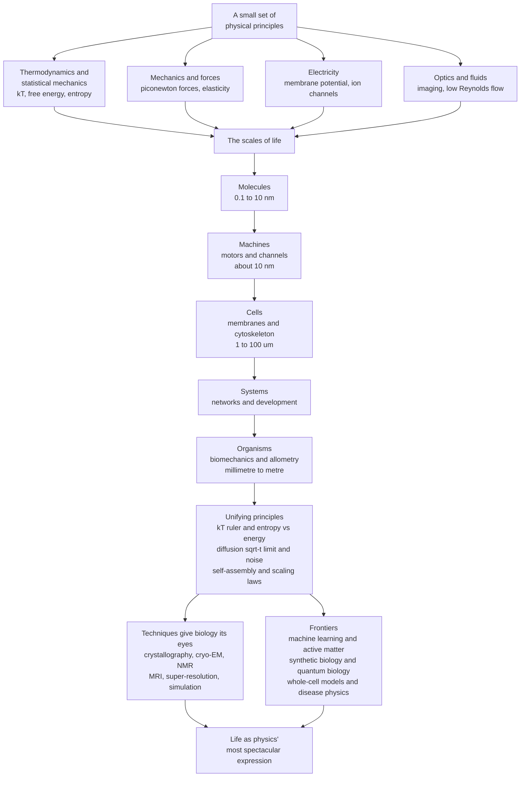

# 🧵 The Reach and Future of Biophysics

> [!abstract] TL;DR
> This is the **capstone** of the vault: the claim that **life obeys physics**, and that a small set of physical principles — free energy and the thermal currency $k_BT$, the entropy-versus-energy competition, diffusion and its $\sqrt{t}$ limit, life amid thermal noise, self-assembly from weak forces, energy transduction, scaling laws, and hard physical limits — explains phenomena across **every** scale of biology, from the quantum tunnelling of an electron to the flight of a bird. Biophysics, in Bialek's phrase, is **"the search for the physical principles underlying life."** It made biology **quantitative and predictive** (Hodgkin–Huxley, Michaelis–Menten, allometric laws), it gave the life sciences their **eyes** (crystallography, cryo-EM, NMR/MRI, super-resolution, single-molecule methods, simulation), and it now drives frontiers in **machine learning, synthetic biology, active matter, and the physics of disease** — all while honestly balancing physics' love of universal law against biology's evolved, glorious messiness. Life is not a violation of physics but its **most spectacular expression**: the unbroken thread from the electron to the elephant.

---

## Intuition

**Analogy:** Start with a handful of physical ideas and follow them, unbroken, all the way up the ladder of life. Thermal energy is a **currency** — every molecule at body temperature carries about one $k_BT$ of jiggle, and biology spends it, saves it, and works against it. **Entropy** pulls constantly toward disorder, so anything ordered must pay for its tidiness in dissipated heat. **Diffusion** is the aimless stagger of a drunk molecule, covering distance only as the square root of time. And **forces** balance — a bone, a membrane, a swimming bacterium each settle where the pushes cancel. Hold onto these four ideas and you can trace them from a single protein folding, to a molecular motor walking, to a nerve firing, to an elephant's heart beating in time with its size. The *same* thermal currency, the *same* entropic pull, the *same* random walk, the *same* balance of forces.

That is the audacious bet of biophysics: that life, in all its staggering complexity, is **not exempt** from physics but is physics' most extraordinary achievement — matter organized by ordinary physical law into a thing that replicates, transduces energy, and processes information. Few fields connect the quantum tunnelling of an electron to the flight of a bird with a single conceptual thread. This note pulls that thread through the whole vault — from the [[Biophysics_Overview]] that opened it to the [[Cryo_Electron_Microscopy]] and [[Fluorescence_Microscopy_and_Super_Resolution]] that gave us new eyes — and asks where the thread leads next.

---

## How It Works

### The through-line: a few principles, all the scales

Every note in this vault is a variation on one melody. Collected, the recurring principles are:

1. **$k_BT$ is the ruler and the currency.** The thermal energy $k_BT \approx 4.1$ pN·nm $\approx 25$ meV $\approx 0.6$ kcal/mol at body temperature is the unit against which *everything* biological is measured (see [[Scales_Units_and_Orders_of_Magnitude_in_Biophysics]] and [[Statistical_Mechanics_of_Biomolecules]]). Bonds that matter are a few $k_BT$ (breakable, tunable, reversible); covalent bonds are ~100 $k_BT$ (permanent). ATP delivers ~20 $k_BT$. A signalling switch needs an energy gap of only a few $k_BT$. The Boltzmann factor $e^{-E/k_BT}$ then converts every energy into a probability — of a channel opening, a ligand binding, a protein unfolding.

2. **Entropy versus energy is the master competition.** Folding, binding, and self-assembly are all the same tug-of-war between energetic gain ($\Delta H$) and entropic cost ($T\Delta S$), settled by minimizing free energy $\Delta G = \Delta H - T\Delta S$ (see [[Energy_Entropy_and_Free_Energy_in_Biology]] and [[Protein_Structure_and_Folding]]). The **hydrophobic effect** — the engine of membrane formation and much of protein folding — is famously *entropy-driven*: water gains disorder when oily surfaces hide, and that gain, not a direct attraction, drives assembly (see [[Intermolecular_Forces_and_the_Aqueous_Environment]] and [[Membranes_and_Lipid_Bilayers]]).

3. **Diffusion, and its $\sqrt{t}$ limit, shapes the geography of life.** Because random walks give $\langle x^2\rangle = 2Dt$, diffusion time explodes as distance squared (see [[Diffusion_and_Brownian_Motion_in_Cells]]). This single fact dictates that cells must be **microscopic**, that neurons signal **electrically** rather than by diffusion, and that large organisms need **circulatory systems** to advect what diffusion cannot deliver. The $\sqrt{t}$ limit is a wall, and much of life's architecture is scaffolding built to get around it.

4. **Life works amid thermal noise — beating it, exploiting it, tolerating it.** At $k_BT$, everything is kicked constantly. Molecular motors **ratchet** that noise into directed motion (see [[Molecular_Motors_and_Mechanochemistry]]); senses push against fundamental noise floors to detect single photons and near-single molecules (see [[The_Physics_of_Hearing_and_Vision]]); and signalling networks compute reliably despite stochastic gene expression. The **Berg–Purcell limit** sets how accurately a cell can ever measure a concentration by counting diffusing molecules — a physical bound on perception itself.

5. **Self-assembly from weak forces.** No hand places the atoms. Membranes, viral capsids, filaments, and the folded protein all build themselves from many weak, reversible interactions summing to a deep free-energy minimum (see [[The_Cytoskeleton_and_Cell_Mechanics]] and [[The_Physics_of_DNA_and_RNA]]). Weakness is a feature: only interactions near $k_BT$ can be both stable enough to hold and labile enough to remodel.

6. **Energy transduction.** Life is a chain of energy converters — photons to chemical bonds, chemical bonds to ion gradients, ion gradients to ATP, ATP to force and motion and light (see [[Enzyme_Kinetics_and_Catalysis_Physics]], [[Membrane_Potential_and_the_Nernst_Equation]], and [[Ion_Channels_and_Transport]]). Each conversion obeys thermodynamic bookkeeping; none is free.

7. **Scaling laws.** From a $10^{21}$-fold range of body mass emerges the astonishing regularity of quarter-power allometry — metabolic rate $\propto M^{3/4}$, heartbeat $\propto M^{-1/4}$, lifespan $\propto M^{+1/4}$, lifetime heartbeats nearly constant (see [[Allometry_and_Scaling_Laws_in_Biology]] and [[Fluid_Dynamics_in_Biology]]). Physical constraints on resource-distribution networks shape the design of every organism.

8. **Physical limits constrain and sculpt.** Diffusion times, the Berg–Purcell sensing bound, viscosity at low Reynolds number, the finite energy of a bond, and even quantum effects set the **edges of the possible**. Evolution is a search *within* a box whose walls are drawn by physics.

### The scales it traverses — quarks to elephants

- **Quantum and single-molecule.** Electron tunnelling in respiratory chains, coherent energy transfer in photosynthesis, tunnelling of protons in enzymes — the domain of [[Wave_Particle_Duality_and_Uncertainty]] made biological.
- **Macromolecular machines.** Motors, the ribosome, ATP synthase, ion channels — piconewton engines watched one at a time by [[Single_Molecule_Biophysics]].
- **Cells.** Membranes as capacitors, the cytoskeleton as active scaffolding, the action potential as a travelling wave of electricity (see [[The_Hodgkin_Huxley_Model_and_Action_Potentials]], [[Bioelectricity_and_Cellular_Signaling_Physics]], and [[Cell_Motility_and_Adhesion]]).
- **Systems.** Reaction–diffusion pattern formation, developmental symmetry breaking, neural information (see [[Pattern_Formation_and_Morphogenesis]] and [[Neural_Biophysics_and_Information]]).
- **Organisms.** Biomechanics, blood flow, and allometric design (see [[Biomechanics_of_Movement]]).

### The techniques that gave biology its eyes

Biophysics is, historically, an **instrument-driven** science: each revolution came when a physical method made an invisible molecular process visible and quantitative. X-ray crystallography revealed the double helix and the first protein structures (see [[X_Ray_Crystallography_and_Structural_Biology]]); NMR and its clinical child MRI probe structure and living tissue (see [[NMR_and_Magnetic_Resonance_in_Biology]]); fluorescence and super-resolution broke the diffraction limit to watch molecules inside cells (see [[Fluorescence_Microscopy_and_Super_Resolution]]); cryo-EM now solves near-atomic structures of the machines that resisted crystals (see [[Cryo_Electron_Microscopy]]); and spectroscopy plus optical methods read out dynamics in real time (see [[Spectroscopy_and_Optical_Methods_in_Biophysics]]). Every "picture" of a molecule in a biology textbook is a physics measurement.

### Flow / Architecture



---

## Key Concepts

### Secondary Level

- **Life is physics, not magic.** A cell builds order by spending energy and dumping disorder into its surroundings — like a refrigerator, not a miracle. Nothing in it breaks the laws of nature.
- **One toolkit, all sizes.** The same few ideas — heat energy as money, the pull toward disorder, random jiggling, the balance of forces — explain a folding protein, a firing nerve, and an elephant's heartbeat.
- **Physics gave biology its eyes.** We can see molecules at all only because physicists invented crystallography, electron microscopes, MRI, and super-bright microscopes.

### Undergraduate Level

- **The unifying quantities.** $k_BT$ (energy), the piconewton (force), the nanometre–micrometre (length), and the diffusion length $\sqrt{Dt}$ (transport) recur at every scale; fluency in them lets you *estimate* whether a mechanism is even possible.
- **Quantitative, predictive biology.** Biophysics turned biology into a science that predicts numbers, not just tells stories: **Hodgkin–Huxley** predicts the shape and speed of a nerve spike; **Michaelis–Menten** predicts reaction rates; **Kleiber's law** predicts heart rate from body mass. Models that *predict*, not merely describe.
- **Non-equilibrium and dissipation.** Living systems are open and driven; they maintain order by continuously exporting entropy. Equilibrium formulas apply only locally.
- **Physical limits as design constraints.** Diffusion times, the Berg–Purcell sensing bound, and low-Reynolds-number viscosity are not footnotes — they set why cells are small, why we have blood, and how bacteria must swim.

### Graduate Level

- **The search for principles (Bialek).** The mature ambition is not to catalogue mechanisms but to find *principles* — optimality arguments (are photoreceptors, or the genetic code, or transcriptional regulation operating at a physical bound?), and information-theoretic limits on sensing, coding, and control.
- **Active matter.** Tissues, cytoskeletal networks, and bacterial swarms are **active materials**: many units each consuming energy, giving rise to collective flows, spontaneous motion, and phases with no equilibrium analogue. A genuinely new branch of non-equilibrium statistical physics born from biology.
- **Machine learning as a new instrument.** **AlphaFold** solved a 50-year problem (sequence-to-structure) by learning the statistics of evolution and physics together; ML force fields, cryo-EM image analysis, and single-cell inference are reshaping what is measurable.
- **Whole-cell and multiscale modelling.** Integrating molecular, network, and cellular physics into predictive models of an entire cell — the "understanding by simulation" complement to "understanding by construction" (synthetic biology).
- **The physics of disease.** Cancer as a problem of mechanics, evolution, and non-equilibrium growth; neurodegeneration as aberrant protein self-assembly (misfolding and aggregation) — physical framings that generate quantitative, testable models.

---

## Python Demo

```python
# CAPSTONE: "The map of biophysics" - the unbroken thread from molecule to organism.
#
# Panel A: a log-log LENGTH-vs-TIME map of phenomena this vault covered, from
#          protein folding (nm, microseconds) to a human lifespan (m, ~10^9 s).
#          Overlaid is the DIFFUSION line t = L^2 / (2D): where a process sits FAR
#          BELOW that line, it is faster than diffusion could ever be at that size,
#          so life must use active transport, electrical signalling, or advection
#          to beat the sqrt(t) wall. One picture, ~15 orders of magnitude each way.
#
# Panel B: the kT RULER - characteristic ENERGIES across the vault, in units of kT.
#          Life operates in a narrow band from ~1 kT (thermal, tunable) to ~100 kT
#          (covalent, permanent); the interesting, remodellable biology lives at a
#          few-to-tens of kT.
#
# Requires: numpy, matplotlib
import numpy as np
import matplotlib.pyplot as plt

# ---- Fundamental constants (SI) ----
kB = 1.380649e-23      # Boltzmann constant, J/K
NA = 6.02214076e23     # Avogadro's number, 1/mol
qe = 1.602176634e-19   # elementary charge, C
T  = 310.0             # body temperature, K
kT = kB * T            # thermal energy, J
kT_kcal = kT * NA / 4184.0

# ------------------------------------------------------------------
# Panel A data: (name, length in metres, time in seconds)
# ------------------------------------------------------------------
phenomena = [
    ("Protein\nfolding",     5e-9,   1e-4),
    ("Motor\nstep",          8e-9,   5e-3),
    ("Channel\ngating",      1.5e-9, 1e-3),
    ("Diffusion\nacross cell",1e-5,  5e-2),
    ("Action\npotential",    3e-4,   2e-3),
    ("Cell\ndivision",       1e-5,   1.2e3),
    ("Heartbeat",            0.1,    1.0),
    ("Organism\nlifespan",   1.0,    2.5e9),
]
names = [p[0] for p in phenomena]
L = np.array([p[1] for p in phenomena])
t = np.array([p[2] for p in phenomena])

# Diffusion reference line: t = L^2 / (2D), small molecule in water
D = 1e-9                                  # m^2/s
Lline = np.logspace(-9, 0.3, 200)         # 1 nm .. ~2 m
tline = Lline**2 / (2 * D)

print("=== kT at body temperature ===")
print("kT = %.3e J = %.2f kcal/mol\n" % (kT, kT_kcal))
print("=== Diffusion time to cross a length (t = L^2/2D, D=1e-9 m^2/s) ===")
for Lx, lab in [(1e-9,"1 nm"), (1e-5,"10 um (cell)"), (1e-3,"1 mm"), (1.0,"1 m")]:
    print("  %-12s -> %.2e s" % (lab, Lx**2/(2*D)))

# ------------------------------------------------------------------
# Panel B data: characteristic energies (in kcal/mol), converted to kT
# ------------------------------------------------------------------
energy_labels = ["Thermal\nkT", "Hydrogen\nbond", "Base\npair", "ATP\nhydrolysis",
                 "Motor step\nwork", "Covalent\nC-C bond"]
E_kcal = np.array([kT_kcal, 2.0, 2.5, 12.5, 12.5*0.6, 83.0])  # kcal/mol
E_kT = E_kcal / kT_kcal
print("\n=== Energies in units of kT ===")
for nm, e in zip(energy_labels, E_kT):
    print("  %-14s %6.1f kT" % (nm.replace(chr(10), ' '), e))

# ------------------------------------------------------------------
# PLOTS
# ------------------------------------------------------------------
fig, (axA, axB) = plt.subplots(1, 2, figsize=(15, 6.5))
fig.suptitle("The reach of biophysics: one thread from the electron to the elephant",
             fontsize=14, fontweight="bold")

# --- Panel A: the length-time map ---
axA.loglog(Lline, tline, color="#868e96", lw=2, ls="--",
           label="diffusion limit  t = L^2 / 2D")
axA.fill_between(Lline, tline, tline*0 + 1e-12, color="#e7f5ff", alpha=0.5)

colors = plt.cm.viridis(np.linspace(0, 0.9, len(phenomena)))
axA.scatter(L, t, s=140, c=colors, edgecolor="k", zorder=5)
for (nm, Lx, tx, c) in zip(names, L, t, colors):
    axA.annotate(nm, (Lx, tx), textcoords="offset points", xytext=(9, 6),
                 fontsize=8, fontweight="bold")

# scale-band guides
for Lx, lab in [(1e-9,"nm"), (1e-6,"um"), (1e-3,"mm"), (1.0,"m")]:
    axA.axvline(Lx, color="gray", ls=":", lw=0.6)
axA.set_xlabel("characteristic length  L  (m)")
axA.set_ylabel("characteristic time  t  (s)")
axA.set_title("A. The map of life: ~15 orders in size, ~13 in time\n"
              "points far BELOW the dashed line beat diffusion by\n"
              "active transport, electricity, or blood flow")
axA.set_xlim(1e-9, 3)
axA.set_ylim(1e-5, 1e11)
axA.legend(loc="upper left", fontsize=9)
axA.grid(True, which="major", alpha=0.2)

# --- Panel B: the kT ruler ---
bar_colors = ["#adb5bd", "#51cf66", "#38d9a9", "#ffa94d", "#ff922b", "#ff6b6b"]
axB.bar(energy_labels, E_kT, color=bar_colors, edgecolor="k")
axB.axhline(1.0, color="gray", ls="--", lw=1)
axB.set_yscale("log")
axB.set_ylabel("energy  (units of kT)")
axB.set_title("B. The kT ruler: life works between ~1 and ~100 kT\n"
              "weak-but-tunable (few kT) vs permanent (~100 kT)")
for i, e in enumerate(E_kT):
    axB.text(i, e*1.15, "%.0f" % e if e >= 1 else "%.1f" % e,
             ha="center", va="bottom", fontsize=9)
axB.axhspan(1, 30, color="#fff3bf", alpha=0.4, zorder=0)  # the "remodellable" band

plt.tight_layout(rect=[0, 0, 1, 0.94])
plt.savefig("biophysics_reach.png", dpi=130)
print("\nSaved figure to biophysics_reach.png")
```

Running this prints $k_BT \approx 0.61$ kcal/mol, shows diffusion times ballooning from ~$5\times10^{-10}$ s across a nanometre to ~$5\times10^{11}$ s across a metre (the reason a human cannot rely on diffusion and needs a heart), and draws the two capstone pictures: a **length–time map** spanning roughly 15 orders of magnitude in size and 13 in time, with the diffusion wall threading through the molecular and cellular regime; and the **$k_BT$ ruler**, showing that all of interesting biology is squeezed into the narrow energy band between the thermal scale and the covalent bond.

---

## Real-World Applications

> **Example — cryo-EM vaccines and structure-based drug design.** When the COVID-19 spike protein was solved by **cryo-electron microscopy** within weeks of the genome being posted, that structure — a direct product of electron optics, statistical image averaging, and diffraction physics ([[Cryo_Electron_Microscopy]]) — guided the "2P" stabilizing mutations engineered into the mRNA vaccines. Biophysics did not merely describe the target; it shaped the therapeutic. The same structure-based pipeline, now supercharged by **AlphaFold** predictions, underpins modern rational drug design, docking candidate molecules into binding pockets with free-energy calculations grounded in statistical mechanics.

The applied payoff is enormous and everywhere:

- **Medical imaging.** MRI (nuclear magnetic resonance turned onto tissue, [[NMR_and_Magnetic_Resonance_in_Biology]]), ultrasound, PET, and optical coherence tomography are physics instruments that diagnose without a scalpel.
- **Neural engineering.** The Hodgkin–Huxley circuit model ([[The_Hodgkin_Huxley_Model_and_Action_Potentials]]) underlies cardiac pacemakers, cochlear implants, deep-brain stimulators, and brain–computer interfaces ([[Brain_Computer_Interfaces]]).
- **Biosensors and diagnostics.** Single-molecule and fluorescence methods ([[Single_Molecule_Biophysics]], [[Fluorescence_Microscopy_and_Super_Resolution]]) power nanopore sequencing, PCR readouts, and point-of-care assays.
- **Nanomedicine and bio-inspired engineering.** Self-assembly physics ([[Intermolecular_Forces_and_the_Aqueous_Environment]]) builds lipid-nanoparticle drug carriers; motor and muscle mechanics ([[Molecular_Motors_and_Mechanochemistry]], [[Biomechanics_of_Movement]]) inspire prosthetics and soft robotics.
- **The physics of disease.** Cancer modelled as mechanics and non-equilibrium growth ([[Allometry_and_Scaling_Laws_in_Biology]] informs tumour metabolic scaling); neurodegeneration modelled as aberrant protein aggregation ([[Protein_Structure_and_Folding]], [[Neurodegenerative_Diseases]]).

---

## Common Pitfalls

- **The "spherical cow" — mistaking a clean model for the messy truth.** Physics prizes *simple, universal* laws; biology is *evolved, contingent, and specific*. A model that ignores the one biological detail that matters (a regulatory feedback, a post-translational modification, a rare cell type) can be elegant and wrong. Ask always: does this physical model **illuminate** the mechanism, or does it **oversimplify** away the biology that carries the function?
- **Universal-law envy.** Not every biological regularity is a deep principle; some are frozen accidents of history. The unresolved 3/4-versus-2/3 debate in [[Allometry_and_Scaling_Laws_in_Biology]] is a cautionary case study in how hard it is to test a claimed "universal law" against genuinely messy, phylogenetically structured data.
- **Ignoring biological specificity.** Two proteins with identical folds can do opposite things; a physical description at the level of "a polymer minimizing free energy" may miss the single catalytic residue that defines the biology. Respect the details.
- **Treating the cell as an equilibrium or a clean-room robot.** Life is driven, dissipative, and noisy at $k_BT$. Equilibrium formulas apply only locally, and any mechanism demanding sub-thermal precision is likely swamped by the jiggle (see [[Diffusion_and_Brownian_Motion_in_Cells]]).
- **Numbers without mechanism — or mechanism without numbers.** A model that fits a curve but proposes no physical mechanism explains nothing; equally, a verbal mechanism that never survives a back-of-the-envelope estimate of energies, forces, and timescales is not yet physics.
- **The honest caveat.** Biophysics *at its best* holds both commitments at once — physics' rigour and biology's complexity. The mature stance is a **naturalistic humility**: life is not "physics as usual," it is physics organized by three billion years of selection into something no equilibrium ensemble would ever produce. Dissolving the mystical boundary between living and non-living does not flatten biology into physics; it reveals biology as physics' most intricate, contingent, and astonishing special case.

---

## Related Concepts

**Foundations and unifying principles**
- [[Biophysics_Overview]] — the opening statement of the whole program that this note now closes.
- [[Scales_Units_and_Orders_of_Magnitude_in_Biophysics]] — the $k_BT$, piconewton, and nanometre fluency that makes the "map of life" readable.
- [[Statistical_Mechanics_of_Biomolecules]] — the Boltzmann machinery beneath folding, binding, and gating.
- [[Energy_Entropy_and_Free_Energy_in_Biology]] — the entropy-versus-energy competition that recurs at every scale.
- [[Diffusion_and_Brownian_Motion_in_Cells]] — the $\sqrt{t}$ limit that dictates the geography of cells and bodies.
- [[Intermolecular_Forces_and_the_Aqueous_Environment]] — the weak forces and hydrophobic effect that drive self-assembly.

**Molecules and machines**
- [[Protein_Structure_and_Folding]] — the energy-landscape search; and, in disease, the physics of aggregation.
- [[The_Physics_of_DNA_and_RNA]] — polymer physics and self-assembly of the genetic material.
- [[Molecular_Motors_and_Mechanochemistry]] — ratcheting thermal noise into directed, piconewton motion.
- [[Enzyme_Kinetics_and_Catalysis_Physics]] — energy transduction and rate theory at the catalytic step.
- [[Single_Molecule_Biophysics]] — watching one machine at a time; the tool of the modern field.
- [[Membranes_and_Lipid_Bilayers]] — self-assembly of the compartment that makes a cell possible.

**Cells and systems**
- [[Membrane_Potential_and_the_Nernst_Equation]] — the battery; ion gradients as stored free energy.
- [[Ion_Channels_and_Transport]] — Boltzmann-governed switches that gate the electricity.
- [[The_Hodgkin_Huxley_Model_and_Action_Potentials]] — the quantitative, predictive triumph of biophysics.
- [[Bioelectricity_and_Cellular_Signaling_Physics]] — electricity as biology's fast signalling, beating diffusion.
- [[The_Cytoskeleton_and_Cell_Mechanics]] — active scaffolding; a paradigm of active matter.
- [[Cell_Motility_and_Adhesion]] — force balance and low-Reynolds mechanics at the cell scale.
- [[Pattern_Formation_and_Morphogenesis]] — reaction–diffusion symmetry breaking builds body plans.
- [[Neural_Biophysics_and_Information]] — information theory and physical limits on the brain.

**Organisms and scaling**
- [[Allometry_and_Scaling_Laws_in_Biology]] — quarter-power laws from the physics of transport networks.
- [[Fluid_Dynamics_in_Biology]] — blood flow and low-Reynolds swimming; the advection that beats diffusion.
- [[Biomechanics_of_Movement]] — the square-cube law and force balance at the organism scale.
- [[The_Physics_of_Hearing_and_Vision]] — senses operating near fundamental physical noise limits.

**Techniques — biology's eyes**
- [[X_Ray_Crystallography_and_Structural_Biology]] — the diffraction physics that revealed the double helix.
- [[NMR_and_Magnetic_Resonance_in_Biology]] — magnetic resonance from structure to MRI.
- [[Fluorescence_Microscopy_and_Super_Resolution]] — breaking the diffraction limit to watch molecules in cells.
- [[Cryo_Electron_Microscopy]] — near-atomic structures of the machines and viruses that resisted crystals.
- [[Spectroscopy_and_Optical_Methods_in_Biophysics]] — real-time readout of molecular dynamics.

**Cross-vault anchors**
- [[Classical_Statistical_Mechanics]] — the physics parent of the $k_BT$ and Boltzmann reasoning.
- [[Entropy_and_Second_Law]] — why living order requires continuous dissipation.
- [[Wave_Particle_Duality_and_Uncertainty]] — the quantum layer beneath tunnelling and quantum biology.
- [[Viscous_Fluids_and_Navier_Stokes]] — the fluid physics of life at low Reynolds number.
- [[Chemical_Thermodynamics]] — free energy and equilibrium at the reaction level.
- [[NMR_Spectroscopy]] — the chemistry-side view of magnetic resonance structure determination.
- [[Protein_Structure_and_Function]] — the biochemistry companion to the physics of folding.
- [[Bioenergetics_and_ATP]] — the ~20 $k_BT$ per ATP that powers every molecular engine.
- [[Cancer_and_the_Cell_Cycle]] — the disease reframed by the physics of growth and mechanics.
- [[Natural_Selection_and_Adaptation]] — the evolutionary search *within* the box that physics draws.
- [[Emergence_and_Self_Organization]] — self-assembly and pattern formation as complex-systems phenomena.
- [[Dissipative_Structures_and_Nonequilibrium]] — the non-equilibrium thermodynamics that defines living matter.
- [[Autopoiesis_and_Living_Systems]] — the systems-theoretic framing of the self-producing cell.

---

## Review Questions

**Secondary**
1. Biophysics claims that "life is physics' most extraordinary achievement, not an exception to it." Using the refrigerator analogy and the idea of thermal energy as a currency, explain in your own words why a cell building intricate order does not break the laws of physics — and name two ways physics gave biology "new eyes."

**Undergraduate**
2. Pick three phenomena from the vault that live at wildly different scales — say a protein folding, a nerve firing, and an elephant's heartbeat — and identify the *same* physical principle threading through all three. Then, using the diffusion relation $t \sim L^2/(2D)$, explain quantitatively why a large organism cannot rely on diffusion for internal transport and what physical strategy it uses instead. Roughly how long would a small molecule take to diffuse across a 1 m human?

**Graduate**
3. Bialek defines biophysics as "the search for the physical principles underlying life," yet biology is evolved, contingent, and messy. Choose one place in this vault where an elegant physical model *illuminates* the biology and one where it risks *oversimplifying* it (the "spherical cow"), and argue what distinguishes the two cases. Then name one current frontier — machine learning, active matter, synthetic biology, or the physics of disease — and explain what genuinely *new physics* (not just new applications) biology is forcing physicists to invent.

---

## Sources

- William Bialek — *Biophysics: Searching for Principles* (Princeton University Press, 2012).
- Rob Phillips, Jane Kondev, Julie Theriot & Hernan Garcia — *Physical Biology of the Cell*, 2nd ed. (Garland Science, 2012).
- Philip Nelson — *Biological Physics: Energy, Information, Life* (updated ed., Chiliagon/Freeman, 2020).
- Jumper, J. et al. (2021). "Highly accurate protein structure prediction with AlphaFold." *Nature* 596: 583–589. — [doi.org/10.1038/s41586-021-03819-2](https://doi.org/10.1038/s41586-021-03819-2)
- Marchetti, M. C. et al. (2013). "Hydrodynamics of soft active matter." *Reviews of Modern Physics* 85: 1143. — [doi.org/10.1103/RevModPhys.85.1143](https://doi.org/10.1103/RevModPhys.85.1143)

---

#biophysics #synthesis #capstone #physics-of-life #interdisciplinary
