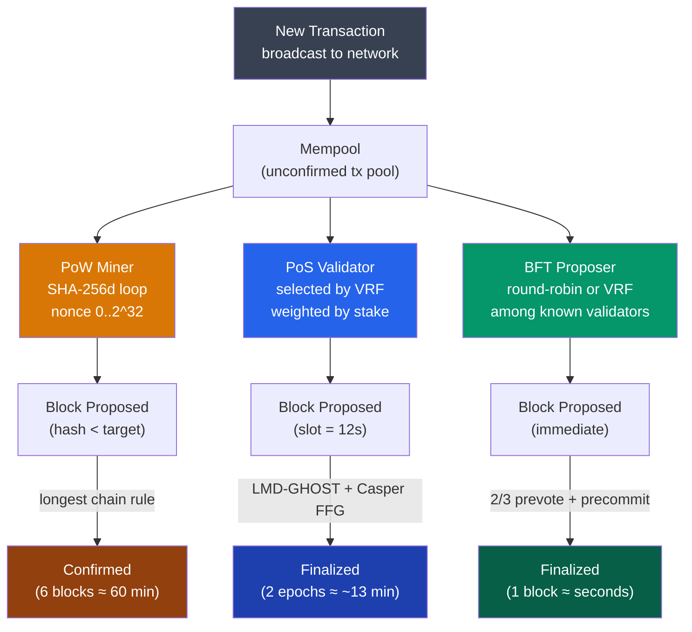

# 🗳️ Consensus Mechanisms

> [!abstract] TL;DR
> Consensus mechanisms are the protocols by which distributed nodes agree on a canonical chain state without trusting each other. **Proof of Work** (Nakamoto, 2008) achieves Sybil resistance through energy expenditure — the longest chain with most accumulated work wins; honest majority >50% guarantees probabilistic safety. **Proof of Stake** (Ethereum post-Merge, Casper FFG + LMD-GHOST) replaces energy with staked capital — validators risk slashing (up to 100% of 32 ETH stake) for equivocation or inactivity; threshold is 2/3 supermajority for finality. **BFT consensus** (Tendermint, HotStuff) achieves deterministic single-block finality in O(n²) communication rounds but requires known validator sets and fails if >1/3 nodes are Byzantine. The trilemma manifests directly: PoW maximizes decentralization, BFT maximizes throughput, PoS attempts to balance all three.

## Intuition — analogy FIRST
Imagine a room full of strangers who have never met and need to agree on the current time — but some are lying and some just make mistakes. In Proof of Work, everyone has to solve a hard puzzle first before proposing the time, and the proposal with the most puzzle-work behind it wins. Liars have to out-work everyone else combined. In Proof of Stake, everyone puts money in escrow proportional to their influence, and if you're caught lying, you forfeit the escrow. In BFT, participants exchange signed attestations in rounds: propose → vote → commit. As long as fewer than one-third are actively malicious, the group reaches agreement in a predictable number of rounds.

The tradeoff: the puzzle (PoW) lets unlimited anonymous participants join but wastes energy; the escrow (PoS) is more efficient but favors the already-wealthy; the round-based vote (BFT) is the fastest but breaks if you don't know who's in the room in advance.

---

## How It Works



---

## Key Concepts / Details

### Proof of Work (Nakamoto Consensus)
The miner repeatedly hashes the block header (including a 4-byte `nonce`) until the resulting SHA-256d hash is below the **target** value encoded as `nBits` in the header:

```
SHA-256d(block_header) < target
```

**Difficulty** D = genesis_target / current_target. Retargets every 2016 blocks (~2 weeks) to maintain ~10-minute blocks.

**Selfish mining** attack: a miner with >33% hashrate can withhold blocks to gain disproportionate rewards. Solution: GHOST rule (Ethereum originally used it).

| Property | Value (Bitcoin) |
|----------|----------------|
| Block time | ~10 minutes |
| Finality | Probabilistic (~6 conf) |
| Energy | ~150 TWh/year |
| Sybil resistance | Hash rate |
| 51% attack cost | ~$8B (2025 estimate) |

### Proof of Stake — Ethereum Casper
Ethereum's PoS uses two mechanisms layered together:
1. **LMD-GHOST** (Latest Message Driven Greedy Heaviest Observed SubTree): fork-choice rule that weights branches by the latest attestations from validators.
2. **Casper FFG** (Friendly Finality Gadget): checkpoint finality. Every epoch (32 slots × 12s = 6.4 min), validators vote to justify/finalize a checkpoint. Two consecutive justified checkpoints = finalized.

**Slashing conditions** (lose up to 100% stake + ejected):
- **Equivocation**: signing two different blocks in the same slot
- **Surround vote**: voting for a checkpoint that surrounds a previous vote

**Inactivity leak**: offline validators gradually leak stake at rate proportional to time offline — ensures the network can eventually finalize even if many validators go offline.

```
Validator reward ≈ base_reward × (attestation_weight / total_weight)
Slash penalty ≈ 3 × (double_vote_stake / total_stake) × validator_balance
```

### BFT Consensus (Tendermint / HotStuff)
Classical BFT tolerates up to f Byzantine nodes in a network of n nodes, requiring **n ≥ 3f + 1** (i.e., >2/3 honest).

**Tendermint rounds**:
1. **Propose**: designated proposer broadcasts a block.
2. **Prevote**: each validator broadcasts prevote for the block (or nil if timeout).
3. **Precommit**: if a validator sees >2/3 prevotes for the same block, it broadcasts a precommit.
4. **Commit**: if >2/3 precommits received, block is committed and finalized.

**HotStuff** (used in LibraBFT/Aptos) reduces communication complexity from O(n²) to O(n) via a linear view-change protocol with threshold signatures.

| Property | PoW | PoS (Ethereum) | BFT (Tendermint) |
|----------|-----|----------------|-------------------|
| Finality | Probabilistic | ~13 min deterministic | Single block |
| Sybil resistance | Hash rate | Staked capital | Permissioned / staked |
| Throughput | ~7 TPS | ~15 TPS L1 | ~10k+ TPS |
| Communication | O(1) per node | O(n) attestations | O(n²) or O(n) HotStuff |
| Liveness under partition | Yes (longest chain) | Partial (inactivity leak) | No (halts if >1/3 offline) |
| Energy | Very high | Low | Low |

### Fork Choice Rules Comparison

| Rule | Used By | Description |
|------|---------|-------------|
| Longest Chain | Bitcoin (PoW) | Follow chain with most accumulated PoW |
| GHOST | Ethereum (original) | Heaviest subtree by block count including uncles |
| LMD-GHOST | Ethereum (PoS) | Heaviest subtree by latest validator attestations |
| Tendermint | Cosmos ecosystem | No fork; deterministic round-based |

---

## Real-World Notes
- Ethereum's Merge (Sep 2022) reduced energy consumption by ~99.95%, from ~78 TWh/year to ~0.01 TWh/year.
- Cosmos zones use Tendermint with 150 validators for ~7-second finality.
- Solana uses **Tower BFT** (a PoH-backed BFT) — validators vote on a proof-of-history sequence, achieving ~400ms slots but with known validator centralization.
- **Long-range attacks** are possible in PoS: an attacker with old keys (from before slashing was implemented) can rewrite history. Mitigated by weak subjectivity checkpoints.

---

## Common Pitfalls
1. **Treating PoS as risk-free** — slashing can destroy 100% of stake; validator uptime is critical.
2. **Confusing BFT liveness with safety** — BFT systems halt (no new blocks) when >1/3 nodes are offline; they never produce conflicting finalized blocks. Bitcoin stays live (just slower) under any partition.
3. **Assuming 6 Bitcoin confirmations is always safe** — for large transfers on alt-chains with low hashrate, 6 confirmations may not be sufficient due to low 51% attack cost.
4. **Ignoring MEV in PoS** — validators can reorder transactions in their slot to extract value; see [[05_DeFi_Protocols/MEV_and_Arbitrage|MEV & Arbitrage]].

---

## Related Concepts
- [[_MOC_Blockchain_Fundamentals|↑ Blockchain Fundamentals MOC]]
- [[Distributed_Ledgers_and_Trilemma]] — trilemma shapes consensus design
- [[Hash_Functions_and_Merkle_Trees]] — SHA-256d is the PoW hash function
- [[P2P_Network_Architecture]] — gossip propagates blocks and attestations
- [[03_Bitcoin_Protocol/Mining_and_Difficulty|Mining & Difficulty]] — deep dive on PoW mechanics

---

## Review Questions
1. Ethereum PoS requires 2/3 supermajority for finality. If 40% of validators go offline simultaneously, what happens to the chain's safety and liveness?
2. A BFT chain with 100 validators suffers a network partition where 35 validators are separated from 65. Describe the behavior of each partition.
3. Design a consensus mechanism for a federated payment network of 20 known banks that needs <2-second finality. Justify your choice and state the failure assumptions.

---

## Sources
- Nakamoto, S. "Bitcoin: A Peer-to-Peer Electronic Cash System" (2008)
- Buterin & Griffith. "Casper the Friendly Finality Gadget" (2017, arXiv:1710.09437)
- Kwon, J. "Tendermint: Consensus without Mining" (2014)
- Yin et al. "HotStuff: BFT Consensus in the Lens of Blockchain" (2019, ACM PODC)

#Blockchain #BlockchainFundamentals #Consensus #PoW #PoS #BFT
