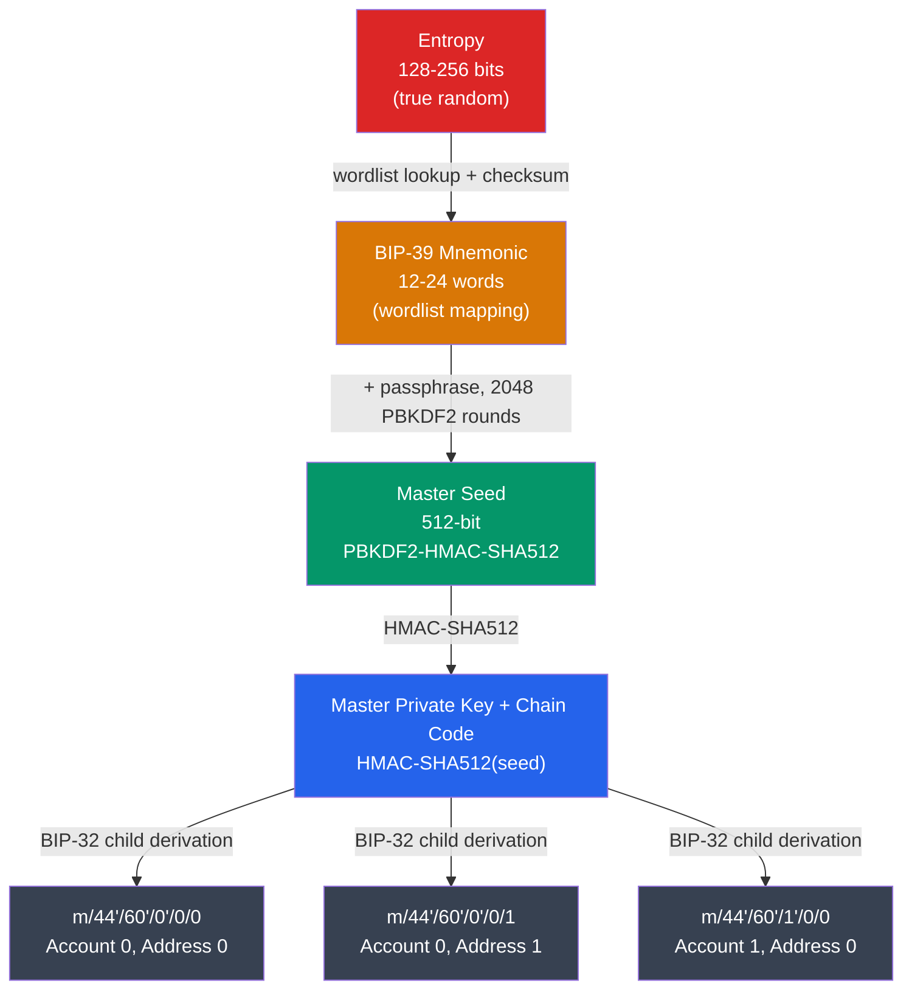

# 🔑 Cryptographic Primitives for Blockchain

> [!abstract] TL;DR
> Blockchain identity rests on **elliptic curve cryptography (ECC)** over two main curves: **secp256k1** (Bitcoin, Ethereum) and **ed25519** (Solana, Polkadot, Cosmos). A private key is a random 256-bit integer; the public key is computed as `PK = privkey × G` where G is the curve generator point (point multiplication = one-way trapdoor). An Ethereum address is `keccak256(PK)[12:32]` (last 20 bytes). **HD Wallets** (BIP-32/39/44) derive a tree of key pairs from a single master seed: BIP-39 maps 128–256 entropy bits to a 12–24 word mnemonic, BIP-32 derives child keys via `HMAC-SHA512(parent_key || index)`, and BIP-44 defines the path `m/44'/coin'/account'/change/index`.

## Intuition — analogy FIRST
Imagine a mathematical lock where you're given the combination result but not the starting point. The "multiplication" in elliptic curve math is like counting off steps around a circular track — easy to do 10,000 steps forward, computationally impossible to figure out how many steps you took just by looking at where you ended up. Your private key is the step count; your public key is where you ended up. Anyone can verify you started from a known point (G) if you tell them your endpoint, but they can't reverse-engineer how many steps you took.

HD wallets are like a master key that generates an infinite numbered set of lockboxes: you memorize one set of words, and the math generates a unique private key for each lockbox (account/address) on demand. Lose the words, lose everything; keep the words safe, recover everything.

---

## How It Works



---

## Key Concepts / Details

### Elliptic Curve Cryptography Basics
An elliptic curve over a finite field Fₚ is defined by: `y² ≡ x³ + ax + b (mod p)`

**Point addition**: given two points P and Q on the curve, P + Q = R (deterministic geometric rule). **Point multiplication**: `nP = P + P + P + ... (n times)` — computed efficiently via double-and-add in O(log n) operations.

The **discrete logarithm problem** on ECC: given P and Q = nP, finding n is computationally infeasible for properly chosen curves (~2^128 operations for 256-bit curves).

### secp256k1 (Bitcoin / Ethereum)
Defined by SECG (Standards for Efficient Cryptography Group):
```
y² ≡ x³ + 7 (mod p)
p = 0xFFFFFFFFFFFFFFFFFFFFFFFFFFFFFFFFFFFFFFFFFFFFFFFFFFFFFFFEFFFFFC2F
n = 0xFFFFFFFFFFFFFFFFFFFFFFFFFFFFFFFEBAAEDCE6AF48A03BBFD25E8CD0364141
G = (0x79BE667E..., 0x483ADA77...)
```
- **a=0, b=7** — a special form (Koblitz curve) enabling faster computation
- Key size: 256 bits private, 512 bits (uncompressed) or 264 bits (compressed) public
- **Compressed public key**: 33 bytes — prefix `02` (even y) or `03` (odd y) + 32-byte x

### ed25519 (Solana / Cosmos / Polkadot)
Based on **Curve25519** (Edwards-form), developed by Daniel J. Bernstein:
```
-x² + y² ≡ 1 - (121665/121666)x²y² (mod 2^255 - 19)
```
- Deterministic signatures (no random nonce needed — eliminates the Sony PS3 / ECDSA nonce-reuse vulnerability)
- Faster verification than secp256k1
- 32-byte private key, 32-byte public key, 64-byte signature

| Property | secp256k1 | ed25519 |
|----------|-----------|---------|
| Curve form | Weierstrass | Twisted Edwards |
| Key size | 32 / 33 bytes | 32 / 32 bytes |
| Signature size | 64-72 bytes (DER) | 64 bytes |
| Deterministic | No (RFC 6979 needed) | Yes |
| Signature aggregation | Schnorr/MuSig2 | Ristretto255/BLS |
| Used in | Bitcoin, Ethereum | Solana, Cosmos, SSH |

### Key Derivation: Address Generation
**Bitcoin (P2PKH)**:
```
privkey (32 bytes)
→ pubkey = privkey × G (33 bytes compressed)
→ SHA-256(pubkey)
→ RIPEMD-160(prev) = pubkey_hash (20 bytes)
→ add version byte (0x00) + checksum (SHA256d first 4 bytes)
→ Base58Check encode → "1A1zP1eP..." format
```

**Ethereum**:
```
privkey (32 bytes)
→ pubkey = privkey × G (64 bytes uncompressed, no prefix)
→ keccak256(pubkey) = 32 bytes
→ take last 20 bytes → address (0x...)
→ EIP-55: mixed-case checksum via keccak256(lowercase_hex_address)
```

### BIP-39: Mnemonic Generation
1. Generate **N bits of entropy** (128/160/192/224/256 bits)
2. Compute checksum: first `N/32` bits of SHA-256(entropy)
3. Append checksum to entropy → (N + N/32) bits
4. Split into groups of 11 bits → indices into the 2048-word BIP-39 wordlist
5. Result: 12/15/18/21/24 words

```python
# BIP-39 mnemonic → seed
import hashlib
mnemonic = "abandon abandon abandon abandon abandon abandon abandon abandon abandon abandon abandon about"
passphrase = ""  # optional user passphrase
seed = hashlib.pbkdf2_hmac(
    'sha512',
    mnemonic.encode('utf-8'),
    ('mnemonic' + passphrase).encode('utf-8'),
    iterations=2048
)
# seed is 64 bytes (512 bits)
```

### BIP-32: Hierarchical Deterministic Wallets
**Master key derivation**: `(IL, IR) = HMAC-SHA512("Bitcoin seed", seed)`. Master private key = IL (32 bytes), master chain code = IR (32 bytes).

**Child key derivation**:
- **Normal child** (index < 2^31): `HMAC-SHA512(chain_code || compress(pubkey) || index)`
- **Hardened child** (index ≥ 2^31, denoted with `'`): `HMAC-SHA512(chain_code || 0x00 || privkey || index)` — requires parent private key, cannot derive child from parent public key alone.

**Why hardened?** If both a child private key and parent extended public key (xpub) are compromised, an attacker can derive the parent private key for normal children. Hardened derivation prevents this.

### BIP-44: Purpose-Specific Derivation Paths
Standard path: `m / purpose' / coin_type' / account' / change / address_index`

| Level | Example | Description |
|-------|---------|-------------|
| purpose | 44' | BIP-44 (84' for native SegWit, 86' for Taproot) |
| coin_type | 0' (Bitcoin), 60' (Ethereum) | SLIP-44 registry |
| account | 0', 1', 2' | User-facing accounts |
| change | 0 (external), 1 (internal) | 1 = change addresses |
| address_index | 0, 1, 2, ... | Incremental addresses |

Example: `m/44'/60'/0'/0/0` = first Ethereum address, first account.

---

## Real-World Notes
- The secp256k1 curve was chosen by Satoshi specifically because, unlike NIST curves (P-256), it has no unexplained curve parameters that could conceal a backdoor.
- Storing a 12-word mnemonic on paper is the gold standard for cold storage. Hardware wallets (Ledger, Trezor) keep the private key in a secure element and never expose it.
- EIP-55 mixed-case checksum: `0x5aAeb6053F3E94C9b9A09f33669435E7Ef1BeAed` — the mixed case encodes a keccak checksum, allowing software to detect typos.
- **Vanity addresses** are generated by brute-forcing random key pairs until a desired prefix/suffix appears — purely cosmetic, no security difference.

---

## Common Pitfalls
1. **Reusing addresses** — reduces privacy (all transactions linkable) and, for old P2PKH addresses, reveals the public key on first spend.
2. **Confusing compressed and uncompressed public keys** — the Bitcoin address derived from `02...` vs `04...` are different; wallet software must track which format was used.
3. **Sharing the xpub (extended public key)** — an xpub exposes all non-hardened child addresses, enabling surveillance of the entire account without exposing funds.
4. **Not using hardened derivation for account level** — using `m/44'/60'/0/0/0` (non-hardened account) instead of `m/44'/60'/0'/0/0` creates a security hole.

---

## Related Concepts
- [[_MOC_Blockchain_Fundamentals|↑ Blockchain Fundamentals MOC]]
- [[02_Applied_Cryptography/ECDSA_and_Digital_Signatures|ECDSA & Digital Signatures]] — how the private key signs transactions
- [[03_Bitcoin_Protocol/UTXO_Model|UTXO Model]] — addresses own UTXOs
- [[03_Bitcoin_Protocol/Taproot_and_SegWit|Taproot & SegWit]] — BIP-86 path for Taproot keys

---

## Review Questions
1. An HD wallet uses path `m/44'/60'/0'/0/5`. The user's xpub for `m/44'/60'/0'` is publicly known and their address-index-3 private key is leaked. What can an attacker derive and why?
2. Explain why ed25519 signatures are deterministic and why this matters compared to secp256k1's original implementation.
3. You receive an Ethereum address `0x5aaEB6053f3E94c9b9A09f33669435E7ef1BeAed`. How do you verify it is not a typo, and what standard defines this?

---

## Sources
- BIP-32: Hierarchical Deterministic Wallets (Wuille, 2012)
- BIP-39: Mnemonic Code for Generating Deterministic Keys (Palatinus et al., 2013)
- BIP-44: Multi-Account Hierarchy (Palatinus & Rusnak, 2014)
- SECG: "SEC 2: Recommended Elliptic Curve Domain Parameters" (2010)
- Bernstein et al. "High-speed high-security signatures" (2011) — ed25519

#Blockchain #BlockchainFundamentals #ECC #secp256k1 #HDWallet #BIP32 #BIP39
