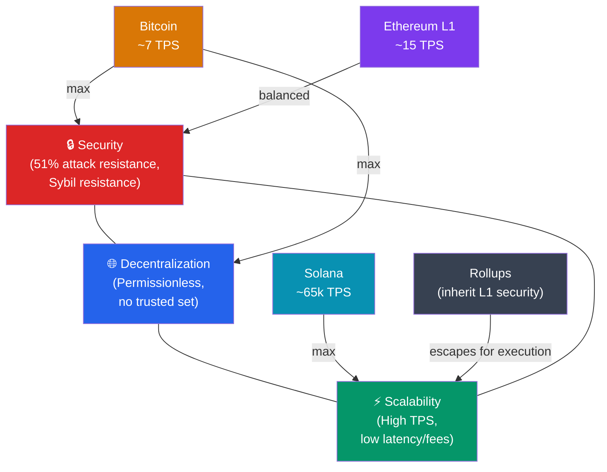

# ⚖️ Distributed Ledgers and the Blockchain Trilemma

> [!abstract] TL;DR
> A blockchain is an append-only, replicated, cryptographically-linked ledger maintained by a decentralized peer-to-peer network — no single entity controls it. The **Blockchain Trilemma** (coined by Vitalik Buterin) states that a system can optimize for at most two of three properties simultaneously: **Security** (resistant to attack), **Decentralization** (no small set of nodes can capture the system), and **Scalability** (high throughput and low latency). Bitcoin maximizes security + decentralization (~7 TPS), Solana maximizes security + scalability (~65k TPS but ~1,900 validators), and Layer 2 rollups escape the trilemma for the execution layer by inheriting L1 security.

## Intuition — analogy FIRST
Imagine a medieval village that decides to share a single accounting ledger for all debts and payments — but instead of trusting one scribe, every household keeps an identical copy. When someone wants to record a new transaction, they shout it across the village square; all scribes verify it's legitimate and add it simultaneously. No single scribe can secretly alter history because everyone else's copy would immediately disagree.

Now the village grows to a million households. Three problems appear that cannot all be solved at once: (1) you need to make the records tamper-proof even if some scribes are malicious, (2) you want every household, not just rich ones, to participate, and (3) you want settlements to finish in seconds rather than days. This is the blockchain trilemma — and every blockchain design is essentially a bet on which two of the three matter most for its use case.

---

## How It Works

### The Trilemma Visualized

### Distributed Ledger vs. Traditional Database

| Property | Traditional DB | Permissioned Ledger | Public Blockchain |
|----------|---------------|---------------------|-------------------|
| Trust model | Central admin | Known consortium | Trustless (anyone) |
| Write access | Admin only | Authorized nodes | Open (with fee) |
| Read access | ACL-controlled | Consortium members | Public |
| Fault tolerance | Replicas (hot standby) | BFT (f<n/3) | BFT or Nakamoto |
| Finality | Immediate | Deterministic | Probabilistic or deterministic |
| Throughput | 100k+ TPS | 10k+ TPS | ~15–65k TPS |
| Censorship resistance | None | Low | High |

---

## Key Concepts / Details

### Security
A network is **secure** if no adversary can rewrite history without controlling an economically prohibitive fraction of resources. In Proof-of-Work this is 51% of hash rate; in Proof-of-Stake this is 33% (liveness) or 67% (safety) of staked capital. The **Nakamoto coefficient** measures decentralization — the minimum number of entities that must collude to compromise the system (Bitcoin's is ~4 mining pools as of 2025).

### Decentralization
**Permissionless** means anyone with hardware and an internet connection can join as a validator. **Permissioned** ledgers (Hyperledger Fabric, R3 Corda) allow only whitelisted nodes — faster but no trustless guarantees. Decentralization erodes when:
- Hardware requirements are too high (Solana's 128 GB RAM validators)
- Stake is concentrated in a few wallets
- Mining pools centralize hash power

### Scalability
Measured by the **scalability trilemma extension**:
- **Throughput** (TPS): transactions per second processed
- **Latency**: time to first confirmation
- **Finality**: time until revert probability approaches zero

**Layer 2 solutions** (rollups, state channels, plasma) escape by off-loading execution while anchoring to L1 for security. ZK-rollups batch thousands of txs, generate a validity proof, and post only the proof + compressed state diff on-chain.

### Forks
- **Soft fork**: backward-compatible tightening of rules. Old nodes see new blocks as valid. (SegWit, Taproot)
- **Hard fork**: new rules incompatible with old software. Network splits unless all upgrade. (ETH/ETC split)
- **Chain reorganization (reorg)**: occurs when a longer competing chain overtakes the canonical chain; probabilistic finality systems are susceptible.

### Finality Types
| Type | Description | Chains |
|------|-------------|--------|
| Probabilistic | Risk decays exponentially with block depth | Bitcoin, pre-Merge Ethereum |
| Deterministic | Irreversible after sufficient validators attest | BFT chains (Cosmos/Tendermint), post-Merge ETH |
| Instant | Single-block finality | Some PoA chains |

---

## Real-World Notes
- Bitcoin's 6-confirmation rule (~60 min) gives ~0.1% reorg probability for honest >50% hash rate.
- Ethereum post-Merge achieves **single-slot finality** proposals (SSF) targeting ~12-second economic finality via Casper FFG.
- Solana achieves ~400ms block times but has experienced multiple multi-hour outages from network floods — a scalability-decentralization tradeoff made visible.
- Layer 2 rollups (Arbitrum, Optimism, zkSync) achieve thousands of TPS with Ethereum-level security, effectively sidestepping the trilemma for the execution layer.

---

## Common Pitfalls
1. **Confusing immutability with permanence** — a chain is immutable only while the network enforces it; a 51% attack rewrites history.
2. **Assuming permissioned = secure** — removing decentralization means you're trusting a consortium; one compromised member can collude.
3. **Ignoring finality type** — building an exchange that treats 1 Bitcoin confirmation as final enables double-spend attacks.
4. **Conflating throughput with scalability** — a chain processing 100k TPS on centralized validators is not scalable in the blockchain sense.

---

## Related Concepts
- [[_MOC_Blockchain_Fundamentals|↑ Blockchain Fundamentals MOC]]
- [[Consensus_Mechanisms]] — how nodes reach agreement on the canonical chain
- [[P2P_Network_Architecture]] — how the distributed ledger propagates transactions
- [[Hash_Functions_and_Merkle_Trees]] — how blocks are cryptographically linked

---

## Review Questions
1. You are designing a settlement network for a consortium of 12 banks. Rank your priorities in the trilemma and justify which blockchain architecture fits best.
2. A 51% attack on Ethereum PoS would cost an attacker how much capital approximately, and what happens to their stake if they're caught?
3. A Layer 2 optimistic rollup claims to inherit Ethereum security. What is the exact security assumption and what is the failure mode if it breaks?

---

## Sources
- Buterin, V. "Why sharding is great: demystifying the technical properties" (2021)
- Nakamoto, S. "Bitcoin: A Peer-to-Peer Electronic Cash System" (2008)
- ethereum.org — "The Ethereum roadmap"
- Kwon & Buchman — "Cosmos: A Network of Distributed Ledgers" (2016)

#Blockchain #BlockchainFundamentals #Trilemma #DistributedSystems
