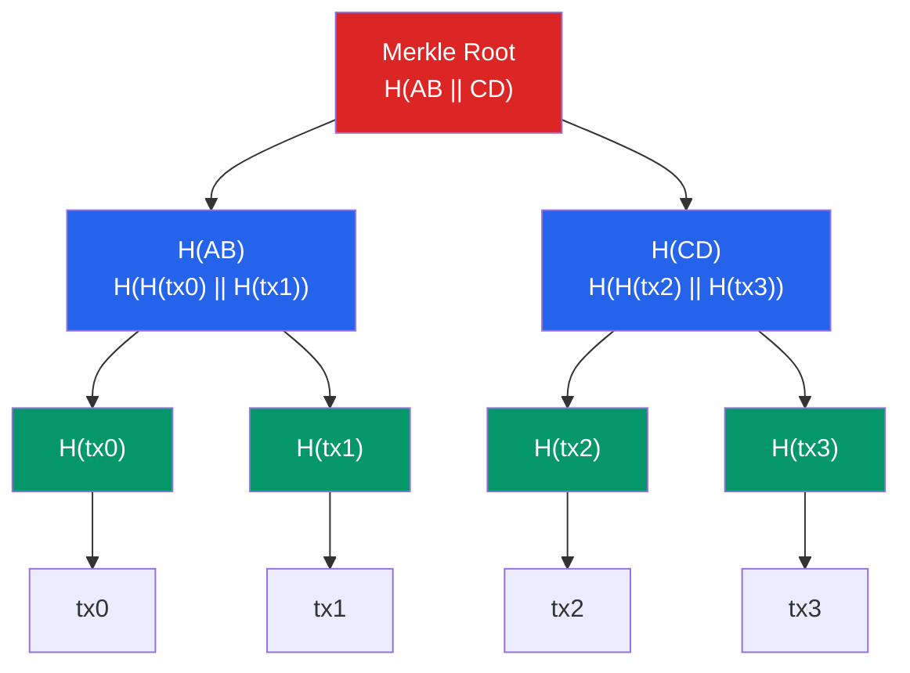

# 🌲 Hash Functions and Merkle Trees

> [!abstract] TL;DR
> A cryptographic hash function maps arbitrary input to a fixed-size digest (SHA-256: 256 bits, Keccak-256: 256 bits) with three security properties: **pre-image resistance** (can't reverse H(x) to x), **second pre-image resistance** (given x, can't find x' ≠ x with H(x)=H(x')), and **collision resistance** (can't find any pair x,x' with H(x)=H(x')). A **Merkle tree** is a binary tree of hashes where each leaf is H(transaction) and each internal node is H(left_child || right_child); the root commits to the entire dataset. A **Merkle proof** lets a light client verify tx inclusion in O(log n) hashes without downloading all n transactions — critical for Bitcoin SPV (Simplified Payment Verification) and Ethereum state proofs.

## Intuition — analogy FIRST
Imagine a fingerprinting system so perfect that changing even one letter of a million-page document produces a completely different 64-character fingerprint, and you can never reconstruct the document from just the fingerprint. That is a cryptographic hash function. Now imagine using that fingerprinter to summarize a list of 1000 entries: fingerprint each entry, pair them up and fingerprint the pairs, pair those fingerprints and fingerprint again — repeat until one root fingerprint remains. That root commits to all 1000 entries. To prove entry #437 is in the list, you only need to share ~10 fingerprints (the sibling path from leaf to root), not all 1000.

This is exactly how Bitcoin blocks summarize thousands of transactions into a single 32-byte Merkle root recorded in the block header, and why a light wallet on a mobile phone can verify its payment was included without downloading the entire chain.

---

## How It Works



**Merkle Proof for tx2**: provide `[H(tx3), H(AB)]`. The verifier computes `H(H(tx2) || H(tx3))` → `CD`, then `H(AB || CD)` → should match the known root.

---

## Key Concepts / Details

### SHA-256 — Bitcoin's Hash Function
SHA-256 (Secure Hash Algorithm 256-bit) is a member of the SHA-2 family, designed by NSA and standardized by NIST. Bitcoin uses **SHA-256d** = SHA-256(SHA-256(x)) — double hashing to defend against length-extension attacks.

Key properties:
- Output: 256 bits (32 bytes), displayed as 64 hex chars
- Block size: 512 bits
- Rounds: 64
- Compression function: Davies–Meyer construction
- **Avalanche effect**: flipping 1 input bit changes ~50% of output bits

```python
import hashlib
data = b"Hello, Blockchain"
digest = hashlib.sha256(hashlib.sha256(data).digest()).hexdigest()
# SHA-256d example
print(digest)
```

### Keccak-256 — Ethereum's Hash Function
Ethereum uses **Keccak-256**, the original submission to the SHA-3 competition (not the NIST-standardized SHA-3, which has different padding). This is why `keccak256("") != sha3("")` in most libraries.

| Property | SHA-256 | Keccak-256 |
|----------|---------|------------|
| Output | 256 bits | 256 bits |
| Construction | Merkle-Damgård | Sponge (Keccak) |
| Used in | Bitcoin, SSL/TLS | Ethereum, Solidity |
| Quantum attack | Grover's ≈ 2^128 | Grover's ≈ 2^128 |
| Length extension | Vulnerable (SHA-256) | Resistant |

```solidity
// Solidity — note: uses Keccak-256
bytes32 hash = keccak256(abi.encodePacked(msg.sender, amount));
```

### Merkle Trees in Detail

**Construction**: For n leaves (round up to next power of 2 with empty/zero leaves):
1. Hash each transaction: `leaf[i] = H(tx[i])`
2. While tree has >1 node: `parent = H(left || right)`
3. Root = final single hash

**Merkle Proof** (inclusion proof):
- Proof size: `O(log₂ n)` hashes
- Verification cost: `O(log₂ n)` hash operations
- For 1M transactions (2^20): proof = 20 hashes = 640 bytes

**Bitcoin SPV**: A mobile wallet downloads only 80-byte block headers (not 1MB+ blocks). To verify payment inclusion, the full node sends the Merkle proof (~640 bytes). The wallet hashes up to the root and checks it matches the header's `hashMerkleRoot` field.

### Merkle Patricia Tries — Ethereum
Ethereum uses a **Merkle Patricia Trie (MPT)** — a combination of a Patricia trie (radix-16 compressed trie) and Merkle hashing — for three state structures:

| Trie | What it stores | Key |
|------|---------------|-----|
| State Trie | Account balances, nonces, code hashes | keccak256(address) |
| Transaction Trie | All txs in block | RLP-encoded tx index |
| Receipt Trie | Logs, gas used, status | RLP-encoded tx index |

The **stateRoot** in an Ethereum block header commits to the entire world state. This enables stateless clients (EIP-4762 / Verkle trees successor) to verify state transitions with proofs.

### Collision Attacks
- **Birthday paradox**: finding a collision in H with n-bit output requires ~2^(n/2) attempts, not 2^n.
- SHA-256 collision resistance: ~2^128 — computationally infeasible today.
- MD5 and SHA-1 are **broken** for collision resistance (do not use in any cryptographic context).

---

## Real-World Notes
- Bitcoin's coinbase transaction is always the first leaf; the Merkle root changes if you change it (e.g., to change the `extraNonce`), which is how miners iterate the search space beyond the 4-byte nonce.
- Ethereum's state trie root changes with every block — this is what makes Ethereum's "proof of state" possible for light clients.
- `git` uses SHA-1 for content addressing (now transitioning to SHA-256 via `git -c extensions.objectFormat=sha256`).
- IPFS uses CIDs (Content Identifiers) based on Keccak or SHA-256 multihash — same principle of content-addressing.

---

## Common Pitfalls
1. **Using `keccak256` as a random number source** — the input is observable; miners can manipulate `block.prevrandao` in some contexts.
2. **Not handling odd leaf counts** — naively pairing leaves without duplicating the last odd leaf produces a non-standard Merkle tree; Bitcoin duplicates the last leaf.
3. **Confusing Keccak-256 with SHA3-256** — they have different padding; using the wrong one causes address mismatches in cross-chain protocols.
4. **Assuming Merkle proofs prove non-inclusion** — standard Merkle trees only prove inclusion; non-inclusion requires a sorted Merkle tree or accumulator.

---

## Related Concepts
- [[_MOC_Blockchain_Fundamentals|↑ Blockchain Fundamentals MOC]]
- [[Consensus_Mechanisms]] — miners/validators compute SHA-256d in PoW; block header includes Merkle root
- [[Cryptographic_Primitives_Blockchain]] — hash functions underpin key derivation (BIP-32 HMAC-SHA512)
- [[02_Applied_Cryptography/Commitment_Schemes|Commitment Schemes]] — Merkle root is a commitment to the dataset

---

## Review Questions
1. You need to prove to a light client that transaction #500,000 is in a Bitcoin block with 1,000,000 transactions. How many hashes does your Merkle proof contain and what is the total size in bytes?
2. An attacker obtains a second pre-image of a Bitcoin transaction hash. What can they do with it and why is the 2^256 security level the relevant bound?
3. Ethereum is considering switching from Merkle Patricia Tries to Verkle Trees (using polynomial commitments). What specific problem does this solve for stateless clients?

---

## Sources
- Nakamoto, S. "Bitcoin: A Peer-to-Peer Electronic Cash System" (2008) — Section 8 SPV
- NIST FIPS 180-4 — SHA-2 Standard
- Ethereum Yellow Paper — Appendix D, Merkle Patricia Trie
- Buterin, V. "Merkling in Ethereum" (2015, ethereum.org blog)

#Blockchain #BlockchainFundamentals #Hashing #MerkleTree #SHA256 #Keccak
