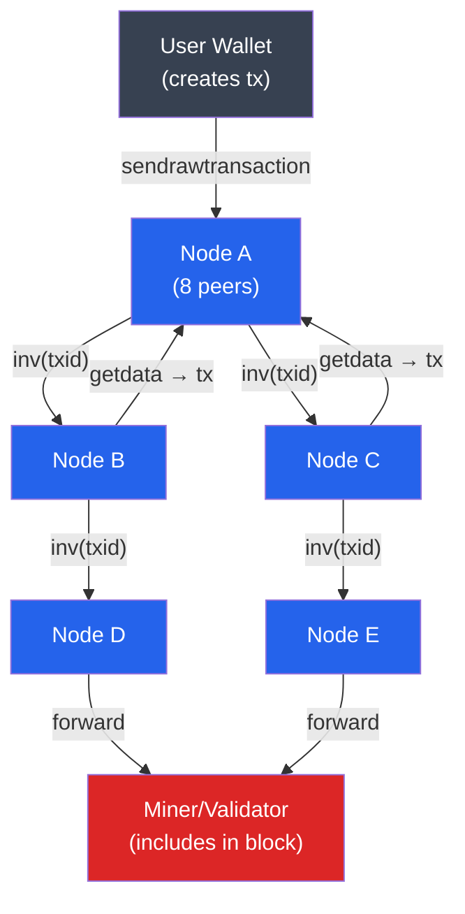

# 🌐 P2P Network Architecture

> [!abstract] TL;DR
> Blockchain networks use **unstructured P2P gossip** (Bitcoin, Ethereum) or **structured DHT-based** routing (IPFS/libp2p) to propagate transactions and blocks without a central server. Bitcoin's gossip: each node maintains 8–125 peer connections; new transactions are announced via `inv` → `getdata` → `tx` messages and propagate in ~2s globally; blocks propagate in ~0.4s via Compact Block Relay (BIP152). The **mempool** holds unconfirmed transactions ordered by fee rate (sat/vByte). **Eclipse attacks** partition a node from the honest network by filling all its peer slots with adversarial nodes — enabling double-spend attacks. Ethereum uses **discv5** for peer discovery and **libp2p gossipsub** for block/attestation propagation, with topics per domain (beacon blocks, attestations, blobs).

## Intuition — analogy FIRST
Think of a blockchain P2P network as a village rumor mill. When someone hears a new piece of gossip (transaction), they whisper it to 8 neighbors — each of those tells 8 more. Within a few hops, the whole village knows. Nobody directs traffic; information just diffuses. Importantly, before forwarding the gossip, each neighbor checks whether it's plausible (validates the signature) and whether they've already heard it (deduplication by txid). If you can replace all of someone's neighbors with your own agents, you control what "news" they hear — that's an Eclipse attack.

The technical difference is that blockchain gossip must be Byzantine-fault-tolerant (some peers will lie, spam, or simply be offline), and the network must eventually propagate valid blocks to every node within a block interval, or the chain will fork unnecessarily.

---

## How It Works



### Bitcoin P2P Message Flow

| Step | Message | Description |
|------|---------|-------------|
| 1 | `version` + `verack` | Peer handshake, negotiate protocol version |
| 2 | `addr` / `addrv2` | Share known peer IP addresses |
| 3 | `inv` | Announce new tx or block by hash |
| 4 | `getdata` | Request full tx or block |
| 5 | `tx` / `block` | Send the actual data |
| 6 | `reject` (deprecated) | Signal invalid message |

---

## Key Concepts / Details

### Peer Discovery
**Bitcoin**:
- Bootstrap via **DNS seeds** (maintained by Bitcoin Core developers): `seed.bitcoin.sipa.be`, etc.
- Nodes exchange `addr` messages containing IP:port of known peers.
- After initial sync, nodes connect to 8 outbound peers (random selection) and allow up to 125 inbound.
- **AddrMan** (address manager): tracks tried/new buckets with randomized slot assignment to resist Eclipse attacks (Ethan Heilman et al., 2015).

**Ethereum**:
- **discv5** (Discovery Protocol v5): Kademlia-based DHT over UDP for node discovery using ENR (Ethereum Node Records, EIP-778).
- After discovery, peers connect over TCP using **RLPx** (devp2p protocol).
- **libp2p gossipsub** (Ethereum consensus layer): publisher/subscriber protocol with topic-based routing. Topics: `beacon_block`, `beacon_aggregate_and_proof`, `blob_sidecar_{index}` (EIP-4844).

### The Mempool
The **memory pool** holds valid but unconfirmed transactions awaiting inclusion in a block.

Key mempool properties:
- **Fee rate ordering**: miners/validators select transactions by descending fee rate (sat/vByte in Bitcoin; gwei/gas in Ethereum)
- **Replace-By-Fee (RBF, BIP-125)**: a sender can broadcast a replacement tx with higher fee that evicts the original
- **CPFP (Child Pays For Parent)**: if a low-fee parent is stuck, a child tx spending its output at high fee can incentivize miners to pull in the parent
- **Mempool size**: Bitcoin core default max 300MB; nodes evict lowest-fee transactions when full
- **Min relay fee**: Bitcoin 1 sat/vByte; Ethereum base_fee + 1 gwei priority tip minimum

```
Fee rate (Bitcoin) = total_fee_sats / virtual_size_vBytes
Virtual size = (base_size × 3 + total_size) / 4  # SegWit weight discount
```

### Block Propagation
**Naive relay**: send full block (~1MB Bitcoin / ~100KB+ Ethereum) to all peers — too slow.

**Bitcoin Compact Block Relay (BIP152)**:
1. Sender announces block with 8-byte short transaction IDs.
2. Receiver reconstructs block from its own mempool + a few `getblocktxn` requests.
3. Reduces block propagation data by ~98%.

**FIBRE (Fast Internet Bitcoin Relay Engine)**: UDP-based protocol with forward error correction, used by mining pools to minimize orphan rate.

**Ethereum**: Uses **SSZ** snappy-compressed gossip for consensus layer. With **EIP-4844** blobs, a separate blob sidecar topic is maintained with 1-month expiry.

### Eclipse Attacks
An **Eclipse attack** fills all of a victim node's peer slots with adversary-controlled nodes, effectively censoring legitimate network data. Consequences:
- Selfish mining: attacker can hide blocks from victim, causing victim to mine on a stale chain.
- Double-spend: attacker shows victim a chain where a payment was confirmed, while the real chain saw it reversed.
- 0-confirmation double-spend: attacker prevents the replacement transaction from reaching the merchant.

**Mitigations**:
- Deterministic peer slot assignment (AddrMan's bucketing with random salts per node)
- Diverse peer selection across different /16 IP subnets
- Anchor connections: maintain 2 long-lived "anchor" peers across restarts
- Feeler connections: probe new addresses occasionally

### Network Topology Comparison

| Property | Bitcoin | Ethereum (consensus) | Cosmos |
|----------|---------|---------------------|--------|
| Discovery | DNS seeds + addr gossip | discv5 DHT | tendermint P2P |
| Transport | TCP (devp2p) | TCP (libp2p) | TCP (ABCI) |
| Pub/Sub | None (push/pull) | gossipsub | None (broadcast) |
| Target peers | 8 outbound / 125 total | ~100 peers | ~40 validators |
| Block prop. time | ~0.4s (compact) | ~4s (attestation included) | <1s |

---

## Real-World Notes
- In 2015, researchers demonstrated an Eclipse attack against older Bitcoin nodes by ARP spoofing within a datacenter — prompting the AddrMan bucketing improvements in Bitcoin Core 0.12.
- Ethereum nodes use two separate P2P stacks: devp2p (execution layer, eth68 protocol) and libp2p (consensus layer). They communicate internally via Engine API (JSON-RPC over localhost).
- Transaction propagation uses **Dandelion++** (BIP-156 proposal) to improve privacy: a tx first travels along a random stem path (not broadcast) before entering the fluff phase (normal gossip), making IP-address-based tx tracing harder.
- Large mining pools often run private relay networks to minimize orphan blocks — a centralization pressure that reduces propagation fairness.

---

## Common Pitfalls
1. **Assuming all peers are reachable** — network partitions, NAT traversal failures, and DDoS mean typical nodes see 20–30% peer churn per day.
2. **Trusting a single RPC node** — a hosted RPC (Infura, Alchemy) is a centralization point; use multiple providers or run your own node for critical applications.
3. **Ignoring mempool state in fee estimation** — during gas price spikes, sending with the "average" fee results in the tx being stuck for hours.
4. **Expecting mempool to be deterministic** — different nodes have different mempools; a tx visible to one node may not be visible to the validator who proposes the next block.

---

## Related Concepts
- [[_MOC_Blockchain_Fundamentals|↑ Blockchain Fundamentals MOC]]
- [[Consensus_Mechanisms]] — consensus messages propagated over P2P gossip
- [[Distributed_Ledgers_and_Trilemma]] — decentralization depends on accessible P2P participation
- [[03_Bitcoin_Protocol/Mining_and_Difficulty|Mining & Difficulty]] — miners receive blocks via P2P network
- [[05_DeFi_Protocols/MEV_and_Arbitrage|MEV & Arbitrage]] — searchers race through mempool

---

## Review Questions
1. Your application submits a transaction to an Ethereum node but it never gets mined after 10 minutes. List 4 distinct root causes and the diagnostic approach for each.
2. An attacker wants to Eclipse-attack a Bitcoin full node to execute a double-spend. Walk through the attack steps and explain what changed in Bitcoin Core 0.15 to make this harder.
3. Bitcoin Compact Block Relay reduces propagation data by 98%. What is the failure mode where it degrades to full block propagation, and how does the protocol handle it?

---

## Sources
- Nakamoto, S. "Bitcoin: A Peer-to-Peer Electronic Cash System" (2008)
- Heilman et al. "Eclipse Attacks on Bitcoin's Peer-to-Peer Network" (2015, USENIX Security)
- BIP-152: Compact Block Relay (Greg Maxwell, 2016)
- Ethereum.org — "Networking layer" (2024)
- Fanti et al. "Dandelion++: Lightweight Cryptocurrency Networking with Formal Anonymity Guarantees" (2018)

#Blockchain #BlockchainFundamentals #P2P #GossipProtocol #Networking
