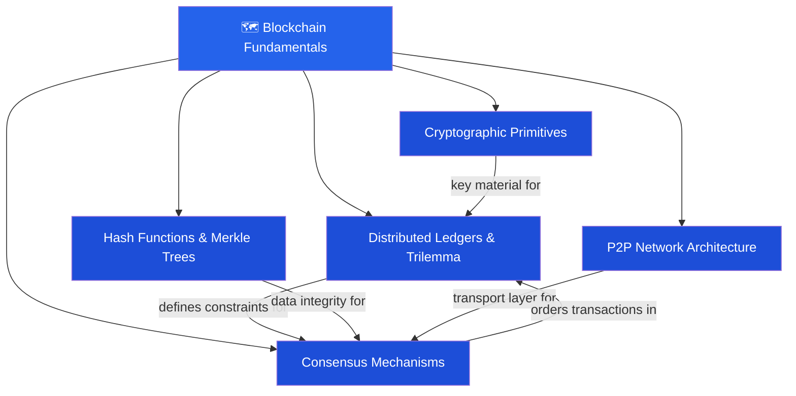

# 🗺️ Blockchain Fundamentals — Map of Content

> [!abstract] What This Section Covers
> This section builds the theoretical and practical foundation for everything else in the vault. You'll learn what makes a blockchain different from a database, the trilemma that constrains all blockchain design, how hash functions and Merkle trees create immutable audit trails, how nodes reach agreement through consensus protocols, how gossip networks propagate transactions, and the elliptic-curve math underlying every Bitcoin and Ethereum key pair.

---

## Concept Map

---

## Learning Path

1. [[Distributed_Ledgers_and_Trilemma]] — Start here: understand *why* blockchain exists and the fundamental trilemma that shapes every design decision.
2. [[Hash_Functions_and_Merkle_Trees]] — The data-structure engine: how SHA-256 and Keccak-256 create tamper-evident chains and how Merkle proofs enable light clients.
3. [[Consensus_Mechanisms]] — The political layer: PoW Nakamoto, PoS with slashing, and BFT/Tendermint — how thousands of strangers agree on truth.
4. [[P2P_Network_Architecture]] — The transport layer: how blocks and transactions propagate across gossip networks and why Eclipse attacks are dangerous.
5. [[Cryptographic_Primitives_Blockchain]] — The identity layer: secp256k1, ed25519, HD wallets (BIP-32/39/44) — every address starts here.

---

## All Notes at a Glance

| Note | Difficulty | What You'll Learn |
|------|-----------|-------------------|
| [[Distributed_Ledgers_and_Trilemma]] | Beginner | CAP/trilemma, forks, finality, permissioned vs permissionless |
| [[Hash_Functions_and_Merkle_Trees]] | Beginner | SHA-256, Keccak-256, Merkle root, SPV proofs |
| [[Consensus_Mechanisms]] | Intermediate | PoW, PoS slashing, BFT, finality gadgets |
| [[P2P_Network_Architecture]] | Intermediate | Gossip propagation, mempool, Eclipse attacks |
| [[Cryptographic_Primitives_Blockchain]] | Intermediate | ECC, secp256k1, HD wallets, BIP-32/39/44 |

---

## Key Questions This Section Answers

- Why can't a blockchain be simultaneously secure, decentralized, and scalable?
- How does SHA-256 make it computationally infeasible to alter historical blocks?
- What is the difference between probabilistic finality (PoW) and deterministic finality (BFT)?
- How does a light client verify a transaction without downloading the entire chain?
- How is an Ethereum address derived from a private key?
- What is a BIP-39 mnemonic and how does BIP-44 derive account paths?

---

## Related Sections

- [[_MOC_Blockchain_Master|↑ Blockchain Master MOC]]
- [[02_Applied_Cryptography/_MOC_Applied_Cryptography|→ Applied Cryptography]]
- [[03_Bitcoin_Protocol/_MOC_Bitcoin_Protocol|→ Bitcoin Protocol]]

#MOC #Blockchain #BlockchainFundamentals
