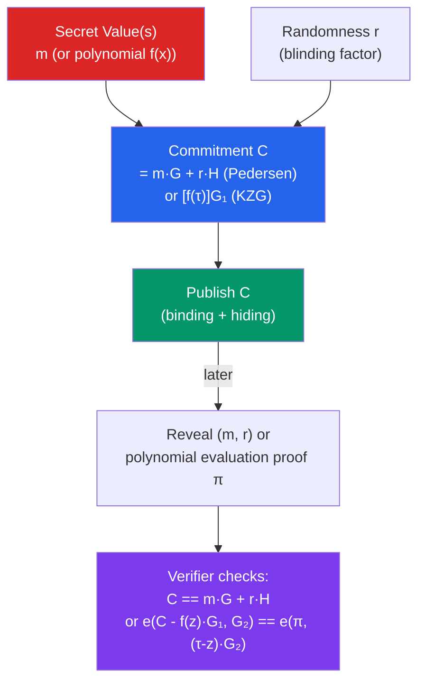

# 📦 Commitment Schemes

> [!abstract] TL;DR
> A **commitment scheme** is a two-phase cryptographic protocol: in the **commit** phase, a party commits to a value by publishing `C = Commit(m, r)` (binding — cannot change m; hiding — C reveals nothing about m). In the **reveal** phase, they open the commitment by publishing `(m, r)`. **Pedersen commitments** over elliptic curves: `C = m·G + r·H` where G, H are group generators — computationally binding under DLP, perfectly hiding. **KZG polynomial commitments** (Kate-Zaverucha-Goldberg) commit to a polynomial `f(x)` as `[f(τ)·G₁]` using a trusted setup `τ` — proofs are a single group element (48 bytes), constant-size regardless of degree. KZG is the commitment scheme underlying **EIP-4844 blobs**, **PLONK**, and **Ethereum's Danksharding** roadmap. Merkle trees are the simplest commitment scheme — hash of the root commits to all leaves.

## Intuition — analogy FIRST
Imagine a sealed envelope: you write your prediction on a piece of paper, seal it, and hand it to a neutral party before the event. After the event, you open the envelope to prove you predicted correctly. The sealed envelope is the commitment — the neutral party can't peek inside (hiding), and you can't swap the paper afterward (binding). A cryptographic commitment scheme does this mathematically, with the envelope being a compact value (like a hash or curve point).

A **polynomial commitment** takes this further: instead of committing to a single number, you commit to an entire polynomial function. Then you can later prove "my polynomial evaluates to 42 at point 7" without revealing the polynomial itself — just provide a 48-byte proof. This is enormously powerful for ZK systems that need to verify complex computations succinctly.

---

## How It Works



---

## Key Concepts / Details

### Properties of Commitment Schemes

| Property | Definition | Consequence if Broken |
|----------|-----------|----------------------|
| **Binding** | Committer cannot find `m' ≠ m` with `Commit(m',r') = Commit(m,r)` | Committer can equivocate — post-commitment fraud |
| **Hiding** | Commitment reveals nothing about `m` | Committed value is exposed before opening |
| **Perfectly hiding** | Information-theoretically hidden | Hiding holds even against computationally unbounded verifiers |
| **Computationally binding** | Binding holds against polynomial-time adversaries only | A quantum computer with enough power could break binding |

### Hash-Based Commitments (Merkle)
The simplest commitment: `C = H(m || r)`. Binding under collision resistance; hiding if pre-image resistant.

**Pedersen hash**: `C = H(m, r) = m·G + r·H` — a special case of Pedersen commitment. Used in Zcash, Monero.

### Pedersen Commitments
Over an elliptic curve group where G and H are two generators with **unknown discrete log relationship** (i.e., nobody knows `h` such that `H = h·G`):

```
C = m·G + r·H
```

- **Perfectly hiding**: for any commitment C and any message m*, there exists exactly one r* such that `C = m*·G + r*·H` — so C carries zero information about m.
- **Computationally binding**: finding `m, r, m', r'` with same C requires solving DLP.
- **Homomorphic**: `C₁ + C₂ = (m₁+m₂)·G + (r₁+r₂)·H = Commit(m₁+m₂, r₁+r₂)`. This enables verifiable arithmetic on committed values.

**Application: Confidential Transactions (Bitcoin CT, Monero)**:
- Sender commits to output amounts: `C_out = amount·G + r·H`
- Proves that `Σ inputs = Σ outputs + fee` (via Pedersen's homomorphic property, without revealing amounts)
- Provides a range proof that each amount ∈ [0, 2^64) (via Bulletproofs)

### KZG Polynomial Commitments
Developed by Kate, Zaverucha, and Goldberg (2010). Requires a **trusted setup** (powers of tau: `[τG₁, τ²G₁, ..., τᵈG₁]` and `[τG₂]`).

**Commit to polynomial** `f(x) = a₀ + a₁x + ... + aₐxᵈ`:
```
C = f(τ)·G₁ = [a₀·G₁ + a₁·τG₁ + ... + aₐ·τᵈG₁]
```
(Computed using the trusted setup values without knowing τ itself.)

**Prove evaluation** `f(z) = y` (where z and y are public):
```
Define quotient polynomial: q(x) = (f(x) - y) / (x - z)
Proof: π = q(τ)·G₁   (another single group element)
```

**Verify**: Check using pairing `e: G₁ × G₂ → Gₜ`:
```
e(C - y·G₁, G₂) == e(π, (τ·G₂ - z·G₂))
```

Key properties:
- **Proof size**: 48 bytes (one G₁ element on BLS12-381) — constant regardless of polynomial degree!
- **Verify time**: 2 pairings (~1ms)
- **Multi-point opening**: prove f evaluates to multiple values at multiple points with one proof

### EIP-4844 — KZG Blobs
Ethereum's EIP-4844 ("Proto-Danksharding") introduced **blob transactions** where rollups post 125 KB of compressed data alongside a KZG commitment. The consensus layer:
1. Verifies the KZG commitment matches the blob data.
2. Stores blobs for ~18 days (not in the EVM state).
3. Makes the KZG commitment and blob hash available to smart contracts via `BLOBHASH` opcode.

Rollup contracts verify their posted data by checking the KZG commitment on-chain, enabling cheap data availability at ~0.02 ETH per 125 KB vs ~2 ETH before EIP-4844.

**Danksharding** (future): Full sharding where each validator only stores a subset of blobs, with **Data Availability Sampling (DAS)** via KZG proofs ensuring each 512-byte chunk is available.

### Vector Commitments vs. Polynomial Commitments

| Scheme | Commit to | Proof size | Setup |
|--------|-----------|-----------|-------|
| Merkle Tree | Vector of values | O(log n) hashes | None |
| Pedersen | Single value | N/A (opening = reveal) | None |
| KZG | Polynomial (or vector via interpolation) | O(1) = 48 bytes | Trusted |
| IPA (Inner Product) | Vector | O(log n) | None |
| Bulletproofs | Range proof / vector | O(log n) | None |

---

## Real-World Notes
- **Verkle Trees** (upcoming Ethereum upgrade): replace Merkle Patricia Tries with a vector commitment scheme (IPA or KZG-based) to enable constant-size (1KB) state proofs instead of multi-KB Merkle Patricia Trie witnesses. Critical for stateless clients.
- The **Ethereum KZG ceremony** (Jan–May 2023): 141,416 contributions to generate the powers of tau for EIP-4844. Safety: as long as one contributor destroys their randomness, the setup is secure.
- **STARK commitment equivalent**: STARKs use FRI (Fast Reed-Solomon IOP) instead of KZG — no trusted setup, hash-based, post-quantum.

---

## Common Pitfalls
1. **Forgetting the blinding factor `r`** in Pedersen commitments — without it, the commitment leaks the value (it's just a public key).
2. **Reusing KZG trusted setup across incompatible applications** — the same powers-of-tau can be shared only if all applications use compatible curve parameters.
3. **Assuming KZG is post-quantum** — it relies on the discrete log assumption in elliptic curve pairings; a quantum computer with Shor's algorithm breaks it.
4. **Confusing binding and soundness** — binding is a property of the commitment scheme; soundness (that a cheating prover can't produce a valid proof) is a separate proof system property.

---

## Related Concepts
- [[_MOC_Applied_Cryptography|↑ Applied Cryptography MOC]]
- [[Zero_Knowledge_Proofs]] — KZG is the polynomial commitment scheme in PLONK; Pedersen in Bulletproofs
- [[ECDSA_and_Digital_Signatures]] — ECC group operations underlie both Pedersen and KZG
- [[04_Ethereum_EVM/EVM_Architecture|EVM Architecture]] — BLOBHASH opcode accesses KZG blob commitments

---

## Review Questions
1. A rollup posts a KZG commitment to blob data. The verifier contract checks `e(C - y·G₁, G₂) == e(π, τG₂ - z·G₂)`. What exactly does a successful check prove, and what would a failed check indicate?
2. In Confidential Transactions using Pedersen commitments, how does the receiver know the committed amount? What prevents a sender from committing to a negative amount?
3. Why is the discrete log of the relationship between G and H in Pedersen commitments critical? What attack becomes possible if the setup party keeps this trapdoor?

---

## Sources
- Kate, Zaverucha, Goldberg. "Constant-Size Commitments to Polynomials and Their Applications" (2010, ASIACRYPT)
- Bünz et al. "Bulletproofs: Short Proofs for Confidential Transactions and More" (2018, IEEE S&P)
- EIP-4844: Shard Blob Transactions (2023)
- Ethereum.org — "KZG Ceremony" (2023)
- Boneh & Shoup. "A Graduate Course in Applied Cryptography" (2023) — Chapter 12

#Blockchain #AppliedCryptography #Commitments #Pedersen #KZG #PolynomialCommitments
