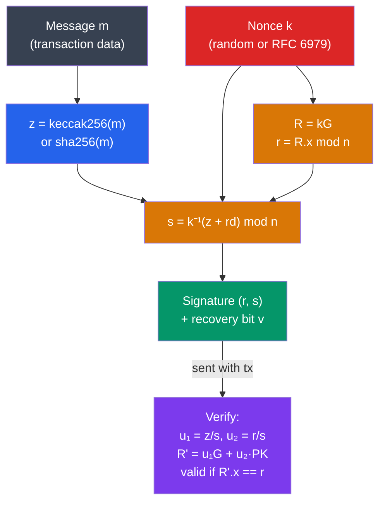

# ✍️ ECDSA and Digital Signatures

> [!abstract] TL;DR
> **ECDSA** (Elliptic Curve Digital Signature Algorithm) on secp256k1 produces a signature `(r, s)` from a message hash `z`, private key `d`, and random nonce `k`: `r = (kG).x mod n`, `s = k⁻¹(z + rd) mod n`. The catastrophic failure: reusing `k` for two different messages exposes the private key `d = (s₁z₂ - s₂z₁) / (s₂ - s₁)(r) mod n`. RFC 6979 eliminates randomness by deriving k deterministically from (privkey, message). **Schnorr signatures** (BIP-340) are simpler: `s = k + H(R || P || m) × d`, support linear aggregation (MuSig2 for n-of-n multisig in a single signature), and are proven secure in the random oracle model. Ethereum uses ECDSA with an additional `v` (recovery bit) byte to reconstruct the public key from a signature.

## Intuition — analogy FIRST
Signing a blockchain transaction is like applying a wax seal to a letter: the seal (signature) can only be made by someone with the specific signet ring (private key), but anyone can verify it matches the ring's impression (public key) without possessing the ring itself. The message is the letter's contents — if you change even one word, the seal no longer matches.

The nonce `k` is like the wax temperature: use the exact same temperature twice for different letters and an attacker can mathematically back-calculate the shape of your signet ring (private key). This is why PlayStation 3 was hacked in 2010 — Sony reused `k` across all firmware signatures. RFC 6979 solves this by deriving the "temperature" deterministically from the letter itself — different letter, different temperature, always.

---

## How It Works



---

## Key Concepts / Details

### ECDSA Sign and Verify

**Signing** (private key `d`, message hash `z`, nonce `k`):
```
R = k × G        (point multiplication)
r = R.x mod n   (x-coordinate of R, mod curve order)
s = k⁻¹ × (z + r × d) mod n
signature = (r, s)
```

**Verification** (public key `PK = d × G`, signature `(r,s)`, message hash `z`):
```
w = s⁻¹ mod n
u₁ = z × w mod n
u₂ = r × w mod n
R' = u₁ × G + u₂ × PK
valid if R'.x mod n == r
```

**Ethereum's `v` byte**: ECDSA can produce two possible public keys from a signature (two curve points map to the same `r`). Ethereum appends `v = 27 or 28` (legacy) or `0 or 1` (EIP-155: `v = chainId × 2 + 35/36`) to allow `ecrecover()` to reconstruct the exact signer address.

```solidity
// Ethereum signature verification
function verify(bytes32 hash, uint8 v, bytes32 r, bytes32 s)
    pure returns (address signer)
{
    signer = ecrecover(hash, v, r, s);
    require(signer != address(0), "invalid signature");
}
```

### The Nonce Reuse Catastrophe
If the same `k` is used for two messages `m₁` (hash `z₁`) and `m₂` (hash `z₂`):
```
s₁ = k⁻¹(z₁ + r·d)
s₂ = k⁻¹(z₂ + r·d)

s₁ - s₂ = k⁻¹(z₁ - z₂)
k = (z₁ - z₂) / (s₁ - s₂) mod n

d = (s₁·k - z₁) / r mod n   ← PRIVATE KEY EXPOSED
```

This is how the PlayStation 3 master key was extracted in 2010, and why Bitcoin Core switched to RFC 6979 deterministic nonce generation.

**RFC 6979**: Derive `k = HMAC-DRBG(privkey || message_hash)` — deterministic, unique per (key, message) pair, no external randomness needed.

### Schnorr Signatures (BIP-340)
Schnorr signatures are simpler and have a security proof in the random oracle model:

**Sign** (private key `d`, public key `P = dG`, message `m`, nonce `k`):
```
R = kG
e = H(R.x || P.x || m)   (challenge hash, BIP-340 uses tagged hash)
s = k + e·d mod n
signature = (R.x, s)     ← 64 bytes, vs ECDSA's 70-72 bytes DER
```

**Verify**: `sG == R + e·P`

**Linear aggregation** (key property Schnorr has that ECDSA lacks):
```
s₁G = R₁ + e·P₁
s₂G = R₂ + e·P₂
(s₁+s₂)G = (R₁+R₂) + e·(P₁+P₂)
```
This means n signers can produce one single 64-byte signature — indistinguishable from a single-signer signature on-chain.

### MuSig2 (n-of-n Aggregated Signatures)
MuSig2 is a 2-round protocol (down from MuSig1's 3 rounds) for aggregating n Schnorr signatures:

1. **Round 1**: Each signer generates 2 nonces (R₁ᵢ, R₂ᵢ), broadcasts commitments.
2. **Round 2**: Compute combined nonce `R = Σ(R₁ᵢ + bᵢ·R₂ᵢ)` where `b = H(all_commitments || agg_pubkey || msg)`. Each signer computes partial `sᵢ = kᵢ + eᵢ·dᵢ`. Aggregate: `s = Σsᵢ`.

**Result**: A single (R, s) Schnorr signature for the aggregate key. Perfect for:
- Bitcoin multisig (BIP-327 MuSig2): 2-of-2 channel opens, threshold custody
- Validator sets signing blocks with aggregated signatures

### Comparison

| Property | ECDSA | Schnorr (BIP-340) |
|----------|-------|-------------------|
| Signature size | 70-72 bytes (DER) | 64 bytes |
| Aggregation | No | Yes (MuSig2) |
| Batch verify | No | Yes (linear) |
| Security proof | Heuristic | Random oracle model |
| Deterministic | Only with RFC 6979 | Yes (nonce from key+msg) |
| Adoption | Bitcoin (legacy), Ethereum | Bitcoin (Taproot), Zcash |

---

## Real-World Notes
- Ethereum's `ecrecover` precompile costs 3000 gas (cheap for on-chain signature verification).
- EIP-191 and EIP-712 define structured message signing standards to prevent cross-protocol signature replay attacks.
- **EIP-2098 compact signatures**: encode the `v` bit into the high bit of `s`, reducing signature from 65 to 64 bytes.
- The Ronin Bridge hack (2022, $624M): attackers obtained 5 of 9 Axie DAO validator keys + 1 compromised via social engineering — ECDSA signature threshold compromise.

---

## Common Pitfalls
1. **Not using EIP-712 typed data** — raw message signing allows malicious dApps to trick users into signing transaction data instead of human-readable messages.
2. **Ignoring signature malleability** — ECDSA has low-S malleability (replace `s` with `n-s`); Bitcoin's BIP-146 mandates low-S; always use normalized signatures.
3. **`ecrecover` returns address(0) on failure** — not checking for this means any invalid signature passes if your target address happens to be zero (impossible but dangerous pattern).
4. **Missing EIP-155 chain ID** — pre-EIP-155 signatures can be replayed on any EVM chain; always include chainId in signing.

---

## Related Concepts
- [[_MOC_Applied_Cryptography|↑ Applied Cryptography MOC]]
- [[01_Blockchain_Fundamentals/Cryptographic_Primitives_Blockchain|Cryptographic Primitives]] — secp256k1 curve, key generation
- [[Zero_Knowledge_Proofs]] — ZK proofs often use Schnorr-based sigma protocols as building blocks
- [[Multi_Party_Computation]] — TSS extends ECDSA to distributed threshold signing
- [[03_Bitcoin_Protocol/Taproot_and_SegWit|Taproot & SegWit]] — BIP-340 Schnorr is the signature scheme

---

## Review Questions
1. Two Bitcoin transactions are signed with the same nonce `k`. Both signatures are public. Derive the formula for extracting the private key and explain why `r` is the same in both.
2. A 3-of-5 multisig wallet wants to upgrade to MuSig2 for privacy (so on-chain it looks like a single signature). Is MuSig2 directly applicable? What would you use instead?
3. A Solidity contract verifies a signature with `ecrecover`. An attacker submits a valid signature with `s` replaced by `n-s`. Does the verification pass? What is the risk?

---

## Sources
- BIP-340: Schnorr Signatures for secp256k1 (Wuille, Nick, Ruffing, 2020)
- RFC 6979: Deterministic Usage of DSA and ECDSA (Pornin, 2013)
- Nick, Ruffing, Seurin. "MuSig2: Simple Two-Round Schnorr Multi-Signatures" (2020)
- Johnson, Menezes, Vanstone. "The Elliptic Curve Digital Signature Algorithm (ECDSA)" (2001)
- EIP-712: Typed structured data hashing and signing

#Blockchain #AppliedCryptography #ECDSA #Schnorr #MuSig2 #Signatures
