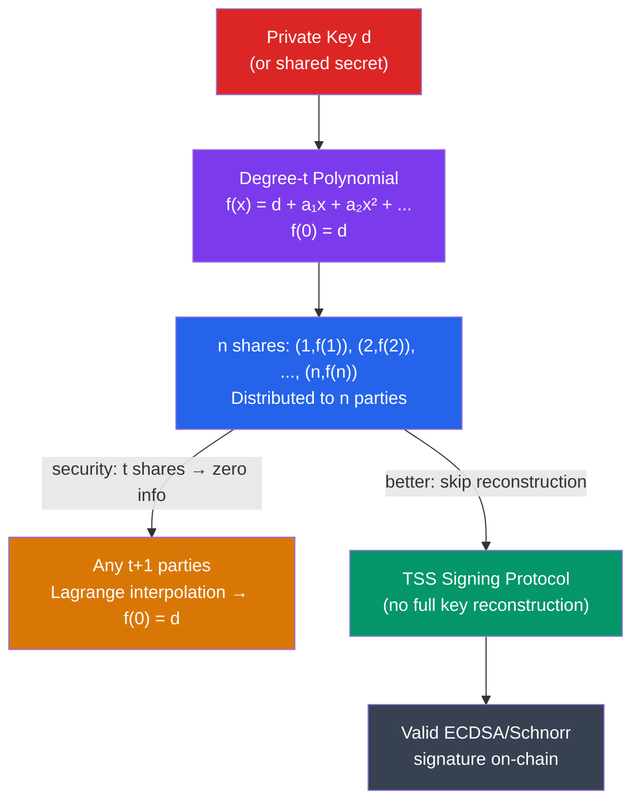

# 🤝 Multi-Party Computation and Threshold Signatures

> [!abstract] TL;DR
> **Multi-Party Computation (MPC)** allows n parties to jointly compute a function `f(x₁, ..., xn)` where each party inputs `xᵢ` privately, learning only the output without revealing individual inputs. In blockchain, the critical application is **Threshold Signature Schemes (TSS)**: a group of t+1 parties (from n total) can collaboratively sign a transaction without any single party ever holding the complete private key. **Shamir's Secret Sharing** splits secret `s` into n shares using a degree-t polynomial: `f(0) = s`, shares are `(i, f(i))` — any t+1 reconstruct `s` via Lagrange interpolation; any t or fewer shares reveal nothing. **Distributed Key Generation (DKG)** generates a shared public key without any trusted dealer. TSS for ECDSA/Schnorr (e.g., GG20, FROST) is production-ready and used by institutional custodians (Fireblocks, Coinbase Custody) and cross-chain bridges to eliminate single-key failure points.

## Intuition — analogy FIRST
Imagine a nuclear launch procedure requiring two officers to simultaneously turn separate keys — neither can launch alone, and neither key reveals anything about the other. Now extend this to digital assets: instead of one private key that unlocks a billion-dollar wallet, you split the "key knowledge" across 5 parties such that any 3 can collaboratively sign but no 2 (or 1, or 0) can reconstruct or misuse the key.

The mathematical magic of Shamir's scheme: plot a polynomial curve of degree 2 through the secret (y-intercept). Give each party one point on the curve. Any 3 points uniquely determine a degree-2 polynomial; 2 points tell you nothing (infinitely many degree-2 polynomials pass through 2 points). The secret is the y-intercept of the reconstructed polynomial.

---

## How It Works



---

## Key Concepts / Details

### Shamir's Secret Sharing (SSS)

**Setup**: Dealer wants to share secret `s` with n parties, threshold t+1:
1. Choose random polynomial `f(x) = s + a₁x + a₂x² + ... + aₜxᵗ` over field Fₚ.
2. Secret: `f(0) = s`.
3. Share `i`: `sᵢ = f(i)`.
4. Distribute `(i, sᵢ)` to party `i`.

**Reconstruction**: Given t+1 shares `(x₁, y₁), ..., (xₜ₊₁, yₜ₊₁)`:
```
f(0) = Σᵢ yᵢ · Πⱼ≠ᵢ (0 - xⱼ)/(xᵢ - xⱼ)   (Lagrange interpolation)
```

**Security**: Any t shares are uniformly distributed over Fₚ regardless of `s` — **information-theoretic** (unconditional) secrecy. This is the maximum possible security.

**Problem**: Naive Shamir requires a trusted dealer. If the dealer is compromised, all security is lost. **Verifiable Secret Sharing (VSS)** adds commitments to shares (Feldman VSS: commit to polynomial coefficients `[aᵢG]`) so each party can verify their share is consistent.

### Distributed Key Generation (DKG)
DKG generates a shared key pair `(d, P = dG)` without any single party ever knowing `d`:

**Pedersen DKG** (the most widely used):
1. Each party `i` picks a random polynomial `fᵢ(x)` with `fᵢ(0) = dᵢ`.
2. Each party commits to their polynomial: `Cᵢⱼ = aᵢⱼ·G` (Feldman commitment).
3. Each party sends secret share `fᵢ(j)` to party `j` (encrypted channel).
4. Each party verifies received shares against commitments.
5. Shared secret: `d = Σᵢ dᵢ` (no one knows this).
6. Shared public key: `P = Σᵢ dᵢ·G` (everyone computes this).

### Threshold ECDSA (GG20)
Producing an ECDSA signature without reconstructing the private key is harder than Schnorr due to ECDSA's multiplicative inversion `k⁻¹`. The GG18/GG20 protocol (Gennaro-Goldfeder) solves this using:
- **Paillier homomorphic encryption** for multiplication-in-the-exponent
- **Committed oblivious transfer** for cross-party multiplication

Protocol overview (simplified 2-of-2):
1. Both parties generate additive shares of `d`: `d₁ + d₂ = d mod n`.
2. Both parties generate additive shares of `k`: `k₁ + k₂ = k mod n`.
3. Party 1 encrypts `d₁k₁` via Paillier; party 2 uses homomorphic ops to compute `k⁻¹(z + rd)` without learning individual values.
4. Combine to produce valid `(r, s)`.

**FROST** (Flexible Round-Optimized Schnorr Threshold Signatures):
- Threshold Schnorr (t-of-n), 2 rounds.
- Much simpler than threshold ECDSA (leverages Schnorr's linearity).
- Used in Bitcoin's Taproot multisig, Zcash, and many bridge designs.

### TSS vs Multisig

| Property | On-chain Multisig (Bitcoin OP_CHECKMULTISIG) | TSS |
|----------|---------------------------------------------|-----|
| On-chain visibility | Shows n keys, threshold | Looks like single signature |
| Gas cost (Ethereum) | O(n) sig verifications | O(1) single sig verification |
| Key rotation | New on-chain contract | Off-chain: run new DKG |
| Trust model | Protocol-enforced | Cryptographic |
| Privacy | Policy visible | Policy hidden |
| Setup | No dealer needed | DKG required |

### Applications in Blockchain

1. **Institutional Custody** (Fireblocks, Coinbase, Qredo): TSS 2-of-3 or 3-of-5 across geographically distributed servers. No HSM holds complete key.

2. **Cross-Chain Bridges**: Wormhole's guardian set (19 guardians), Axelar's validator TSS — validators collectively sign bridge messages. If threshold % are honest, bridge is secure.

3. **Decentralized Exchanges**: TSS-based order matching where no single server has custody.

4. **Random Beacon** (threshold BLS): Ethereum's RANDAO + VDF, or Dfinity's threshold BLS, where randomness requires threshold participation — prevents manipulation by any single party.

### Oblivious Transfer (OT) and Garbled Circuits
For general MPC (not just signing), two fundamental primitives:
- **Oblivious Transfer (1-of-2 OT)**: Sender has two secrets (s₀, s₁); receiver chooses b ∈ {0,1}; receiver gets sᵦ; sender learns nothing about b; receiver learns nothing about s₁₋ᵦ.
- **Garbled Circuits** (Yao's 2PC): Each gate's truth table is encrypted with keys; evaluator can only decrypt the row corresponding to their input — evaluates the function without learning each other's input.

---

## Real-World Notes
- The Ronin Bridge hack (2022, $624M): Attackers compromised 5 of 9 Axie DAO validators — exactly the threshold needed — by exploiting social engineering + a dormant gas-free RPC. A reminder that TSS security is only as good as key management of individual shares.
- Fireblocks uses MPC-CMP (an improved GG20 variant) for institutional custody and processed $3T+ in transfers in 2023 without a custody breach.
- FROST is standardized in IETF RFC 9591 (2024) — a milestone for production adoption.
- **Proactive secret sharing**: Re-share keys periodically (new polynomial with same `f(0)`) so old shares become useless — limits the window for an attacker who gradually compromises shares.

---

## Common Pitfalls
1. **Confusing TSS with multisig** — TSS is off-chain signing, multisig is on-chain policy. TSS hides the threshold from the blockchain but requires trusting the MPC protocol implementation.
2. **Not running secure channels for DKG** — DKG share distribution must be encrypted point-to-point; broadcasting over plain channels defeats the security.
3. **Ignoring abort handling** — MPC protocols can abort if any party misbehaves; production systems need robust blame assignment (identifying the malicious party) and restart procedures.
4. **Threshold vs. full quorum confusion** — setting threshold = n (all parties required) loses liveness; setting threshold = 1 loses security. Choose t to balance availability and security.

---

## Related Concepts
- [[_MOC_Applied_Cryptography|↑ Applied Cryptography MOC]]
- [[ECDSA_and_Digital_Signatures]] — TSS produces ECDSA/Schnorr signatures without a single key
- [[Commitment_Schemes]] — Feldman VSS uses Pedersen commitments to verify shares
- [[Zero_Knowledge_Proofs]] — ZK range proofs used in Paillier-based TSS to prevent cheating
- [[06_Web3_Development/Cross_Chain_Bridges|Cross-Chain Bridges]] — bridges use TSS for validator signing

---

## Review Questions
1. A 3-of-5 Shamir secret sharing scheme is used to protect a private key. Two shares are compromised by an attacker. How much does the attacker know about the private key? Justify mathematically.
2. Compare the security model of a 3-of-5 on-chain multisig (Bitcoin OP_CHECKMULTISIG) vs. a 3-of-5 FROST threshold signature. What does each reveal on-chain and what are the respective failure modes?
3. In a DKG ceremony, party 3 sends incorrect shares to parties 1 and 2 but correct shares to parties 4 and 5. How does a protocol with Feldman VSS detect this, and what happens next?

---

## Sources
- Shamir, A. "How to Share a Secret" (1979, Communications of the ACM)
- Gennaro & Goldfeder. "Fast Multiparty Threshold ECDSA with Fast Trustless Setup" (2018, ACM CCS)
- Komlo & Goldberg. "FROST: Flexible Round-Optimized Schnorr Threshold Signatures" (2021, SAC)
- Pedersen. "Non-Interactive and Information-Theoretic Secure Verifiable Secret Sharing" (1991, CRYPTO)
- IETF RFC 9591: FROST (2024)

#Blockchain #AppliedCryptography #MPC #ThresholdSignature #ShamirSecretSharing #TSS #DKG
