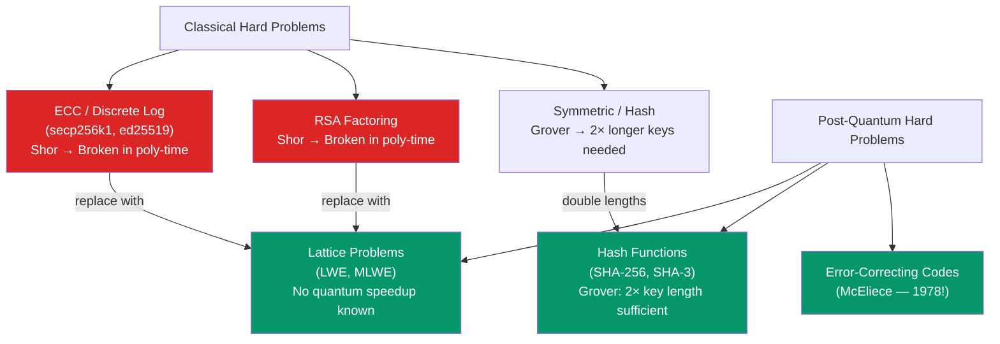

# ⚛️ Post-Quantum Cryptography for Blockchain

> [!abstract] TL;DR
> Quantum computers running **Shor's algorithm** can break all ECC-based cryptography (ECDSA, Schnorr, secp256k1, ed25519, BLS) and RSA in polynomial time. Grover's algorithm reduces symmetric/hash security by half (SHA-256 from 2^256 to 2^128 — still secure, just double key/hash lengths). NIST standardized three post-quantum algorithms in 2024: **CRYSTALS-Kyber** (ML-KEM, key encapsulation, lattice-based), **CRYSTALS-Dilithium** (ML-DSA, digital signatures, lattice-based), and **SPHINCS+** (SLH-DSA, hash-based signatures). The **harvest-now/decrypt-later** (HNDL) threat means adversaries are archiving encrypted blockchain transactions today to decrypt when quantum computers mature (~2030-2035 estimates). Blockchain migration is uniquely hard: billions of UTXOs and smart contracts use secp256k1 addresses; coordinated migration requires simultaneously upgrading key formats, signature algorithms, and all dependent protocols.

## Intuition — analogy FIRST
Imagine your lock is secured by the difficulty of factoring a huge number (2048-bit RSA) or finding a discrete log (secp256k1 ECDSA). Classical computers would take millions of years. A quantum computer using Shor's algorithm is like having a magic machine that instantly finds the prime factors — it turns "practically impossible" to "trivially solvable." All the wealth locked behind ECDSA keys on Bitcoin and Ethereum becomes transparent.

Lattice-based cryptography uses a different kind of hard problem: given a high-dimensional lattice (think a grid in 1000+ dimensions), find the shortest non-zero vector. Even quantum computers using the best known algorithms take exponential time for this — the lock survives the quantum era.

---

## How It Works



---

## Key Concepts / Details

### Quantum Threats to Blockchain

| Algorithm | Threat | Affected Blockchain Crypto |
|-----------|--------|--------------------------|
| Shor's | Breaks discrete log in poly-time | ECDSA, Schnorr, BLS, RSA, DH |
| Grover's | Quadratic speedup for hash preimage | SHA-256 (weakens to 2^128), Keccak-256 |

**Key point**: Public key addresses that have *never spent* from them (P2PK that only received) are safe until first spend — spending reveals the public key, which is then vulnerable to Shor's on the ~10-minute window before confirmation. **Reused addresses** are more vulnerable.

**Harvest-Now Decrypt-Later (HNDL)**: Adversaries (nation-states) are recording all blockchain traffic today. When quantum computers arrive, they can:
- Derive private keys from public keys visible in transactions
- Decrypt any encrypted bridge/channel communications from the past

Timeline estimates: "cryptographically relevant quantum computers" (CRQC) by 2030-2035 per NIST and NSA (though highly uncertain).

### CRYSTALS-Kyber (ML-KEM, FIPS 203)
**Type**: Key Encapsulation Mechanism (KEM) — establishes shared secret keys, replaces ECDH.
**Hard problem**: Module Learning With Errors (MLWE).

**Learning With Errors intuition**: Given `A·s + e = b` where `A` is a public matrix, `s` is the secret vector, and `e` is small noise — recovering `s` from `(A, b)` is hard even for quantum computers.

```
Key sizes (Kyber-768 / security level 3):
- Public key: 1,184 bytes
- Private key: 2,400 bytes
- Ciphertext: 1,088 bytes
- Shared secret: 32 bytes
vs. ECDH P-256:
- Public key: 64 bytes
- Shared secret: 32 bytes
```

**Applications in blockchain**:
- Encrypted P2P communication (replace ECDH in libp2p)
- Encrypted mempool (Private transactions, Flashbots SUAVE)
- Cross-chain bridge key exchange

### CRYSTALS-Dilithium (ML-DSA, FIPS 204)
**Type**: Digital signature scheme — replaces ECDSA/Schnorr.
**Hard problem**: MLWE + Short Integer Solution (SIS).

```
Key sizes (Dilithium3 / security level 3):
- Public key: 1,952 bytes
- Private key: 4,000 bytes
- Signature: 3,293 bytes
vs. secp256k1 ECDSA:
- Public key: 33 bytes
- Signature: 64-72 bytes
```

**Critical observation**: Dilithium signatures are ~50× larger than Schnorr. At 1M TPS, this dramatically increases block size and bandwidth requirements.

### SPHINCS+ (SLH-DSA, FIPS 205)
**Type**: Hash-based signature scheme (stateless).
**Hard problem**: Hash function collision/preimage resistance only — the most conservative PQ assumption.

```
SPHINCS+-SHA2-256f (fast variant):
- Public key: 64 bytes
- Signature: 49,856 bytes (~50 KB!)
- Sign time: ~80ms
- Verify time: ~10ms
```

**Use case**: Suitable for infrequent but critical signatures (blockchain consensus checkpoints, root certificate signing) — not suitable for high-frequency transaction signing due to 50 KB signature size.

### Comparison Table

| Scheme | Type | PK size | Sig size | Security basis | NIST standard |
|--------|------|---------|---------|----------------|---------------|
| secp256k1 ECDSA | Signature | 33 B | 71 B | ECC DLP | N/A (legacy) |
| Dilithium3 | Signature | 1.9 KB | 3.3 KB | MLWE + SIS | FIPS 204 |
| SPHINCS+-256f | Signature | 64 B | ~50 KB | Hash functions | FIPS 205 |
| Falcon-512 | Signature | 897 B | ~690 B | NTRU lattice | FIPS 206 |
| Kyber-768 | KEM | 1.2 KB | 1.1 KB | MLWE | FIPS 203 |

**Falcon** is worth noting: smallest lattice-based signatures (~690 bytes), but requires careful constant-time implementation to prevent side-channel attacks from Gaussian sampling.

### Blockchain Migration Challenges

**Bitcoin PQ migration**:
1. Need consensus-level soft/hard fork to support new address types (P2PQH — Post-Quantum Key Hash?)
2. ~4.3M Bitcoin in P2PK outputs (very old, from Satoshi era) are quantum-vulnerable when spent.
3. Migration requires users to actively move funds to PQ addresses before quantum threat materializes.
4. BIP proposal: hybrid ECDSA + Dilithium signatures during transition period.

**Ethereum PQ migration**:
- Account abstraction (EIP-4337) enables wallets to verify any signature type — a migration path.
- EIP-7212 (P-256 precompile) shows the pattern for adding new curve precompiles.
- ZK-based PQ: prove knowledge of ECDSA private key in ZK (a STARK, which is PQ-safe), derive a new quantum-safe address.

---

## Real-World Notes
- NIST finalized FIPS 203 (Kyber), 204 (Dilithium), 205 (SPHINCS+) in August 2024 — the start of the official migration era.
- NSA's "CNSA 2.0" (Commercial National Security Algorithm Suite) mandates PQ algorithms for all national security systems by 2030.
- Ethereum core devs (2024): "PQ migration is a 10-15 year project; we have time but must start now." Account abstraction is the enabling infrastructure.
- The QRL (Quantum Resistant Ledger) blockchain, launched in 2018, uses XMSS (hash-based) signatures — the only major production blockchain that is already quantum-resistant.

---

## Common Pitfalls
1. **"Quantum computers don't exist yet, we have time"** — HNDL means the threat is active today for long-term secret confidentiality; wait and all historical encrypted data is at risk.
2. **Assuming hash-based crypto is fully safe** — Grover's algorithm squares the attack speed; SHA-256's 2^256 preimage resistance becomes ~2^128. Still secure, but SHAKE-256 or SHA-3 with 384-bit outputs are preferred.
3. **Migrating signature scheme without migrating KEM** — a system using Dilithium signatures but ECDH key exchange is still quantum-vulnerable for encryption.
4. **Ignoring implementation side-channels** — lattice-based schemes require careful constant-time implementation; naive implementations leak secret keys through timing/power analysis.

---

## Related Concepts
- [[_MOC_Applied_Cryptography|↑ Applied Cryptography MOC]]
- [[ECDSA_and_Digital_Signatures]] — the current scheme that PQ replaces
- [[Zero_Knowledge_Proofs]] — STARKs are post-quantum (hash-based); SNARKs are not
- [[Commitment_Schemes]] — KZG commitments are NOT post-quantum; Merkle/hash-based commitments are
- [[01_Blockchain_Fundamentals/Cryptographic_Primitives_Blockchain|Cryptographic Primitives]] — secp256k1 key generation at risk

---

## Review Questions
1. A nation-state adversary is recording all Ethereum transactions today. In 2035, they deploy a CRQC. Which Ethereum addresses are immediately at risk, and which are not? Describe the attack on the vulnerable ones.
2. Bitcoin has ~21M UTXOs locked by various script types. Which script types are quantum-vulnerable and why? What would a BIP for quantum-safe migration look like?
3. Ethereum account abstraction (EIP-4337) is described as the migration path for PQ signatures. Walk through how a wallet could use AA to verify a Dilithium signature today without any L1 protocol change.

---

## Sources
- NIST FIPS 203, 204, 205 (2024) — ML-KEM, ML-DSA, SLH-DSA
- Bernstein & Lange. "Post-quantum cryptography" (2017, Nature)
- NSA CNSA 2.0 (2022) — "Cybersecurity Advisory: Commercial National Security Algorithm Suite 2.0"
- Banegas et al. "CTIDH: Faster Constant-Time CSIDH" (2021)
- ethereum.org — "Post-quantum Ethereum" (2024, Ethereum Research)

#Blockchain #AppliedCryptography #PostQuantum #Kyber #Dilithium #LatticeBasedCrypto
