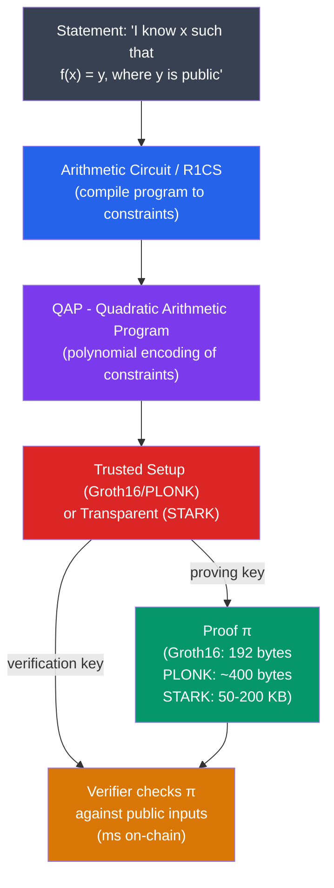

# 🔮 Zero-Knowledge Proofs

> [!abstract] TL;DR
> A **Zero-Knowledge Proof (ZKP)** lets a prover convince a verifier that a statement is true without revealing any information beyond the truth of the statement. Formal properties: **completeness** (honest provers always succeed), **soundness** (cheating provers can't convince except with negligible probability), **zero-knowledge** (verifier learns nothing extra). The ZK proof systems used in blockchain range from sigma protocols (interactive, simple) → **Groth16** (SNARK: ~200 bytes proof, ~10ms verify, trusted setup, not quantum-safe) → **PLONK** (universal trusted setup) → **STARKs** (transparent, quantum-safe, 10-100 KB proofs, 10ms verify). **zkEVMs** (zkSync Era, Polygon zkEVM, Scroll) prove Ethereum execution validity in ZK, enabling validity rollups with cryptographic finality.

## Intuition — analogy FIRST
You're in a library and claim you know the location of a specific book without revealing where it is. Zero-knowledge: you blindfold the librarian, walk directly to the book, and show them the cover — they're convinced you knew, but you never said "aisle 7, shelf 3." You proved knowledge of the location without revealing it.

In blockchain terms: a rollup processes 10,000 transactions and claims the resulting state root is correct. A ZK-SNARK is the proof: 200 bytes that cryptographically certify all 10,000 transactions were valid. The Ethereum mainnet verifier contract checks this proof in ~10ms without re-executing any transaction. This is why ZK-rollups achieve 2000-4000x throughput gains while inheriting L1 security.

---

## How It Works



---

## Key Concepts / Details

### Sigma Protocols (Interactive ZK)
The simplest ZK proofs. Example: **Schnorr's identification protocol** (proving knowledge of discrete log):
```
Prover knows d such that P = dG (public key P known to verifier)
1. Prover picks random k, sends R = kG
2. Verifier sends random challenge e
3. Prover sends s = k + e·d
4. Verifier checks sG == R + e·P   ← ZK proof of knowledge of d
```
**Fiat-Shamir transform**: replace the verifier's random challenge with `e = H(R || public_inputs)` to make it non-interactive (NIZK). This is the basis of all practical ZK-SNARKs.

### R1CS — Rank-1 Constraint System
Any computation can be compiled to a set of rank-1 constraints:
```
(a · s) × (b · s) = (c · s)
```
Where `s` is the witness vector (private + public inputs), and `a, b, c` are coefficient vectors. Example: prove `x³ + x + 5 = 35` (i.e., `x = 3` is the witness):
```
Constraints:
v₁ = x × x       → (x)(x) = v₁
v₂ = v₁ × x     → (v₁)(x) = v₂
v₂ + x + 5 = 35  → public output check
```

### QAP — Quadratic Arithmetic Program
The R1CS constraints are converted to polynomial equations using Lagrange interpolation. Each constraint becomes a check that a polynomial evaluates to 0 at the appropriate points. The prover commits to these polynomials using elliptic curve points; the verifier checks the relationships using a **pairing** (bilinear map) `e: G₁ × G₂ → Gₜ`.

### Groth16 (2016)
The most efficient SNARK for fixed circuits:
- **Proof size**: 192 bytes (3 group elements)
- **Verify time**: ~1ms (2 pairings)
- **Prove time**: O(n log n) where n = # constraints
- **Trusted setup**: per-circuit "powers of tau" ceremony — if ANY participant is honest, setup is safe. Powers of Tau was conducted for Ethereum's KZG commitments in 2022 (~140,000 participants).
- **NOT post-quantum**: relies on pairing-friendly curves (BN254, BLS12-381)

```
Groth16 proof: (A ∈ G₁, B ∈ G₂, C ∈ G₁)
Verify: e(A, B) == e(α, β) × e(Σᵢ aᵢ(γᵢ/γ), γ) × e(C, δ)
```

### PLONK (2019)
Universal trusted setup (one ceremony works for all circuits up to size n):
- **Proof size**: ~400 bytes
- Verify: ~2-3ms
- Uses **KZG polynomial commitments** (see [[Commitment_Schemes]])
- Variants: **Turbo-PLONK** (custom gates), **Ultra-PLONK** (lookups for non-arithmetic ops)

### STARKs (Scalable Transparent ARguments of Knowledge)
- **Transparent**: no trusted setup. Uses hash functions (collision-resistant) instead of elliptic curve pairings.
- **Post-quantum secure**: security based on hash functions, not discrete log.
- **Proof size**: 50-200 KB (much larger than SNARKs)
- **Verify time**: O(log² n) — fast
- Uses **FRI** (Fast Reed-Solomon IOP of Proximity) for polynomial commitment
- Used by: StarkNet/StarkEx (Cairo language → STARK proofs)

| Property | Groth16 | PLONK | STARKs |
|----------|---------|-------|--------|
| Proof size | 192 bytes | ~400 bytes | 50-200 KB |
| Verify time | ~1ms | ~2ms | ~10ms |
| Trusted setup | Per-circuit | Universal | None |
| Post-quantum | No | No | Yes |
| Prover time | Fast | Moderate | Moderate |
| Used by | Zcash Sapling | zkSync Era | StarkNet |

### zkEVMs
A **zkEVM** proves that an EVM execution trace is valid using ZK proofs, enabling validity rollups:

| Type | EVM Compatibility | Proof Complexity | Examples |
|------|-----------------|-----------------|---------|
| Type 1 | Full (byte-for-byte identical) | Highest | Taiko |
| Type 2 | EVM-equivalent (same semantics) | High | Scroll, Polygon zkEVM |
| Type 3 | Mostly EVM-compatible | Moderate | Polygon zkEVM (v1) |
| Type 4 | Language-level (Solidity → ZK-friendly IR) | Lower | zkSync Era (LLVM) |

Proving an Ethereum block with ~100 txs typically takes 5-30 minutes of prover computation and produces a proof verifiable on L1 in ~500k gas (~$5-20 at current prices).

---

## Real-World Notes
- **Zcash Sapling** uses Groth16 to prove shielded transaction validity: sender, receiver, amount all private; ~40ms prove time on consumer hardware.
- **Aztec Network** uses PLONK for private smart contracts — arbitrary logic with ZK privacy.
- **Risc Zero** and **SP1** (Succinct) compile arbitrary Rust/WASM programs to ZK proofs using a RISC-V VM, enabling zkEVM-class proofs for any computation.
- **Recursive proofs**: a SNARK can prove the validity of another SNARK — enables proof aggregation where one proof certifies thousands of individual proofs (Mina Protocol: 22 KB blockchain).

---

## Common Pitfalls
1. **Trusting the trusted setup blindly** — if the toxic waste from a Groth16 ceremony is not destroyed, the setup is compromised and the prover can forge proofs.
2. **Under-constrained circuits** — a circuit that doesn't fully constrain the witness allows a malicious prover to submit false proofs. A major source of ZK protocol vulnerabilities.
3. **Confusing ZK-SNARKs with privacy** — SNARKs prove correctness of execution; privacy requires the inputs to be hidden (ZK property), which is separate from just proving a computation.
4. **Ignoring proof generation cost** — verification is cheap (ms), but proving can take minutes/hours and significant RAM for large circuits.

---

## Related Concepts
- [[_MOC_Applied_Cryptography|↑ Applied Cryptography MOC]]
- [[ECDSA_and_Digital_Signatures]] — Schnorr sigma protocol is the basis of ZKP
- [[Commitment_Schemes]] — KZG commitments underpin PLONK
- [[04_Ethereum_EVM/EVM_Architecture|EVM Architecture]] — zkEVMs prove EVM execution
- [[06_Web3_Development/Cross_Chain_Bridges|Cross-Chain Bridges]] — ZK bridges use validity proofs

---

## Review Questions
1. A zkEVM circuit has an under-constrained division operation. Describe a concrete attack where a malicious prover can exploit this to mint arbitrary tokens in a ZK-rollup.
2. Compare the trust assumptions of a Groth16 SNARK (with a trusted setup ceremony) vs. a STARK. When would you choose each?
3. A SNARK proof of 192 bytes costs 500,000 gas to verify on Ethereum L1. For a rollup processing 1000 txs per proof, what is the per-transaction gas overhead from proof verification alone?

---

## Sources
- Groth, J. "On the Size of Pairing-based Non-interactive Arguments" (2016, EUROCRYPT)
- Gabizon, Williamson, Ciobotaru. "PLONK: Permutations over Lagrange-bases for Oecumenical Noninteractive arguments of Knowledge" (2019)
- Ben-Sasson et al. "Scalable, transparent, and post-quantum secure computational integrity" (2018) — STARKs
- Buterin. "An Incomplete Guide to Rollups" (2021, vitalik.ca)
- Buterin. "The different types of ZK-EVMs" (2022, vitalik.ca)

#Blockchain #AppliedCryptography #ZKP #ZKSNARKs #ZKSTARKs #PLONK #Groth16 #zkEVM
