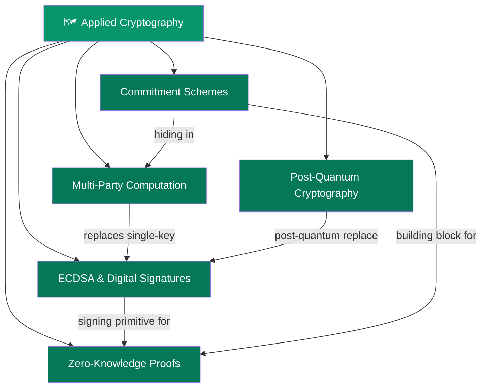

# 🗺️ Applied Cryptography — Map of Content

> [!abstract] What This Section Covers
> This section covers the cryptographic machinery that makes blockchain trust possible without a central authority. You'll go from classical ECDSA signatures (and their catastrophic nonce-reuse failure mode) through zero-knowledge proof systems (Groth16, PLONK, STARKs), algebraic commitment schemes (Pedersen, KZG), multi-party computation for distributed key management, and finally post-quantum algorithms that will replace current crypto as quantum computers mature.

---

## Concept Map

---

## Learning Path

1. [[ECDSA_and_Digital_Signatures]] — Foundation: secp256k1, sign/verify, nonce reuse disaster, Schnorr/MuSig2.
2. [[Commitment_Schemes]] — Building block: Pedersen, KZG polynomial commitments — hiding and binding.
3. [[Zero_Knowledge_Proofs]] — Core ZK: sigma protocols → Groth16 → PLONK → STARKs → zkEVMs.
4. [[Multi_Party_Computation]] — Distributed signing: Shamir secret sharing, TSS, DKG protocols.
5. [[Post_Quantum_Cryptography_Blockchain]] — Future-proofing: CRYSTALS-Kyber/Dilithium, harvest-now/decrypt-later threat.

---

## All Notes at a Glance

| Note | Difficulty | What You'll Learn |
|------|-----------|-------------------|
| [[ECDSA_and_Digital_Signatures]] | Intermediate | secp256k1, (r,s) pairs, nonce reuse, Schnorr, MuSig2 |
| [[Zero_Knowledge_Proofs]] | Advanced | R1CS, QAP, Groth16, PLONK, STARKs, zkEVMs |
| [[Commitment_Schemes]] | Intermediate | Pedersen, KZG, binding vs hiding |
| [[Multi_Party_Computation]] | Advanced | Shamir, TSS, DKG, threshold signatures |
| [[Post_Quantum_Cryptography_Blockchain]] | Advanced | Lattice crypto, Kyber, Dilithium, migration strategy |

---

## Key Questions This Section Answers

- Why does reusing the ECDSA nonce `k` expose your private key?
- How does a ZK-SNARK let you prove you know a secret without revealing it?
- What is the difference between a Pedersen commitment and a KZG commitment?
- How does threshold signing avoid a single point of failure for custodial keys?
- What is the harvest-now/decrypt-later attack and why must blockchains prepare now?
- What makes STARKs post-quantum secure while SNARKs are not?

---

## Related Sections

- [[_MOC_Blockchain_Master|↑ Blockchain Master MOC]]
- [[01_Blockchain_Fundamentals/_MOC_Blockchain_Fundamentals|← Blockchain Fundamentals]]
- [[03_Bitcoin_Protocol/_MOC_Bitcoin_Protocol|→ Bitcoin Protocol]]

#MOC #Blockchain #AppliedCryptography
