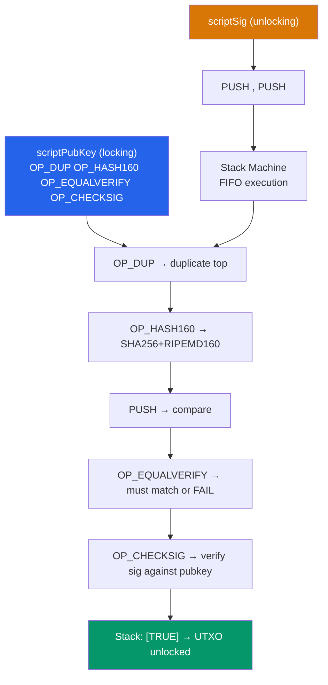

# 📜 Bitcoin Script

> [!abstract] TL;DR
> Bitcoin Script is a **Forth-like, stack-based, intentionally non-Turing-complete** scripting language that defines spending conditions for UTXOs. The scriptPubKey (locking script) is attached to each output; the scriptSig (unlocking script) and/or witness data must satisfy it. Script evolution: **P2PKH** (Pay-to-Public-Key-Hash, 1xxx addresses) → **P2SH** (Pay-to-Script-Hash, 3xxx, BIP-16) → **P2WPKH/P2WSH** (SegWit, bech32 bc1q) → **P2TR** (Pay-to-Taproot, BIP-341, bech32m bc1p). Key opcodes: `OP_DUP OP_HASH160` (P2PKH), `OP_CHECKMULTISIG` (n-of-m multisig, but with a bug requiring an extra null push), `OP_CHECKLOCKTIMEVERIFY` (CLTV, BIP-65), `OP_CHECKSEQUENCEVERIFY` (CSV, BIP-112). P2TR's key-path spend reveals only a single Schnorr signature on-chain; script-path exposes only the executed branch of the Merkle Abstract Syntax Tree (MAST).

## Intuition — analogy FIRST
Bitcoin Script is like a combination lock where the combination isn't a sequence of numbers, but a sequence of operations. The UTXO (locked output) is the lock with a "combination challenge" baked in (scriptPubKey). Whoever wants to open it must provide a series of operations (scriptSig/witness) that, when run on the lock's machinery, leave the word "TRUE" on the readout. The machinery doesn't have loops — you can't write infinite programs — which makes Script simple enough to verify without risk of infinite execution.

Standard P2PKH: the lock says "duplicate the provided item, hash it with RIPEMD-160 after SHA-256, check it equals the expected hash, then verify the provided signature matches the public key." Seven operations. The combination is: provide a valid signature and the corresponding public key. Simple, deterministic, and safe.

---

## How It Works



---

## Key Concepts / Details

### Script Types Ladder

| Type | Address | BIP | scriptPubKey pattern | Notes |
|------|---------|-----|---------------------|-------|
| P2PK | Raw pubkey | - | `<PubKey> OP_CHECKSIG` | Oldest; pubkey visible; quantum-vulnerable |
| P2PKH | 1... | - | `OP_DUP OP_HASH160 <PubKeyHash> OP_EQUALVERIFY OP_CHECKSIG` | Standard through 2017 |
| P2MS | - | BIP-11 | `M <pubkey1>...<pubkeyN> N OP_CHECKMULTISIG` | Raw multisig, large scriptPubKey |
| P2SH | 3... | BIP-16 | `OP_HASH160 <ScriptHash> OP_EQUAL` | Script hidden until spend |
| P2WPKH | bc1q | BIP-141 | `OP_0 <PubKeyHash>` | SegWit v0, 20-byte push |
| P2WSH | bc1q | BIP-141 | `OP_0 <ScriptHash>` | SegWit v0, 32-byte push |
| P2TR | bc1p | BIP-341 | `OP_1 <TweakedPubKey>` | Taproot, Schnorr, MAST |

### P2PKH — Pay-to-Public-Key-Hash
The "standard" pre-SegWit script:

```
scriptPubKey: OP_DUP OP_HASH160 <20-byte-PubKeyHash> OP_EQUALVERIFY OP_CHECKSIG
scriptSig:    <Signature> <PublicKey>
```

Execution trace:
```
Stack after push:      [<Sig>, <PubKey>]
After OP_DUP:          [<Sig>, <PubKey>, <PubKey>]
After OP_HASH160:      [<Sig>, <PubKey>, <PubKeyHash>]
After PUSH hash:       [<Sig>, <PubKey>, <PubKeyHash>, <expected_hash>]
After OP_EQUALVERIFY:  [<Sig>, <PubKey>]  (or FAIL)
After OP_CHECKSIG:     [TRUE]
```

### P2SH — Pay-to-Script-Hash (BIP-16)
Allows complex scripts (multisig, timelocks) while only revealing a hash in the scriptPubKey. The **redeem script** (the actual spending conditions) is provided at spend time.

```
scriptPubKey: OP_HASH160 <20-byte-hash-of-redeemScript> OP_EQUAL
scriptSig:    <...satisfying-data...> <redeemScript>
```

**P2SH-2-of-3 Multisig**:
```
redeemScript: OP_2 <PubKey1> <PubKey2> <PubKey3> OP_3 OP_CHECKMULTISIG
scriptSig:    OP_0 <Sig1> <Sig2> <redeemScript>
```

Note: `OP_CHECKMULTISIG` has a **bug** — it pops one extra element from the stack (the legacy `OP_0` / null dummy). This is fixed by `OP_CHECKMULTISIGVERIFY` and avoided entirely in Taproot.

### SegWit (P2WPKH / P2WSH) — BIP-141
SegWit moves the signature data to a separate "witness" field, outside the transaction serialization used for computing txid. This fixes **transaction malleability** (where scriptSig could be altered, changing txid without invalidating the tx — a prerequisite for Lightning Network).

**Weight** = base_size × 3 + total_size. Witness data gets a 75% discount (weight 1 instead of 4 per byte). This enables larger effective block capacity while keeping block weight ≤ 4M weight units.

```
P2WPKH scriptPubKey: OP_0 <20-byte hash>  (22 bytes total)
Witness:             <Signature> <PublicKey>  (not in txid hash)
```

### P2TR — Pay-to-Taproot (BIP-340/341/342)

P2TR outputs encode a **tweaked public key** `Q = P + tG` where:
- `P` = internal key (the "default" signer's key)
- `t = H_taptweak(P || merkle_root)` — a tagged hash that commits to the MAST

**Key-path spend** (most private): Just provide a Schnorr signature for `Q`. On-chain, looks exactly like a single-signer output — no script visible, indistinguishable from a key-path spend of any other P2TR output.

**Script-path spend**: Reveal the executed leaf script + the Merkle proof (control block) proving the leaf is committed in `Q`. Only the executed branch is revealed; other branches remain hidden.

```
P2TR scriptPubKey: OP_1 <32-byte tweaked x-only pubkey>
Key-path witness:  <64-byte Schnorr sig for Q>
Script-path witness: <script inputs...> <leaf_script> <control_block>
```

**MAST example**: A will with three spending conditions:
```
Leaf 1: 2-of-3 multisig (normal spending)
Leaf 2: 1-of-1 after block 900,000 (inheritance)
Leaf 3: 2-of-2 emergency recovery
```
Only one leaf script need be revealed when spending — other conditions remain forever hidden.

### Timelock Opcodes

| Opcode | BIP | Type | Behavior |
|--------|-----|------|----------|
| `OP_CHECKLOCKTIMEVERIFY` (CLTV) | BIP-65 | Absolute | Script fails if current block height/time < stack value |
| `OP_CHECKSEQUENCEVERIFY` (CSV) | BIP-112 | Relative | Script fails if tx sequence < n blocks/time since input confirmed |

**HTLC (Hash Time Locked Contract)** — the building block of Lightning Network:
```
OP_IF
  OP_SHA256 <payment_hash> OP_EQUALVERIFY
  <recipient_pubkey> OP_CHECKSIG      ← Claim with preimage
OP_ELSE
  <timeout> OP_CHECKLOCKTIMEVERIFY OP_DROP
  <sender_pubkey> OP_CHECKSIG         ← Refund after timeout
OP_ENDIF
```

---

## Real-World Notes
- As of 2025, ~60% of Bitcoin value is in P2TR (Taproot) outputs — Taproot adoption accelerated due to privacy and fee efficiency.
- Legacy P2PKH and P2PK outputs locked to addresses that have never been spent still hold ~4.3M BTC (including ~1M in Satoshi's early P2PK UTXOs — quantum-vulnerable because the public key is directly in the script).
- Script standardness rules: Bitcoin Core only relays "standard" transactions. Custom opcodes and non-standard scripts require miner cooperation to include.
- **Bitcoin Covenants** (BIP-118 ANYPREVOUT, BIP-119 OP_CTV): proposed opcodes that would enable advanced spending restrictions — still not activated as of 2026 due to community debate.

---

## Common Pitfalls
1. **OP_CHECKMULTISIG extra null** — forgetting the leading `OP_0` in the scriptSig causes script failure. Taproot's `OP_CHECKSIGADD` fixes this cleanly.
2. **CLTV vs. CSV confusion** — CLTV is absolute (block height or Unix time); CSV is relative to the input's confirmation depth.
3. **P2SH redeemScript size limit** — redeemScript in P2SH is limited to 520 bytes; P2WSH raises this to 10,000 bytes for witness scripts.
4. **x-only pubkeys in Taproot** — BIP-340 uses 32-byte x-only public keys (drops the parity bit); ECDSA uses 33-byte compressed keys. Mixing them in key derivation causes failures.

---

## Related Concepts
- [[_MOC_Bitcoin_Protocol|↑ Bitcoin Protocol MOC]]
- [[UTXO_Model]] — each UTXO is locked by a scriptPubKey
- [[Taproot_and_SegWit]] — deep dive on BIP-340/341/342 and MAST
- [[Lightning_Network]] — HTLCs use CLTV/CSV opcodes
- [[02_Applied_Cryptography/ECDSA_and_Digital_Signatures|ECDSA & Digital Signatures]] — OP_CHECKSIG invokes ECDSA or Schnorr

---

## Review Questions
1. Write the scriptPubKey and describe the execution trace for a 2-of-3 P2SH multisig where Alice, Bob, and Carol must provide 2 of their signatures to spend.
2. A Lightning channel commitment transaction uses an HTLC with `OP_CHECKLOCKTIMEVERIFY`. Explain what happens if the recipient does not claim within the timeout and how the sender reclaims funds.
3. Compare P2TR key-path vs. script-path spend in terms of: bytes on-chain, information revealed about spending conditions, and fee cost at 10 sat/vByte.

---

## Sources
- BIP-16: Pay to Script Hash (Gavin Andresen, 2012)
- BIP-141: Segregated Witness (Wuille et al., 2015)
- BIP-340/341/342: Schnorr/Taproot/Tapscript (Wuille, Nick, Ruffing, 2020)
- bitcoin.org/en/developer-guide — Scripts and Transactions
- Antonopoulos, A. "Mastering Bitcoin" (3rd ed., 2023) — Chapter 6, 7

#Blockchain #BitcoinProtocol #BitcoinScript #P2PKH #P2TR #Multisig
