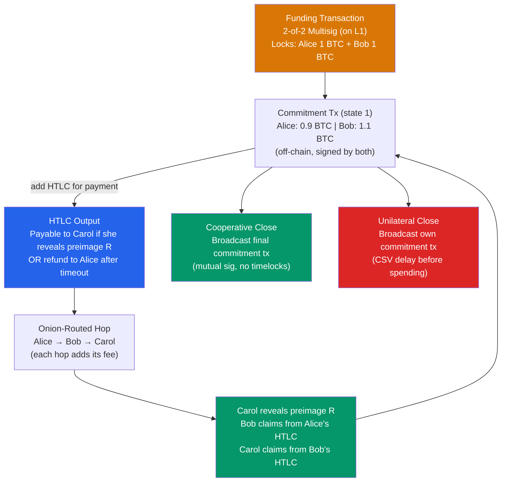

# ⚡ Lightning Network

> [!abstract] TL;DR
> The Lightning Network (LN) is Bitcoin's Layer 2 payment channel network enabling instant, low-cost, off-chain micropayments. Two parties open a **channel** by locking funds in a 2-of-2 multisig (the funding tx); they then exchange **commitment transactions** (off-chain) that update the balance split. **HTLC** (Hash Time-Locked Contracts) enable atomic multi-hop payments: a preimage `R` unlocks payment along a chain of HTLCs — if all settle, payment succeeds; if any fail, all refund via timelock expiry. **Onion routing** (Sphinx) wraps routing instructions in layers so each node learns only its predecessor and successor. **Watchtowers** monitor the chain for old commitment broadcasts (revocation keys detect fraud). The BOLT spec (Basis of Lightning Technology) defines the protocol; Lightning capacity was ~5,000 BTC / 60,000 channels (2025 estimate).

## Intuition — analogy FIRST
Imagine a pub tab between you and the bartender: instead of settling every drink on-chain (expensive, slow), you open a tab (funding transaction on L1) and keep updating an IOU throughout the evening. Only when you leave do you settle the final tab on-chain. Lightning extends this: if you have a tab with the bartender and the bartender has a tab with the brewery supplier, you can pay the brewery through the bartender atomically — the bartender acts as a router and earns a small routing fee.

The magic is the "atomic" part — the payment either completes fully across all hops or fails completely, with no partial transfers. This is achieved via Hash Time-Locked Contracts: the brewery generates a secret and gives you its hash; you pay the bartender if-and-only-if he can produce the secret; the bartender pays the brewery if-and-only-if she produces the secret. Once the brewery reveals the secret to claim her payment, the secret flows back, allowing each hop to settle.

---

## How It Works



---

## Key Concepts / Details

### Payment Channel Lifecycle

**1. Channel Opening**:
- Alice and Bob each fund a 2-of-2 multisig P2WSH (or P2TR with MuSig2)
- Funding tx broadcast on-chain, must confirm (1-3 blocks)
- Both parties exchange first commitment transactions before broadcasting funding tx

**2. Commitment Transactions**:
Each state update creates new commitment txs replacing the old ones. Crucially, old states must be **invalidated**:
- Each party holds a commitment tx that can spend the funding output
- If broadcasted, the CSV (relative timelock) delays their own output by ~144 blocks (1 day)
- The counterparty's output is immediately spendable
- If one party broadcasts an **old** commitment tx: the other party can use the **revocation key** to sweep ALL funds

**Revocation mechanism**: When state transitions from n → n+1:
- Both parties reveal their revocation secret for state n
- If Alice later broadcasts state n's commitment, Bob knows Alice's revocation secret and can claim everything via `OP_IF <revocation_key> OP_CHECKSIG OP_ELSE <144 blocks CSV> OP_CHECKSIG OP_ENDIF`

**3. Hash Time-Locked Contracts (HTLCs)**
For routing a payment from Alice to Carol via Bob:

```
Alice's HTLC to Bob:
  OP_IF
    OP_SHA256 <payment_hash> OP_EQUALVERIFY <Bob_pubkey> OP_CHECKSIG
  OP_ELSE
    <cltv_expiry> OP_CHECKLOCKTIMEVERIFY OP_DROP <Alice_pubkey> OP_CHECKSIG
  OP_ENDIF

Bob's HTLC to Carol (same payment hash, shorter timeout):
  [same structure, timeout = Alice_timeout - Δ blocks]
```

The CLTV timeouts must be **strictly decreasing** hop-by-hop, giving each hop time to claim before the upstream refund window closes.

**4. Onion Routing (Sphinx)**
LN uses Sphinx packet format — each hop receives an encrypted packet and can only decrypt its own layer, learning the next hop. Privacy properties:
- Each node sees only its immediate predecessor and successor
- Cannot determine total path length
- Cannot determine sender or final recipient

```python
# Conceptual Sphinx packet construction
packet = [
    encrypt(hop3_data, hop3_shared_secret),   # Carol's layer
    encrypt(hop2_data + prev_layer, hop2_ss),  # Bob's layer
    encrypt(hop1_data + prev_layer, hop1_ss),  # Alice constructs this
]
```

### BOLT Specification
Lightning is specified in BOLTs (Basis Of Lightning Technology):

| BOLT | Title |
|------|-------|
| BOLT 1 | Base Protocol (message framing, errors) |
| BOLT 2 | Peer Protocol (channel establishment, updates) |
| BOLT 3 | Transaction formats (commitment tx, HTLC scripts) |
| BOLT 4 | Onion Routing (Sphinx packet format) |
| BOLT 5 | Recommendations for on-chain transaction handling |
| BOLT 7 | P2P Node and Channel Discovery (gossip) |
| BOLT 11 | Invoice Protocol (payment requests with QR codes) |
| BOLT 12 | Offers (reusable payment codes, async payments) |

### Routing Fee Structure
Each routing node specifies:
- `base_fee_msat`: flat fee per HTLC forwarded (e.g., 1000 msat = 1 sat)
- `fee_rate_millionths`: proportional fee (e.g., 1000 ppm = 0.1% of payment amount)

Total routing fee for a hop: `base_fee + (amount × fee_rate / 1,000,000)`

**Pathfinding**: LN wallets use Dijkstra/Bellman-Ford on the gossip graph, weighted by fee and reliability. Probabilistic pathfinding (Pickhardt-Richter optimization) considers channel capacity distribution.

### Watchtowers
A **watchtower** is a third-party service that monitors the chain for revoked commitment transactions on behalf of an offline user:
- User shares revocation keys with watchtower
- Watchtower scans every block for transactions spending the funding output
- If old state detected: watchtower broadcasts the justice transaction, sweeping all channel funds
- Watchtower cannot steal funds (only authorized to claim for the victim)

**Privacy concern**: Watchtowers learn which channels you're in. Encrypted blob watchtowers (BOLT 13, proposed) address this by storing encrypted hints — the watchtower can't identify which user it's helping until a breach is detected.

### Channel Management Challenges

| Challenge | Problem | Solution |
|-----------|---------|---------|
| Liquidity | Channel may be depleted in one direction | Circular rebalancing (sending to yourself) |
| Inbound capacity | New node has no inbound liquidity | Liquidity Ads (BOLT 12), dual-funded channels |
| Channel jamming | Attacker routes slow payments to lock up channels | Upfront fee proposals, reputation systems |
| Pathfinding failure | Path with insufficient capacity | Multi-path payments (MPP): split payment across multiple paths |
| Offline receivers | Recipient must be online to settle HTLC | Async payments (BOLT 12 + PTLCs) |

---

## Real-World Notes
- **Multi-Path Payments (MPP)**: split a 1 BTC payment into 10 paths of 0.1 BTC each — increases routing success for large payments. Supported by all major LN implementations.
- **PTLC (Point Time-Locked Contracts)**: Taproot-enabled replacement for HTLC using Schnorr + adaptor signatures — eliminates payment hash correlation across hops for better privacy (not yet deployed as of 2026).
- Major LN implementations: **CLN** (Core Lightning, C-lightning), **LND** (Lightning Labs, Go), **Eclair** (ACINQ, Scala). They interoperate via BOLT spec.
- **LSP (Lightning Service Provider)**: companies like ACINQ offer channel leasing for users who don't want to manage their own node — a centralization trade-off.

---

## Common Pitfalls
1. **Broadcasting old commitment transactions** — triggers the revocation penalty; the counterparty can sweep ALL channel funds. This is why channel state databases must never be restored from backup without care (can roll back to old state).
2. **CLTV delta misconfiguration** — if the hop's CLTV delta is too small, the node may not have time to close the channel before its HTLC timeout, losing funds.
3. **Insufficient inbound liquidity** — a new node with self-funded channels has 100% outbound, 0% inbound capacity; cannot receive payments until channels are depleted or rebalanced.
4. **Ignoring channel reserve** — both parties must maintain a minimum reserve (~1% of channel size) to ensure they always have "skin in the game" against fraud. Payments cannot reduce balance below this reserve.

---

## Related Concepts
- [[_MOC_Bitcoin_Protocol|↑ Bitcoin Protocol MOC]]
- [[UTXO_Model]] — funding transactions spend UTXOs; commitment txs create new UTXOs
- [[Bitcoin_Script]] — HTLCs use CLTV, CSV, OP_CHECKSIG; commitment txs use 2-of-2 multisig
- [[Taproot_and_SegWit]] — SegWit fixed malleability enabling LN; Taproot enables PTLCs and better privacy
- [[02_Applied_Cryptography/ECDSA_and_Digital_Signatures|ECDSA & Digital Signatures]] — adaptor signatures enable PTLCs

---

## Review Questions
1. Alice has an open Lightning channel with Bob. Bob is offline and Alice wants to close the channel, but she broadcasts an old commitment state (accidentally, from a corrupted backup). Describe step-by-step what happens if Bob's watchtower detects this.
2. A multi-hop payment: Alice → Bob → Carol → Dave (final recipient). The payment fails at the Bob → Carol hop because Carol's channel is depleted. Which party sees the failure, how does the error propagate back, and what happens to locked funds?
3. Channel jamming attack: an attacker routes a 10 BTC payment through 20 hops with a malicious final node that never reveals the preimage. Describe the impact on each hop's channel capacity and the cost to the attacker.

---

## Sources
- Poon & Dryja. "The Bitcoin Lightning Network: Scalable Off-Chain Instant Payments" (2016)
- BOLT specification: github.com/lightning/bolts
- Pickhardt & Richter. "Optimally Reliable & Cheap Payment Flows on the Lightning Network" (2021)
- Antonopoulos et al. "Mastering the Lightning Network" (O'Reilly, 2021)
- Teinturier. "Splicing" (BOLT draft, 2023)

#Blockchain #BitcoinProtocol #LightningNetwork #PaymentChannels #HTLC #L2
