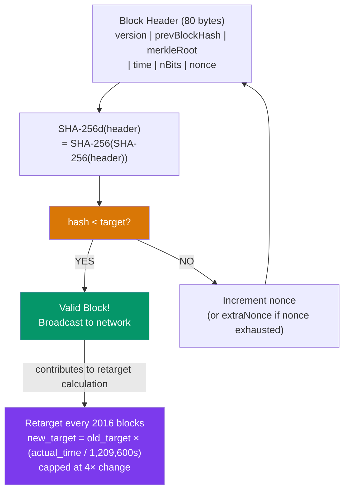

# ⛏️ Bitcoin Mining and Difficulty

> [!abstract] TL;DR
> Bitcoin mining is the process of repeatedly double-SHA-256-hashing block headers until the resulting hash is below the current **target** threshold: `SHA-256d(header) < target`. Miners iterate the 4-byte `nonce` (2^32 possibilities), and when exhausted, modify the `extraNonce` in the coinbase transaction (which changes the Merkle root, giving a new 2^32 nonce space). The **difficulty** D = genesis_target / current_target ≈ 86 trillion (2025). The **retarget** occurs every **2016 blocks** (~2 weeks): `new_target = old_target × (actual_time / 1,209,600 seconds)`, capped at 4× change per period. The block **subsidy** halves every 210,000 blocks (~4 years); as of the 2024 halving it is **3.125 BTC**. The total supply cap of 21M BTC is approached asymptotically, with the last satoshi mined ~2140.

## Intuition — analogy FIRST
Mining is like a global lottery where you have to roll a 10,000-sided die and get under 10 — except instead of a die, you hash a block header, and instead of 10,000 sides, there are 2^256 possible outputs. Every hash is a fresh independent roll. The current target is so low that the average miner needs to attempt 10^22 hashes before finding a valid block. The SHA-256d hash is designed so there's no shortcut — no algorithm is faster than brute-force guessing.

The difficulty retarget is like a thermostat: if the global hashing power (hash rate) increases and blocks arrive faster than every 10 minutes, the target is tightened (fewer valid hashes), making it harder. If hash rate drops and blocks slow down, the target loosens. The thermostat checks and adjusts every two weeks.

---

## How It Works



---

## Key Concepts / Details

### Block Header Structure
The Bitcoin block header is exactly **80 bytes**:

| Field | Size | Description |
|-------|------|-------------|
| version | 4 bytes | Block version (signals soft fork activation) |
| prevBlockHash | 32 bytes | SHA-256d hash of previous block header |
| merkleRoot | 32 bytes | Root of transaction Merkle tree |
| time | 4 bytes | Unix timestamp (must be > median of last 11 blocks) |
| nBits | 4 bytes | Compact representation of the target |
| nonce | 4 bytes | Counter miners iterate (0 to 2^32-1) |

### Target and nBits Encoding
The target is a 256-bit number stored compactly in 4 bytes (nBits):
```
target = mantissa × 2^(8 × (exponent - 3))

nBits = 0x17053894 means:
exponent = 0x17 = 23
mantissa = 0x053894
target = 0x053894 × 2^(8×(23-3)) = 0x053894_00000000000000000000000000000000000000000000 (a very small number)
```

Difficulty: `D = 0x00000000FFFF0000... (genesis target) / current_target`

**2025 difficulty**: ~86 trillion = 8.6 × 10^13. This means mining a block requires an expected 8.6 × 10^13 × 2^32 ≈ 3.7 × 10^23 hash operations.

### Mining Hardware Evolution

| Era | Hardware | Hash rate | Energy efficiency |
|-----|---------|-----------|-------------------|
| 2009-2010 | CPUs | ~1-10 MH/s | Very poor |
| 2010-2011 | GPUs | ~100-500 MH/s | ~100 MH/J |
| 2012-2013 | FPGAs | ~100 GH/s | ~1,000 MH/J |
| 2013+ | ASICs | ~10-100 TH/s | ~10,000-30,000 MH/J |
| 2025 | Modern ASICs | ~200-300 TH/s | ~20 J/TH |

Global Bitcoin hash rate (2025): ~800 EH/s = 8 × 10^20 H/s. Expected block time with this hash rate and current difficulty: exactly ~10 minutes (the retarget mechanism ensures this).

### The Difficulty Retarget Algorithm
Every 2016 blocks (stored in `nBits` of the block at height `k × 2016`):

```python
def retarget(old_target, actual_timespan):
    TARGET_TIMESPAN = 14 * 24 * 60 * 60  # 1,209,600 seconds (2 weeks)
    
    # Clamp to prevent extreme adjustments
    if actual_timespan < TARGET_TIMESPAN // 4:
        actual_timespan = TARGET_TIMESPAN // 4  # Max 4× harder
    if actual_timespan > TARGET_TIMESPAN * 4:
        actual_timespan = TARGET_TIMESPAN * 4  # Max 4× easier
    
    new_target = old_target * actual_timespan // TARGET_TIMESPAN
    return min(new_target, MAX_TARGET)  # Cannot exceed genesis target
```

**Off-by-one bug**: The timespan is computed between block `(period_start - 1)` and `period_end`, so technically 2015 block intervals not 2016. This is a known quirk, not fixed to preserve consensus compatibility.

### Block Reward and Halvings
The **block subsidy** (newly created BTC) started at 50 BTC and halves every 210,000 blocks (~4 years):

| Halving | Block height | Date | Subsidy |
|---------|-------------|------|---------|
| Genesis | 0 | Jan 2009 | 50 BTC |
| 1st | 210,000 | Nov 2012 | 25 BTC |
| 2nd | 420,000 | Jul 2016 | 12.5 BTC |
| 3rd | 630,000 | May 2020 | 6.25 BTC |
| 4th | 840,000 | Apr 2024 | 3.125 BTC |
| ~32nd | ~6,720,000 | ~2140 | <1 satoshi |

Total supply: `Σ 210,000 × 50 / 2^k` for k=0..∞ = `210,000 × 50 × 2` = 21,000,000 BTC.

**Fee market transition**: As subsidy approaches zero, transaction fees must sustain miner economics. This is a major open question for Bitcoin's long-term security budget.

### Mining Pools
Individual miners face high variance (expected 1 block per ~2.4 × 10^23 hashes at 800 EH/s global rate). Pools coordinate thousands of miners to share rewards proportionally:

**Payout schemes**:
- **PPS (Pay Per Share)**: Pool pays fixed amount per valid share submitted, regardless of whether pool finds a block. Pool absorbs variance.
- **PPLNS (Pay Per Last N Shares)**: Reward based on shares submitted in a sliding window before a block is found. Miners absorb variance; no pool-hopping incentive.
- **FPPS (Full Pay Per Share)**: PPS + fee revenue distribution. Most common in 2025.

**Stratum v2**: Modern mining pool protocol with end-to-end encryption, miner-selected transactions (reduces pool censorship power), and efficient binary encoding.

### Selfish Mining Attack
A miner with >~33% hash rate can strategically withhold blocks to gain a disproportionate share of rewards:

1. Find block, do NOT broadcast. Continue mining the next block.
2. If the honest network catches up (finds 1 block), broadcast your block to tie it.
3. Race condition: if you find block 2 first, you reveal both → 2-block lead → honest chain is orphaned.

**Impact**: At 33% hash rate, selfish mining gives >33% of rewards. Above 51%, traditional 51% attack is possible (double-spend). The solution: GHOST fork-choice rule (used in Ethereum) partially mitigates selfish mining by counting uncle blocks.

---

## Real-World Notes
- China banned Bitcoin mining in May 2021, causing the largest difficulty drop in history (~28% decrease over 4 retarget periods). Hash rate recovered to pre-ban levels within ~6 months — demonstrating remarkable anti-fragility.
- Mining profitability depends on: BTC price, hash rate (difficulty), electricity cost (ASIC operators target < $0.05/kWh), and ASIC efficiency. Break-even analysis: `revenue = blocks_per_day × reward × price × (miner_hashrate / total_hashrate)`.
- **Stranded energy mining**: Bitcoin mining is location-agnostic and can use otherwise-wasted energy (flared gas, curtailed renewable). This makes mining a flexible load that stabilizes power grids.

---

## Common Pitfalls
1. **Confusing difficulty and target** — they are inversely related; higher difficulty = lower target = harder to find a valid hash.
2. **Ignoring the nonce exhaustion problem** — the 4-byte nonce (2^32 values) is exhausted in ~0.005 seconds at modern ASIC speeds; the extraNonce in the coinbase provides additional search space.
3. **Assuming 6 confirmations means finality** — for very large transactions on chains with low security budgets (small alt-coins), 6 blocks is insufficient; the 51% attack cost determines safe confirmation depth.
4. **Forgetting the Merkle root changes with extraNonce** — incrementing extraNonce changes the coinbase tx, which changes the Merkle root, which changes the block header — giving miners effectively unlimited search space.

---

## Related Concepts
- [[_MOC_Bitcoin_Protocol|↑ Bitcoin Protocol MOC]]
- [[UTXO_Model]] — the coinbase transaction creates new UTXOs (block reward)
- [[01_Blockchain_Fundamentals/Hash_Functions_and_Merkle_Trees|Hash Functions & Merkle Trees]] — SHA-256d and the Merkle root in the header
- [[01_Blockchain_Fundamentals/Consensus_Mechanisms|Consensus Mechanisms]] — PoW is the consensus mechanism; difficulty is its Sybil resistance mechanism
- [[Taproot_and_SegWit]] — SegWit changes block weight calculation, affecting miner fee selection

---

## Review Questions
1. At global hash rate 800 EH/s, calculate the expected number of hashes to find a block and the expected time in minutes. Show your work.
2. The difficulty retarget caps adjustment at 4×. What problem does this cap prevent, and give a scenario where an attacker could exploit the system without the cap?
3. Selfish mining requires ~33% hash rate. A mining pool reaches 35% of global hash rate. Describe the economic incentive calculation and what happens to the network's security.

---

## Sources
- Nakamoto, S. "Bitcoin: A Peer-to-Peer Electronic Cash System" (2008)
- Eyal & Sirer. "Majority is Not Enough: Bitcoin Mining Is Vulnerable" (2014, CCS)
- Bitcoin Core source: `src/pow.cpp` — `GetNextWorkRequired()`
- bitcoinwiki.org — "Difficulty"
- Stratum v2 specification: stratumprotocol.org

#Blockchain #BitcoinProtocol #Mining #ProofOfWork #SHA256 #Difficulty
