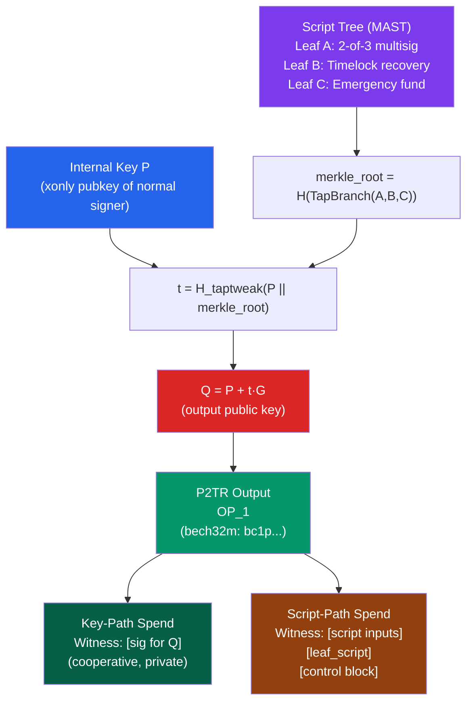

# 🌿 Taproot and SegWit

> [!abstract] TL;DR
> **SegWit** (BIP-141, activated August 2017) separates witness data (signatures) from transaction data, fixing transaction malleability (a Lightning Network prerequisite), reducing effective transaction size via a 75% witness discount (4 weight units per byte → 1 per witness byte), and enabling script version upgrades via the `OP_0` version byte. **Taproot** (BIP-340/341/342, activated November 2021) adds Schnorr signatures, **MAST** (Merkle Abstract Syntax Tree) for hidden script branches, and key aggregation. A P2TR output encodes a **tweaked public key** `Q = P + tG` where `t = H_taptweak(P || merkle_root)` — this means a cooperative spend is just a single Schnorr signature for `Q` (indistinguishable from any other key-path spend), while an uncooperative spend reveals only the executed script branch. bech32m encoding uses the character set `qpzry9x8gf2tvdw0s3jn54khce6mua7l` for P2TR addresses.

## Intuition — analogy FIRST
**SegWit**: Imagine a legal contract where the notary's stamp (signature) must be attached to the document body — the stamp determines the document's ID, so a crooked notary could re-stamp the same document with a slightly different ink placement, changing its ID without changing its content. SegWit moves the stamp to a separate annex: the document's ID is determined only by its content, not the stamp. Lightning Network channels (which reference specific transaction IDs) are now immune to this stamp-manipulation attack.

**Taproot**: A corporate resolution might have 5 different spending clauses ("CFO alone if amount < $1M; CFO + CEO if > $1M; Board of Directors for emergencies; 1-year delay for inheritance"). If the CFO and CEO agree (the normal case), they can jointly present a single combined signature that looks like a personal signature — no one can tell whether it was CFO+CEO, one executive, or a committee. Only if a dispute arises does the specific clause become visible. This is Taproot's key-path vs. script-path paradigm.

---

## How It Works



---

## Key Concepts / Details

### SegWit (BIP-141) Deep Dive

**Transaction malleability (pre-SegWit bug)**:
ECDSA signatures `(r, s)` have a malleability: `(r, n-s)` is also a valid signature. A malicious node could relay a modified version of a transaction with a different txid (same content, different signature encoding), breaking protocols that reference specific txids before confirmation.

**SegWit fix**: Move scriptSig to a separate `witness` field:
- Non-witness serialization (used for txid): `version | inputs | outputs | locktime`
- Full serialization (for relay): `version | marker(0x00) | flag(0x01) | inputs | outputs | witness | locktime`
- txid = SHA-256d(non-witness serialization) — malleated witnesses don't change the txid.
- wtxid = SHA-256d(full serialization) — for the witness Merkle tree in block headers.

**Block weight calculation**:
```
weight = base_size × 4 + witness_size × 1
block weight limit = 4,000,000 weight units (WU)
= 1MB base + 3MB of witness data discount

Effective capacity: ~1.7MB average with SegWit
```

**Version bytes**: SegWit v0 uses `OP_0` (allows P2WPKH and P2WSH). Future versions use `OP_1` through `OP_16` — Taproot uses `OP_1`. This enables soft-fork upgrades to new script semantics.

### BIP-340: Schnorr Signatures
(See also [[02_Applied_Cryptography/ECDSA_and_Digital_Signatures|ECDSA & Digital Signatures]])

Key BIP-340 design choices for Bitcoin:
- **x-only public keys**: Only the x-coordinate of the curve point is stored (32 bytes vs. 33 for compressed ECDSA). The y-coordinate parity is implicit (always even for public keys). This saves 1 byte per key and enables the key tweaking math.
- **Tagged hashes**: All hash computations use a domain separation tag `H_tag(x) = SHA256(SHA256(tag) || SHA256(tag) || x)`. Prevents cross-protocol hash collisions.
- **Nonce generation**: BIP-340 specifies deterministic nonce from the private key and message + optional auxiliary randomness.

```
sign(privkey d, message m):
  P = d·G  (public key, take x-coordinate)
  k = tagged_hash("BIP0340/nonce", d || P.x || m)  # deterministic
  R = k·G
  e = tagged_hash("BIP0340/challenge", R.x || P.x || m)
  sig = (R.x, k + e·d mod n)  # 64 bytes
```

### BIP-341: Taproot
**Tweaked key construction**:
```
t = H_taptweak(P.x || merkle_root)   # if no scripts: t = H_taptweak(P.x)
Q = P + t·G                           # tweaked output key
```

**Why tweaking works for script commitment**:
- The spender of the key-path must sign with the private key of `Q = P + t·G`.
- `Q`'s private key = `p + t` (where `p` is the private key for `P`).
- The spender can only compute `p + t` if they know `p` AND know `t` (which requires knowing the merkle root and thus the committed scripts). This prevents a spender from using a key-path spend to bypass committed scripts they don't know about.
- If `P` is a MuSig2 aggregate key, `p + t` can only be computed collaboratively.

**Control block** (for script-path spend):
```
[version byte (leaf version + parity of Q.y)] || [P.x] || [sibling_hashes...]
```

**Leaf version**: Currently `0xC0`. Future upgrades can use different version bytes (analogous to SegWit version bytes) for new Tapscript semantics.

### BIP-342: Tapscript
Tapscript redefines Script semantics within Taproot leaves:
- `OP_CHECKSIG` and `OP_CHECKSIGVERIFY` use BIP-340 Schnorr signatures (not ECDSA)
- New opcode `OP_CHECKSIGADD`: `<sig> <n> <pubkey> → <n+1>` if sig valid, else `<n>`. Replaces `OP_CHECKMULTISIG` (fixes the dummy null bug).
- `OP_SUCCESS*` opcodes (OP_SUCCESS80 through OP_SUCCESS255): immediately return success — reserved for future opcodes without requiring script failures on old nodes. Any script with an `OP_SUCCESSx` is valid regardless of other content (makes soft-fork upgrades possible).

```
Old 2-of-3 multisig (OP_CHECKMULTISIG):
  OP_2 <pubA> <pubB> <pubC> OP_3 OP_CHECKMULTISIG
  scriptSig: OP_0 <sigA> <sigB>   ← the OP_0 is a quirk/bug

New 2-of-3 Tapscript (OP_CHECKSIGADD):
  <pubA> OP_CHECKSIG <pubB> OP_CHECKSIGADD <pubC> OP_CHECKSIGADD OP_2 OP_GREATERTHANOREQUAL
  witness: <sigA> <sigB> (or any 2 of 3, with OP_0 for missing sig)
```

### bech32m Address Format
P2TR addresses use **bech32m** (BIP-350, distinct from bech32 used for P2WPKH/P2WSH):
- Charset: `qpzry9x8gf2tvdw0s3jn54khce6mua7l`
- Error detection: detect all single-character substitutions + 2-character swaps + some bursts
- Format: `bc1p` + 59 characters (human-readable: `bc`, separator: `1`, version: `p` for OP_1, data: 52 chars)

### Privacy Benefits of Taproot
**Pre-Taproot**: Multisig vs. single-sig was visually distinguishable on-chain (`OP_CHECKMULTISIG` pattern).

**Post-Taproot with MuSig2**: 
- 1-of-1, 2-of-2, 5-of-9 with key aggregation: all produce a single-signature P2TR output — **identical on-chain appearance**
- Lightning cooperative closes look like ordinary key-path sends
- DLCs (Discreet Log Contracts), CoinJoin with Taproot: indistinguishable from normal txs
- Only dispute/unilateral cases reveal the true script

---

## Real-World Notes
- Taproot activated at block 709,632 (Nov 14, 2021) via speedy trial soft fork (BIP-8). Adoption grew to ~60% of outputs by value by 2025.
- Bitcoin Core wallet natively creates P2TR addresses by default since v24 (2022).
- **BIP-118 (ANYPREVOUT)** and **BIP-119 (OP_CHECKTEMPLATEVERIFY)** are proposed Tapscript extensions — eltoo payment channels, covenants — still under discussion as of 2026.
- **Ordinals/BRC-20** inscriptions use Taproot script-path spends with arbitrary data in the witness; this is valid Bitcoin Script (using `OP_IF 0 OP_ENDIF` to make the data unreachable but committable).

---

## Common Pitfalls
1. **Forgetting the parity bit when building control block** — the version byte of the control block encodes the parity of `Q.y`. Incorrect parity causes script-path spend validation to fail.
2. **Using BIP-44 path for P2TR** — Taproot uses `m/86'/coin'/account'/change/index` (BIP-86), not `m/44'`. Using BIP-44 path produces a different address.
3. **Not committing to any scripts when only key-path is needed** — if no scripts are committed (`merkle_root` is empty), the tweaked key is `Q = P + H_taptweak(P.x)·G`. This is still safe but different from `Q = P` (which would reveal no commitment).
4. **Tapscript `OP_SUCCESS` footgun** — a script containing any `OP_SUCCESS` opcode passes immediately without executing any other code. Never place an `OP_SUCCESS` opcode in a script unless you intend it as a future upgrade hook.

---

## Related Concepts
- [[_MOC_Bitcoin_Protocol|↑ Bitcoin Protocol MOC]]
- [[Bitcoin_Script]] — P2TR is the latest script type in the P2PKH → P2TR ladder
- [[UTXO_Model]] — UTXOs locked by P2TR scriptPubKey
- [[Lightning_Network]] — SegWit malleability fix enabled LN; Taproot enables PTLCs for better LN privacy
- [[02_Applied_Cryptography/ECDSA_and_Digital_Signatures|ECDSA & Digital Signatures]] — BIP-340 Schnorr replaces ECDSA in Taproot

---

## Review Questions
1. A Lightning Network cooperative channel close uses a Taproot key-path spend. Explain exactly what information is revealed on-chain and how this differs from a Force Close (unilateral close).
2. You want to create a 3-of-5 multisig that looks like a single-sig on-chain for the common case but can fall back to an individual key after 1 year. Sketch the MAST structure and the key tweaking.
3. Why does BIP-341 use x-only public keys, and what implications does this have for MuSig2 key aggregation in a Taproot output?

---

## Sources
- BIP-340: Schnorr Signatures for secp256k1 (Wuille, Nick, Ruffing, 2020)
- BIP-341: Taproot: SegWit version 1 spending rules (Wuille et al., 2020)
- BIP-342: Validation of Taproot Scripts (Wuille et al., 2020)
- BIP-141: Segregated Witness (Consensus layer) (Wuille et al., 2015)
- BIP-350: Bech32m format for v1+ witness addresses (Wuille, 2020)
- Wuille, P. "Taproot: Privacy preserving switchable scripting" (2018, bitcoin-dev mailing list)

#Blockchain #BitcoinProtocol #Taproot #SegWit #BIP340 #BIP341 #Schnorr #MAST
