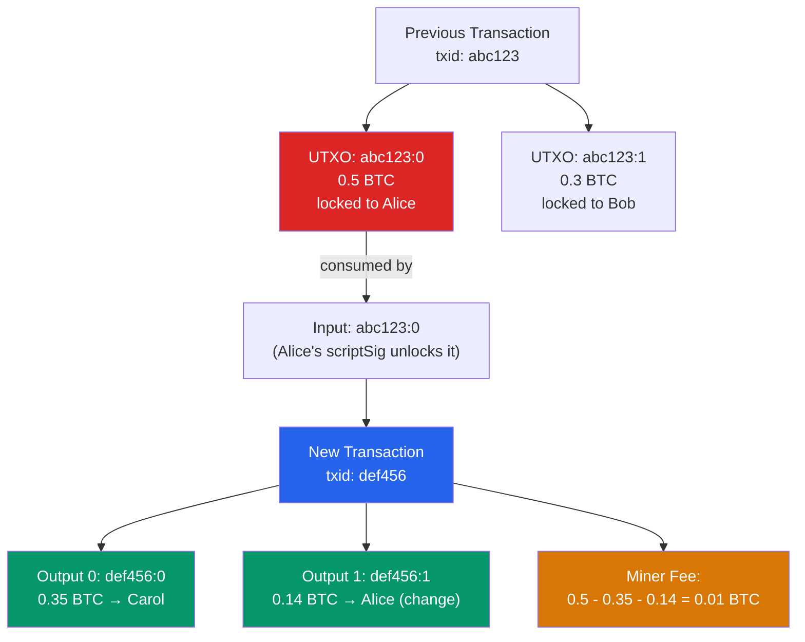

# 💰 The UTXO Model

> [!abstract] TL;DR
> Bitcoin uses the **Unspent Transaction Output (UTXO)** model for accounting: there are no "accounts" or "balances" — instead, the blockchain tracks a set of discrete "coins" (UTXOs), each identified by `txid:vout` (transaction hash + output index), locked by a scriptPubKey, and valued in satoshis. Spending a UTXO creates new UTXOs. A wallet's "balance" is the sum of all UTXOs it can unlock. Key rules: a UTXO must be spent in its entirety (change output is standard), the total output value must not exceed total input value (the difference is the miner fee), and a UTXO with value below **546 satoshis** (the dust threshold at standard relay fee of 3 sat/vByte) is considered non-economically spendable and filtered by most nodes. The entire UTXO set (~5.6 GB as of 2025, ~86M UTXOs) is kept in RAM by full nodes for fast validation.

## Intuition — analogy FIRST
Imagine a world where money only exists as physical banknotes and you cannot get change. To pay for a $30 item, you hand over a $50 bill — but instead of getting $20 back from the cashier, the $50 bill is destroyed and two new bills appear: one for the store ($30) and one for you ($20). Every banknote has a serial number (the `txid:vout`), and the bank keeps a master list of all uncashed banknotes (the UTXO set). To spend a banknote, you sign the back — but only the owner of the specific key (corresponding to the address on the front) can sign validly.

This model means there's no central ledger of "Alice has $30"; instead, there are physical notes that Alice can unlock with her key. Privacy is better (addresses are pseudonymous), parallelism is better (different UTXOs can be spent concurrently without conflict), and double-spend protection is simpler (just check the UTXO set for membership).

---

## How It Works



---

## Key Concepts / Details

### UTXO Structure
Each UTXO in the UTXO set contains:
```
{
  txid: <32-byte transaction hash>,
  vout: <output index, uint32>,
  value: <satoshis, int64>,
  scriptPubKey: <locking script, variable length>
}
```

**Transaction inputs** reference and consume UTXOs:
```
{
  txid: <prevout transaction hash>,
  vout: <prevout output index>,
  scriptSig: <unlocking script (for legacy) or empty>,
  witness: <SegWit witness data>,
  sequence: <uint32, for RBF/timelocks>
}
```

**Conservation equation**: `Σ input values = Σ output values + miner_fee`

### The Dust Threshold
A UTXO is "dust" if spending it would cost more in fees than its value. Bitcoin Core's standard relay policy defines the dust threshold as outputs with fee cost exceeding 1/3 of the output value at the minimum relay fee rate (currently 3 sat/vByte):

```
dust_threshold = 3 × (minimum_output_size × fee_rate)
```

For a P2PKH output (34 bytes output + 148 bytes to spend = 182 bytes):
```
dust_threshold = 3 × 148 × 3 sat/vByte = 1332 satoshis? No...
```

Standard calculation: `dust_limit = 3 × (input_size × dust_relay_fee_rate)` where standard is **546 satoshis** for P2PKH, **294 satoshis** for P2WPKH (smaller witness size), **330 satoshis** for P2TR.

UTXOs below dust threshold are:
- Not relayed by standard nodes
- Still valid — can be mined if included directly, just not propagated
- An attack surface for **dust attacks**: sending tiny amounts to track address clustering

### Coin Selection Algorithms
When spending, a wallet must select which UTXOs to use as inputs. This is the **coin selection problem** (NP-hard in the general case). Strategies:

| Strategy | Description | Tradeoffs |
|----------|-------------|-----------|
| **Branch and Bound (BnB)** | Find exact change-free solution | Best for fee efficiency; O(2^n) worst case |
| **Knapsack** | Greedy fill closest to target | Fast; creates change output |
| **Single Random Draw** | Try random single large UTXO | Simple; wastes change |
| **FIFO** | Use oldest UTXOs first | Reduces UTXO set age; may create dust |
| **Minimize inputs** | Use fewest inputs | Low fee; consolidates UTXOs |

Bitcoin Core uses **Branch and Bound** (BnB) first (finds exact match), falling back to **Single Random Draw** (SRD) for stochastic selection if BnB fails. The goal: minimize total fee while avoiding change (best case) or minimizing change (second best).

```python
# BnB pseudocode
def branch_and_bound(utxos, target, fee_per_input):
    # Sort UTXOs descending by value
    # Try combinations: DFS with bound = target + max_fee
    # If effective_value == target → change-free solution!
    pass
```

### UTXO vs Account Model Comparison

| Property | UTXO (Bitcoin) | Account (Ethereum) |
|----------|---------------|-------------------|
| State representation | Set of unspent outputs | Account balances in state trie |
| Parallelism | High (independent UTXOs) | Lower (account state requires serialization) |
| Privacy | Pseudo-anon (no address reuse best practice) | Single address, all txs linked |
| Double-spend check | UTXO set membership lookup | Account nonce + balance check |
| Smart contracts | Limited (Bitcoin Script) | Full (EVM) |
| UTXO/Account creation | Output creation | Account creation (first receive) |
| Light client | SPV + Merkle proof | Light client + state proof (heavier) |

### Replace-By-Fee (RBF, BIP-125)
A transaction signals RBF by setting sequence < 0xFFFFFFFE. A replacement:
- Must spend at least one of the same inputs
- Must have a higher fee rate (at least 1 sat/vByte more than original)
- Cannot include previously confirmed inputs

**Use case**: unstuck low-fee transactions during fee spikes. **Risk for merchants**: accepting 0-conf RBF transactions is unsafe — the sender can replace with a tx that pays themselves.

### Child-Pays-For-Parent (CPFP)
If a transaction (parent) is stuck with low fee, create a child transaction that spends an output of the parent and pays a high-enough fee to incentivize miners to include both:

```
effective_fee_rate = (parent_fee + child_fee) / (parent_vsize + child_vsize)
```

---

## Real-World Notes
- Bitcoin's UTXO set fits in ~5-6 GB of RAM — full nodes keep it entirely in memory for fast validation. The "chainstate" LevelDB database stores the UTXO set.
- **Consolidation transactions**: wallets periodically merge many small UTXOs into fewer large ones during low-fee periods — reduces future spend costs.
- **CoinJoin**: multiple users combine UTXOs in one transaction with multiple outputs of equal value — breaks transaction graph analysis for privacy.
- **Ordinals/Inscriptions** (2023): treat individual satoshis as ordinals (indexed by mining order), inscribing data in witness fields. Created a new "digital artifacts" market using UTXO semantics in creative ways.

---

## Common Pitfalls
1. **Address reuse** — receiving multiple payments to the same address links all UTXOs; wallet clustering analysis can deanonymize users.
2. **Not accounting for change output in fee calculation** — adding a change output to avoid dust costs additional bytes; sometimes it's cheaper to donate the change to miners.
3. **Treating 0-conf as final** — unconfirmed UTXOs can be replaced (RBF) or double-spent; never ship goods for 0-conf Bitcoin payments.
4. **Ignoring locktime and sequence** — `nLockTime` prevents transaction broadcast until a future block/timestamp; `sequence` enables RBF and relative timelocks (BIP-68).

---

## Related Concepts
- [[_MOC_Bitcoin_Protocol|↑ Bitcoin Protocol MOC]]
- [[Bitcoin_Script]] — scriptPubKey locks each UTXO; scriptSig/witness unlocks it
- [[Mining_and_Difficulty]] — miners select UTXOs from the mempool by fee rate
- [[Lightning_Network]] — payment channels are built on top of UTXOs (funding tx)
- [[Taproot_and_SegWit]] — SegWit discount on witness data changes effective UTXO size

---

## Review Questions
1. A wallet has UTXOs: [0.1 BTC, 0.05 BTC, 0.03 BTC, 0.01 BTC] and needs to send 0.13 BTC. List all possible input combinations and explain which Branch and Bound would select and why.
2. Explain how a dust attack works and what information the attacker gains by tracking the small UTXOs they send.
3. A merchant accepts a Bitcoin payment for a $5,000 product without waiting for confirmations. The buyer had enabled RBF. Describe the attack and estimate the success probability.

---

## Sources
- Nakamoto, S. "Bitcoin: A Peer-to-Peer Electronic Cash System" (2008)
- BIP-125: Opt-in Full Replace-by-Fee Signaling (Heilman & Todd, 2015)
- Erhardt & Shikhelman. "An Empirical Analysis of Bitcoin's UTXO Set" (2017, BTCSR)
- Bitcoin Core source: `src/wallet/coinselection.cpp`
- BIP-141: Segregated Witness (Wuille et al., 2015)

#Blockchain #BitcoinProtocol #UTXO #CoinSelection #Bitcoin
