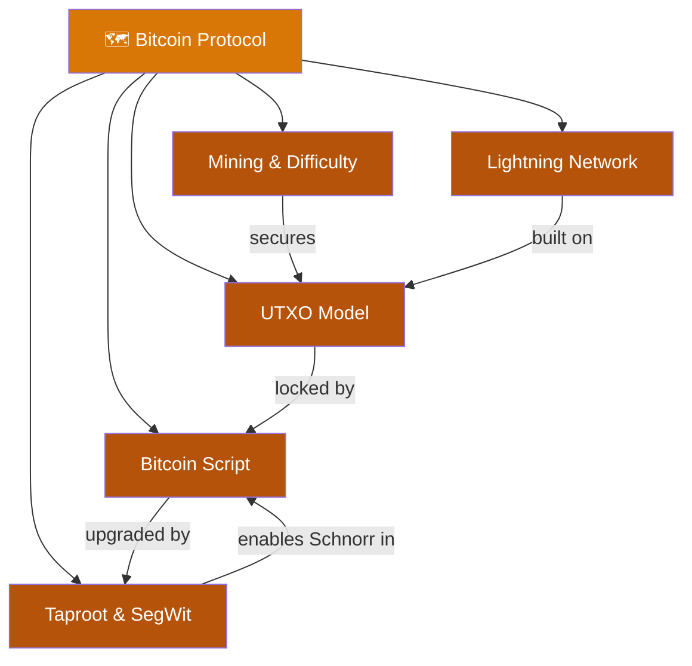

# 🗺️ Bitcoin Protocol — Map of Content

> [!abstract] What This Section Covers
> This section covers Bitcoin's full protocol stack from the ground up: the UTXO accounting model, the scripting language that expresses spending conditions, the proof-of-work mining loop and difficulty retarget algorithm, the Lightning Network payment channel architecture, and the Taproot/SegWit upgrade path that unlocks Schnorr signatures and MAST. Together these notes give you the mental model to build, audit, or operate on Bitcoin's base layer and Layer 2.

---

## Concept Map

---

## Learning Path

1. [[UTXO_Model]] — Start with Bitcoin's accounting model: txid:vout, coin selection algorithms, the 546 sat dust threshold.
2. [[Bitcoin_Script]] — The locking/unlocking language: P2PKH, P2SH, P2WPKH, P2TR — stack machine semantics.
3. [[Mining_and_Difficulty]] — The consensus engine: SHA-256d double hash, nBits encoding, retarget every 2016 blocks.
4. [[Taproot_and_SegWit]] — Soft fork upgrades: SegWit malleability fix, Taproot BIP340/341/342, tweaked key Q=P+tG, MAST.
5. [[Lightning_Network]] — Layer 2: 2-of-2 channels, revocation secrets, HTLCs, CLTV timelocks, onion routing, watchtowers.

---

## All Notes at a Glance

| Note | Difficulty | What You'll Learn |
|------|-----------|-------------------|
| [[UTXO_Model]] | Beginner | UTXO set, coin selection, change outputs, dust |
| [[Bitcoin_Script]] | Intermediate | Stack opcodes, P2PKH→P2TR script types |
| [[Mining_and_Difficulty]] | Intermediate | Hashcash PoW, difficulty retarget, selfish mining |
| [[Taproot_and_SegWit]] | Advanced | BIP340 Schnorr, BIP341 Taproot, BIP342 Tapscript, MAST |
| [[Lightning_Network]] | Advanced | Payment channels, HTLCs, BOLT spec, routing |

---

## Key Questions This Section Answers

- How does the UTXO model prevent double-spending without a central ledger?
- What is the dust threshold and why does it exist?
- How does Bitcoin Script's stack machine evaluate a P2PKH spending condition?
- How does the difficulty retarget algorithm maintain ~10 min block times?
- How do Lightning HTLCs route payments atomically across multiple hops?
- How does Taproot's key-path spend hide the full script tree on-chain?

---

## Related Sections

- [[_MOC_Blockchain_Master|↑ Blockchain Master MOC]]
- [[_MOC_Applied_Cryptography|← Applied Cryptography]]
- [[_MOC_Ethereum_EVM|→ Ethereum & EVM]]

#MOC #Blockchain #BitcoinProtocol
