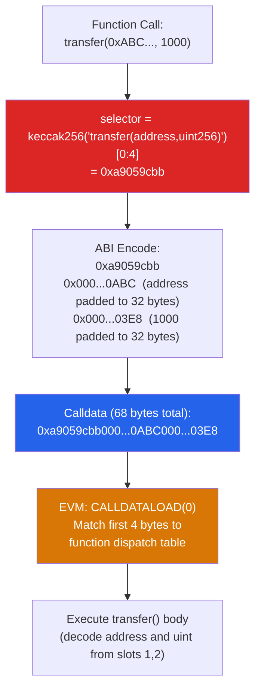

# 🔌 ABI and Contract Interaction

> [!abstract] TL;DR
> The **ABI (Application Binary Interface)** defines how callers encode function calls and decode return data for EVM contracts. A **function selector** is the first 4 bytes of `keccak256("functionName(type1,type2,...)")` — this is what the EVM uses to route calldata to the correct function. **ABI encoding** uses 32-byte slots for all types: static types packed inline, dynamic types (arrays, bytes, strings) stored with a 32-byte offset pointer + length + data. **CREATE2** (`address = keccak256(0xFF || deployer || salt || keccak256(initcode))[12:]`) enables counterfactual deployment — contracts can be pre-funded at an address before their code exists. **Multicall** (EIP-2000-style, implemented by MakerDAO/Uniswap) batches multiple contract calls into one transaction, saving overhead and enabling atomic multi-step interactions.

## Intuition — analogy FIRST
The ABI is like a phone book for smart contracts: it tells external callers what functions exist, what arguments they take, and what they return. When you call `transfer(address to, uint256 amount)`, the ABI says "encode these as: the function's 4-byte fingerprint, then 32 bytes for the address, then 32 bytes for the amount." The contract receives this binary blob via calldata, uses the first 4 bytes to find the right function dispatcher, and unpacks the rest.

CREATE2 is like renting an office before you've signed a lease: someone can start sending mail (ETH) to your future address — calculated from your future office's blueprint and a unique key — before you've actually moved in. Once you deploy, you inherit all mail sent ahead of time.

---

## How It Works



---

## Key Concepts / Details

### Function Selectors
```python
from eth_abi.abi import encode
import hashlib

def selector(signature):
    return hashlib.sha3_256(signature.encode()).digest()[:4].hex()

# Examples:
selector("transfer(address,uint256)")  # "a9059cbb"
selector("balanceOf(address)")          # "70a08231"
selector("approve(address,uint256)")    # "095ea7b3"
selector("")                            # "00000000" — receive() fallback

# Solidity:
bytes4 sel = bytes4(keccak256("transfer(address,uint256)"));
```

**Selector collision**: two different function signatures can have the same 4-byte selector (probability ~1/2^32 for random pairs). A known attack: craft a function name that collides with `withdraw()` in a malicious contract to mislead users. Tools like `sig.eth.samczsun.com` catalogue known selectors.

### ABI Encoding Rules

**Static types** (fixed size): encoded inline in their 32-byte slot
```
address: 000000000000000000000000<20 bytes>
uint256: <32 bytes big-endian>
bool:    000...0001 or 000...0000
bytes32: <32 bytes>
int128:  sign-extended to 32 bytes
```

**Dynamic types** (variable size): encoded as a 32-byte offset pointer, then actual data elsewhere
```
string "hello":
  [offset: 0x20]   <- pointer to where string data begins (32 bytes after tuple start)
  [length: 5]      <- length in bytes
  [data: 0x68656c6c6f000...] <- utf-8 padded to 32-byte boundary
```

**Nested example**: `transfer(address, uint256, bytes calldata)`:
```
Calldata (selector stripped):
slot 0: 0x000...0xABC    (address to — static, inline)
slot 1: 0x000...0x64     (amount = 100 — static, inline)
slot 2: 0x000...0x60     (offset of bytes data = 96 = 3×32)
slot 3: 0x000...0x05     (length of bytes = 5)
slot 4: 0xABCDEF1234...  (5 bytes + 27 bytes padding)
```

**ABI encode/decode in Solidity**:
```solidity
// Encoding
bytes memory data = abi.encode(uint256(42), address(this));
bytes memory packed = abi.encodePacked(uint8(1), bytes20(addr)); // no padding

// Decoding
(uint256 a, address b) = abi.decode(data, (uint256, address));

// Call with raw calldata
(bool success, bytes memory ret) = target.call(
    abi.encodeWithSelector(IERC20.transfer.selector, recipient, amount)
);
```

### Receive and Fallback Functions
```solidity
contract Receiver {
    receive() external payable {
        // Called when: calldata is empty AND ETH is sent
    }
    
    fallback() external payable {
        // Called when: no matching function selector
        // OR receive() doesn't exist but ETH is sent
    }
}
```

ETH transfer routing:
```
ETH sent to contract:
  calldata empty? → receive() if exists, else fallback()
  calldata non-empty? → dispatch by selector; fallback() if no match
```

### CREATE2 Counterfactual Deployment
```
deployed_address = keccak256(0xFF || deployer_address || salt || keccak256(init_code))[12:]
```

**Key property**: The address can be computed before deployment. ETH or tokens can be sent to this address. When the contract is deployed with matching deployer+salt+initcode, it inherits any pre-sent funds.

**Applications**:
1. **Layer 2 account abstraction**: pre-fund your wallet address before deploying the wallet contract.
2. **Counterfactual channel funding**: fund a Lightning-style channel address before creating the multisig.
3. **Upgradeable proxy deployment**: deploy a proxy at a predictable address, then point it at the implementation.
4. **Efficient factory patterns**: Uniswap v2 uses CREATE2 to deploy pair contracts at addresses that encode the token pair, enabling off-chain pair address computation without an on-chain lookup.

```solidity
// Uniswap v2 pair address computation (no on-chain lookup needed)
function pairFor(address factory, address tokenA, address tokenB)
    internal pure returns (address pair)
{
    (address token0, address token1) = tokenA < tokenB
        ? (tokenA, tokenB) : (tokenB, tokenA);
    pair = address(uint160(uint(keccak256(abi.encodePacked(
        hex'ff',
        factory,
        keccak256(abi.encodePacked(token0, token1)),
        hex'96e8ac4277198ff8b6f785478aa9a39f403cb768dd02cbee326c3e7da348845f' // init code hash
    )))));
}
```

### Multicall
Batch multiple calls in a single transaction for:
- Atomic multi-step operations (read state → make dependent call)
- Gas savings (one tx overhead instead of many)
- Avoiding state changes between operations

```solidity
// Simplified multicall
contract Multicall3 {
    struct Call {
        address target;
        bytes callData;
    }
    
    function aggregate(Call[] calldata calls)
        external returns (uint256 blockNumber, bytes[] memory returnData)
    {
        blockNumber = block.number;
        returnData = new bytes[](calls.length);
        for (uint256 i = 0; i < calls.length; i++) {
            (bool success, bytes memory ret) = calls[i].target.call(calls[i].callData);
            require(success, "Multicall3: call failed");
            returnData[i] = ret;
        }
    }
}
```

MakerDAO's `Multicall3` (deployed at `0xcA11bde05977b3631167028862bE2a173976CA11` on all major EVM chains) is the de facto standard.

### Interface and Contract Interaction Patterns
```solidity
// Interface definition (no implementation)
interface IERC20 {
    function transfer(address to, uint256 amount) external returns (bool);
    function balanceOf(address account) external view returns (uint256);
    event Transfer(address indexed from, address indexed to, uint256 value);
}

// Call via interface
function sendToken(address token, address to, uint256 amount) external {
    bool ok = IERC20(token).transfer(to, amount);
    require(ok, "Transfer failed");
}

// Low-level call (when you don't have the ABI)
(bool success, bytes memory data) = token.call(
    abi.encodeWithSignature("transfer(address,uint256)", to, amount)
);
require(success && (data.length == 0 || abi.decode(data, (bool))));
// Note: some tokens return nothing; some return false instead of reverting
```

**SafeERC20** (OpenZeppelin): wraps low-level calls to handle non-standard ERC20s (USDT returns void, not bool).

---

## Real-World Notes
- Etherscan's "Read Contract" / "Write Contract" tabs use the ABI JSON + provider to let users call functions directly in a browser.
- **EIP-3156 Flash Loan Standard**: defines `flashLoan(receiver, token, amount, data)` with a standardized callback — the ABI standardization enables protocol composability.
- **EIP-4626 Tokenized Vaults**: a standard ABI for yield-bearing vault tokens — `deposit/withdraw/mint/redeem` with standard share price calculation.
- Function selectors are case-sensitive and whitespace-sensitive in the canonical form. `Transfer(address,uint256)` and `Transfer(address, uint256)` produce different selectors.

---

## Common Pitfalls
1. **Function selector collisions** — a malicious contract could expose `func_abc123()` that has the same selector as your `withdraw()`. Always verify contract source code, not just the ABI.
2. **Not handling ERC20's non-standard return** — USDT's `transfer()` returns void (no bool). Calling `IERC20.transfer()` directly on USDT may revert at ABI decoding. Use `SafeERC20.safeTransfer()`.
3. **ABI-encoding dynamic types with wrong offsets** — manually constructing calldata with `abi.encodePacked` for dynamic types skips length prefixes; use `abi.encode` for correctness.
4. **Delegatecall with different ABI** — if the proxy and implementation have the same function selectors but different type signatures, decoding arguments from calldata will silently read wrong values.

---

## Related Concepts
- [[_MOC_Ethereum_EVM|↑ Ethereum & EVM MOC]]
- [[EVM_Architecture]] — calldata is one of the EVM's data regions; function dispatch is EVM bytecode
- [[Solidity_Programming]] — ABI is the external face of Solidity contracts
- [[Gas_and_Optimization]] — calldata bytes cost 16 gas each (nonzero); ABI encoding matters for gas
- [[Upgradeable_Contracts]] — proxy contracts rely on DELEGATECALL with ABI compatibility guarantees

---

## Review Questions
1. Two functions in different contracts: `function foo(uint8 x, address y)` and `function bar(bytes4 x, bytes16 y)` — both have 4-byte parameters. Could they share the same function selector? Show the selector calculation.
2. Using CREATE2, you pre-fund an address with 1 ETH before deployment. Then you deploy a contract at that address that has no `receive()` function. What happens to the 1 ETH?
3. A user calls `Multicall3.aggregate()` with 5 calls. The 3rd call reverts. What is the behavior with `aggregate()` vs. `tryAggregate(false)` (non-reverting version)? When would you use each?

---

## Sources
- Ethereum ABI Specification: docs.soliditylang.org/en/v0.8.x/abi-spec.html
- EIP-1014: Skinny CREATE2 (Buterin, 2018)
- Multicall3: github.com/mds1/multicall
- OpenZeppelin SafeERC20: github.com/OpenZeppelin/openzeppelin-contracts
- Samczsun — "Ethereum Signature Database": sig.eth.samczsun.com

#Blockchain #EthereumEVM #ABI #FunctionSelector #CREATE2 #Multicall
