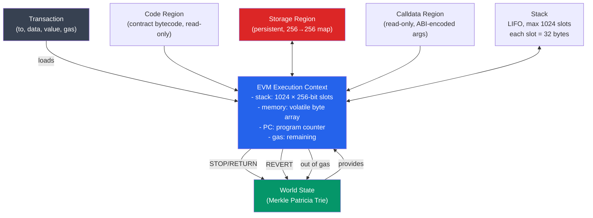

# 🔧 EVM Architecture

> [!abstract] TL;DR
> The **Ethereum Virtual Machine (EVM)** is a quasi-Turing-complete, stack-based virtual machine that executes smart contract bytecode. Key parameters: **1024-slot stack** of 256-bit (32-byte) words, **volatile memory** (byte-addressable, expands in 32-byte chunks at O(n²) cost), **persistent storage** (key-value map, 256-bit → 256-bit, SSTORE cold: 20,000 gas, SLOAD cold: 2,100 gas), and **read-only calldata**. Every instruction has a gas cost; execution halts with `REVERT` (state reverted) or `STOP`/`RETURN` (success). Call types: `CALL` (external, new context), `DELEGATECALL` (external code, caller's storage), `STATICCALL` (view, no state changes), `CREATE`/`CREATE2` (deploy new contracts). The EVM is deterministic across all nodes — given the same state and transaction, every node produces identical output.

## Intuition — analogy FIRST
Think of the EVM as a very specific kind of calculator: instead of having memory registers (like your CPU), it has a stack of slots — you push values onto the stack, operations pop values off the top, and results are pushed back. Every operation costs a specific number of "gas tokens" which are pre-purchased; run out and the calculation resets (but you keep the gas as miner fees).

The EVM's genius is its determinism: every Ethereum node runs exactly the same calculator on the same inputs and must arrive at the same outputs. There are no random numbers, no system calls, no floating point. This determinism is what makes smart contracts trustworthy — a DeFi protocol's logic runs identically for every user on every validator node.

---

## How It Works



---

## Key Concepts / Details

### Data Regions

| Region | Access | Persistence | Cost model |
|--------|--------|-------------|-----------|
| **Stack** | Push/pop (top only) | Volatile | Minimal (3 gas) |
| **Memory** | `MLOAD`/`MSTORE` (any offset) | Volatile (per call) | Quadratic expansion |
| **Storage** | `SLOAD`/`SSTORE` (any key) | Persistent | 20,000 / 2,100 gas |
| **Calldata** | `CALLDATALOAD`/`CALLDATACOPY` | Read-only | 4 gas/0-byte, 16/nonzero |
| **Code** | `CODECOPY`, `CODESIZE` | Read-only | Fixed |
| **Returndata** | `RETURNDATACOPY` | Read-only (prev call) | Fixed |
| **Transient storage** | `TLOAD`/`TSTORE` (EIP-1153) | Volatile (tx-scope) | 100 gas |

**Memory expansion cost**: `gas = word_count² / 512 + 3 × word_count`. Memory is zero-initialized on each call. Expanding to 1KB costs ~100 gas; 32KB costs ~2800 gas; 1MB costs ~2M gas (prohibitive).

### Gas Costs for Critical Opcodes

| Opcode | Gas | Notes |
|--------|-----|-------|
| `ADD`, `MUL`, `SUB` | 3 | Arithmetic |
| `DIV`, `SDIV` | 5 | Division |
| `EXP` | 10 + 50/byte of exp | Dynamic |
| `KECCAK256` | 30 + 6/word | Hash function |
| `SLOAD` | 2,100 (cold) / 100 (warm) | EIP-2929 |
| `SSTORE` | 20,000 (new slot) / 5,000 (update) / 2,900 (warm) | EIP-2929 |
| `CALL` | 2,600 (cold addr) / 100 (warm) + value transfer: 9,000 | Dynamic |
| `CREATE` | 32,000 + init code gas | Contract deployment |
| `LOG1` - `LOG4` | 375 + 375/topic + 8/byte | Events |
| `RETURNDATASIZE` | 2 | Very cheap |
| `TLOAD`/`TSTORE` | 100 | EIP-1153 transient |

### Call Types

```
CALL:         external call, caller provides value and gas
              creates new context, accesses callee's storage
              
DELEGATECALL: external call using callee's CODE but caller's storage
              msg.sender and msg.value are preserved from original caller
              used in proxy patterns (caller = proxy, callee = logic contract)
              
STATICCALL:   read-only call, any state modification reverts
              used for 'view' and 'pure' functions
              
CALLCODE:     deprecated (use DELEGATECALL)

CREATE:       deploys new contract at deterministic address based on sender+nonce
              address = keccak256(rlp([sender, nonce]))[12:]
              
CREATE2:      deploys at deterministic address based on sender+salt+initcode
              address = keccak256(0xFF || sender || salt || keccak256(initcode))[12:]
```

### Stack Operations
The EVM stack supports:
- `PUSH1`..`PUSH32`: push 1-32 bytes onto stack (most common opcodes)
- `POP`: discard top item
- `DUP1`..`DUP16`: duplicate item at depth 1..16
- `SWAP1`..`SWAP16`: swap top with item at depth 2..17
- Stack overflow (>1024 items) causes immediate revert

Example: `ADD` in bytecode:
```
PUSH1 0x05    // stack: [5]
PUSH1 0x03    // stack: [3, 5]
ADD           // pops 3 and 5, pushes 8: stack: [8]
```

### Account Types

| Type | Has code? | Has storage? | Created by |
|------|-----------|--------------|-----------|
| **EOA** (Externally Owned Account) | No | No | Key pair generation |
| **Contract account** | Yes | Yes | `CREATE` / `CREATE2` |

EOA to Contract calls initiate EVM execution. Contract to Contract calls nest execution contexts. Maximum call stack depth: **1024 frames** (EIP-150 mitigated reentrancy via 63/64 gas forwarding rule).

### EIP-1559 Gas Market (Brief)
Transactions include:
- `maxFeePerGas`: max willing to pay (gwei/gas)
- `maxPriorityFeePerGas`: tip for validator (gwei/gas)
- Actual fee: `(base_fee + priority_fee) × gas_used`, where `base_fee` is burned

(See [[Gas_and_Optimization]] for full EIP-1559 deep dive.)

### The Execution Loop
```python
# Pseudocode EVM execution
def execute(code, calldata, state, gas):
    pc = 0
    stack = []
    memory = bytearray()
    
    while pc < len(code):
        op = code[pc]
        gas_cost = GAS_TABLE[op]
        if gas < gas_cost:
            raise OutOfGas()
        gas -= gas_cost
        
        if op == PUSH1:
            pc += 1
            stack.append(code[pc])
        elif op == ADD:
            a, b = stack.pop(), stack.pop()
            stack.append((a + b) % 2**256)
        elif op == SSTORE:
            key, value = stack.pop(), stack.pop()
            state.storage[key] = value
        elif op == RETURN:
            offset, size = stack.pop(), stack.pop()
            return memory[offset:offset+size]
        # ... etc
        
        pc += 1
```

### Precompiles
Precompiled contracts at addresses `0x01`–`0x0A` implement expensive operations in native code (not EVM bytecode):

| Address | Function | Gas | Use case |
|---------|----------|-----|---------|
| 0x01 | ECDSA recover | 3,000 | Signature verification |
| 0x02 | SHA-256 | 60 + 12/word | Bitcoin interop |
| 0x03 | RIPEMD-160 | 600 + 120/word | Bitcoin address hashing |
| 0x04 | Identity | 15 + 3/word | Data copy |
| 0x05 | ModExp | Variable | RSA verify |
| 0x06-0x08 | BN254 pairings | 150/point | ZK proof verify |
| 0x09 | BLAKE2f | Variable | Zcash/ZK |

---

## Real-World Notes
- The EVM's 256-bit word size matches secp256k1 key sizes — a deliberate design decision enabling native cryptographic operations.
- **EIP-3855** (PUSH0 opcode): added a dedicated `PUSH0` (pushes 0 onto stack) for 2 gas — saves bytes vs. `PUSH1 0x00`.
- **EIP-4844** (Proto-Danksharding): added `BLOBHASH` opcode to access blob commitments from blob-carrying transactions.
- **EOF (EVM Object Format, EIP-3540)**: proposed new container format for EVM code with explicit code/data separation, static jumps (no dynamic `JUMP`), and better tooling. Not yet activated as of 2026.
- **Verkle Trees**: upcoming Ethereum upgrade that changes the state tree structure, enabling stateless clients with smaller (~1KB) state witnesses.

---

## Common Pitfalls
1. **DELEGATECALL storage collision** — if a proxy and implementation contract have different storage layouts, a `DELEGATECALL` to the implementation reads/writes the proxy's storage slots with different semantics. Use EIP-1967 standardized storage slots.
2. **Integer arithmetic overflow** — Solidity <0.8.0 doesn't revert on overflow; `uint256 max + 1 = 0`. Use SafeMath or Solidity 0.8+ which checks by default.
3. **Ignoring return value of CALL** — a `CALL` can fail silently if the called contract reverts; always check the boolean return value.
4. **Reentrancy via CALL** — a `CALL` transfers control to external code before returning; the external code can call back into your contract in an inconsistent state. Use checks-effects-interactions or reentrancy guards.

---

## Related Concepts
- [[_MOC_Ethereum_EVM|↑ Ethereum & EVM MOC]]
- [[Solidity_Programming]] — Solidity compiles to EVM bytecode
- [[Gas_and_Optimization]] — every opcode has a gas cost
- [[ABI_and_Contract_Interaction]] — calldata encoding for function calls
- [[Upgradeable_Contracts]] — DELEGATECALL is the basis of proxy patterns

---

## Review Questions
1. A Solidity function writes to 100 different storage slots in one transaction. Calculate the gas cost for SSTORE on each assuming: 50 are new (cold, zero → nonzero), 30 are updates (cold, nonzero → nonzero), and 20 are warm (accessed earlier in the same tx).
2. The EVM call stack depth is limited to 1024. Design a reentrancy attack that exploits this limit on a contract that checks `address(this).balance` but not the call depth.
3. A contract uses `DELEGATECALL` to call a logic contract. The logic contract's `initialize()` function writes to storage slot 0. What does this actually modify, and what is the risk if the proxy contract stores its admin address at slot 0?

---

## Sources
- Ethereum Yellow Paper (Wood, G. — current version)
- EIP-2929: Gas cost increases for state access opcodes (2021)
- EIP-1153: Transient storage opcodes (2022)
- evm.codes — Interactive EVM opcode reference
- ethereum.org — "Ethereum Virtual Machine (EVM)"

#Blockchain #EthereumEVM #EVM #Opcodes #StackMachine #Ethereum
