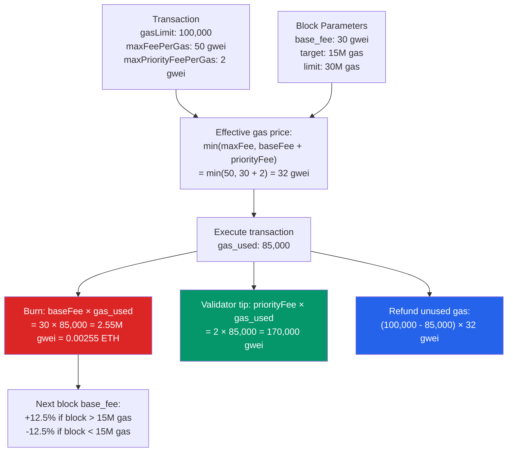

# ⛽ Gas and EVM Optimization

> [!abstract] TL;DR
> Gas is Ethereum's metering mechanism for computation. Every EVM opcode has a fixed gas cost; a transaction specifies a `gasLimit` (max gas) and pays `gas_used × effective_gas_price`. **EIP-1559** (London, Aug 2021) replaced first-price auctions: each block has a `base_fee` (burned, adjusts ±12.5% per block based on 15M target utilization) plus a `priority_fee` (tip to validator). Validators earn priority tips; base fees are burned (making ETH deflationary at high usage). Key gas costs: SSTORE new slot = 20,000; SLOAD cold = 2,100; CALL cold = 2,600; calldata byte (nonzero) = 16. Optimization techniques: pack variables into slots, use `calldata` not `memory` for external inputs, avoid `SSTORE` in loops, use events instead of storage for historical data, use `CREATE2` for counterfactual deployment, `bytes32` packing, and short-circuit conditions.

## Intuition — analogy FIRST
Gas is Ethereum's taxi meter: every operation is a meter tick, and you prepay by setting a gas limit. If the ride (transaction) costs less than your prepaid amount, you get the change back. If it costs more, the taxi stops mid-trip (out of gas), you lose the fare but are returned to your starting location (state is reverted).

EIP-1559 changed the fare structure from "haggle with the driver" (first-price auction — frequent overpaying) to "fixed meter rate + small tip" (base fee + priority fee). The meter rate (base fee) automatically increases when Ethereum is busy and decreases when quiet. The smart driver (validator) sorts passengers by tip size, so tipping more gets you picked up faster during busy periods.

---

## How It Works



---

## Key Concepts / Details

### EIP-1559 Base Fee Dynamics
The base fee adjusts each block by at most 12.5%:
```
new_base_fee = base_fee × (1 + 1/8 × (gas_used - target) / target)
```

Where `target = 15M gas` (half of the 30M gas block limit). 

If `gas_used = 30M` (full block): `new_base_fee = base_fee × (1 + 1/8) = base_fee × 1.125` (+12.5%)
If `gas_used = 0` (empty block): `new_base_fee = base_fee × 0.875` (-12.5%)

**Minimum base fee**: 1 wei (can't go below). **ETH burn**: ~$X million/day at average usage; network was deflationary (net ETH supply decreased) during high-usage periods post-Merge.

**Fee estimation strategy**:
```javascript
// ethers.js v6
const feeData = await provider.getFeeData();
const tx = {
  maxFeePerGas: feeData.maxFeePerGas,         // base_fee × 2 + tip (aggressive)
  maxPriorityFeePerGas: feeData.maxPriorityFeePerGas,  // ~1-2 gwei typically
};
```

### Storage Cost — The Dominant Cost

| Operation | Condition | Gas |
|-----------|-----------|-----|
| `SSTORE` | slot: 0 → nonzero (cold) | 22,100 (20,000 base + 2,100 cold load) |
| `SSTORE` | slot: nonzero → nonzero (cold) | 5,000 + 2,100 = 7,100 |
| `SSTORE` | slot: warm (already read) | 100 |
| `SSTORE` | slot: nonzero → 0 (refund 15,000) | 5,000 then +15,000 refund (max 20% of gas) |
| `SLOAD` | cold slot | 2,100 |
| `SLOAD` | warm slot (tx-level access list) | 100 |
| `TSTORE` | (EIP-1153 transient) | 100 |
| `TLOAD` | (EIP-1153 transient) | 100 |

### Variable Packing
```solidity
// BAD: 3 storage slots
contract Wasteful {
    uint256 a;   // slot 0
    uint8 b;     // slot 1 (only 1 byte, wastes 31 bytes!)
    uint256 c;   // slot 2
}

// GOOD: 2 storage slots
contract Packed {
    uint256 a;   // slot 0
    uint256 c;   // slot 1
    uint8 b;     // slot 1 (packed alongside c — wait, c is 256 bits...)
}

// CORRECT: group small types together
contract OptimizedPacking {
    uint128 x;   // slot 0 (bytes 0-15)
    uint96 y;    // slot 0 (bytes 16-27)
    uint32 z;    // slot 0 (bytes 28-31) — all in one 32-byte slot!
    uint256 bigVal; // slot 1
}
```

### Calldata vs Memory
```solidity
// BAD: copies array to memory (expensive for large arrays)
function processArray(uint256[] memory data) external returns (uint256) {

// GOOD: reads directly from calldata (no copy)
function processArray(uint256[] calldata data) external returns (uint256) {
    uint256 sum;
    for (uint i; i < data.length; ++i) {  // ++i cheaper than i++
        sum += data[i];
    }
    return sum;
}
```

Calldata costs 4 gas/zero-byte, 16 gas/nonzero-byte — much cheaper than memory allocation.

### Storage in Loops (The Performance Killer)
```solidity
// BAD: reads and writes storage on every iteration
function badSum(uint256[] calldata values) external {
    for (uint i; i < values.length; i++) {
        total += values[i];   // SLOAD + SSTORE each iteration
    }
}

// GOOD: cache in memory, write once
function goodSum(uint256[] calldata values) external {
    uint256 sum;  // memory (stack variable)
    for (uint i; i < values.length; ) {
        sum += values[i];
        unchecked { ++i; }   // skip overflow check in unchecked block
    }
    total = sum;  // one SSTORE
}
```

### Short-Circuit and Early Revert
```solidity
// Put cheapest/most-likely-to-fail checks FIRST
function transfer(address to, uint256 amount) external {
    require(amount > 0, "Zero amount");            // cheap: just a comparison
    require(to != address(0), "Zero address");    // cheap
    require(balances[msg.sender] >= amount, "Insufficient"); // SLOAD
    // ... transfer logic
}
```

### Event vs Storage for History
```solidity
// BAD: storing entire history in storage
mapping(uint256 => Transfer) public transferHistory; // $$$

// GOOD: emit events for historical data
event Transfer(address indexed from, address indexed to, uint256 amount);
emit Transfer(from, to, amount);
// Query off-chain via eth_getLogs — no on-chain storage cost
```

Events cost 375 + 375/topic + 8/byte vs. 20,000 per new storage slot — ~100× cheaper for historical records.

### Other Optimization Techniques

**Custom errors over strings**:
```solidity
error InsufficientBalance(uint256 have, uint256 need);
// vs
require(balance >= amount, "Insufficient balance"); // encodes 19-byte string
```
Custom error: 4 bytes selector (PUSH4 + revert data). String: 32+ bytes of ABI-encoded string → more calldata, higher intrinsic gas.

**bytes32 over string for short strings**:
```solidity
bytes32 public constant NAME = "MyToken";  // free constant, no SLOAD
// vs
string public name = "MyToken";  // SLOAD for every access
```

**Bitmask for multiple booleans**:
```solidity
uint256 flags;  // one slot for 256 booleans
bool isActive = (flags >> 0) & 1 == 1;
bool isPaused = (flags >> 1) & 1 == 1;
// Toggle: flags ^= 1 << 0;  — much cheaper than 256 separate bool slots
```

**Gas refund on SSTORE zero** (pre-Berlin was better; post-Berlin capped at 20% of total gas):
Clearing a storage slot (nonzero → 0) refunds 15,000 gas, but you need to burn at least `gas_cost / 0.2` total gas first.

### EIP-2929 Access Lists
EIP-2929 charges higher gas for "cold" (first access in tx) addresses and storage slots. **EIP-2930 access lists** prepay at reduced cost for addresses/slots you know you'll access:
```javascript
const tx = {
  accessList: [
    {
      address: "0x...",
      storageKeys: ["0x0000...0001", "0x0000...0002"]
    }
  ]
};
// Cost: 2,400 per address + 1,900 per storage key (vs 2,100 on first access)
```

---

## Real-World Notes
- **Gas token schemes** (CHI, GST2) pre-dated EIP-3529; they're now obsolete as storage refunds are capped at 20% of gas used.
- OpenZeppelin's `ERC20` uses Solidity 0.8+ and packed structs optimized for gas — use it as a reference for idiomatic patterns.
- **Curve Finance** achieved extreme gas efficiency through hand-written Vyper and Yul — their contracts are 50-70% cheaper than naive Solidity equivalents for complex math.
- At 30 gwei base fee and $3000/ETH, one new storage write costs: `22,100 × 30 gwei × 3000 USD/ETH = ~2.0 USD`. Scale that to millions of users.

---

## Common Pitfalls
1. **Redundant SLOAD** — accessing the same storage variable twice in one function costs 2100+100 gas; cache in a local variable.
2. **Forgetting EIP-2929 warm/cold distinction** — the first SLOAD of a slot in a tx costs 2,100; subsequent accesses cost 100. Benchmarks without access lists may be misleading.
3. **Not using `unchecked` for safe increments** — loop counter `i < arr.length` can never overflow; wrapping it in `unchecked { ++i; }` saves ~200 gas per iteration.
4. **Using `string` for fixed messages** — `bytes32` is always cheaper for ≤32 byte strings; `string` has dynamic length overhead and ABI encoding costs.

---

## Related Concepts
- [[_MOC_Ethereum_EVM|↑ Ethereum & EVM MOC]]
- [[EVM_Architecture]] — gas costs are per-opcode; storage slots are EVM storage region
- [[Solidity_Programming]] — packing, calldata usage, unchecked blocks
- [[ABI_and_Contract_Interaction]] — calldata encoding affects intrinsic gas cost
- [[05_DeFi_Protocols/MEV_and_Arbitrage|MEV & Arbitrage]] — gas price competition in MEV transactions

---

## Review Questions
1. A function loops over a 1000-element array and increments a storage counter on each iteration. Calculate the gas cost difference between the naive (SSTORE each iteration) and optimized (cache + one SSTORE) versions. Use 2025 gas prices.
2. Under EIP-1559, the base fee is 100 gwei. Block 1 uses 30M gas (full). What is the base fee for block 2? If this trend continues for 10 blocks, what is the approximate base fee?
3. A DeFi contract has users call `claim()` 10,000 times per day. Each call reads 2 cold storage slots and writes 1. Estimate the annual ETH cost at 20 gwei average and $3,000/ETH. Would using transient storage (EIP-1153) help?

---

## Sources
- EIP-1559: Fee market change (Buterin et al., 2019)
- EIP-2929: Gas cost increases for state access opcodes (2021)
- EIP-1153: Transient storage opcodes (2022)
- ethereum.org — "Gas and fees"
- Georgios Konstantopoulos. "EVM Deep Dives" (2021, paradigm.xyz)
- Hacknoon/OpenZeppelin — "Gas optimization tricks" (2024)

#Blockchain #EthereumEVM #Gas #EIP1559 #GasOptimization #Ethereum
