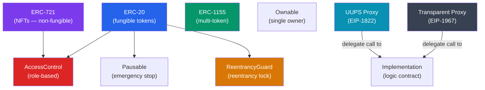

# OpenZeppelin Contracts

> [!abstract] TL;DR
> OpenZeppelin Contracts is the most widely used smart contract library in the Ethereum ecosystem — audited implementations of ERC standards and security primitives. Core modules: **ERC-20/ERC-721/ERC-1155** (token standards with extensions like `ERC20Burnable`, `ERC721Enumerable`), **access control** (`Ownable` for single-owner, `AccessControl` for role-based), **security utilities** (`ReentrancyGuard`, `Pausable`), and **upgradeable contracts** (Transparent Proxy and UUPS patterns via `@openzeppelin/contracts-upgradeable`). Every production Solidity project starts here.

## Intuition — analogy FIRST

OpenZeppelin Contracts is the industry's pre-approved building codes and certified pre-fabricated structural components. ERC-20 is like a certified load-bearing wall design — you don't re-engineer it; you install the certified version and customize the facade. `AccessControl` is the building's keycard system — roles (MINTER_ROLE, ADMIN_ROLE) are like different access levels, and the contract enforces who can enter which room. `ReentrancyGuard` is the deadbolt — it prevents someone from pushing the door open while it's still closing. Upgradeable contracts are the modular interiors — the building's address (proxy) never changes, but the interior layout (implementation) can be swapped by the owner.

---

## How It Works



---

## Key Concepts / Details

### ERC-20 — Fungible Token

```solidity
// SPDX-License-Identifier: MIT
pragma solidity ^0.8.20;

import "@openzeppelin/contracts/token/ERC20/ERC20.sol";
import "@openzeppelin/contracts/token/ERC20/extensions/ERC20Burnable.sol";
import "@openzeppelin/contracts/access/Ownable.sol";
import "@openzeppelin/contracts/token/ERC20/extensions/ERC20Permit.sol";

contract MyToken is ERC20, ERC20Burnable, Ownable, ERC20Permit {
    constructor(address initialOwner)
        ERC20("MyToken", "MTK")
        Ownable(initialOwner)
        ERC20Permit("MyToken")
    {
        // Mint 1 million tokens to deployer (18 decimals = default)
        _mint(initialOwner, 1_000_000 * 10**decimals());
    }

    // onlyOwner: restricts to contract owner
    function mint(address to, uint256 amount) public onlyOwner {
        _mint(to, amount);
    }
}

// Common ERC-20 extensions:
// ERC20Burnable   — adds burn() and burnFrom()
// ERC20Permit     — gasless approvals via EIP-2612 signatures
// ERC20Votes      — delegation and on-chain governance (Compound-style)
// ERC20Capped     — enforces a maximum total supply
// ERC20Pausable   — adds pause() / unpause() from Pausable
```

### ERC-721 — Non-Fungible Token (NFT)

```solidity
pragma solidity ^0.8.20;

import "@openzeppelin/contracts/token/ERC721/ERC721.sol";
import "@openzeppelin/contracts/token/ERC721/extensions/ERC721URIStorage.sol";
import "@openzeppelin/contracts/token/ERC721/extensions/ERC721Enumerable.sol";
import "@openzeppelin/contracts/access/AccessControl.sol";

contract MyNFT is ERC721, ERC721URIStorage, ERC721Enumerable, AccessControl {
    bytes32 public constant MINTER_ROLE = keccak256("MINTER_ROLE");
    uint256 private _nextTokenId;

    constructor(address admin) ERC721("MyNFT", "MNFT") {
        _grantRole(DEFAULT_ADMIN_ROLE, admin);
        _grantRole(MINTER_ROLE, admin);
    }

    function safeMint(address to, string memory uri)
        public onlyRole(MINTER_ROLE) returns (uint256)
    {
        uint256 tokenId = _nextTokenId++;
        _safeMint(to, tokenId);
        _setTokenURI(tokenId, uri);   // ERC721URIStorage
        return tokenId;
    }

    // Required overrides when inheriting multiple extensions
    function _update(address to, uint256 tokenId, address auth)
        internal override(ERC721, ERC721Enumerable) returns (address)
    {
        return super._update(to, tokenId, auth);
    }

    function supportsInterface(bytes4 interfaceId)
        public view override(ERC721, ERC721URIStorage, ERC721Enumerable, AccessControl)
        returns (bool)
    {
        return super.supportsInterface(interfaceId);
    }

    function tokenURI(uint256 tokenId)
        public view override(ERC721, ERC721URIStorage) returns (string memory)
    {
        return super.tokenURI(tokenId);
    }
}
```

### ERC-1155 — Multi-Token Standard

```solidity
// ERC-1155: one contract handles both fungible AND non-fungible tokens
import "@openzeppelin/contracts/token/ERC1155/ERC1155.sol";

contract GameItems is ERC1155 {
    uint256 public constant GOLD   = 0;  // fungible
    uint256 public constant SWORD  = 1;  // semi-fungible (multiple copies)
    uint256 public constant SHIELD = 2;
    uint256 public constant LEGENDARY_RING = 3;  // unique (supply=1)

    constructor() ERC1155("https://game.example/api/item/{id}.json") {
        _mint(msg.sender, GOLD, 10**18, "");             // 1M gold
        _mint(msg.sender, SWORD, 100, "");               // 100 swords
        _mint(msg.sender, LEGENDARY_RING, 1, "");        // unique item
    }

    // Batch mint — more gas efficient than multiple ERC-20 transfers
    function mintBatch(address to, uint256[] memory ids, uint256[] memory amounts)
        external
    {
        _mintBatch(to, ids, amounts, "");
    }
}
// ERC-1155 advantage: one transfer call can move multiple token types
// balanceOfBatch([alice, alice, bob], [GOLD, SWORD, SHIELD]) — batch query
```

### AccessControl — Role-Based Permissions

```solidity
import "@openzeppelin/contracts/access/AccessControl.sol";

contract MultiRoleVault is AccessControl {
    bytes32 public constant DEPOSITOR_ROLE = keccak256("DEPOSITOR_ROLE");
    bytes32 public constant WITHDRAWER_ROLE = keccak256("WITHDRAWER_ROLE");
    bytes32 public constant PAUSER_ROLE = keccak256("PAUSER_ROLE");

    constructor(address admin) {
        // DEFAULT_ADMIN_ROLE: can grant/revoke any role
        _grantRole(DEFAULT_ADMIN_ROLE, admin);
    }

    function deposit() external payable onlyRole(DEPOSITOR_ROLE) { }

    function withdraw(uint256 amount) external onlyRole(WITHDRAWER_ROLE) {
        payable(msg.sender).transfer(amount);
    }

    // Grant roles (only DEFAULT_ADMIN_ROLE)
    // vault.grantRole(DEPOSITOR_ROLE, userAddress)
    // vault.revokeRole(DEPOSITOR_ROLE, userAddress)
    // vault.renounceRole(DEPOSITOR_ROLE, msg.sender)

    // hasRole(WITHDRAWER_ROLE, address) — check without reverting
}
```

### Pausable — Emergency Stop

```solidity
import "@openzeppelin/contracts/token/ERC20/ERC20.sol";
import "@openzeppelin/contracts/token/ERC20/extensions/ERC20Pausable.sol";
import "@openzeppelin/contracts/access/Ownable.sol";

contract PausableToken is ERC20Pausable, Ownable {
    constructor() ERC20("PToken", "PT") Ownable(msg.sender) {}

    // pause() / unpause() — only owner
    function pause() public onlyOwner { _pause(); }
    function unpause() public onlyOwner { _unpause(); }
    // All transfers revert when paused (enforced by ERC20Pausable override)
}
```

### ReentrancyGuard

```solidity
import "@openzeppelin/contracts/utils/ReentrancyGuard.sol";

contract SecureVault is ReentrancyGuard {
    mapping(address => uint256) public balances;

    function deposit() external payable {
        balances[msg.sender] += msg.value;
    }

    // nonReentrant: sets a lock flag before execution, clears after
    // A reentrant call hits the lock and reverts
    function withdraw(uint256 amount) external nonReentrant {
        require(balances[msg.sender] >= amount, "Insufficient balance");
        balances[msg.sender] -= amount;  // effect before interaction
        (bool success, ) = msg.sender.call{value: amount}("");
        require(success, "Transfer failed");
    }
}
```

### Upgradeable Contracts (UUPS vs Transparent Proxy)

```solidity
// UUPS (EIP-1822) — upgrade logic lives in the implementation
// npm install @openzeppelin/contracts-upgradeable

import "@openzeppelin/contracts-upgradeable/token/ERC20/ERC20Upgradeable.sol";
import "@openzeppelin/contracts-upgradeable/proxy/utils/Initializable.sol";
import "@openzeppelin/contracts-upgradeable/proxy/utils/UUPSUpgradeable.sol";
import "@openzeppelin/contracts-upgradeable/access/OwnableUpgradeable.sol";

contract MyTokenV1 is Initializable, ERC20Upgradeable, UUPSUpgradeable, OwnableUpgradeable {
    /// @custom:oz-upgrades-unsafe-allow constructor
    constructor() { _disableInitializers(); }

    // initialize() replaces constructor — called only once via proxy
    function initialize(address initialOwner) public initializer {
        __ERC20_init("MyToken", "MTK");
        __Ownable_init(initialOwner);
        __UUPSUpgradeable_init();
        _mint(initialOwner, 1_000_000e18);
    }

    // authorizeUpgrade: controls who can upgrade the contract
    function _authorizeUpgrade(address newImplementation)
        internal override onlyOwner {}
}

// V2 — adds a new function, DO NOT change storage layout
contract MyTokenV2 is MyTokenV1 {
    uint256 public version;  // NEW storage slot (always append, never reorder)

    function initializeV2() public reinitializer(2) {
        version = 2;
    }

    function newFeature() external view returns (string memory) {
        return "V2 feature";
    }
}
```

### UUPS vs Transparent Proxy

| Feature | UUPS Proxy | Transparent Proxy |
|---------|-----------|------------------|
| Upgrade logic location | Implementation | Proxy (ProxyAdmin) |
| Gas cost (calls) | Lower (one less SLOAD) | Higher (checks admin on every call) |
| Footgun risk | Higher (if upgradeability removed, contract stuck) | Lower (always upgradeable via admin) |
| ProxyAdmin contract | Not needed | Required |
| Modern recommendation | Yes (post-2022 OZ) | Legacy projects |

---

## Common Pitfalls

1. **Storage layout corruption on upgrade**: Adding a new state variable in V2 ABOVE existing variables shifts all storage slots. Always append new variables at the bottom. Use OZ's `storage-layout` upgrade checker: `npx oz-upgrades check`.
2. **Calling `initialize` directly on the implementation**: Without `_disableInitializers()` in the constructor, an attacker can take ownership of the logic contract and call `selfdestruct`, bricking the proxy. Always disable initializers.
3. **Missing `supportsInterface` overrides**: When inheriting multiple OZ interfaces (ERC721 + AccessControl), Solidity requires explicit overrides or the compilation fails. Always implement `supportsInterface` that chains all parents.
4. **Using `Ownable` for multisig but not transferring**: Projects deploy with the deployer EOA as owner and forget to transfer ownership to a Gnosis Safe multisig. The deployer key becomes a single point of failure.
5. **`ERC20Permit` replay attacks across chains**: ERC-2612 signatures include a `chainId`. Ensure the permit validation checks `block.chainid` (done by OZ by default) — forking chains can replay signatures if not handled.

---

## Related Concepts

- [[_MOC_Ethereum_EVM|↑ Ethereum & EVM MOC]]
- [[Solidity_Programming]] — Solidity fundamentals underlying OZ contract patterns
- [[Upgradeable_Contracts]] — Deep dive into proxy patterns and storage slots
- [[Gas_and_Optimization]] — OZ contracts are optimized but inheritance chains add bytecode
- [[Smart_Contract_Security_Tools]] — Slither and Echidna for validating OZ-based contracts

---

## Review Questions

1. What is the difference between `Ownable` and `AccessControl`? When would you use each?
2. Explain the storage layout rule for upgradeable contracts. What happens if you insert a new variable in the middle of the layout in V2?
3. Why must upgradeable contracts use `initialize()` instead of `constructor()`? What does `_disableInitializers()` prevent?
4. What is the difference between UUPS and Transparent proxy in terms of where upgrade logic lives and the gas implications?
5. A contract inherits both `ERC721` and `AccessControl`. The Solidity compiler throws an error about `supportsInterface`. Why does this happen and how do you fix it?

---

## Sources

- OpenZeppelin Contracts docs — https://docs.openzeppelin.com/contracts/
- OpenZeppelin Upgrades docs — https://docs.openzeppelin.com/upgrades-plugins/
- EIP-1155 — https://eips.ethereum.org/EIPS/eip-1155
- EIP-2612 Permit — https://eips.ethereum.org/EIPS/eip-2612

#Blockchain #Ethereum #Solidity #OpenZeppelin #ERC20 #ERC721 #upgradeable #AccessControl
