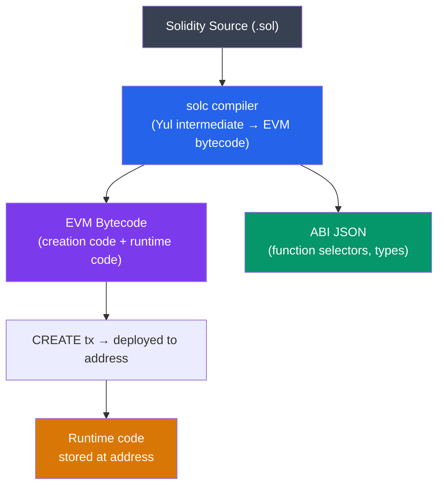

# 🧩 Solidity Programming

> [!abstract] TL;DR
> Solidity is a statically-typed, contract-oriented language that compiles to EVM bytecode. **Value types** (copied on assignment): `uint`, `int`, `bool`, `address`, `bytes1`-`bytes32`, enums. **Reference types** (pointer semantics, location matters): arrays, structs, mappings, `bytes`, `string`. **Storage locations**: `storage` (persistent, expensive), `memory` (volatile, per-call), `calldata` (read-only, cheapest for external inputs). **Visibility**: `external` (calldata args), `public` (generates getter), `internal`, `private`. **Modifiers** intercept function execution for access control. **Inheritance** uses **C3 linearization** (most-derived-last); `super.f()` calls next in MRO. **Custom errors** (`error InsufficientBalance(uint have, uint need)`) are gas-cheaper than `require(false, "string")`. Events (`emit Transfer(from, to, amount)`) are logged in transaction receipts and indexed for off-chain querying.

## Intuition — analogy FIRST
Solidity is like a very strict legal contract language: every variable's type is declared upfront (no dynamic typing), all external interactions are explicitly marked with visibility, and the language enforces rules designed to prevent common blockchain attacks. Where Python lets you assign anything to any variable, Solidity forces you to say exactly what kind of data lives in each slot and how expensive operations on it will be.

The dual world of `storage` vs. `memory` is like the difference between a filing cabinet (persistent, expensive to access) and a whiteboard (volatile, cheap for calculations). A reference type in storage is a persistent pointer into the filing cabinet; the same type in memory is a whiteboard drawing that gets erased when the function returns. Forgetting which one you're writing to is a common source of bugs.

---

## How It Works



---

## Key Concepts / Details

### Value vs Reference Types

**Value types** (stored inline, copied on assignment):
```solidity
uint256 x = 100;         // unsigned 256-bit integer
int128 y = -50;          // signed 128-bit integer  
bool flag = true;
address payable user;    // 20-byte Ethereum address
bytes32 hash;            // fixed-size byte array

uint256 a = x;           // 'a' is a copy; modifying a doesn't affect x
```

**Reference types** (pointer to location, must specify storage location):
```solidity
uint256[] storage arr;   // persistent array in contract storage
string memory name;      // temporary string in memory
bytes calldata data;     // read-only byte array from calldata

// Mapping — always storage, cannot be in memory or calldata
mapping(address => uint256) public balances;
```

### Storage Layout
Contract state variables are laid out in storage slots sequentially:
```solidity
contract Example {
    uint256 a;           // slot 0
    uint256 b;           // slot 1
    address owner;       // slot 2 (uses 20 of 32 bytes)
    bool active;         // slot 2 (packs into same slot as owner — 1 byte)
    uint256[] dynamicArr; // slot 3: length; actual data at keccak256(3)
    mapping(address => uint256) map; // slot 4: value at keccak256(key || 4)
}
```

**Tight packing**: Multiple variables smaller than 32 bytes pack into one slot. Reading a packed slot (`SLOAD`) retrieves all packed variables; writing one updates only the relevant bits. Optimizer recommendation: declare packed variables together to minimize slots.

### Visibility Modifiers

| Modifier | Access | Calldata args? | Generates getter? |
|----------|--------|---------------|-------------------|
| `external` | Only from outside (or via `this.f()`) | Yes (cheapest) | No |
| `public` | Inside + outside | Memory copy | Yes (state vars) |
| `internal` | This + derived contracts | — | No |
| `private` | This contract only | — | No |

### Function Modifiers
```solidity
modifier onlyOwner() {
    require(msg.sender == owner, "Not owner");
    _;   // placeholder for function body
}

modifier nonReentrant() {
    require(!_locked, "Reentrant call");
    _locked = true;
    _;
    _locked = false;
}

function withdraw(uint amount) external onlyOwner nonReentrant {
    // Modifiers applied left-to-right; _ = function body
    payable(msg.sender).transfer(amount);
}
```

### Custom Errors (Solidity 0.8.4+)
Custom errors are ~4× cheaper than string revert messages (4 bytes selector vs. ABI-encoded string):
```solidity
error InsufficientBalance(uint256 available, uint256 required);
error Unauthorized(address caller, address required);

function transfer(address to, uint256 amount) external {
    if (balances[msg.sender] < amount)
        revert InsufficientBalance(balances[msg.sender], amount);
    balances[msg.sender] -= amount;
    balances[to] += amount;
}
```

### Events
Events are stored in transaction receipt logs — not in contract storage:
```solidity
event Transfer(
    address indexed from,    // indexed → stored in topic (searchable)
    address indexed to,      // max 3 indexed topics per event
    uint256 amount           // non-indexed → stored in ABI-encoded data
);

emit Transfer(msg.sender, to, amount);
```

Log gas: `LOG1-LOG4` = 375 + 375/topic + 8/byte data.
**Indexed** parameters create Bloom filter entries enabling efficient `eth_getLogs` queries by topic.

### C3 Linearization and Multiple Inheritance
Solidity uses the C3 linearization algorithm (MRO — Method Resolution Order) to determine function resolution order in multiple inheritance:

```solidity
contract A { function hello() virtual returns (string memory) { return "A"; } }
contract B is A { function hello() virtual override returns (string memory) { return "B"; } }
contract C is A { function hello() virtual override returns (string memory) { return "C"; } }
contract D is B, C {
    function hello() override(B, C) returns (string memory) {
        return super.hello(); // calls C.hello() — most-derived first in declaration order
    }
}
// MRO for D: D → C → B → A
```

**Diamond problem**: resolved by C3. The `override` keyword is required when overriding; `virtual` required on all functions that can be overridden.

### Important Global Variables

| Variable | Type | Description |
|----------|------|-------------|
| `msg.sender` | `address` | Direct caller of the function |
| `msg.value` | `uint256` | ETH sent in wei |
| `msg.data` | `bytes calldata` | Complete calldata |
| `tx.origin` | `address` | Original transaction signer (EOA) |
| `block.timestamp` | `uint256` | Unix timestamp of current block |
| `block.number` | `uint256` | Current block height |
| `block.chainid` | `uint256` | Chain ID (EIP-155) |
| `block.prevrandao` | `uint256` | Randomness from RANDAO (post-Merge) |
| `gasleft()` | `uint256` | Remaining gas |

**Warning**: `tx.origin` is different from `msg.sender` in delegated calls. Using `tx.origin` for authentication is a vulnerability (phishing via contract intermediary).

### ABI Encoding for Return Values
Solidity automatically ABI-encodes return values:
```solidity
function getValues() external pure returns (uint256 a, bytes32 b, bool c) {
    return (42, bytes32("hello"), true);
}
// Encoded: 
// [0x000...02a][0x68656c6c6f...][0x000...001]
// (each 32 bytes, packed sequentially for static types)
```

### Reentrancy Guard Pattern
```solidity
// Checks-Effects-Interactions pattern
function withdraw(uint amount) external {
    // 1. CHECKS
    require(balances[msg.sender] >= amount, "Insufficient");
    
    // 2. EFFECTS (update state BEFORE external call)
    balances[msg.sender] -= amount;
    
    // 3. INTERACTIONS (external call last)
    (bool success, ) = msg.sender.call{value: amount}("");
    require(success, "Transfer failed");
}
```

---

## Real-World Notes
- Solidity version pragmas: `^0.8.20` means >=0.8.20 <0.9.0. Production contracts should specify exact version (`=0.8.24`) to prevent surprise breaking changes.
- **Yul** is Solidity's intermediate representation (IR) and can be written inline with `assembly { }` for gas-critical paths.
- `immutable` variables are set once at construction, stored in the contract's bytecode (not storage) — cheap to read (like constants), but set dynamically at deploy time.
- `constant` variables are fully compile-time literals — zero storage cost, minimal read cost (PUSH opcode).
- The **Solidity compiler outputs** three things: bytecode (deploy), runtime bytecode (execution), ABI (interface). Verify all three on Etherscan for contract trust.

---

## Common Pitfalls
1. **Using `tx.origin` for auth** — a phishing contract can call your function; `msg.sender` is the phishing contract (which has permission), `tx.origin` is the victim's EOA. Never use `tx.origin` for authentication.
2. **State changes after external calls** — violates Checks-Effects-Interactions; enables reentrancy. The DAO hack (2016, 60M ETH) exploited this pattern.
3. **Integer overflow (pre-0.8)** — `uint8 x = 255; x++;` wraps to 0 silently. Solidity 0.8+ reverts on overflow/underflow by default; use `unchecked { }` only when you've proven safety.
4. **Keccak slot collision in mappings** — two mappings at different slots produce different data locations; a mapping at slot `n` stores value for key `k` at `keccak256(k || n)`. Changing the order of state variables changes all mapping slots, breaking upgrades.

---

## Related Concepts
- [[_MOC_Ethereum_EVM|↑ Ethereum & EVM MOC]]
- [[EVM_Architecture]] — Solidity compiles to EVM bytecode; storage layout maps to EVM slots
- [[Gas_and_Optimization]] — Solidity patterns that save or waste gas
- [[ABI_and_Contract_Interaction]] — ABI defines the interface, selectors, encoding
- [[Upgradeable_Contracts]] — C3 linearization and storage layout critical for proxy patterns

---

## Review Questions
1. A contract has state variables in order: `address owner; bool active; uint256 value`. How many storage slots do these use? Reorder them to minimize slots and explain why.
2. Explain why using `mapping(address => uint) storage ptr = myMapping;` (a storage pointer to a mapping) in a function is dangerous when the function is called via DELEGATECALL.
3. Write a modifier `rateLimit(uint maxCalls, uint period)` that limits a function to `maxCalls` per `period` seconds. What are the gas costs and what is the griefing attack vector?

---

## Sources
- Solidity documentation: docs.soliditylang.org (v0.8.x)
- ethereum.org — "Introduction to smart contracts"
- Consensys — "Smart Contract Best Practices" (2024)
- Solidity-by-Example: solidity-by-example.org
- OpenZeppelin — "Contracts" library source (github.com/OpenZeppelin/openzeppelin-contracts)

#Blockchain #EthereumEVM #Solidity #SmartContracts #Inheritance #Events
