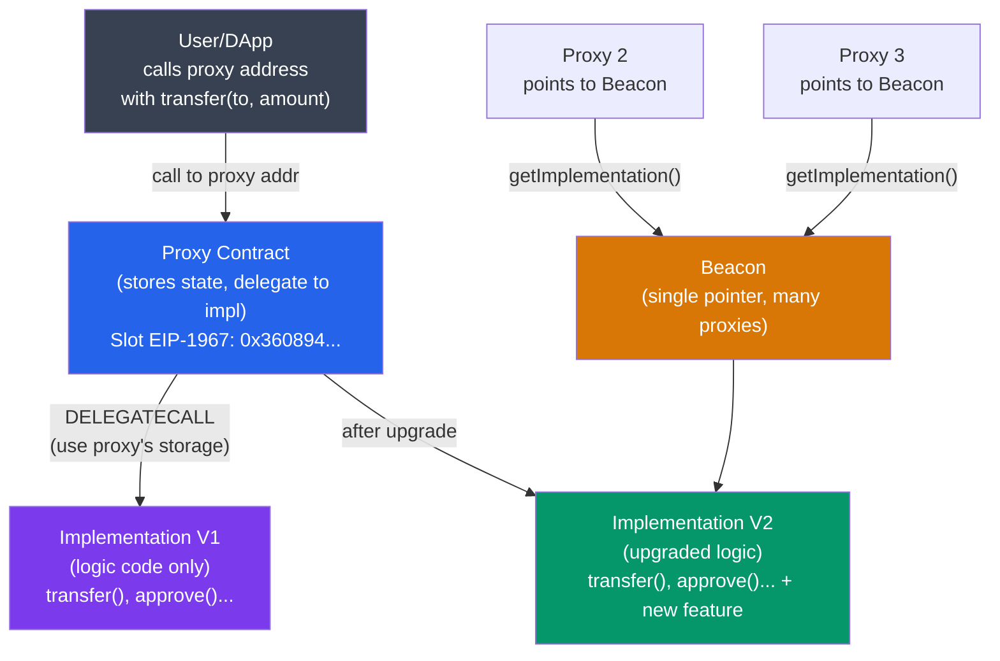

# 🔄 Upgradeable Contracts

> [!abstract] TL;DR
> Smart contracts are immutable once deployed, but **proxy patterns** enable upgrades by separating storage (proxy) from logic (implementation). The proxy uses `DELEGATECALL` to forward calls to the implementation — executing the implementation's code in the proxy's storage context. Three main patterns: **Transparent Proxy** (admin calls go to proxy, user calls go to implementation — prevents selector collision but wastes gas checking admin on every call), **UUPS** (upgrade logic IN the implementation, cheaper but riskier if forgotten), **Beacon Proxy** (multiple proxies share one implementation pointer via a beacon — mass upgrade in one tx). All use **EIP-1967 standardized storage slots** (e.g., `keccak256("eip1967.proxy.implementation") - 1`) to avoid storage collisions. Storage layout must be preserved across upgrades — adding variables at the end is safe; reordering breaks everything.

## Intuition — analogy FIRST
A proxy contract is like a phone switchboard operator: when you call the main company number (proxy address), the operator forwards the call to whoever is handling it today (implementation). The notes (state/storage) are kept at the switchboard (proxy), not with the individual agent. When you hire a better agent (upgrade), you just redirect the switchboard — same phone number, same notes, new logic.

The danger: if the old agent's notes were filed in drawer #1 (storage slot 0) as "client name," but the new agent files in drawer #1 as "contract admin," all the client names suddenly become admin addresses. This is the storage collision problem that proxy patterns must prevent.

---

## How It Works



---

## Key Concepts / Details

### DELEGATECALL Mechanics
```
Normal CALL:           DELEGATECALL:
┌──────────────┐       ┌──────────────┐
│ Proxy        │       │ Proxy        │
│ msg.sender=A │──────▶│ msg.sender=A │ ← preserved
│ address=proxy│       │ address=proxy│ ← proxy's storage used
│ storage=proxy│       │ code=impl    │ ← implementation's code
└──────────────┘       └──────────────┘
```

The implementation contract executes but reads/writes to the PROXY's storage. This is why:
1. `address(this)` inside implementation = proxy address (not implementation)
2. `msg.sender` = original caller (not proxy)
3. All `SSTORE`/`SLOAD` operations hit the proxy's storage slots

### Storage Collision Problem
```solidity
// NAIVE PROXY (DANGEROUS):
contract NaiveProxy {
    address public implementation;  // slot 0
    // ... proxy storage
}

contract NaiveImpl {
    address public owner;  // also slot 0 — COLLISION with implementation!
}
```

When the implementation sets `owner = msg.sender` via DELEGATECALL, it actually writes to the proxy's slot 0 — which is the `implementation` address. This would corrupt the proxy!

**EIP-1967 Solution**: Use deterministic pseudorandom storage slots that are astronomically unlikely to collide:
```solidity
// EIP-1967 implementation slot:
bytes32 constant IMPL_SLOT = bytes32(uint256(
    keccak256("eip1967.proxy.implementation")
) - 1);
// = 0x360894a13ba1a3210667c828492db98dca3e2076cc3735a920a3ca505d382bbc

// EIP-1967 admin slot:
bytes32 constant ADMIN_SLOT = bytes32(uint256(
    keccak256("eip1967.proxy.admin")
) - 1);
// = 0xb53127684a568b3173ae13b9f8a6016e243e63b6e8ee1178d6a717850b5d6103
```

The `-1` ensures the slot is never equal to the keccak output itself (preventing hash pre-image attacks).

### Transparent Proxy Pattern (OpenZeppelin)
```
Admin calls → proxy handles directly (upgrade functions)
Non-admin calls → delegated to implementation

Proxy has:
- upgradeTo(address) — admin only, sets IMPL_SLOT
- admin management functions
- fallback: if msg.sender == admin → revert with transparent proxy error
            if msg.sender != admin → delegatecall to implementation
```

**Cost**: Every call checks `msg.sender == admin` (one `SLOAD` of admin slot). Approximately +2,100 gas cold / +100 gas warm overhead.

**Implementation notes**:
```solidity
// AdminUpgradeabilityProxy — simplified
fallback() external payable {
    address _admin = _getAdmin();
    if (msg.sender == _admin) {
        // Admin calls: only proxy management
        revert("Use ProxyAdmin for admin actions");
    } else {
        // User calls: delegate to implementation
        _delegate(_implementation());
    }
}
```

### UUPS (Universal Upgradeable Proxy Standard, EIP-1822)
Move the `upgradeTo()` function INTO the implementation contract:
```solidity
// Implementation includes upgrade logic
contract MyContractV1 is UUPSUpgradeable {
    function _authorizeUpgrade(address newImpl) internal override onlyOwner {}
    
    function upgradeTo(address newImpl) external {
        _authorizeUpgrade(newImpl);
        _upgradeToAndCall(newImpl, "", false);
    }
}
```

**Advantages**:
- No per-call admin check overhead
- Proxy is simpler (just a `DELEGATECALL` fallback)

**Risks**:
- If you deploy an implementation without `upgradeTo()`, or if it has a bug in `_authorizeUpgrade`, the proxy is **permanently bricked** (can never be upgraded)
- Must include upgrade logic in EVERY implementation version

### Beacon Proxy Pattern
Useful when you have 1000 proxies all sharing the same implementation (e.g., ERC1967 factory-deployed instances like Uniswap v3 pools):

```
1 BeaconProxy                    n ProxyInstances
   implementation ◀──────────────── each proxy reads beacon for impl
   address                           then delegatecalls to impl

Upgrade: change beacon.implementation ONCE → all proxies updated
```

```solidity
contract UpgradeableBeacon {
    address private _implementation;
    function upgradeTo(address newImpl) external onlyOwner {
        _implementation = newImpl;
        emit Upgraded(newImpl);
    }
}

contract BeaconProxy is Proxy {
    // reads implementation from beacon on every call
    function _implementation() internal view override returns (address) {
        return IBeacon(_beacon()).implementation();
    }
}
```

**Gas tradeoff**: one extra external `CALL` to the beacon per delegated call (~2,600 gas cold for first call). Subsequent calls to same beacon = ~100 gas warm. Worth it for mass upgrade convenience.

### Storage Layout and Upgrade Safety
```solidity
// V1
contract TokenV1 {
    uint256 totalSupply;  // slot 0
    mapping(address => uint256) balances;  // slot 1
}

// V2 — SAFE: only append new variables
contract TokenV2 {
    uint256 totalSupply;  // slot 0 (unchanged)
    mapping(address => uint256) balances;  // slot 1 (unchanged)
    address feeRecipient;  // slot 2 (NEW — safe to add)
}

// V2 — UNSAFE: reordering
contract TokenV2_BAD {
    address feeRecipient;  // slot 0 ← was totalSupply!!! BROKEN
    uint256 totalSupply;   // slot 1
    mapping(address => uint256) balances;  // slot 2
}
```

**Storage gaps**: Reserve space for future variables in base contracts to avoid inheritance-related collisions:
```solidity
contract BaseV1 {
    uint256 x;
    uint256[49] private __gap;  // reserve 49 slots for future base variables
}
// If BaseV1 adds 10 variables in v2, they occupy gap slots without shifting derived contract slots
```

### Upgrade Safety Checkers
Tools to verify storage layout compatibility:
- `hardhat-upgrades` (`upgrades.validateUpgrade()`) — uses OpenZeppelin Upgrades plugin
- `openzeppelin-foundry-upgrades`
- Slither's storage layout checker

```bash
# Hardhat check
npx hardhat run --network mainnet scripts/upgrade.ts
# Validates that V2 is storage-compatible with V1 before upgrading
```

---

## Real-World Notes
- OpenZeppelin's `TransparentUpgradeableProxy` + `ProxyAdmin` is the most widely deployed proxy system (~50% of upgradeable contracts on Ethereum mainnet as of 2025).
- **EIP-7702 (account abstraction)**: EOAs can set code temporarily — blurs the line between EOA and contract, enabling new upgrade-like patterns without traditional proxies.
- The Parity Multisig wallet hack (2017, $150M): a flaw in the initialization of an uninitialized proxy implementation contract allowed an attacker to call `initWallet()` and take ownership, then `kill()` the implementation — bricking all dependent wallets.
- Auditors always check: (1) initialization protection (`initializer` modifier), (2) upgrade authorization, (3) storage layout compatibility, (4) selfdestruct in implementation (would brick all proxies).

---

## Common Pitfalls
1. **Forgetting `initializer` modifier on implementation** — without it, anyone can call `initialize()` on the implementation directly (not the proxy) and take ownership; then the implementation can be destroyed.
2. **Calling `selfdestruct` in implementation** — destroys the implementation contract, leaving all proxies pointing to dead code (permanent brick for transparent/beacon, same for UUPS).
3. **Changing `immutable` variables across upgrades** — immutables are baked into bytecode, not storage; you can't "upgrade" them. A new immutable value requires a new deployment.
4. **Selector collision between proxy admin functions and implementation** — if the implementation has a function selector that matches the proxy's `upgradeTo(address)`, the proxy may shadow it (transparent proxy) or expose it unprotected (UUPS without access control).

---

## Related Concepts
- [[_MOC_Ethereum_EVM|↑ Ethereum & EVM MOC]]
- [[EVM_Architecture]] — DELEGATECALL opcode is the foundation of all proxy patterns
- [[ABI_and_Contract_Interaction]] — proxy must forward ABI-compatible calldata
- [[Solidity_Programming]] — storage layout, inheritance, C3 linearization affect upgrade safety
- [[06_Web3_Development/Hardhat_and_Foundry|Hardhat & Foundry]] — upgrade plugins for testing and deployment

---

## Review Questions
1. A UUPS proxy's implementation V2 is deployed without an `upgradeTo()` function (accidentally omitted). What is the exact consequence and is there any recovery path?
2. You have 10,000 pool contracts all using BeaconProxy. You need to upgrade the implementation. Compare the gas cost of: (a) upgrading each proxy's implementation individually, and (b) upgrading the beacon once. Under what condition does (b) break down?
3. A developer adds a new state variable `address feeRecipient` to their base contract `Ownable` between slot 0 (`owner`) and the derived contract's variables. All existing deployed proxies store data in `feeRecipient`'s new slot position. What does this slot currently contain, and what is the attack scenario?

---

## Sources
- EIP-1967: Standard proxy storage slots (Palladino, 2019)
- EIP-1822: Universal Upgradeable Proxy Standard (Gabriel Barros & Patrick Gallagher, 2019)
- OpenZeppelin — "Writing Upgradeable Contracts" docs (2024)
- OpenZeppelin — "Proxy Upgrade Pattern" docs
- Trail of Bits — "Contract upgrade anti-patterns" (2023)
- Parity Multisig Post-Mortem (2017) — Openzeppelin blog

#Blockchain #EthereumEVM #UpgradeableContracts #ProxyPattern #UUPS #Beacon #EIP1967
