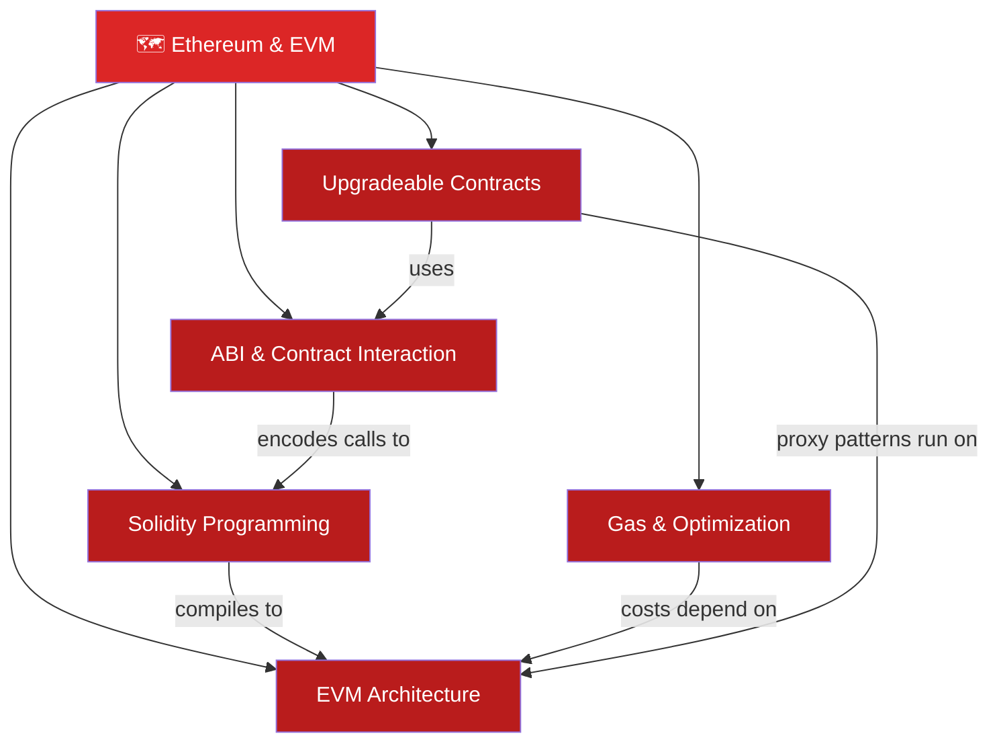

# 🗺️ Ethereum & EVM — Map of Content

> [!abstract] What This Section Covers
> This section covers Ethereum's virtual machine and smart contract ecosystem in production depth. You'll learn how the EVM's stack-based architecture executes bytecode, how Solidity's type system and inheritance model map to that bytecode, how gas pricing works under EIP-1559, how the ABI encodes function calls, and how proxy patterns enable upgradeable contracts. These notes are written for engineers who need to build correct, gas-efficient, upgradeable smart contracts.

---

## Concept Map

---

## Learning Path

1. [[EVM_Architecture]] — The runtime: 1024-slot stack, four data regions (stack/memory/storage/calldata), opcode costs.
2. [[Solidity_Programming]] — The language: value/reference types, visibility, modifiers, C3 linearization, custom errors.
3. [[Gas_and_Optimization]] — The economics: EIP-1559 base fee + priority tip, SSTORE costs, packing, avoiding loops.
4. [[ABI_and_Contract_Interaction]] — The interface: function selector keccak256[0:4], ABI encoding, CREATE2 addresses.
5. [[Upgradeable_Contracts]] — The pattern: transparent/UUPS/beacon proxies, EIP-1967 storage slots.

---

## All Notes at a Glance

| Note | Difficulty | What You'll Learn |
|------|-----------|-------------------|
| [[EVM_Architecture]] | Intermediate | Stack machine, opcodes, memory regions, call types |
| [[Solidity_Programming]] | Intermediate | Types, modifiers, inheritance, events, custom errors |
| [[Gas_and_Optimization]] | Intermediate | EIP-1559, gas costs, storage packing, common savings |
| [[ABI_and_Contract_Interaction]] | Intermediate | Function selectors, ABI encoding, CREATE2, multicall |
| [[Upgradeable_Contracts]] | Advanced | Transparent, UUPS, beacon proxies; EIP-1967; storage gaps |

---

## Key Questions This Section Answers

- How does the EVM stack differ from a register machine and what are the implications?
- Why does writing to a cold storage slot cost 20,000 gas while reading costs 2,100?
- How does Solidity's C3 linearization resolve diamond inheritance?
- What exactly is a function selector and how can two functions collide?
- How does EIP-1559 change the fee market vs. the original first-price auction?
- What is the storage collision risk in proxy patterns and how does EIP-1967 fix it?

---

## Related Sections

- [[_MOC_Blockchain_Master|↑ Blockchain Master MOC]]
- [[03_Bitcoin_Protocol/_MOC_Bitcoin_Protocol|← Bitcoin Protocol]]
- [[05_DeFi_Protocols/_MOC_DeFi_Protocols|→ DeFi Protocols]]

#MOC #Blockchain #EthereumEVM
