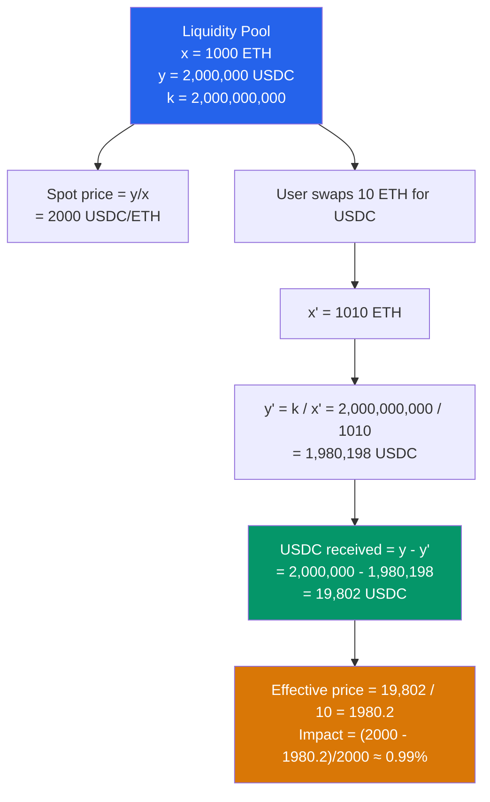

# 🌊 AMMs and Liquidity Pools

> [!abstract] TL;DR
> An **Automated Market Maker (AMM)** replaces an order book with a mathematical pricing formula. The dominant model is the **Constant Product Market Maker (CPMM)**: `x × y = k`. After a swap of `Δx` input: `y_out = y - k/(x + Δx)`. The trade's **price impact** = deviation from spot price. **Impermanent Loss (IL)** is the opportunity cost LPs bear vs. holding: `IL = 2√p/(1+p) - 1` where `p = new_price / initial_price`. At 2× price change, IL ≈ 5.7%; at 4×, IL ≈ 20%. **Uniswap v3 concentrated liquidity** allows LPs to provide liquidity within custom price ranges `[pa, pb]`, multiplying capital efficiency by up to 4000× in tight ranges — but risk going "out of range" and earning zero fees. **Curve StableSwap** uses a hybrid CPMM + constant sum formula optimized for pegged assets, dramatically reducing slippage for stablecoin swaps.

## Intuition — analogy FIRST
An AMM is like a vending machine that prices goods by availability: when a soda can is taken, remaining cans become slightly more expensive. The "machine" is a liquidity pool holding reserves of two tokens; the price adjusts automatically so that the product of reserves stays constant. You can always buy or sell, 24/7, without a counterparty — the math is the market maker.

Impermanent loss is the "opportunity cost of being the machine." If you lock your USDC and ETH in the machine at $2000/ETH, and ETH rises to $4000, arbitrageurs will buy your ETH at your stale price until the pool reflects $4000. You end up holding less ETH than if you'd just kept both tokens in a wallet — you "gave away" the upside. The loss is "impermanent" because it reverses if the price returns to the original.

---

## How It Works



---

## Key Concepts / Details

### CPMM Formula Deep Dive
```
Invariant: x × y = k   (constant product)

Swap Δx of token X → get Δy of token Y:
  Δy = y - k/(x + Δx(1-fee))    [with fee deduction on input]
  
  Example (0.3% fee, k = 1,000,000):
  x=1000, y=1000, swap Δx=10:
  Δy = 1000 - 1,000,000/(1000 + 10×0.997)
     = 1000 - 1000000/1009.97
     = 1000 - 990.12 = 9.88
  
  Effective price: 10/9.88 = 1.012 (1.2% above spot)
```

**LP fee structure**: Uniswap v2 charges 0.3% on input amount; 0.05% stays in the pool (increasing k gradually), compounding fees for LPs.

### Impermanent Loss Derivation
When the price moves from `P₀` to `P₁ = p × P₀` (where `p = P₁/P₀`):

From the CPMM invariant and new price:
```
x₁ = x₀ × √(1/p)   (arbitrageur sells/buys to rebalance)
y₁ = y₀ × √p

Portfolio value (pool): 2 × y₀ × √p
Portfolio value (hold): y₀ × (1 + p)    [value of initial y + value of initial x in USDC]

IL = (pool_value - hold_value) / hold_value
   = (2√p - (1+p)) / (1+p)
   = 2√p/(1+p) - 1
```

| Price change (p) | IL |
|-----------------|-----|
| 0.5× (halved) | -5.72% |
| 0.75× (-25%) | -0.66% |
| 1.25× (+25%) | -0.60% |
| 2× (doubled) | -5.72% |
| 4× (4x) | -20.0% |
| 10× | -42.5% |

**IL is symmetric**: both 0.5× and 2× produce the same -5.72% IL. The loss is realized only if the LP withdraws; fees earned may offset it.

### Uniswap v3 Concentrated Liquidity
LPs specify a price range `[pa, pb]` — liquidity is only active (earning fees) when the current price `P ∈ [pa, pb]`:

```
Virtual reserves formula:
x_real = L × (1/√P - 1/√pb)   when pa < P < pb
y_real = L × (√P - √pa)

where L = √k is the "liquidity" parameter
```

**Capital efficiency**: By concentrating in a tight range, an LP provides the same depth as a v2 LP with much less capital. A ±1% range around current price is ~200× more capital efficient than full-range v2 (but earns 0 fees if price exits the range).

**NFT positions**: Each LP position in Uniswap v3 is an ERC-721 NFT (unique range + liquidity amount). This is more complex but enables composability.

**Tick system**: Prices are discretized into "ticks" at intervals of `√1.0001 ≈ 1.005%` (0.01% price steps). Ranges must align to tick boundaries (or multiples — tick spacing depends on fee tier).

### Curve StableSwap (for Pegged Assets)
Curve uses a hybrid formula that blends CPMM (x*y=k) and constant sum (x+y=C):

```
A × n^n × Σxᵢ + D = A × D × n^n + D^(n+1) / (n^n × Πxᵢ)

where:
- A = amplification coefficient (governance-controlled, e.g., 100-4000)
- D = total deposits
- n = number of assets (2 for USDC/USDT, 3 for 3pool)
```

**Behavior**:
- When prices are close to peg: behaves like constant sum (near-zero slippage)
- When prices diverge far: behaves like CPMM (prevents pool draining)
- Higher A = more efficient near peg, more dangerous if peg breaks

**Real example**: Curve 3pool (USDC/USDT/DAI) with A=2000:
- $1M swap of USDC→USDT: <0.01% slippage
- Same swap on Uniswap v2: ~0.5% slippage

### Fee Tiers and Pool Selection (Uniswap v3)
| Fee tier | Spread | Best for |
|----------|--------|---------|
| 0.01% | Stable pairs | USDC/USDT, pegged assets |
| 0.05% | Close pairs | ETH/USDC, liquid pairs |
| 0.30% | Standard | Most token pairs |
| 1.00% | Exotic | Low-liquidity / high-volatility tokens |

---

## Real-World Notes
- **MEV from AMMs**: Every large swap creates a price impact. MEV bots (frontrunners/sandwichers) exploit this — see [[MEV_and_Arbitrage]].
- Uniswap v4 introduces "hooks" — callbacks before/after swap/liquidity events — enabling custom AMM logic (dynamic fees, TWAP oracle integration) in a modular plugin architecture.
- **LVR (Loss-Versus-Rebalancing)**: A more precise measure of LP loss than IL — compares LP to a strategy that rebalances a static portfolio. LVR is always negative (AMMs always lose to rebalancing for any price path), while IL can be "recovered" if price returns. LVR = realized LP loss from adverse selection.
- Real AMMs use `Reentrancy Guard` via `unlocked` flag — callbacks within swaps (flash loans) are controlled to prevent reentrancy.

---

## Common Pitfalls
1. **IL as "temporary"** — calling it "impermanent" is misleading; price moves can be permanent. An ETH/USDC LP in 2022 experienced permanent IL when ETH fell 70% and never recovered.
2. **Ignoring out-of-range risk in v3** — a concentrated position earns 0 fees when price exits the range. Passive LPs without active management often perform worse than v2 full-range LPs.
3. **Using spot price for oracle** — the spot price of an AMM is easily manipulated in a single transaction. Use TWAP (time-weighted average price) for protocol oracles.
4. **Forgetting the `sqrtPriceX96` encoding** — Uniswap v3 stores price as `√P × 2^96` (a fixed-point `Q64.96` number). Misinterpreting this as a regular price causes errors.

---

## Related Concepts
- [[_MOC_DeFi_Protocols|↑ DeFi Protocols MOC]]
- [[Oracles_and_Data_Feeds]] — AMM TWAP prices used as oracles; spot price manipulation vectors
- [[MEV_and_Arbitrage]] — arbitrageurs rebalance AMM prices; sandwichers exploit swaps
- [[Lending_and_Borrowing]] — AMMs provide collateral price feeds for liquidation
- [[04_Ethereum_EVM/Gas_and_Optimization|Gas & Optimization]] — Uniswap v3 is highly gas-optimized; concentrated liquidity has extra complexity

---

## Review Questions
1. An LP provides 1 ETH and 2000 USDC to a Uniswap v2 pool at launch (P₀ = $2000). ETH rises to $4000 (p=2). Calculate: (a) how much ETH and USDC the LP has after rebalancing, (b) the IL in USD, and (c) the hold value.
2. A Uniswap v3 LP provides concentrated liquidity in the range [$1800, $2200] with an initial investment equivalent to 1 ETH + 2000 USDC. ETH falls to $1700. What happens to the LP's position composition and fee earnings?
3. Curve's 3pool has A=2000. Explain why a stablecoin depegging (e.g., USDT drops to $0.90) is particularly dangerous for Curve pools with high A values, compared to a standard CPMM pool.

---

## Sources
- Uniswap v2 Whitepaper (Adams et al., 2020)
- Uniswap v3 Core Whitepaper (Adams et al., 2021)
- Curve Finance: StableSwap Whitepaper (Egorov, 2019)
- Milionis et al. "Automated Market Making and Loss-Versus-Rebalancing" (2022)
- Pintail. "Understanding Uniswap Returns" (2019, medium.com)

#Blockchain #DeFiProtocols #AMM #UniswapV3 #ImpermanentLoss #CPMM #Curve
