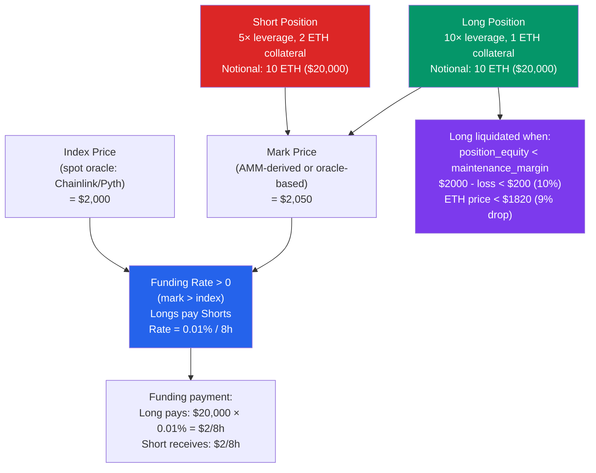

# 📈 Derivatives and Perpetuals in DeFi

> [!abstract] TL;DR
> **Perpetual futures** ("perps") are derivatives contracts with no expiry date, allowing traders to hold leveraged long/short positions indefinitely. The **funding rate** mechanism keeps the perpetual's **mark price** (derived from the perp market) anchored to the **index price** (spot): when mark > index, longs pay shorts (funding rate > 0); when mark < index, shorts pay longs (funding rate < 0). This payment incentivizes arbitrage that converges prices. Key implementations: **dYdX v4** (order-book-based, on a Cosmos appchain), **GMX v2** (liquidity-pool-based, GLP/GM pools act as counterparty, oracle-based pricing), **Synthetix** (synthetic assets backed by SNX collateral). Liquidation occurs when position equity falls below **maintenance margin**; cascade liquidations are a systemic risk.

## Intuition — analogy FIRST
A perpetual futures contract is like betting on whether a horse will win — except the race never ends and you can hold your bet indefinitely. Since the bet doesn't settle, the price of the bet (perp price) can drift away from the horse's actual value (spot price). The funding rate is the bookmaker's way of keeping them aligned: when the bet price exceeds the horse's real odds (perp > spot), people who bet the horse will win (longs) pay a small fee every 8 hours to those who bet the horse will lose (shorts). This makes longing expensive when the market is "too long," incentivizing some longs to close and some shorts to open — driving the price back toward fair value.

Leverage amplifies everything: a 10× levered long on ETH gains 10% when ETH gains 1%, but loses 10% on a 1% drop — and is liquidated when the loss exceeds the collateral.

---

## How It Works



---

## Key Concepts / Details

### Funding Rate Mechanics
The **hourly/8-hourly funding rate** is computed from the premium between mark and index:

```
funding_rate = premium_rate + clamp_rate

premium_rate = (mark_price - index_price) / index_price
clamp_rate = clamp(premium_rate, -0.05%, +0.05%)  // bounds funding

Funding payment (every 8 hours):
  payment = position_size × funding_rate
  If funding_rate > 0: longs pay shorts
  If funding_rate < 0: shorts pay longs
```

**Equilibrium mechanism**: High positive funding → longing is expensive → longs close, shorts open → mark price falls back toward index. This arbitrage keeps perp price anchored.

**Annual yield from funding**: During bull markets, shorts consistently earn positive funding. In 2021, ETH perp funding rates averaged +0.1%/8h = ~109%/year — creating a carry trade: short perp + hold spot (delta-neutral, earns funding rate).

### Mark Price vs. Index Price

| Price type | Source | Purpose |
|------------|--------|---------|
| **Mark price** | Median of external exchanges + fair value | Determines PnL, funding |
| **Index price** | Spot oracle (Chainlink, Pyth) | Anchor for funding rate |
| **Last price** | Most recent trade in the perp market | UI display only |

**Mark price formula** (dYdX style):
```
mark = median(max(index × (1 + 0.05%), last_price),
              index,
              min(index × (1 - 0.05%), last_price))
```

Using mark price (not last trade) prevents manipulation via "last-trade" manipulation to trigger liquidations.

### dYdX v4 Architecture (Order Book Model)
dYdX v4 (launched Sep 2023) is a Cosmos SDK appchain dedicated to perpetuals:

- **Off-chain order book**: maintained in validator memory (not on-chain storage — ultra-fast matching)
- **On-chain settlement**: trades settled on-chain; PnL credited to accounts
- **Validator consensus**: validators run full order-book nodes; proposer selects valid order matches
- **DYDX staking**: validators stake DYDX for consensus + security
- **Fee model**: maker: -0.011% to 0.01%, taker: 0.02%-0.05% (tiered by volume)
- **No gas token**: no ETH — users pay fees in USDC

**Throughput**: ~2000 TPS order throughput (not limited by EVM), sub-second execution.

### GMX v2 Architecture (Liquidity Pool Model)
GMX uses **GM (GMX Market) pools** as the trading counterparty:

- Each market has its own GM pool (e.g., ETH/USD market: hold ETH + USDC)
- **LPs** provide ETH + USDC to the GM pool and earn fees
- **Traders** trade against the pool with up to 50× leverage
- **Oracle-based pricing**: GMX uses Pyth/Chainlink prices directly (not order book) — no price impact for trades, but oracle risk

**GM pool PnL**:
- When traders lose: GM pool gains
- When traders win: GM pool loses
- Fees: 0.05-0.1% per open/close + funding rate → LPs earn in up/down markets

**Risks for LPs**:
- Large directional exposure: if ETH pumps and most traders are long, LP pool loses ETH value to winning longs
- Oracle risk: a compromised oracle lets traders manipulate prices and drain the pool

### Synthetix (Synthetic Asset Model)
Synthetix uses **SNX stakers** as the global counterparty to all synthetic positions:

- SNX holders stake and mint **sUSD** (over-collateralized, typically 400-500% C-ratio)
- Synthetics (sETH, sBTC, sXAU) track real prices via oracle
- The entire SNX staker pool is the counterparty: if sETH longs profit, SNX stakers pay
- **Issuance fee**: 0% minting fee; burning fee = current issuance fee rate
- **Debt pool**: each staker's debt is their proportional share of the global synthetic debt — fluctuates with asset prices

### Liquidation and Margin

| Term | Definition | Typical value |
|------|-----------|---------------|
| Initial Margin | Collateral required to open position | 10% (10× max leverage) |
| Maintenance Margin | Minimum collateral to keep position open | 5% (auto-liquidation below) |
| Liquidation price | Price at which position is force-closed | `entry_price × (1 - 1/leverage + maintenance_margin)` |
| Liquidation bonus | Incentive for liquidators | 1-10% of position |

**Example** (10× long ETH at $2000):
```
Initial margin: $200 (10%)
Maintenance margin: $100 (5%)
Liquidation at PnL = -$100:
  liquidation_price = $2000 × (1 - 1/10 + 0.05) = $2000 × 0.95 = $1900
```

**Cascade liquidations**: In a fast-moving market, liquidations reduce open interest, which can cause further price moves (if liquidation hits the AMM), triggering more liquidations. GMX partial liquidations, ADL (Auto-Deleveraging) for profitable positions, and funding rate spikes are mechanisms to prevent insolvency.

### Auto-Deleveraging (ADL)
When a pool is insolvent (profitable traders can't be paid), the protocol forcibly closes the most profitable positions at their current mark price. This is a last resort mechanism used by BitMEX, Binance, and on-chain protocols.

---

## Real-World Notes
- **Perpetual Protocol (PERP)** used a vAMM (virtual AMM) for price discovery without real liquidity — but had issues with price divergence from real markets. Deprecated in v2 for Uniswap v3 as the AMM backend.
- **Hyperliquid** (2024): on-chain order book perp exchange achieving >$1B daily volume by 2025, using a custom HyperBFT consensus chain.
- In 2024, on-chain perpetual volume exceeded $50B/month across protocols, approaching centralized exchange volumes for some assets.
- **Funding rate arbitrage (cash and carry)**: short perp (earn funding) + hold spot (price neutral) = yield strategy. Risk: funding can go negative; protocol smart contract risk.

---

## Common Pitfalls
1. **Ignoring funding rate costs** — a 10× long position during a bull run might earn 20% in price gains but pay 50% in annual funding. Net PnL can be negative despite being "right" on direction.
2. **Liquidation during low-liquidity periods** — if the liquidation mechanism relies on AMM execution, low-liquidity times (weekend, 4am) cause worse liquidation prices and larger losses.
3. **Oracle lag liquidations** — if the oracle price is stale and then snaps to reality, positions can be instantly liquidated without warning. Always maintain healthy margin buffers.
4. **Not understanding the GM pool risk as an LP** — GM pools have directional exposure. A bull market where all traders are long means LPs are short ETH — LPs can lose more than expected from "just providing liquidity."

---

## Related Concepts
- [[_MOC_DeFi_Protocols|↑ DeFi Protocols MOC]]
- [[Oracles_and_Data_Feeds]] — mark price and index price sourced from oracle networks
- [[AMMs_and_Liquidity_Pools]] — some perp protocols (Perpetual Protocol v2) use AMMs for price
- [[Lending_and_Borrowing]] — overcollateralization and liquidation mechanics similar to lending
- [[MEV_and_Arbitrage]] — funding rate arb and liquidation racing are MEV opportunities

---

## Review Questions
1. ETH mark price is $2100, index is $2000. Calculate the funding rate payment for a $1M long position over 24 hours (three 8-hour periods), assuming rate = (mark-index)/index per 8h.
2. Design a delta-neutral yield strategy using ETH perps and spot ETH. Describe the positions, the yield source, and the risks (funding rate risk, smart contract risk, liquidation risk).
3. GMX v2's GM pool has $10M ETH and $10M USDC. Traders hold $15M in ETH longs (5× levered). ETH rises 20%. Calculate the GM pool's PnL, the traders' PnL, and whether the pool can fully pay out profits.

---

## Sources
- dYdX v4 Whitepaper (2023) — dydx.exchange
- GMX v2 Documentation (2023) — gmx.io
- Perpetual Protocol Whitepaper (2020) — perp.com
- Bybit Research — "A Comprehensive Guide to Perpetual Contracts" (2021)
- Chainalysis — "DeFi Derivatives Report" (2024)

#Blockchain #DeFiProtocols #Perpetuals #FundingRate #dYdX #GMX #Derivatives
