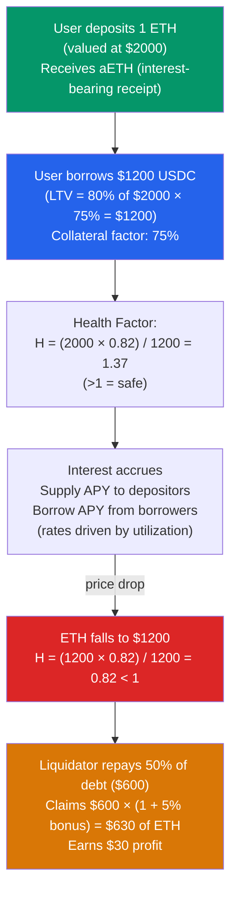

# 🏦 DeFi Lending and Borrowing

> [!abstract] TL;DR
> DeFi lending protocols (Aave, Compound) are over-collateralized loan markets: borrowers deposit collateral (e.g., ETH worth $150) to borrow up to a **Loan-to-Value (LTV)** ratio (e.g., 80% → $120 USDC). A position's safety is measured by its **health factor** `H = Σ(collateral_value × liquidation_threshold) / total_debt`. When `H < 1`, liquidators repay up to 50% of the debt and claim collateral plus a liquidation bonus (5-15%). Interest rates are algorithmic: **utilization rate** `U = borrows / (borrows + liquidity)` drives rates; at kink point (e.g., U=80%), rates jump sharply to incentivize repayment. **Flash loans** (EIP-3156) let borrowers take uncollateralized loans of any amount in one transaction — if not repaid (plus fee) by end of tx, the entire transaction reverts. Used for arbitrage, self-liquidation, and collateral swaps.

## Intuition — analogy FIRST
DeFi lending is like a pawn shop that never sleeps: you deposit your gold watch (ETH) and borrow cash (USDC) up to 80% of its value. The pawn shop holds the watch; if the watch's value drops enough that your loan exceeds the "liquidation threshold," the pawn shop sells your watch to a third-party buyer at a slight discount. You avoid needing to trust the pawn shop with your personal details — the collateral is the only guarantee.

Flash loans break the traditional lending model entirely: imagine a pawn shop that lends you $10 million for exactly one day — one atomic day that either completes entirely (you return the loan plus fee) or never happened at all (if you can't repay, time rewinds). This isn't science fiction; it's what happens in a single Ethereum transaction.

---

## How It Works



---

## Key Concepts / Details

### Health Factor
```
H = Σ(collateral_i × liquidation_threshold_i × price_i) / total_debt_in_base_currency

where:
- collateral_i = amount of collateral token i
- liquidation_threshold_i = risk parameter per token (e.g., ETH: 82.5%, USDT: 75%)
- price_i = from oracle (Chainlink, see [[Oracles_and_Data_Feeds]])
```

When `H < 1`: position eligible for liquidation. Liquidator can repay up to `close_factor` (typically 50%) of the debt and receive discounted collateral.

### Liquidation Mechanics
```
debt_repaid = min(50% × total_debt, collateral_available / (1 + liquidation_bonus))
collateral_seized = debt_repaid × (1 + liquidation_bonus) / collateral_price

Example:
  ETH collateral: 1 ETH at $1200
  USDC debt: $1200
  H = (1200 × 0.825) / 1200 = 0.825 < 1  → liquidation eligible
  
  Liquidator repays 50% → $600 USDC
  Collateral seized: $600 × 1.05 / $1200 = 0.525 ETH (=$630 value)
  Liquidator profit: $30 (5% bonus on $600)
```

**Cascade liquidations**: A large price drop triggers many simultaneous liquidations, which may cause further selling pressure on the collateral asset, triggering more liquidations (2022 LUNA/UST collapse, Celsius liquidation cascade).

### Interest Rate Model
Aave's **two-slope interest rate** model:

```
U = total_borrows / (total_borrows + available_liquidity)

If U < U_optimal (80%):
  borrow_rate = base_rate + (U / U_optimal) × slope1
  
If U >= U_optimal:
  borrow_rate = base_rate + slope1 + ((U - U_optimal) / (1 - U_optimal)) × slope2
  
slope2 >> slope1 (e.g., slope1=4%, slope2=300%)
```

This creates a "kink" at `U_optimal` — when utilization is high, rates spike dramatically to attract new deposits and repayments.

**Supply APY**: `supply_rate = borrow_rate × U × (1 - reserve_factor)` — suppliers earn interest from borrowers, minus a protocol reserve cut.

### Flash Loans (EIP-3156)
```solidity
interface IERC3156FlashLender {
    function flashLoan(
        IERC3156FlashBorrower receiver,  // contract that receives and returns funds
        address token,
        uint256 amount,
        bytes calldata data
    ) external returns (bool);
}

interface IERC3156FlashBorrower {
    function onFlashLoan(
        address initiator,
        address token,
        uint256 amount,
        uint256 fee,
        bytes calldata data
    ) external returns (bytes32);  // must return keccak256("ERC3156FlashBorrower.onFlashLoan")
}
```

**Atomic execution**: All steps in one tx — loan received → arbitrary logic → repay with fee. No net borrowing if repaid. No collateral required.

**Flash loan fee**: Aave v3: 0.05% per flash loan. Balancer: 0% (subsidized by protocol).

**Use cases**:
1. **Arbitrage**: Borrow 1M USDC, buy ETH on Uniswap, sell on Curve (higher price), repay loan + fee, pocket profit.
2. **Self-liquidation**: User's own position is at risk; use flash loan to repay debt, claim collateral, sell enough to cover loan — avoids 5-15% liquidation penalty.
3. **Collateral swap**: Borrow DAI against ETH; swap collateral from ETH to stETH atomically without closing position.
4. **Price oracle attacks**: (Malicious) borrow large amount, manipulate spot price oracle, liquidate under-priced positions. Mitigated by TWAP oracles.

**Flash loan attack anatomy** (bZx 2020):
```
1. Flash loan 10,000 ETH from dYdX
2. Borrow WBTC using 5,500 ETH as collateral on Compound
3. Sell WBTC short on bZx (using spot price oracle)
4. Dump WBTC on Uniswap → price drops → bZx oracle updates
5. bZx position underwater → liquidate at profit
6. Repay flash loan
Total profit: ~$350k. Total cost: flash loan fee + gas
```

### Collateral Types and Risk Parameters

| Asset | LTV | Liquidation Threshold | Liquidation Bonus | Risk |
|-------|-----|----------------------|-------------------|------|
| WETH | 80% | 82.5% | 5% | Low |
| WBTC | 70% | 75% | 6.25% | Low-Medium |
| LINK | 50% | 65% | 10% | Medium |
| UNI | 65% | 77% | 10% | Medium |
| stETH | 69% | 81% | 7.5% | Medium (liquid staking) |
| Long-tail | 0-40% | 40-65% | 10-15% | High |

### Protocol Comparison

| Protocol | Governance | Flash loans | Isolated markets | Notable feature |
|----------|-----------|-------------|-----------------|----------------|
| Aave v3 | AAVE token | Yes, 0.05% | Yes (Isolation Mode) | Efficiency mode (eMode) for correlated assets |
| Compound v3 | COMP token | No (v3) | Per-market | Single-asset collateral per market |
| Morpho | MORPHO | Yes | Yes | Peer-to-peer matching on top of Aave/Compound |
| Euler | EUL | Yes | Yes | Risk-based parameter tiers |

---

## Real-World Notes
- **Aave v3 eMode**: when borrowing an asset from the same category as collateral (e.g., ETH and stETH), LTV can be up to 95% — much higher efficiency for correlated assets.
- **Liquidation bots**: run by MEV searchers, monitor health factors via `Multicall3` batched reads. A profitable liquidation triggers a gas auction (Priority Gas Auction) — often using Flashbots to avoid failed transaction costs.
- Celsius Network (2022 bankruptcy): ran DeFi lending strategies with customer funds. When markets crashed, their collateral positions became undercollateralized and they couldn't repay $4.7B to depositors.
- **Reentrancy in lending protocols**: ERC-777 tokens enabled reentrancy in Lendf.me and dForce (2020, $25M hack). Use checks-effects-interactions; avoid ERC-777 collateral.

---

## Common Pitfalls
1. **Assuming health factor is static** — it changes with every oracle price update (every block). A position can drop below 1 between calls with no user action.
2. **Not accounting for the liquidation penalty** — the net loss from liquidation (5-15% bonus + potential slippage) is often worse than preemptively repaying or adding collateral.
3. **Using spot price AMM oracles** — flash loan attacks exploit spot price oracles. Always use TWAP, Chainlink, or multi-source oracles for collateral pricing.
4. **Forgetting to repay in `onFlashLoan`** — if the callback doesn't return the proper bytes32 or fails to approve the lender for repayment, the entire transaction reverts.

---

## Related Concepts
- [[_MOC_DeFi_Protocols|↑ DeFi Protocols MOC]]
- [[Oracles_and_Data_Feeds]] — health factor calculation requires oracle prices
- [[AMMs_and_Liquidity_Pools]] — AMM pools often used as liquidity sources for liquidation
- [[MEV_and_Arbitrage]] — liquidation bots are MEV searchers
- [[04_Ethereum_EVM/Gas_and_Optimization|Gas & Optimization]] — flash loan arbitrage is highly gas-optimized

---

## Review Questions
1. A position has: 2 ETH ($1800/ETH LT=82.5%), 5000 LINK ($15/LINK LT=65%), and 3000 USDC debt. Calculate the health factor. How much can a liquidator repay, and how much collateral would they seize (which asset, and at what price)?
2. Design a flash loan arbitrage between two AMMs: Uniswap v3 has ETH/USDC at $2000; Curve has the same at $2010. You have zero capital. Walk through the exact steps and calculate the minimum profitable trade size (ignoring gas costs).
3. Aave v3's interest rate model has kink at U=80%, slope1=4%/year, slope2=300%/year. Calculate borrow APY at U=95%. What happens to supply APY if reserve_factor=10%?

---

## Sources
- Aave v3 Technical Paper (2022) — aave.com/risk
- Compound v3 Whitepaper (2022) — compound.finance
- EIP-3156: Flash Loans (2020)
- Perez et al. "Liquidations: DeFi on a Knife-edge" (2021, FC)
- bZx Post-Mortem: "bZx flash loan attacks" (2020)

#Blockchain #DeFiProtocols #Lending #Aave #Compound #FlashLoan #HealthFactor #Liquidation
