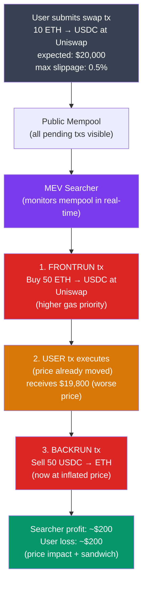

# 🎯 MEV and Arbitrage

> [!abstract] TL;DR
> **MEV (Maximal Extractable Value)** is the profit validators/miners can extract by reordering, inserting, or censoring transactions within the blocks they produce. Total extracted MEV on Ethereum exceeded $1B cumulatively by 2024. Key MEV strategies: **frontrunning** (copy a profitable tx and submit with higher gas to execute first), **backrunning** (place a tx immediately after a target tx to capture slippage), **sandwich attacks** (frontrun + backrun a victim swap, causing ~0.5-3% slippage loss). **Proposer-Builder Separation (PBS)** via Flashbots MEV-Boost separates block production (builders compete to create the most profitable block) from block proposal (validators select the highest-value block header and earn the payment), extracting MEV without validators needing to run searcher infrastructure. MEV is a fundamental economic property of transparent mempools and deterministic state machines.

## Intuition — analogy FIRST
Imagine a stock exchange where all orders are visible in a queue before they execute, and the person running the exchange can rearrange the queue at will. A large buy order for Apple stock (causing the price to rise) would be visibly queued. The exchange operator could insert their own buy order first (frontrunning), let your order execute (price now higher), then sell their shares to you at the inflated price. This is sandwiching — you get a worse price, they pocket the difference.

In blockchain terms, the "queue" is the public mempool, the "exchange operator" is the block producer, and the "rearrangement" is MEV. The transparency that makes blockchains trustless also makes every pending transaction visible to sophisticated actors who have powerful incentives to exploit ordering.

---

## How It Works



---

## Key Concepts / Details

### MEV Taxonomy

| Type | Description | Example |
|------|-------------|---------|
| **Arbitrage** | Exploit price discrepancy across DEXes | Buy ETH on Uniswap, sell on Curve |
| **Liquidation** | Repay undercollateralized positions first | Aave position at H=0.99 |
| **Frontrunning** | Execute before a known profitable tx | Copy a profitable arbitrage tx |
| **Backrunning** | Execute immediately after a tx | Capture price impact after large swap |
| **Sandwich** | Frontrun + backrun a user swap | Most common user-harming MEV |
| **Time-bandit** | Reorg to recapture old MEV | 51%+ attack for high-value MEV |
| **JIT Liquidity** | Add v3 LP right before large swap, remove after | Earn fees without IL exposure |
| **NFT sniping** | Frontrun minting of rare NFTs | Gas wars during NFT drops |

### Sandwich Attack Economics
For a user swapping `x` tokens (with k-invariant AMM):

```
Victim swap: Δx into pool with price impact ε = Δx/(2x)

Sandwich attacker:
1. Frontrun with Δx_f: moves price by ε_f
2. Victim's Δx executes at worsened price (worse by ε_f)
3. Attacker backruns: recovers position at higher price

Attacker profit ≈ Δx_v × ε_f   (steal victim's expected surplus)
Victim loss ≈ Δx_v × ε_f        (receives output at inflated price)

Required: ε_f > gas_cost / (Δx_v × ε_f)
Typical profitable when: victim swap size > $10,000 at 30 gwei
```

**Detection**: If your tx has a high slippage tolerance (>0.5%), sandwiches are profitable. Always set tight slippage (0.1-0.3%) for stable pairs; accept slightly higher for volatile pairs.

### Proposer-Builder Separation (PBS)
Pre-PBS: validators extracted MEV themselves (or bought access to it from searchers via "tips").

**PBS via MEV-Boost (Flashbots)**:
1. **Searchers**: identify MEV opportunities, submit **bundles** (ordered set of txs + payment to builder) to builders.
2. **Builders**: aggregate bundles + regular mempool txs, optimize ordering for maximum block value, submit signed block + bid to relay.
3. **Relays**: validate blocks from builders (verify non-missing transactions, no malicious reorgs), pass to validators.
4. **Validators**: pick the block header with the highest payment from all received relay bids. Sign and propose the block.

```
Value flow:
User fees → Builder → Relay → Validator (up to 95%)
Searcher profits → Builder (in payment) → Validator
```

**Numbers (2024)**:
- ~90% of Ethereum blocks built by just 3-4 builders (Rsync-builder, Titan, beaverbuild, etc.)
- MEV-Boost adopted by ~90% of validators
- Total MEV-Boost payments to validators: ~200,000 ETH (~$500M) in 2024

### Flashbots Architecture

```
Searcher → Bundle → Builder  →  Relay  → Validator
                                         (picks max bid)
```

**Private order flow**: Searchers submit bundles privately to builders, bypassing the public mempool. This eliminates frontrunning of the searcher's own strategies and of user transactions submitted via Flashbots Protect.

**Bundle format**:
```json
{
  "txs": ["0x...", "0x..."],           // ordered list of transactions
  "blockNumber": "0x12C4F0",          // target block
  "minTimestamp": null,
  "maxTimestamp": null,
  "revertingTxHashes": ["0x..."]       // allow these to revert (optional)
}
```

**Bundle simulation**: Builders simulate bundles before including them to verify profitability and no unexpected reverts.

### SUAVE and the MEV Future
**SUAVE (Single Unifying Auction for Value Expression)**: Flashbots' next-gen system — a specialized blockchain for expressing, simulating, and auctioning MEV preferences across multiple chains. Aims to:
- Give users control over how their order flow is monetized
- Enable app-layer MEV redistribution (back to users)
- Cross-chain MEV coordination

**MEV redistribution**:
- **CowSwap**: uses batch auctions + intent-based routing; MEV is captured by "solvers" who compete to provide best execution — MEV goes to users as better prices.
- **1inch Fusion**: orderbook with resolvers bidding on user intents.
- **UniswapX**: permit2-based intents, solvers compete off-chain.

### Order Flow Auctions (OFA)
Instead of MEV being extracted from users, OFAs let users capture their own MEV:

1. User signs an "intent" (not a raw tx): "I want to sell 1 ETH for at least $1990 USDC"
2. Solvers bid for the order flow, compete to provide best execution
3. Winning solver executes + pays user the extra (or captures as profit)

Platforms: CowSwap, 1inch Fusion, UniswapX, Flashbots Protect.

---

## Real-World Notes
- **The Flashbots Auction (pre-PBS)**: before MEV-Boost, searchers submitted bundles directly to miners via Flashbots. Miners ran `mev-geth` — a modified geth that included Flashbots API. Reduced gas wars by ~80%.
- JIT (Just-In-Time) Liquidity on Uniswap v3: a builder adds concentrated liquidity in one transaction before a large swap and removes it in the next transaction in the same block. The LP earns the full fee on the swap with zero IL risk. Earns ~$1-10k per block on large swaps.
- Ethereum's PBS is currently "enshrined" via MEV-Boost (off-protocol), but "in-protocol PBS" (ePBS, EIP-7732) is being developed to formalize and decentralize the relay layer.
- **Tornado Cash** was a privacy protocol that laundered MEV profits (among other uses) — sanctioned by OFAC in 2022. Flashbots relays started censoring OFAC-sanctioned addresses, creating controversy about relay censorship.

---

## Common Pitfalls
1. **High slippage tolerance** — setting max slippage >1% on large swaps is an invitation for sandwich attacks. Never use "auto" slippage for large transactions.
2. **Public mempool submission for competitive txs** — submitting a liquidation or arbitrage tx to the public mempool means it's immediately visible to frontrunners. Use Flashbots Protect or private order flow.
3. **Ignoring MEV in smart contract design** — if your protocol has any profitable sequencing opportunity (rebalancing, fee collection, liquidation), assume MEV bots will exploit it and design accordingly.
4. **Confusing builder and validator** — after PBS, validators don't construct blocks; builders do. Validators only sign block headers. This separation is key to understanding Ethereum's post-Merge economics.

---

## Related Concepts
- [[_MOC_DeFi_Protocols|↑ DeFi Protocols MOC]]
- [[AMMs_and_Liquidity_Pools]] — AMM swaps are the primary MEV attack surface (sandwiching)
- [[Lending_and_Borrowing]] — liquidations are the second largest MEV category
- [[Oracles_and_Data_Feeds]] — oracle manipulation is often the vector for MEV exploitation
- [[01_Blockchain_Fundamentals/P2P_Network_Architecture|P2P Network Architecture]] — mempool visibility enables MEV detection

---

## Review Questions
1. A user swaps $500,000 USDC for ETH on Uniswap v3 with 1% max slippage. Describe the exact steps of a sandwich attack, estimate the attacker's profit, and explain at what slippage setting it becomes unprofitable.
2. Under PBS, a builder includes a MEV bundle that earns 1 ETH profit and pays the validator 0.8 ETH. A different builder submits a block with only regular txs earning 0.5 ETH in fees. Which block does the validator choose, and why?
3. You are designing a DeFi protocol with a rebalancing function that anyone can call to earn a fee. How do you prevent the rebalancer from being frontrun, and what MEV-resistant design pattern would you use?

---

## Sources
- Daian et al. "Flash Boys 2.0" (2019, IEEE S&P)
- Flashbots Research — "MEV and Me" (2021)
- Flashbots — "MEV-Boost: Merge ready Flashbots Architecture" (2022)
- Ethereum.org — "Maximal Extractable Value (MEV)" (2024)
- Adams et al. "UniswapX" (2023, uniswap.org)

#Blockchain #DeFiProtocols #MEV #Flashbots #PBS #Sandwich #Frontrunning
