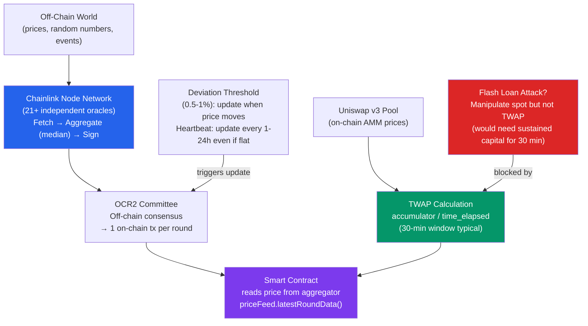

# 🔭 Oracles and Data Feeds

> [!abstract] TL;DR
> **Oracles** bridge off-chain data (asset prices, random numbers, weather data) to smart contracts. The **oracle problem**: blockchains are deterministic closed systems — they cannot natively access external data. Solutions: **Chainlink** uses a decentralized network of independent node operators who fetch, aggregate (median), and sign data on-chain via OCR2 (Off-Chain Reporting 2) — reducing on-chain gas by 90% vs. individual submissions. **TWAP (Time-Weighted Average Price)** from AMMs like Uniswap v3 provides on-chain, manipulation-resistant price averaging over a configurable window. **Pyth Network** uses a "pull" oracle model where publishers (financial institutions) push prices off-chain; users pull the latest price on-demand with a cryptographic proof. Oracle manipulation is the #1 attack vector in DeFi — 2023 saw >$200M lost to oracle attacks.

## Intuition — analogy FIRST
A smart contract is like a blind courtroom: it can execute rules with perfect fairness, but it cannot see outside the courthouse. An oracle is the witness who testifies about the outside world. The contract trusts the witness's testimony because the witness has staked their reputation (and economically staked value) on telling the truth, and multiple witnesses must agree before their testimony is accepted.

The danger: if you bring in a biased witness (manipulated oracle), the entire legal proceeding produces an unjust outcome. In DeFi, "bringing in a biased witness" means flash-loaning a massive amount to temporarily manipulate an AMM spot price, which is used as an oracle — then exploiting the distorted price to drain a protocol.

---

## How It Works



---

## Key Concepts / Details

### Chainlink Data Feeds (OCR2)
Chainlink's **Off-Chain Reporting 2 (OCR2)** protocol:

1. **Committee**: A set of 21-31 oracle nodes are assigned to a price feed.
2. **Leader election**: One node is the "leader" per round.
3. **Observation phase**: All nodes independently fetch prices from exchange APIs, CEXes, and data providers.
4. **Report phase**: Leader aggregates observations into a signed report (median of all values). Requires threshold (≥14 of 21) of cryptographic signatures.
5. **On-chain submission**: One node submits the signed report. Contract verifies threshold signatures, stores result.

**Gas saving**: Instead of 21 individual on-chain txs, OCR2 submits 1 tx with 21 signatures verified by an aggregator contract — 90% gas reduction vs. FluxAggregator.

**Update triggers**:
- **Deviation**: price changes by ≥0.5% (ETH/USD) or ≥1% (altcoins)
- **Heartbeat**: forced update every 1-24 hours even if price is flat

```solidity
// Chainlink usage
AggregatorV3Interface priceFeed = AggregatorV3Interface(
    0x5f4eC3Df9cbd43714FE2740f5E3616155c5b8419  // ETH/USD on Ethereum
);

(
    uint80 roundId,
    int256 answer,         // price × 10^8 (8 decimals)
    uint256 startedAt,
    uint256 updatedAt,     // CRITICAL: check this for staleness
    uint80 answeredInRound
) = priceFeed.latestRoundData();

require(updatedAt >= block.timestamp - 1 hours, "Stale price feed");
require(answer > 0, "Invalid price");
uint256 price = uint256(answer);  // $2000 → 200000000000 (8 decimals)
```

### TWAP (Time-Weighted Average Price)
Uniswap v3 stores a **cumulative price accumulator** updated at each block:
```
price_cumulative += current_spot_price × time_since_last_update
```

**TWAP calculation**:
```
TWAP = (price_cumulative_now - price_cumulative_T_ago) / time_elapsed

In Uniswap v3: stores tick_cumulative (log₁.0001 of price), not price directly.
spot_price = 1.0001^(tick_cumulative_diff / time_elapsed)
```

**Manipulation resistance**: 
- Moving the TWAP significantly requires sustaining a manipulated AMM price for the entire TWAP window (30 min = 150 blocks).
- Cost to shift 30-min TWAP by 10%: need to hold 10% price move for 150 blocks, which requires continuous capital locked in the pool against arbitrageurs.
- This cost grows with: longer TWAP window, deeper AMM liquidity, active arbitrage.

**TWAP limitations**:
- **Latency**: 30-min TWAP lags spot by 30 min — poor for fast-moving markets.
- **Illiquid pools**: thin AMMs are cheaper to manipulate even with TWAP.
- **Block stuffing**: an attacker with high gas could fill blocks to slow down arbitrageurs (reduces manipulation cost).

### Pyth Network (Pull Oracle)
Traditional "push" oracles update prices on a schedule. Pyth uses a **"pull" model**:

1. **Publishers** (60+ exchanges and financial institutions: Jane Street, Jump, Binance, etc.) push price data to Pyth's aggregator on Pythnet (a Solana fork).
2. **On Pythnet**: prices aggregated every 400ms, stored in an off-chain attestation.
3. **On demand**: DApp users or protocols call `pyth.updatePriceFeeds(priceUpdateData)` to push the latest price + merkle proof on-chain (costs ~0.001 USD in Ethereum).

**Confidence intervals**: Pyth reports not just a price but a `(price, confidence_interval)` pair. Protocols can check if the price is reliable: `require(abs(price - conf) / price < 0.01, "Low confidence")`.

**Staleness**: Each price has a `publishTime`. Protocols must check `block.timestamp - publishTime < 60 seconds`.

### Oracle Types Comparison

| Type | Latency | Decentralization | Manipulation resistance | Gas cost |
|------|---------|-----------------|------------------------|---------|
| Chainlink OCR2 | 0.5-24h (heartbeat) | High (21+ nodes) | High | High (deviated updates) |
| Uniswap v3 TWAP | 30-60 min | Very high (on-chain) | Good (long window) | Low (read) |
| Pyth (pull) | 400ms | Medium (60+ publishers) | Medium | Low (user pays) |
| Tellor | ~10 min | Medium (PoW miners) | Medium | Medium |
| Band Protocol | 10-30s | Medium (delegated PoS) | Medium | Medium |
| API3 (dAPI) | Seconds | Low-Medium | Low-Medium | Low |

### Oracle Attack Vectors

1. **Flash loan spot price manipulation** (most common):
   - Borrow large amount → move AMM spot price → exploit protocol using spot price → repay loan.
   - Mitigated by: use TWAP, use Chainlink, don't use AMM spot price as oracle.

2. **Oracle delay exploitation**:
   - Chainlink price lags real price by minutes during volatile markets.
   - Arbitrageurs can exploit the lag: buy underpriced collateral from protocol using stale Chainlink price.
   - Mitigated by: tighter deviation thresholds, shorter heartbeat.

3. **Node operator collusion**:
   - If 14+ of 21 Chainlink nodes collude, they can submit arbitrary price.
   - Mitigated by: economic staking (LINK), reputation, circuit breakers.

4. **Last-mile data source compromise**:
   - Chainlink nodes all fetch from the same 3 API sources → single source of failure.
   - Mitigated by: diverse data sourcing, cross-validation.

### Chainlink VRF (Verifiable Random Function)
For random numbers, Chainlink VRF provides cryptographically provable randomness:
```solidity
// VRF v2 usage (simplified)
function requestRandomWords() external returns (uint256 requestId) {
    requestId = COORDINATOR.requestRandomWords(
        keyHash,      // VRF key hash
        s_subscriptionId,
        3,            // minimum confirmations
        100000,       // gas limit for callback
        2             // number of random words
    );
}

function fulfillRandomWords(uint256, uint256[] memory randomWords)
    internal override
{
    s_randomWord = randomWords[0]; // Cryptographically verifiable random
}
```

**Security**: The randomness is based on `VRF(secret_key, request_seed)` — the node cannot predict the outcome before the request, and the contract verifies the cryptographic proof.

---

## Real-World Notes
- **Mango Markets exploit (2022, $116M)**: Avi Eisenberg manipulated MNGO perpetual futures price using spot price oracle (AMM spot). Created a massive long position, then manipulated the oracle price upward to borrow against the inflated collateral.
- **Cream Finance (2021, $130M)**: flash loan attack exploited a misconfigured oracle that used AMM spot price for AMP token.
- **Circuit breakers**: Some protocols implement a circuit breaker — if the reported price deviates >30% from a TWAP, pause liquidations/borrows. This prevents flash loan attacks at the cost of potential liveness issues.
- Chainlink's CCIP (Cross-Chain Interoperability Protocol) extends the oracle network to bridge data across chains.

---

## Common Pitfalls
1. **Not checking `updatedAt` timestamp** — a Chainlink feed that stops updating (node failure, network congestion) returns a stale price. Always validate `updatedAt >= block.timestamp - threshold`.
2. **Using pool spot price as oracle** — AMM spot price is trivially manipulated in a single transaction. Never use `getReserves()` from Uniswap v2 or `slot0()` from Uniswap v3 as an oracle.
3. **Ignoring the oracle's decimal precision** — Chainlink ETH/USD uses 8 decimals; some feeds use 18. Always check `decimals()` before dividing.
4. **Single oracle dependency** — if only one oracle source is used and it's compromised or fails, the entire protocol is at risk. Use at least two independent sources with a circuit breaker.

---

## Related Concepts
- [[_MOC_DeFi_Protocols|↑ DeFi Protocols MOC]]
- [[AMMs_and_Liquidity_Pools]] — TWAP oracles derived from AMM price accumulators
- [[Lending_and_Borrowing]] — health factor calculations depend on oracle prices
- [[MEV_and_Arbitrage]] — oracle manipulation often involves MEV-style flash loans
- [[Derivatives_and_Perpetuals]] — perp protocols use mark/index price oracles for funding rate

---

## Review Questions
1. A protocol uses a 30-minute Uniswap v3 TWAP for ETH/USDC. An attacker wants to manipulate the TWAP by 10% (move from $2000 to $2200). The pool has $100M in liquidity at ±1% range. Estimate the cost of the attack and why it's (or isn't) economically viable.
2. Chainlink's ETH/USD feed has a 1-hour heartbeat and 0.5% deviation threshold. ETH drops 25% in 5 minutes during a market crash. How long before the Chainlink price reflects this? What attack is possible during this window?
3. You are designing a lending protocol. Compare three oracle options: Chainlink + Uniswap v3 TWAP fallback + circuit breaker. What is the protocol behavior in each of these failure scenarios: (a) Chainlink goes stale, (b) Uniswap pool is too thin to manipulate, (c) flash loan attack on AMM spot price.

---

## Sources
- Chainlink OCR2: "Off-Chain Reporting Protocol" (Breidenbach et al., 2021)
- Uniswap v3 Whitepaper — "Observations" section (Adams et al., 2021)
- Pyth Network Whitepaper (2022) — pyth.network
- samczsun — "So you want to use a price oracle" (2020, paradigm.xyz)
- Trail of Bits — "Attacks on DeFi Oracles" (2022)

#Blockchain #DeFiProtocols #Oracles #Chainlink #TWAP #PythNetwork #DataFeeds
