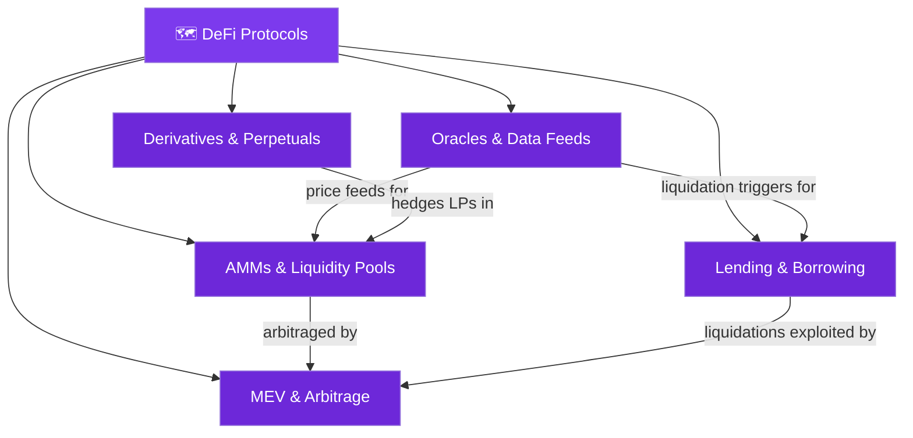

# 🗺️ DeFi Protocols — Map of Content

> [!abstract] What This Section Covers
> This section dissects the core primitive protocols of Decentralized Finance: automated market makers (AMMs), lending/borrowing platforms, MEV and block-building economics, oracle data feed infrastructure, and derivatives/perpetuals. Each note is written for engineers who need to understand the exact math, economic attack vectors, and production failure modes — not just the high-level narrative.

---

## Concept Map

---

## Learning Path

1. [[AMMs_and_Liquidity_Pools]] — The exchange primitive: x*y=k invariant, impermanent loss formula IL=2√p/(1+p)-1, Uniswap v3, Curve.
2. [[Oracles_and_Data_Feeds]] — The price feed: Chainlink decentralized median, TWAP manipulation, Pyth pull model.
3. [[Lending_and_Borrowing]] — The credit layer: health factor H=Σcol×LT/debt, liquidation bonus, flash loans EIP-3156.
4. [[MEV_and_Arbitrage]] — The meta-game: frontrunning, sandwiching, PBS/Flashbots MEV-Boost, builder/relay.
5. [[Derivatives_and_Perpetuals]] — The synthetic layer: funding rate, mark/index price, vAMM, liquidation engine.

---

## All Notes at a Glance

| Note | Difficulty | What You'll Learn |
|------|-----------|-------------------|
| [[AMMs_and_Liquidity_Pools]] | Intermediate | CPMM, IL, concentrated liquidity, Curve StableSwap |
| [[Lending_and_Borrowing]] | Intermediate | Health factor, collateral ratios, flash loans |
| [[MEV_and_Arbitrage]] | Advanced | MEV taxonomy, PBS, Flashbots, MEV-Boost, SUAVE |
| [[Oracles_and_Data_Feeds]] | Intermediate | Chainlink OCR, TWAP, manipulation attacks |
| [[Derivatives_and_Perpetuals]] | Advanced | Funding rate, vAMM, dYdX, GMX, liquidation cascade |

---

## Key Questions This Section Answers

- How does impermanent loss arise mathematically in an x*y=k AMM?
- At what health factor is a position liquidated and how is the bonus calculated?
- What is the difference between a sandwich attack and a frontrun?
- Why is a spot price oracle manipulable and how does TWAP reduce (but not eliminate) this?
- How does the funding rate mechanism keep a perpetual's mark price anchored to index?
- What is Proposer-Builder Separation and why was it introduced?

---

## Related Sections

- [[_MOC_Blockchain_Master|↑ Blockchain Master MOC]]
- [[_MOC_Ethereum_EVM|← Ethereum & EVM]]
- [[_MOC_Web3_Development|→ Web3 Development]]

#MOC #Blockchain #DeFiProtocols
