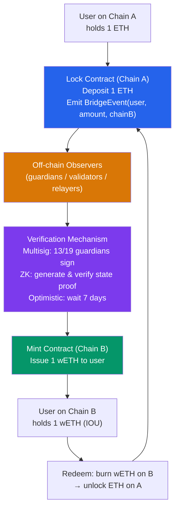

# 🌉 Cross-Chain Bridges

> [!abstract] TL;DR
> Cross-chain bridges move assets and messages between blockchains. Three fundamental mechanisms: **lock-and-mint** (lock token on source chain, mint wrapped token on destination), **burn-and-mint** (burn on source, mint native on destination), **liquidity pools** (swap from source pool to destination pool, no wrapping). Trust models span from **externally verified** (multisig guardians: Wormhole 19 guardians, Axelar 75 validators) to **optimistically verified** (Optimism's 7-day fraud proof) to **validity-verified** (ZK proof of state transition, trustless). Major exploits: Wormhole (2022, $320M — signature verification bypass), Ronin (2022, $624M — key compromise), Poly Network (2021, $611M — access control flaw), Nomad (2022, $190M — merkle root zero-initialization). Cross-chain bridges hold $20B+ in TVL and represent the single largest attack surface in Web3.

## Intuition — analogy FIRST
Moving money between blockchains without a bridge is like trying to spend euros in the US — the currencies exist in separate systems that don't recognize each other. A bridge is like a foreign exchange bureau: you give your euros (ETH on Ethereum) to the bureau (bridge contract), get a receipt (wrapped ETH token on Polygon), use the receipt in the local system, and can redeem it later for original euros.

The security problem is: who verifies that your original euros are still safely locked? A multisig bridge relies on a committee of people you trust to verify and confirm. A ZK bridge uses cryptographic math to prove the locked state without trusting anyone. If the committee is bribed or hacked, the multisig bridge is drained. ZK bridges are trustless — if the proof checks out mathematically, the locked funds are safe.

---

## How It Works



---

## Key Concepts / Details

### Bridge Mechanism Types

**1. Lock-and-Mint (Custodial)**
- Source chain: lock native token in contract
- Destination chain: mint "wrapped" token (1:1 backed IOU)
- Redeem: burn wrapped → unlock native
- Example: WBTC (Bitcoin → Ethereum), Wormhole wETH

**Risk**: The "custodian" (bridge contract + guardian set) holds all locked funds. If hacked, all wrapped tokens become worthless.

**2. Burn-and-Mint (Native)**
- Token deployed natively on both chains with shared total supply
- Bridge burns on source, signals to mint on destination
- No "wrapping" — same token on both chains
- Example: Circle's CCTP (USDC), LayerZero OFT standard
- Risk: If bridge is compromised, unlimited minting possible

**3. Liquidity Pool (Native Swap)**
- Source chain: swap into bridge pool
- Destination chain: swap out from bridge pool
- No wrapping — liquidity providers fund each side
- Example: Connext, Hop Protocol
- Risk: Pool imbalance → LP losses; no bridge contract holding all funds

**4. Canonical Rollup Bridges (Trust-minimized)**
- Ethereum L1 ↔ L2 rollup bridges with no additional trust
- Optimistic: 7-day fraud proof window
- ZK: instant (proof verified in minutes)
- Example: Arbitrum/Optimism (7-day), zkSync/Starknet (hours for proof)

### Trust Model Spectrum

| Bridge | Mechanism | Trust assumption | Withdrawal delay |
|--------|-----------|-----------------|-----------------|
| Ethereum ↔ Optimism | Optimistic rollup | 1 of N watchers honest | 7 days |
| Ethereum ↔ zkSync | ZK rollup | Cryptographic | Hours |
| Wormhole | Multisig (19 guardians) | 13/19 guardians honest | Minutes |
| Axelar | PoS validators | 2/3 of 75 validators honest | Minutes |
| LayerZero | Oracle + relayer (configurable) | Oracle ≠ relayer (both honest) | Minutes |
| Ronin | Multisig (9 validators) | 5/9 validators honest | Minutes |

### Major Bridge Exploits

**Wormhole (Feb 2022, $320M)**:
- **Vulnerability**: Signature verification bypass in the Wormhole guardian verification contract
- **Attack**: The attacker exploited a spoofed guardian signature verification — a deprecated `verify_signatures` function was not properly secured. The attacker forged a valid-looking VAA (Verified Action Approval) without actually having 13/19 guardian signatures.
- **Consequence**: Minted 120,000 wETH on Solana without locking ETH on Ethereum
- **Recovery**: Jump Crypto (Wormhole funder) injected $320M to cover losses

**Ronin Bridge (Mar 2022, $624M)**:
- **Vulnerability**: Key compromise — 5 of 9 Sky Mavis (Axie Infinity developer) validator keys + 1 trusted node run by Axie DAO
- **Attack**: North Korean Lazarus group compromised 4 Sky Mavis keys via phishing + spear-phishing. One more key (the Axie DAO gas-free RPC node) was a residual trusted validator from 2 months prior (a governance permission that was never removed)
- **Consequence**: Attacker had 5/9 keys — exactly the threshold — and drained 173,600 ETH + $25.5M USDC
- **Lesson**: Validator key management is the critical failure point for multisig bridges

**Nomad (Aug 2022, $190M)**:
- **Vulnerability**: A routine upgrade initialized the trusted root to `bytes32(0)`. The message verification checked `acceptableRoot[0x0000...] == true` — which was `true` for the zero root.
- **Attack**: Any message with `root = 0x0000...` passed validation. Anyone could replay transactions by changing the recipient address. Once discovered, hundreds of copycats drained the bridge in a chaotic free-for-all.
- **Lesson**: Zero-value initialization is catastrophic for access control systems

**Poly Network (Aug 2021, $611M — recovered)**:
- **Vulnerability**: Cross-chain message could call any method on any contract. The `EthCrossChainData` contract had a `putCurEpochConPubKeyBytes()` function that updated the public keys of the validator committee — and it was accessible from the bridge's cross-chain message handler.
- **Attack**: Attacker sent a cross-chain message that called `putCurEpochConPubKeyBytes()` with their own key, then signed transactions with their new "validator" key
- **Recovery**: Attacker returned funds after the community identified them; "white hat" motivation debated

### ZK Bridge Architecture (Trustless)
ZK bridges prove chain state transitions cryptographically:

```
Source chain (Ethereum):
  Block header: hash(state_root, tx_root, ...)
  Storage proof: merkle proof that bridge contract has locked X tokens

ZK Circuit proves:
  1. Block header is valid (signed by validators)
  2. State root in header matches on-chain state
  3. Storage proof shows X tokens locked for user Y

ZK Proof (SNARK/STARK) → verified on destination chain in one transaction
Destination chain: mint tokens, no trusted committee
```

**ZK Bridge implementations**:
- **Succinct Labs**: SP1-based ZK light client bridges
- **Polyhedra Network**: zkBridge using PLONK
- **=nil; Foundation**: zkBridge on Ethereum/L2 state proofs
- **Ethereum → L2 native bridges**: zkSync, Starknet, Polygon zkEVM

**Limitations**: ZK proof generation is expensive (minutes to hours). Not yet competitive with multisig bridges for speed.

### LayerZero Architecture
LayerZero uses a **dual-verification** model instead of a single guardian committee:

```
Source chain → Relayer delivers the message + transaction proof
Source chain → Oracle (Chainlink, Band) delivers the block header hash

Destination chain contract:
  verify(block_header from Oracle, tx_proof from Relayer)
  → only processes if BOTH agree
  
Security assumption: Oracle and Relayer do NOT collude
(they are economically independent — different organizations)
```

**OApp (Omnichain Application)**: LayerZero's application framework for cross-chain smart contracts. OFT (Omnichain Fungible Token) standard for cross-chain tokens.

### Bridge Security Best Practices

1. **Rate limiting**: Limit withdrawal amounts per time period (e.g., max 5% of TVL per day) — gives time to detect and respond to attacks.
2. **Pause mechanisms**: Circuit breakers that halt bridge if abnormal flow detected.
3. **Validator key management**: Hardware wallets, geographic distribution, regular rotation.
4. **Multi-sig governance**: Any threshold change requires time-lock + multi-sig approval.
5. **Bug bounties**: ImmuneFi bounties for bridge bugs (up to $10M offered by major bridges).
6. **Formal verification**: Mathematical proof of critical bridge logic.

---

## Real-World Notes
- Cross-chain bridges have lost $2.5B+ to exploits as of 2024 — the #1 exploit target in all of DeFi.
- **Circle's CCTP (Cross-Chain Transfer Protocol)**: Circle directly burns USDC on source and mints native USDC on destination — no wrapped tokens. Trusted by Circle as a company, not a decentralized guardian set. Supported on 10+ chains.
- Ethereum L2 rollup bridges are the gold standard for security (no trusted parties), but the 7-day optimistic bridge delay is a major UX friction. Fast bridges (like Hop) provide instant liquidity by advancing funds from a LP, taking the 7-day risk.
- **Cosmos IBC (Inter-Blockchain Communication)**: A protocol-native bridge for IBC-compatible chains (Cosmos SDK). Uses on-chain light clients — each chain stores the other's block headers and verifies proofs. The gold standard for inter-chain communication within the Cosmos ecosystem.

---

## Common Pitfalls
1. **Assuming TVL on both sides** — in a lock-and-mint bridge, the TOTAL value at risk equals the locked amount on the source chain. All $X million of locked ETH can be stolen in one tx if the bridge is exploited.
2. **Off-by-one in validator thresholds** — if threshold = 5/9 and you have 9 validators, an attacker needs only 5 keys. Losing even 5 keys (including residual/forgotten trusted nodes) is catastrophic.
3. **Not time-locking large parameter changes** — changing the validator set or withdrawal limits should have a 48-72 hour time-lock, allowing monitoring services to detect and respond to unauthorized changes.
4. **Trusting bridge security without verification** — bridge teams routinely claim their bridge is "battle-tested." Always review the trust model, guardian key management, and audit history before moving significant funds.

---

## Related Concepts
- [[_MOC_Web3_Development|↑ Web3 Development MOC]]
- [[02_Applied_Cryptography/Multi_Party_Computation|Multi-Party Computation]] — guardian multisig uses TSS for efficient signing
- [[02_Applied_Cryptography/Zero_Knowledge_Proofs|Zero-Knowledge Proofs]] — ZK bridges use validity proofs for trustless verification
- [[05_DeFi_Protocols/MEV_and_Arbitrage|MEV & Arbitrage]] — cross-chain MEV opportunities arise from price discrepancies across chains
- [[01_Blockchain_Fundamentals/Consensus_Mechanisms|Consensus Mechanisms]] — bridge security depends on source chain finality

---

## Review Questions
1. Explain exactly how the Nomad exploit worked: what was the root cause, how did the first attacker exploit it, and why did hundreds of copycats successfully drain the bridge after the first attack?
2. Compare the trust assumptions of: (a) Ethereum ↔ Optimism canonical bridge with 7-day fraud proof, (b) Wormhole with 19 guardians requiring 13/19, (c) a ZK bridge with a valid SNARK proof. Under what adversarial conditions does each fail?
3. You are designing a new cross-chain USDC bridge for a DeFi protocol. The team wants instant finality. Choose between LayerZero, Axelar, and Circle's CCTP. Justify your choice based on security, cost, and operational considerations.

---

## Sources
- Wormhole Post-Mortem (2022) — wormhole.com/blog
- Ronin Network Post-Mortem (2022) — roninchain.com/blog
- Nomad Bridge Incident Analysis — samczsun (2022, paradigm.xyz)
- Poly Network Post-Mortem (2021) — polynetwork.medium.com
- LayerZero Documentation — layerzero.gitbook.io
- Cosmos IBC Specification — github.com/cosmos/ibc
- Buterin. "Trust Models" (2022, vitalik.ca)
- ImmuneFi — "Bridge Hack Analysis" (2023)

#Blockchain #Web3Development #Bridges #Wormhole #LayerZero #Axelar #ZKBridges #CrossChain
