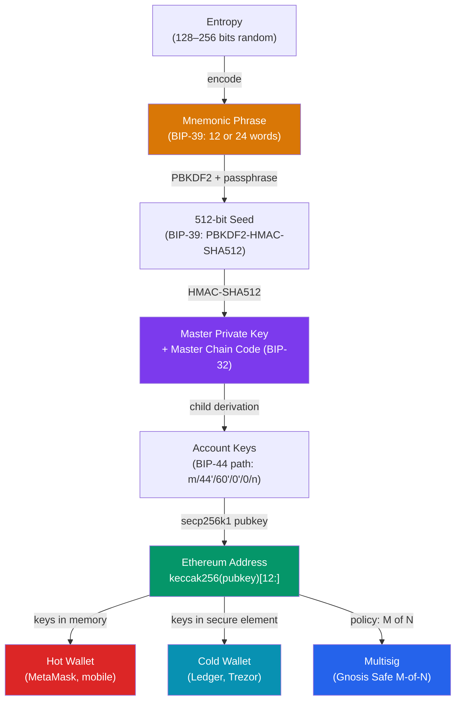

# Crypto Wallets

> [!abstract] TL;DR
> A crypto wallet does not store coins — it stores **private keys** that prove ownership of blockchain addresses. Key taxonomy: **hot wallets** (keys in software — MetaMask, mobile apps) are convenient but exposed to the internet; **cold wallets** (keys in hardware — Ledger, Trezor) sign transactions in an air-gapped chip. **HD wallets** (BIP-32/39/44) derive unlimited addresses from a single 12/24-word seed phrase using hierarchical deterministic derivation. **Multisig wallets** (Gnosis Safe) require M-of-N key signatures — the gold standard for DAO treasuries. **WalletConnect** is the QR-code protocol bridging mobile wallets to desktop dApps. **Keystore files** (JSON + scrypt/pbkdf2) are encrypted private keys for programmatic use.

## Intuition — analogy FIRST

A cryptocurrency wallet is a misnamed object — it is more like a **keychain** than a wallet. The "coins" live on the blockchain (a public ledger), and the wallet holds the keys that prove you own them. The seed phrase is the master key blank that a locksmith (BIP-32 derivation) can cut into thousands of individual keys (addresses). A hardware wallet is a key-cutting machine locked in a tamper-proof vault — you can ask it to sign a transaction, but the blank never leaves the vault. A multisig wallet is a safety deposit box that requires multiple keyholders to be present simultaneously — no single person can walk away with the contents.

---

## How It Works



---

## Key Concepts / Details

### Hot vs Cold Wallets

| Feature | Hot Wallet | Cold Wallet |
|---------|-----------|-------------|
| Private key location | Software (RAM/disk) | Secure element chip |
| Internet exposure | Always connected | Air-gapped (offline signing) |
| Convenience | High (instant signing) | Low (physical device needed) |
| Security | Lower (malware, phishing) | High (physical theft only) |
| Examples | MetaMask, Rainbow, Phantom | Ledger Nano X, Trezor Model T, Coldcard |
| Use case | Small amounts, frequent use | Large holdings, long-term storage |

### BIP-32 / BIP-39 / BIP-44 — HD Wallet Standards

```python
# BIP-39: Entropy → Mnemonic → Seed
from mnemonic import Mnemonic

mnemo = Mnemonic("english")
entropy = os.urandom(16)                         # 128 bits → 12 words
mnemonic = mnemo.generate(strength=128)
# "abandon ability able about above absent..."  (12 words)

seed = mnemo.to_seed(mnemonic, passphrase="")    # PBKDF2-HMAC-SHA512, 2048 rounds
# → 512-bit seed

# BIP-32: Seed → Hierarchical Deterministic key tree
from bip32 import BIP32
bip32 = BIP32.from_seed(seed)

# BIP-44: Standardized derivation path
# m / purpose' / coin_type' / account' / change / address_index
# m / 44'      / 60'        / 0'       / 0      / 0
# purpose=44 (BIP-44), coin_type=60 (Ethereum), account=0, external chain, index 0

eth_key_0 = bip32.get_privkey_from_path("m/44'/60'/0'/0/0")
eth_key_1 = bip32.get_privkey_from_path("m/44'/60'/0'/0/1")
# Same seed → same keys → same addresses every time (deterministic)
```

**Coin type indices** (BIP-44):
```
60'  = Ethereum (ETH)
0'   = Bitcoin (BTC)
195' = TRON
501' = Solana
```

### MetaMask Internals

```
MetaMask architecture:
┌────────────────────────────────────────────────────┐
│  Browser Extension (Chrome/Firefox)                 │
│  ┌─────────────┐  ┌──────────────┐                 │
│  │  UI Layer   │  │ Background   │                 │
│  │ (React)     │  │ Service      │                 │
│  │             │  │ Worker       │                 │
│  └──────┬──────┘  └──────┬───────┘                 │
│         │  JSON-RPC      │                         │
│         └────────────────┘                         │
│                │                                   │
│  ┌─────────────▼──────────┐                        │
│  │  KeyringController      │                        │
│  │  (encrypted keystore)   │                        │
│  │  keys: HD KeyTree       │                        │
│  └─────────────────────────┘                        │
└────────────────────────────────────────────────────┘

Key storage: keys encrypted with AES-256-GCM using a
password-derived key (PBKDF2-SHA256, 600,000 iterations)
Stored in browser's chrome.storage.local (encrypted blob)
Never sent to MetaMask servers — purely local
```

MetaMask exposes `window.ethereum` — an EIP-1193 provider that dApps call:

```javascript
// Connecting to MetaMask from a dApp
const provider = new ethers.BrowserProvider(window.ethereum)
await provider.send("eth_requestAccounts", [])  // prompts user approval

const signer = await provider.getSigner()
const address = await signer.getAddress()

// Signing a transaction — user approves in MetaMask popup
const tx = await signer.sendTransaction({
  to: "0xRecipient...",
  value: ethers.parseEther("0.01"),
})
await tx.wait()  // wait for confirmation
```

### Hardware Wallets — Signing Flow

```
Hardware wallet signing flow:
1. dApp / software constructs unsigned transaction
2. Transaction data sent to hardware device over USB/BLE
3. Device screen shows: "Send 0.5 ETH to 0xABC...?"
4. User physically confirms on device buttons
5. Secure element chip signs with private key (key never leaves chip)
6. Signature returned to software
7. Software broadcasts signed transaction to the network

The private key NEVER exists outside the secure element.
Even if the computer is infected with malware,
it cannot extract the key — it can only request signatures.
```

### Keystore Files (JSON)

```json
{
  "version": 3,
  "id": "304dba0e-...",
  "address": "1a642f0e...",
  "crypto": {
    "ciphertext": "f77d...",
    "cipherparams": { "iv": "bcd3..." },
    "cipher": "aes-128-ctr",
    "kdf": "scrypt",
    "kdfparams": {
      "dklen": 32,
      "salt": "c4...",
      "n": 262144,
      "r": 8,
      "p": 1
    },
    "mac": "2e5a..."
  }
}
```

```javascript
// Load keystore with ethers.js
const wallet = await ethers.Wallet.fromEncryptedJson(keystoreJson, password)
// Scrypt is computationally expensive (n=262144) — brute force is slow
// Use for server-side signing; hardware wallets for anything interactive
```

### Multisig Wallets — Gnosis Safe

```javascript
// Gnosis Safe: M-of-N transaction approval
// Example: 2-of-3 multisig DAO treasury

// 1. Create a Safe (M=2, N=3 owners)
const safe = await SafeFactory.deploySafe({
  safeAccountConfig: {
    owners: [ownerA, ownerB, ownerC],
    threshold: 2,  // 2 signatures required
  },
})

// 2. Propose a transaction (any owner)
const tx = await safe.createTransaction({
  transactions: [{ to: recipient, value: parseEther('1'), data: '0x' }]
})
const safeTxHash = await safe.getTransactionHash(tx)

// 3. Sign (ownerA)
const sigA = await safe.signTransactionHash(safeTxHash)

// 4. Sign (ownerB) — threshold reached
const sigB = await safe.signTransactionHash(safeTxHash)

// 5. Execute — requires 2 collected signatures
await safe.executeTransaction(tx)
// Transaction submitted on-chain only after M signatures collected
```

**Why multisig for treasuries**:
- No single point of failure (one compromised key ≠ lost funds)
- Transparent on-chain: all proposals and signatures are public
- Timelock integration: add delay between proposal and execution
- Role separation: signers can be geographically distributed

### WalletConnect Protocol

```javascript
// WalletConnect v2 — QR code bridge between dApp and mobile wallet

// dApp side (browser)
import { WalletConnectModal } from '@walletconnect/modal'
import { UniversalProvider } from '@walletconnect/universal-provider'

const provider = await UniversalProvider.init({
  projectId: 'YOUR_PROJECT_ID',  // from cloud.walletconnect.com
  metadata: {
    name: 'My dApp',
    description: 'Demo',
    url: 'https://mydapp.com',
    icons: ['https://mydapp.com/icon.png'],
  },
})

// Display QR code — user scans with their mobile wallet
await provider.connect({ namespaces: {
  eip155: { methods: ['eth_sendTransaction'], chains: ['eip155:1'], events: ['accountsChanged'] }
}})

const ethersProvider = new ethers.BrowserProvider(provider)
const signer = await ethersProvider.getSigner()
// From here, signing requests appear as notifications on the user's phone
```

---

## Common Pitfalls

1. **Storing seed phrases digitally**: Photographing your mnemonic or saving it to cloud notes exposes it to cloud breaches. The seed phrase should be written on paper (or steel) and stored physically.
2. **Reusing addresses for privacy**: HD wallets support unlimited addresses. Using a fresh address per transaction prevents blockchain analysis from linking your transactions.
3. **Blind signing on hardware wallets**: Hardware wallets display the raw hex transaction. Always verify the "to" address and amount on the device screen — malware can replace the intended recipient in the transaction data.
4. **Keystore file with weak password**: A stolen keystore file with a weak password can be brute-forced offline despite scrypt's cost. Use 20+ character random passwords for keystore files.
5. **WalletConnect session persistence**: WalletConnect v2 sessions are persistent until explicitly disconnected. Always implement a disconnect button and handle `session_delete` events to clear stale sessions.

---

## Related Concepts

- [[_MOC_Web3_Development|↑ Web3 Development MOC]]
- [[Cryptographic_Primitives_Blockchain]] — secp256k1, ECDSA, keccak256 underlying all wallet operations
- [[ECDSA_and_Digital_Signatures]] — How private keys sign transactions
- [[Ethers_JS_and_Viem]] — ethers.js `BrowserProvider`, `Signer`, keystore loading APIs

---

## Review Questions

1. Explain the BIP-39/32/44 derivation pipeline from entropy to an Ethereum address. What is the role of each BIP?
2. A user loses their hardware wallet. Under what conditions can they recover their funds? Under what conditions can they not?
3. What is the difference between a hot wallet and a cold wallet from a threat model perspective? What attack succeeds against a hot wallet but not a cold wallet?
4. Why is a 2-of-3 Gnosis Safe more secure than a regular EOA for a DAO treasury, even if two of the three owners are individually trusted?
5. A keystore file is stolen. What determines how long an attacker needs to brute-force the password, and what parameters control this?

---

## Sources

- BIP-32: HD Wallets — https://github.com/bitcoin/bips/blob/master/bip-0032.mediawiki
- BIP-39: Mnemonic Code — https://github.com/bitcoin/bips/blob/master/bip-0039.mediawiki
- BIP-44: Multi-Account Hierarchy — https://github.com/bitcoin/bips/blob/master/bip-0044.mediawiki
- WalletConnect v2 docs — https://docs.walletconnect.com/
- EIP-1193: Ethereum Provider API — https://eips.ethereum.org/EIPS/eip-1193

#Blockchain #wallets #BIP-32 #BIP-39 #MetaMask #hardware-wallet #multisig #WalletConnect
