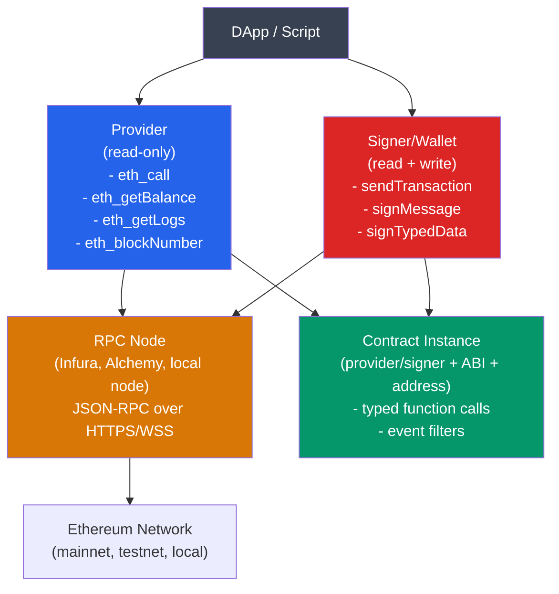

# 🔗 Ethers.js and Viem

> [!abstract] TL;DR
> **ethers.js** (v6) and **viem** are the two dominant TypeScript libraries for interacting with Ethereum nodes. Both expose a **Provider** (read-only connection to an RPC endpoint) and a **Signer/Wallet** (account with a private key that can sign and send transactions). Key operations: query balances/logs/blocks (`eth_call`, `eth_getLogs`), encode/decode ABI data, send transactions, sign typed data (EIP-712). **TypeChain** (for ethers.js) and viem's type generation generate fully type-safe TypeScript interfaces from ABI JSON. `eth_getLogs` requires pagination for large block ranges (max 10,000 blocks per call on most RPCs); viem's `getContractEvents` and ethers' `queryFilter` abstract this. Viem is ~3.4× smaller, fully tree-shakeable, and has first-class TypeScript inference vs. ethers.js's OOP approach.

## Intuition — analogy FIRST
A provider is like a read-only library card: you can look up any information (balances, transactions, events) from the blockchain's "library" (Ethereum node) without being identified. A signer is the library card upgraded to a borrower's card — it has your identity (private key) attached, so you can take actions that require authentication: borrowing books (sending transactions), making reservations (signing messages), authorizing others (approve transactions).

TypeChain/viem type generation is like getting a typed receipt whenever you interact with a specific shelf (smart contract) — instead of generic "any" responses, you get typed return values and argument validation at compile time, catching ABI mismatches before deployment.

---

## How It Works



---

## Key Concepts / Details

### ethers.js v6 — Core Patterns

```typescript
import { ethers } from "ethers";

// --- Provider (read-only) ---
const provider = new ethers.JsonRpcProvider("https://mainnet.infura.io/v3/KEY");
// or: ethers.WebSocketProvider, BrowserProvider (MetaMask)

const balance = await provider.getBalance("0xABC..."); // in wei (BigInt)
const blockNumber = await provider.getBlockNumber();
const tx = await provider.getTransaction("0xdef...");

// --- Signer ---
const wallet = new ethers.Wallet("0x_private_key", provider);
// or: ethers.Wallet.fromPhrase("abandon abandon abandon...") // BIP-39

// Send ETH
const txResponse = await wallet.sendTransaction({
  to: "0xRecipient...",
  value: ethers.parseEther("0.1"),  // 0.1 ETH in wei
  gasLimit: 21000n,
});
const receipt = await txResponse.wait(); // wait for 1 confirmation
console.log(receipt.status); // 1 = success, 0 = revert

// --- Contract interaction ---
const ERC20_ABI = [
  "function balanceOf(address) view returns (uint256)",
  "function transfer(address to, uint256 amount) returns (bool)",
  "event Transfer(address indexed from, address indexed to, uint256 value)",
];

const token = new ethers.Contract("0xTokenAddress...", ERC20_ABI, provider);
const bal = await token.balanceOf("0xUser..."); // typed BigInt

// Write (requires signer)
const tokenWithSigner = token.connect(wallet);
const tx = await tokenWithSigner.transfer("0xTo...", ethers.parseUnits("100", 6));
```

### viem — Core Patterns

```typescript
import { createPublicClient, createWalletClient, http, parseEther } from "viem";
import { mainnet } from "viem/chains";
import { privateKeyToAccount } from "viem/accounts";

// --- Public client (read-only) ---
const publicClient = createPublicClient({
  chain: mainnet,
  transport: http("https://mainnet.infura.io/v3/KEY"),
});

const balance = await publicClient.getBalance({ address: "0xABC..." });
const blockNumber = await publicClient.getBlockNumber();

// --- Wallet client (read + write) ---
const account = privateKeyToAccount("0x_private_key");
const walletClient = createWalletClient({
  account,
  chain: mainnet,
  transport: http("https://mainnet.infura.io/v3/KEY"),
});

const hash = await walletClient.sendTransaction({
  to: "0xRecipient...",
  value: parseEther("0.1"),
});
await publicClient.waitForTransactionReceipt({ hash });

// --- Contract read ---
const balance = await publicClient.readContract({
  address: "0xTokenAddress...",
  abi: erc20Abi,  // viem/contracts exports standard ABIs
  functionName: "balanceOf",
  args: ["0xUser..."],
});

// --- Contract write ---
const hash = await walletClient.writeContract({
  address: "0xTokenAddress...",
  abi: erc20Abi,
  functionName: "transfer",
  args: ["0xTo...", parseUnits("100", 6)],
});
```

### eth_getLogs and Event Querying
Events are stored in transaction receipt logs. Querying requires specifying a block range:

**ethers.js v6**:
```typescript
const filter = token.filters.Transfer(null, "0xRecipient..."); // indexed filter
const logs = await token.queryFilter(filter, 18000000, 18010000); // 10k block range
logs.forEach(log => {
  const { from, to, value } = log.args; // typed
});
```

**viem**:
```typescript
const logs = await publicClient.getContractEvents({
  address: "0xTokenAddress...",
  abi: erc20Abi,
  eventName: "Transfer",
  args: { to: "0xRecipient..." },  // filter indexed args
  fromBlock: 18000000n,
  toBlock: 18010000n,
});
```

**Pagination strategy** (most RPCs limit to 10,000 blocks per call):
```typescript
async function getAllLogs(fromBlock: bigint, toBlock: bigint) {
  const BATCH_SIZE = 10000n;
  const allLogs = [];
  
  for (let start = fromBlock; start <= toBlock; start += BATCH_SIZE) {
    const end = start + BATCH_SIZE - 1n < toBlock ? start + BATCH_SIZE - 1n : toBlock;
    const logs = await publicClient.getContractEvents({
      // ...
      fromBlock: start,
      toBlock: end,
    });
    allLogs.push(...logs);
  }
  return allLogs;
}
```

### TypeChain (ethers.js Type Generation)
```bash
# Install
npm install --save-dev typechain @typechain/ethers-v6

# Generate types from ABI
npx typechain --target=ethers-v6 --out-dir=typechain-types 'artifacts/**/*.json'
```

```typescript
// Generated types — fully typed contract interaction
import { ERC20__factory } from "./typechain-types";

const token = ERC20__factory.connect("0xTokenAddress...", provider);
// TypeScript knows all function signatures, argument types, return types
const balance: bigint = await token.balanceOf("0xUser..."); // typed!
const filter = token.filters.Transfer(); // typed event filter
```

### EIP-712 Typed Data Signing
Used for gasless approvals (permit), meta-transactions, and off-chain authorizations:

```typescript
// ethers.js
const domain = {
  name: "MyToken",
  version: "1",
  chainId: 1,
  verifyingContract: "0xTokenAddress...",
};

const types = {
  Permit: [
    { name: "owner", type: "address" },
    { name: "spender", type: "address" },
    { name: "value", type: "uint256" },
    { name: "nonce", type: "uint256" },
    { name: "deadline", type: "uint256" },
  ],
};

const value = { owner: "0x...", spender: "0x...", value: 1000000n, nonce: 0n, deadline: timestamp };

const signature = await wallet.signTypedData(domain, types, value);
const { r, s, v } = ethers.Signature.from(signature);
// Then call token.permit(owner, spender, value, deadline, v, r, s)
```

### ethers.js vs. viem Comparison

| Property | ethers.js v6 | viem |
|----------|-------------|------|
| Bundle size | ~100 KB min | ~35 KB min |
| Tree-shaking | Partial | Full |
| TypeScript | Good | Excellent (inferred types) |
| API style | OOP (classes) | Functional |
| Multicall | Manual | `multicall` built-in |
| Network support | Good | Excellent (400+ chains) |
| React integration | react-hooks-wagmi | wagmi (built on viem) |
| Learning curve | Lower (intuitive) | Higher (functional) |

---

## Real-World Notes
- **Alchemy vs. Infura**: Major hosted node providers. Alchemy has better developer tooling (webhooks, enhanced APIs, Notify). Infura is more established. Both have free tiers.
- `ethers.parseEther("1.5")` = `1500000000000000000n` (wei). Always use BigInt or the parse helpers; never use floating point for token amounts (floating point precision errors cause loss of funds).
- **Provider pooling**: For high-throughput apps, use multiple providers and round-robin requests to avoid rate limits.
- `eth_call` vs `eth_sendTransaction`: `eth_call` simulates the call without state changes (free, no gas); `eth_sendTransaction` broadcasts a real transaction.
- **Websocket providers**: Use for real-time event listening (`provider.on(filter, callback)`). HTTPS polling is less efficient for event-driven apps.

---

## Common Pitfalls
1. **Using `Number` for BigInt amounts** — JavaScript `Number` max is 2^53; Ethereum uint256 is 2^256. Always use `BigInt` or ethers/viem parse helpers.
2. **Not checking transaction receipt status** — `txResponse.wait()` resolves even if the transaction reverted; always check `receipt.status === 1`.
3. **Hardcoding gas limits** — gas requirements change with EVM upgrades; use `estimateGas()` with a buffer (e.g., `estimatedGas * 120n / 100n`).
4. **Querying all logs without pagination** — requesting blocks 1 to 20M in one `eth_getLogs` call will timeout or be rejected; always paginate.

---

## Related Concepts
- [[_MOC_Web3_Development|↑ Web3 Development MOC]]
- [[Hardhat_and_Foundry]] — compile contracts; ethers.js used in Hardhat test scripts
- [[The_Graph_Protocol]] — alternative to eth_getLogs for complex indexed event queries
- [[04_Ethereum_EVM/ABI_and_Contract_Interaction|ABI & Contract Interaction]] — ABI encoding is what ethers/viem uses internally
- [[04_Ethereum_EVM/Upgradeable_Contracts|Upgradeable Contracts]] — proxy pattern affects how TypeChain types map to contract addresses

---

## Review Questions
1. A token contract has emitted 2M Transfer events over 5 years (15M blocks). Write pseudocode for a paginated `eth_getLogs` query that fetches all events without hitting the 10,000-block limit, and estimate how many RPC calls this requires.
2. Explain why `const amount = 0.1 * 1e18` is a bug when working with ERC-20 token amounts, and provide the correct approach in both ethers.js and viem.
3. You need to sign an EIP-712 typed data message for a meta-transaction (EIP-2612 permit). What is the domain separator, how is it computed, and what prevents replay attacks on different chains?

---

## Sources
- ethers.js v6 documentation: docs.ethers.org/v6
- viem documentation: viem.sh
- TypeChain: github.com/dethcrypto/TypeChain
- EIP-712: Typed structured data hashing and signing
- EIP-2612: Permit — 712-signed approvals for EIP-20 tokens

#Blockchain #Web3Development #EthersJS #Viem #Provider #Signer #TypeChain
